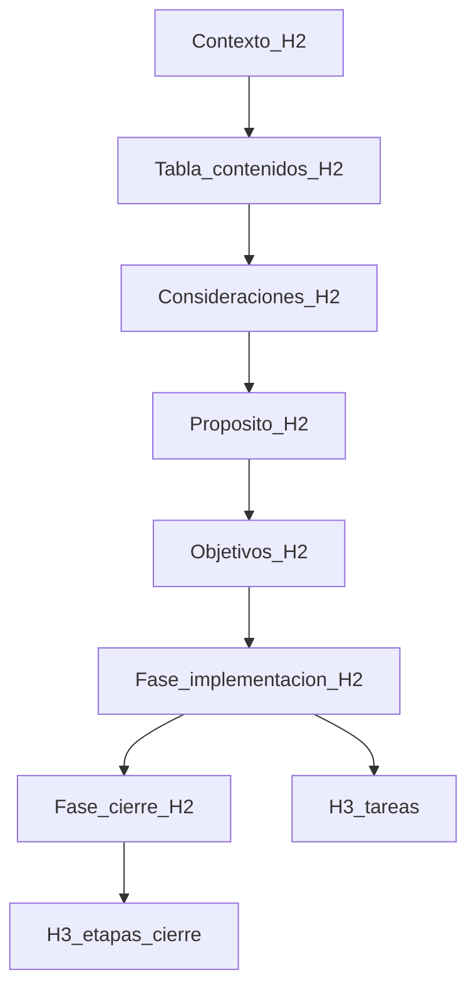
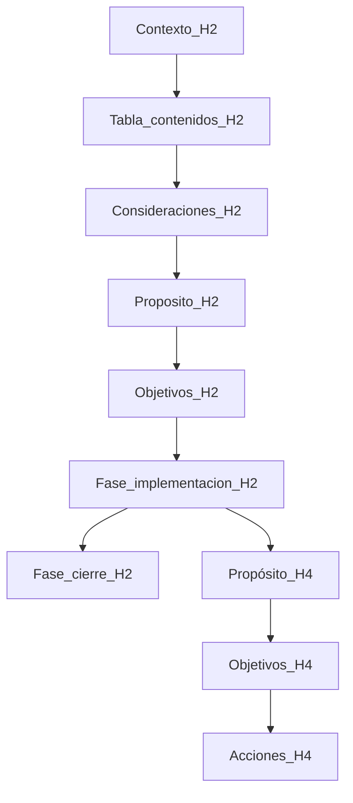

# Workflow: Create development plan for Smart Code Proxy

<overview>
Guide to build a development plan with the project's standard structure, ready for execution by an implementation agent.
</overview>

<user_communication>
Ask, confirm, and respond to the user in **Spanish** (native Spanish-speaking audience). Keep this artifact's instructions in **English** for token efficiency. Canonical policy: `<language_policy>` in [.claude/skills/artifact-structuring/SKILL.md](../skills/artifact-structuring/SKILL.md). User-facing rules: [AGENTS.md](../../AGENTS.md) §0.
</user_communication>

<operation>
## How to operate this workflow

After activating harness planning mode per `<harness_planning>`, apply the rules below.

When invoking this command, the user may or may not have included the plan's specific requirements in their message. Your behavior depends on this:

- **If the user included the requirements** with the command invocation, proceed directly to build the complete plan integrating those requirements into the implementation phase («Fase de implementación»).
- **If the user did NOT include the requirements**, request them explicitly **in Spanish** before generating the plan. Ask about the problem to solve, proposed improvement, or functionality to implement, and any restrictions or additional context needed to size the scope correctly.

Do not generate a plan with invented or assumed requirements. If there is ambiguity in the provided requirements, ask for clarification before continuing.
</operation>

<harness_planning>
## Harness planning mode

On invocation, enter the harness **planning mode** before producing the delivered plan.

1. **Switch mode first**: If `SwitchMode` (plan mode) is available, call it with `target_mode_id: "plan"` before requirement gathering, codebase discovery, or drafting plan sections.
2. **Use planning agents and tools**: Prefer harness planning capabilities for scope discovery — e.g. `Task` with `subagent_type: "explore"` to resolve repo-relative paths and architectural context needed for the implementation phase. Launch parallel explore agents when discovery tasks are independent.
3. **Read-only until implementation is scoped**: In planning mode, do not edit source files; analysis and plan authoring only. Source edits belong to a separate apply flow unless the user explicitly requests execution in the same turn.
4. **Never leak into the delivered plan**: Do not mention harness tools, modes, subagents, or `SwitchMode` in the plan delivered to the user. These instructions apply only to this command artifact.
</harness_planning>

<plan_topology>
## Plan topology: flat delivered structure, two execution phases

Before generating the plan, internalize the complete structure and how sections relate.

**Internal vocabulary** (this artifact, English): *orientation blocks*, *implementation phase*, *closure phase*. These terms describe roles in this command — they are **not** H2 headings in the plan delivered to the user.



| Delivered H2 (Spanish) | Internal role | Changes per plan | Executes work |
|---|---|---|---|
| **Contexto del proyecto** | Project context | Content varies | No |
| **Tabla de contenidos** | Plan table of contents | Built from outline | No |
| **Consideraciones fundamentales** | Fundamental considerations | Fixed structure; point 3 semantics vary by plan | No |
| **Propósito del plan** | Plan purpose (fused) | Content varies | No |
| **Objetivos del plan** | Plan objectives | Content varies | No |
| **Fase de implementación** | Implementation phase | Tasks and content vary | Yes |
| **Fase de cierre** | Closure phase | Fixed stages | Yes |

| Internal name (artifact) | Delivered heading (Spanish) |
|---|---|
| Project context | Contexto del proyecto |
| Plan table of contents | Tabla de contenidos |
| Fundamental considerations | Consideraciones fundamentales |
| Plan purpose | Propósito del plan |
| Plan objectives | Objetivos del plan |
| Implementation phase / variable section | Fase de implementación |
| Closure phase / final section | Fase de cierre |

**Never** use «Sección inicial», «Sección variable», or «Sección final» as H2 headings in the delivered plan.

The **two execution phases** (implementation → closure) are **mutually exclusive and sequential**: the implementation phase runs first and completes requirement-specific work; the closure phase runs afterward and consolidates the result. There is no overlap between them.

**Orientation blocks** (context through objectives) precede execution. They orient the agent but do not execute work. Semantic substructure (fused Purpose and Objectives at plan level; Purpose / Objectives / Actions per implementation task) is defined in `<purpose_objectives_model>` below.

### Non-duplication rules (critical)

<critical>
1. **Never duplicate content between the implementation phase and the closure phase**. If a task conceptually belongs to closing stages (dead code removal, compilation/tests/linter validation, documentation update, commit), it goes **only** in the closure phase. Do not replicate it as an implementation task.

2. **Do not advance closing stages into the implementation phase**. Even if tempting to include "validation" or "zombie cleanup" as the last implementation task for explicitness, do not: that responsibility is already covered by the closure phase and duplicating it causes confusion about source of truth and execution order.

3. **The implementation phase ends when requirement-specific changes are complete**. From there, the natural continuation is the closure phase, and the executing agent must understand that.
</critical>
</plan_topology>

<purpose_objectives_model>
## Purpose, objectives, and actions: two-level rule

Before generating plan content, internalize this canonical structure:



| Level | Mandatory content |
|-------|-------------------|
| **Delivered plan (orientation H2s)** | Context + Table of contents + Fundamental considerations + Purpose (fused) + Objectives — each as its own H2, in that order |
| **Each implementation task (H3)** | Purpose + Objectives + Actions (H4 subsections) |
| **Each closure stage (H3)** | Stage prose (no H4 Propósito/Objetivos/Acciones template) |

### Purpose (fused narrative)

Use one **Propósito** header only — **never** a separate Motivación / Motivation section or H4. **Propósito** is the fusion of two narrative concerns that formerly had their own headings; both belong in continuous prose under the single Propósito header.

Two narrative movements, in order, under that one header:

1. **Motivation (observed need)**: the need for change as observed — a bug to fix, a defect class to prevent, a new capability, or a modification to existing behavior. State what was seen, missing, or failing that triggered the work.
2. **Purpose (resolution value)**: the reason and value of implementing that change — what applying the solution achieves and what it returns.

In delivered plans (Spanish), both movements live under **Propósito del plan** (H2) or **Propósito** (H4 per task) as flowing prose or consecutive paragraphs — not under a «Motivación» heading.

Applies at plan level and at each implementation task level. Do not mix file lists or execution steps into Purpose — those belong in Actions.

### Objectives

Verifiable goals aligned with the Purpose of the same level. They bound work; they do not re-explain the Purpose.

### Actions (tasks only)

Numbered list. **Every item must name an explicit repo-relative file path** — required in every implementation task. **Never** under orientation H2s (context through objectives).

**Mandatory action line shape** (deliver in Spanish; keep paths as in the repo):

```
N. **`path/to/file.ext`** — `<section_or_block>`: <concrete change>.
```

Rules:

- **File path first**, in backticks, relative to the repository root (e.g. `.claude/commands/create-plan.md`, `src/foo.ts`). One primary file per action line.
- **Section or block** next: XML tag, markdown heading, function name, or line range when known — so the agent knows *where* inside the file.
- **Concrete change** last: what to add, remove, or replace — not a restatement of the objective.
- Multi-file work: one numbered action **per file**; do not bundle multiple files into one step.
- Unknown target file: **stop and ask** the user — do not use placeholders (`the file`, `relevant module`, `appropriate path`).

**Task title (H3)** should name the primary target file(s) in backticks when scope is bounded, e.g. `### Tarea 2 — Actualizar verificación (`create-plan.md`)`.

### Context (plan level only)

Brief synthesis of architecture and technologies so an unfamiliar agent can orient. Delivered as H2 **Contexto del proyecto**. **Never** repeated per task.

### Table of contents (plan level)

Navigational index of the **entire delivered plan** — not narrative, not execution. Delivered as H2 **Tabla de contenidos**, immediately after **Contexto del proyecto**.

Content rules:

- List every delivered **H2** except **Tabla de contenidos** itself: Contexto del proyecto, Consideraciones fundamentales, Propósito del plan, Objetivos del plan, Fase de implementación, Fase de cierre.
- Under **Fase de implementación**: every task **H3** title only — no H4 (Propósito, Objetivos, Acciones), no action lines, no file paths.
- Under **Fase de cierre**: the four closing stages as H3 titles (zombie removal, validation, documentation, commit).
- Use a nested bullet list (2-space indent per level). Optional markdown anchor links when the viewer supports them.
- Do not duplicate plan objectives or copy action steps into the TOC.

### Anti-patterns

| Anti-pattern | Why it fails |
|--------------|--------------|
| Technical H2 headings («Sección inicial/variable/final») in delivered plan | Internal vocabulary leaks into user-facing document; use delivered headings from `<plan_topology>` |
| Actions under orientation H2s | Actions belong only to implementation tasks |
| Context repeated in each task | Context is unique and belongs at plan level (Contexto del proyecto H2) |
| Objective = restatement of purpose | Does not bound work |
| Task without Actions subsection | Plan is not autonomously executable |
| Action without named file or section | Agent must guess where to edit |
| Action without repo-relative file path in backticks | Path is ambiguous or absent |
| Placeholder paths (`the file`, `relevant module`) | Not executable without discovery |
| One action step covering multiple unrelated files | Split into one line per file |
| Task title without target file when files are known | Hides scope until Actions subsection |
| Duplicating plan purpose/objectives verbatim in each task | Tasks must scope down, not copy plan narrative |
| Purpose with file lists or steps | Mixes narrative with execution |
| Vague single-sentence Purpose | Does not convey both motivation (observed need) and purpose (resolution value) |
| Separate Motivación / Motivation header or H4 | Splits the fused narrative; use one Propósito header with both movements instead |
| TOC omits an implementation-phase task H3 | Index does not match deliverable |
| TOC repeats plan objectives as task list | Confuses navigation with goals |
| TOC lists action lines or file paths | Mixes index with execution |
</purpose_objectives_model>

<examples>
## Generated plan shape (illustrative)

<example name="generated_plan_shape">
Example content is illustrative; line numbers in actions must be resolved at edit time.

```markdown
# Plan: Ejemplo de forma de plan generado

## Contexto del proyecto
El comando `/create-plan` organiza sus instrucciones en bloques XML; la topología
del plan entregado usa H2 planos con nombres orientados al lector.

## Tabla de contenidos
- Contexto del proyecto
- Consideraciones fundamentales
- Propósito del plan
- Objetivos del plan
- Fase de implementación
  - Tarea 1 — Introducir topología de plan (`create-plan.md`)
  - Tarea 2 — Actualizar verificación (`create-plan.md`)
- Fase de cierre
  - Eliminación de código zombie
  - Validación técnica
  - Actualización de documentación sincronizada
  - Commit descriptivo

## Consideraciones fundamentales para el razonamiento y diseño del plan
1. …
2. …
3. …

## Propósito del plan
El artefacto usaba encabezados técnicos opacos («Sección inicial/variable/final»)
que no orientaban al lector ni al agente ejecutor. Reorganizar la topología con
H2 autodescriptivos y alinear bloques XML con `artifact-structuring` devuelve
planes legibles y ejecutables sin ambigüedad de fases.

## Objetivos del plan
- Unificar topología de siete H2 en el bloque de topología del comando.
- Extraer ejemplos y reglas de generación como bloques hermanos.
- Actualizar checklist de verificación del comando.

## Fase de implementación

### Tarea 1 — Introducir topología de plan (`create-plan.md`)

#### Propósito
Los wrappers técnicos anteriores ocultaban el alcance hasta leer secciones internas.
Introducir topología plana con nombres orientados al lector hace visible la estructura
del entregable desde el índice y reduce errores de orden al generar planes.

#### Objetivos
- Documentar los siete H2 en orden fijo.
- Mantener reglas de no-duplicación implementación/cierre.

#### Acciones
1. **`.claude/commands/create-plan.md`** — bloque `<plan_topology>`: reemplazar diagrama y tablas por topología plana con mapa interno→entregable.
2. **`.claude/commands/create-plan.md`** — bloque `<critical>`: actualizar reglas de no-duplicación para fase de implementación y fase de cierre.
```
</example>

<example name="action_without_explicit_file_bad">
```markdown
#### Acciones
1. Actualizar la sección de verificación para exigir rutas de archivo.
2. Añadir anti-patrones en el modelo de propósito.
```
Reason: no repo-relative file path per step — agent must guess which artifact to edit.
</example>

<example name="action_with_explicit_file_good">
```markdown
#### Acciones
1. **`.claude/commands/create-plan.md`** — subsección `### Actions (tasks only)`: prescribir formato obligatorio con ruta en backticks al inicio de cada línea.
2. **`.claude/commands/create-plan.md`** — tabla `### Anti-patterns`: añadir filas para rutas placeholder y acciones multi-archivo.
```
</example>
</examples>

<plan_structure>
## Mandatory structure of the generated plan

Follow `<plan_topology>` for section order and `<purpose_objectives_model>` for subsection semantics.

The plan you produce must follow this complete structure as **seven consecutive H2 sections** (plus H1 title), in this order, without omitting any block.

### 1. Project context — delivered H2: Contexto del proyecto

Write a brief synthesis of Smart Code Proxy's high-level architecture and technologies. It must be enough for an agent unfamiliar with the project to orient themselves when reading the plan. **No Actions here.**

### 2. Plan table of contents — delivered H2: Tabla de contenidos

Build from the heading outline per `<purpose_objectives_model>`. Must list every delivered H2 except Tabla de contenidos itself, every implementation-phase task H3 title nested under Fase de implementación, and the four closure-phase stages nested under Fase de cierre. **No Actions here.**

### 3. Fundamental considerations for plan reasoning and design — delivered H2: Consideraciones fundamentales

This block is fixed and must be included in full in every generated plan. **In the plan delivered to the user**, render these three points in **Spanish** (faithful translation of the invariant English text below).

1. Smart Code Proxy is in **active development**: there is currently no human or system user that depends on it. During this phase, historical documentation, legacy logic, and backward compatibility do not add value; they add unnecessary complexity and slow evolution.

2. The plan must preserve the project's **canonical state**: avoid keeping unused source logic, historical documentation, legacy features, or backward compatibility. Design, implementation, source code, documentation, and project skills must stay synchronized. After implementation, any unused legacy or zombie code must be removed from code and documentation consistently.

3. The delivered plan must follow the **flat H2 structure** defined in `<plan_topology>`: context, table of contents, fundamental considerations, fused plan purpose, plan objectives, implementation phase, closure phase. The table of contents sits after context and before fundamental considerations. **Each task** in the implementation phase must state **purpose, objectives, and prescriptive actions**. Every action line must start with an **explicit repo-relative file path** in backticks, then section/block, then concrete change. Do not put Actions under orientation H2s or Context in individual tasks.

   **Spanish rendering of point 3 (deliver faithfully in generated plans):** «El plan entregado debe seguir la **estructura plana de H2** definida en este workflow: contexto, tabla de contenidos, consideraciones fundamentales, propósito del plan, objetivos del plan, fase de implementación y fase de cierre. La tabla de contenidos va después del contexto y antes de las consideraciones fundamentales. **Cada tarea** de la fase de implementación debe declarar **propósito, objetivos y acciones prescriptivas**. Cada línea de acción debe comenzar con una **ruta de archivo explícita relativa al repo** entre backticks, seguida de sección o bloque y cambio concreto. No incluir Acciones bajo los H2 de orientación ni Contexto en tareas individuales.»

### 4. Plan purpose — delivered H2: Propósito del plan

Apply fused narrative rules from `<purpose_objectives_model>`: one header, two movements (motivation then purpose). **No Actions here.**

### 5. Plan objectives — delivered H2: Objetivos del plan

Verifiable goals aligned with plan purpose. **Important**: objectives listed here must describe only the plan's specific work (implementation phase). Do not include objectives like "validate compilation", "remove dead code", or "commit", because those belong to the closure phase and are implicit in every implementation. **No Actions here.**

### 6. Implementation phase — delivered H2: Fase de implementación

Here integrate **exclusively** the specific requirements provided by the user. Break down into individual H3 tasks; apply Purpose, Objectives, and Actions rules from `<purpose_objectives_model>` per task.

Each task **Actions** subsection must use the mandatory action line shape (file path in backticks first). Task titles (H3) should include the primary target file in backticks when the task scope is bounded to known paths.

Strict scope of the implementation phase:

- **Include**: source code changes required by requirements, changes to directly affected interfaces or contracts, test updates that specifically verify modified behavior, prescriptive actions per task (each line: repo-relative file path in backticks, section/block, concrete change), and any other action that is a direct consequence of the user's requirement.
- **Do not include**: generic closing tasks (residual zombie cleanup, global compilation/tests/linter validation, synchronized cross-cutting documentation update, commit). All those responsibilities are described once in the closure phase.

### 7. Closure phase — delivered H2: Fase de cierre

This block is fixed and must be included in full at the end of every generated plan. Render each stage as an H3 under **Fase de cierre**. The following four stages are ordered by strict temporal logic that must be preserved: first clean code, then validate on clean code, then document validated code, then commit the complete state.

1. **Dead code removal**: Identify whether implemented changes made any project source code "zombie" by no longer being used. If so, remove zombie source code, logic, and documentation consistently. This stage goes first because removing code after validation would require re-running all validations; cleaning first allows validating once on the final state.

2. **Technical validation**: Verify correct project compilation, then verify all automated tests complete successfully, then verify no warnings or errors from the project linter. If any validation fails, fix iteratively-incrementally until fully resolved. This stage goes second because it operates on code already cleaned by the previous stage.

3. **Synchronized documentation update**: Analyze implemented changes, then investigate which sections, subsections, or comments in project documentation are impacted, then design a sub-plan to update all necessary documentation synchronously, coherently, and consistently across multiple project files. Documentation is distributed in `README.md` and `docs/`. This stage goes third because it documents code that is already clean and validated, avoiding documenting realities that would later change.

4. **Descriptive commit**: Commit changes designed and implemented in the plan, describing implemented changes in Spanish, descriptive and detailed. To build the commit message, analyze plan purpose and objectives, then analyze and synthesize all implemented changes, and comment how each change aligns with plan purpose and objectives. Follow the three-block body template in conventional-commits (Propósito, Objetivos, Resumen de cambios). This stage goes last because it captures in history a consolidated, clean, validated, and documented state.
</plan_structure>

<generation_rules>
## Rules while generating the plan

### Ambiguous or incomplete requirements

If user requirements are ambiguous, incomplete, or contradict fundamental considerations, stop and request clarification before materializing the implementation phase.

### Handling design decisions during generation

While analyzing requirements you may detect architectural decision points the user did not resolve explicitly (e.g. choosing between two implementation strategies with different trade-offs, or whether to keep residual behavior). When this happens:

1. **Do not resolve the decision unilaterally** by embedding it as fact inside a task.
2. **Stop plan generation** and present the decision point to the user, explaining alternatives, trade-offs, and your recommendation if you have one.
3. **Continue plan generation only after** the user has resolved the decision point.

This preserves the user's architectural control and avoids plans contaminated with hard-to-revert implicit decisions.

### File paths in actions

Use harness planning agents per `<harness_planning>` when resolving target files from user requirements and codebase layout.

Before writing the implementation phase, resolve target files from user requirements and codebase layout (search or read when needed). Every action line must cite an explicit repo-relative path. If a required file is unknown, stop and ask — never emit placeholder paths. See good/bad examples in `<examples>`.

### Table of contents generation order

The TOC appears before later section bodies but must list task and stage titles. Use this **internal** order (delivered H2 order: context → TOC → considerations → purpose → objectives → implementation → closure):

1. **Outline** implementation-phase task H3 titles and confirm closure-phase structure.
2. Write **context** (Contexto del proyecto).
3. Write **table of contents** from the outline.
4. Write **fundamental considerations**.
5. Write **purpose** and **objectives**.
6. Expand implementation phase and closure phase in full.
7. **Verify** TOC entries match every delivered H3 task title and the four closure stages.
</generation_rules>

<delivery_format>
## Delivery format

Deliver the complete plan in a single well-structured markdown block. Do not omit any section described above, even if the requirement is small: structural uniformity is part of this workflow's value.

Deliver the plan to the user in Spanish per AGENTS.md (§0), including the three fundamental considerations translated from the English invariant text in `plan_structure` section 3 above.

Do not expose internal XML block names (`plan_topology`, `purpose_objectives_model`, `generation_rules`, etc.) in the plan delivered to the user.

### Heading hierarchy (Spanish)

| Level | Use |
|-------|-----|
| H1 | Plan title |
| H2 | `Contexto del proyecto`, `Tabla de contenidos`, `Consideraciones fundamentales`, `Propósito del plan`, `Objetivos del plan`, `Fase de implementación`, `Fase de cierre` — in that order |
| H3 | Each implementation task; each closure stage |
| H4 | `Propósito`, `Objetivos`, `Acciones` under each implementation task only |

### Spanish headings

- Delivered H2 order (**fixed**): `Contexto del proyecto` → `Tabla de contenidos` → `Consideraciones fundamentales` → `Propósito del plan` → `Objetivos del plan` → `Fase de implementación` → `Fase de cierre`.
- Table of contents body: nested bullet list (2-space indent per level); list every delivered H2 except `Tabla de contenidos`; task H3 titles indented under `Fase de implementación`; four closure stages indented under `Fase de cierre`.
- Each implementation task (H3 title + H4 subsections): `Propósito`, `Objetivos`, `Acciones`. Prefer H3 titles that name the primary file in backticks when scope is bounded.
- **Propósito** (H2 or H4): fused narrative — motivation (observed need) then purpose (resolution value) in one header; never a separate `Motivación` heading.
- Each action line: `` **`ruta/relativa/al/archivo`** — sección: cambio concreto. `` (Spanish prose; repo paths unchanged).
- Fundamental consideration #3: use the Spanish rendering fixed in `plan_structure` section 3.
- Forbidden: H2 `Sección inicial`, `Sección variable`, or `Sección final`; `Acciones` under orientation H2s; `Contexto` inside a task; action lines without an explicit file path in backticks.
</delivery_format>

<verification>
## Final verification before delivery

Before delivering the plan, mentally run the following checklist. If any check fails, fix the plan before delivering:

1. Does the implementation phase contain only tasks derived from the user's specific requirements?
2. Does no implementation task duplicate a closure-phase responsibility (zombie, validation, documentation, commit)?
3. Do closure-phase stages appear in the correct order: zombie → validation → documentation → commit?
4. Do the seven delivered H2 sections appear in fixed order (Contexto → Tabla de contenidos → Consideraciones → Propósito → Objetivos → Fase de implementación → Fase de cierre) with **no** technical wrapper H2s?
5. Does the delivered plan contain **no** H2 titled «Sección inicial», «Sección variable», or «Sección final»?
6. Does each implementation task have Purpose, Objectives, and Actions; **no** Context subsection per task?
7. Does **every** Actions list item **start** with an explicit repo-relative file path in backticks, then section/block, then a concrete change?
8. Does no action use placeholder paths (`the file`, `relevant module`, `appropriate files`)?
9. Are multi-file changes split into one action line per file?
10. Do plan objectives under **Objetivos del plan** describe only implementation work, without mixing closing stages?
11. Did I detect any architectural decision point unresolved by the user that I should consult before delivering?
12. Do fused Propósito subsections (plan and tasks) contain both narrative movements — motivation (observed need for change) and purpose (reason and value of implementing it) — not a single vague sentence?
13. Does heading hierarchy match: seven H2 sections in order; H3 implementation tasks and closure stages; H4 Purpose, Objectives, Actions under implementation tasks only?
14. Do bounded-scope task titles (H3) name the primary target file in backticks when paths are known?
15. Is generation-time behavior only in `<generation_rules>`, not mixed into `<plan_structure>`?
16. Does the table of contents list every implementation-phase task H3 title (parity with delivered headings)?
17. Does the table of contents list all four closure-phase stages nested under **Fase de cierre**?
18. Does the table of contents avoid listing itself, H4 subsections, action lines, and file paths?

Only deliver the plan when all eighteen checks have passed.
</verification>
