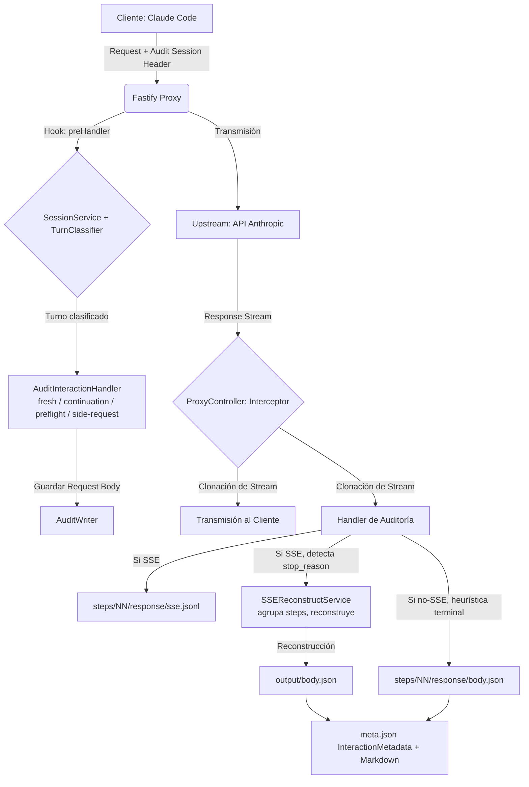

# 📡 Smart Code Proxy (Anthropic Observability)

[](https://www.typescriptlang.org/)
[](https://fastify.dev/)
[](#-diseño-del-sistema-pka---progressive-kernel-architecture)

Una implementación de alto rendimiento, modular y basada en **Fastify + TypeScript** diseñada específicamente para interceptar, auditar y analizar en tiempo real el tráfico entre **Claude Code** (el CLI oficial de Anthropic) y la API oficial de Anthropic. Claude Code permite redirigir sus peticiones al proxy vía la variable `ANTHROPIC_BASE_URL`, condición imprescindible para el funcionamiento del sistema; otros clientes (p. ej. Cursor) usan harnesses distintos y no están dentro del alcance de este proyecto.

Diseño desacoplado que garantiza **latencia cero** en la retransmisión mientras procesa auditorías enfocadas en la **observabilidad inteligente para análisis humana** — no busca registrar todo lo técnicamente posible, sino presentar los flujos lógicos que el usuario orquesta (secuenciales y/o paralelos con subagentes) de forma natural y trazable.

---

## 🏛 Diseño del Sistema (PKA - Progressive Kernel Architecture)

El proxy utiliza **Progressive Kernel Architecture (PKA)** — un modelo arquitectónico concéntrico de 6 capas que sintetiza los mejores patrones de **Clean Architecture**, **Hexagonal Architecture**, **Onion Architecture**, **DDD** y **CQRS**. Las dependencias del código fuente **solo apuntan hacia el centro** (Dominio). La Capa 6 (GUIs) no aplica a este proyecto.

### 🧩 Capas de Responsabilidad

| Capa                           | Ubicación                | Responsabilidad                                                                   | Componentes Clave                                                                                                                                                   |
| ------------------------------ | ------------------------ | --------------------------------------------------------------------------------- | ------------------------------------------------------------------------------------------------------------------------------------------------------------------- |
| **1 - Dominio**                | `src/1-domain/`          | Tipos puros (entidades) y lógica de dominio sin dependencias externas             | `SessionResolverService`, `RequestClassifierService`, `RedactService`, `MarkdownRendererService`, `SseSimulatorService`, Tipos de auditoría                         |
| **2 - Servicios (Adapters)**   | `src/2-services/`        | Implementaciones concretas con I/O (filesystem, streams) y **ports** (interfaces) | `SessionStoreService`, `AuditWriterService`, `SseReconstructService`, `StreamTeeService`, Ports: `IAuditWriter`, `ISessionStore`, `ISseReconstructor`, `IStreamTee` |
| **3 - Operaciones (Handlers)** | `src/3-operations/`      | Orquestación de casos de uso (Command Handlers)                                   | `AuditInteractionHandler`, `AuditSseResponseHandler`, `AuditStandardResponseHandler`, `AuditUpstreamErrorHandler`, `FilterToolsHandler`                             |
| **4 - API (Composition Root)** | `src/4-api/`             | Wiring de dependencias y configuración                                            | `createProxyDependencies()`, Configuración de entorno                                                                                                               |
| **5 - Interfaces de Usuario**  | `src/5-user-interfaces/` | Adaptadores HTTP (reciben deps inyectadas via options)                            | `ProxyController`, `proxyRoutes`, `fastify.augments.d.ts`                                                                                                           |

### 📐 Regla de Dependencia

```
Capa 5 → Capa 4 → Capa 3 → Capa 2 → Capa 1
(UI)     (API)     (Ops)    (Svcs)   (Domain)
```

Las capas internas **nunca** importan de capas externas. Esta regla garantiza que:

- El dominio (Capa 1) es puro y testeable sin mocks
- Los servicios (Capa 2) pueden ser reemplazados sin afectar la lógica de negocio
- La UI (Capa 5) es un detalle de implementación desechable

---

## 🔄 Flujo de Datos (Arquitectura de Intercepción)



---

## 🚀 Casos de Uso del Sistema

### 🔍 Observabilidad de Flujos SSE

A diferencia de un proxy genérico, este sistema "entiende" los flujos binarios de Anthropic.

- Extrae cada línea de datos y la convierte en una entrada con _timestamp_ en `steps/NN/response/sse.jsonl` (escrito **síncronamente**: fuente de verdad ordenada para la reconstrucción).
- Mantiene un volcado binario crudo (`steps/NN/response/sse.txt`) para depuración de paridad de protocolos. **No** es la fuente de la reconstrucción y puede truncarse por `MAX_AUDIT_SSE_RAW_BYTES` sin afectar al mensaje final reconstruido.

### 🛡️ Privacidad Avanzada

El diseño garantiza que nunca se filtren API Keys a los logs de servidor ni a los archivos de auditoría físicos, permitiendo compartir los volcados de sesión de forma segura entre equipos de desarrollo.

### 📦 Gestión de Sesiones Persistentes

Ideal para depurar comportamientos erráticos en herramientas de CLI (como `claude`):

- Agrupa las peticiones de un turno completo (prompt → respuesta final) bajo una interacción con subdirectorios `steps/`.
- Tres tipos de interacción: `agentic` (turno del usuario con prompt y respuesta), `client-preflight` (quota check + cache warm-up) y `side-request` (peticiones con `"tools": []`, ej. count_tokens, generación de títulos).
- Los `side-request` se auditan en su propia interacción sin desplazar al turno activo principal, evitando corrupción de metadata por race conditions.
- Los turnos se indexan por `interactionDir` (único por request) permitiendo múltiples turnos concurrentes en la misma sesión (parallel subagents).
- Las continuaciones (`tool_result`) se rutean al turno padre mediante correlación por `tool_use_id`, eliminando la misatribución de steps. Las continuaciones de `Agent`/subagentes se coalescen en el `response` del step que emitió los subagentes; las demás tools conservan steps separados.
- Los preflights (`client-preflight`) se cierran inmediatamente al recibir su respuesta, evitando turnos zombie que bloquean la sesión.
- Cada step en `meta.json` puede incluir `toolUseIds: string[]` — los IDs de tool_use emitidos en ese step, usados para correlacionar con futuras continuaciones.
- `meta.json` resume el turno completo: steps individuales, tokens agregados en `totals`, duración y `outcome`.

<a name="riesgos-seguridad"></a>

> [!WARNING]
> **Riesgos de Seguridad**: Los directorios de auditoría pueden contener API keys, tokens y contenido de conversaciones en claro si se desactiva la redacción. Restringe los permisos del directorio `sessions/` y manténlo fuera de repositorios públicos.

---

<a name="archivos-auditoria"></a>

## 📂 Referencia de Archivos de Auditoría

La sesión se divide en dos árboles independientes bajo `./sessions/<session-id>/`:

```
sessions/<session-id>/
  session-metrics.json          # Métricas agregadas de tokens por modelo (O(1) para el statusline)
  main-agent/                   # Turnos agénticos del usuario (fresh + continuations)
    interactions/
      interaction-sequence.json # Contador de secuencia exclusivo de este árbol
      NN/                       # Secuencia de 2 dígitos (01, 02, …)
        meta.json               # InteractionMetadata: resumen del turno
        state.json              # Marcador "in-progress" (solo existe mientras está abierto)
        input/                  # Petición inicial top-level (agentic y side-request)
          headers.json, body.bin, body.json, body.parsed.md
        output/                 # Respuesta final reconstruida (SSE completados)
          body.json, body.parsed.md, headers.json
        steps/
          NN/                   # Step lógico observable (01, 02, …)
            request/            # Petición del step (auto-contenida)
              headers.json, body.bin, body.json, body.parsed.md
            response/           # SSE: sse.jsonl (fuente de verdad) + reconstruidos; No-SSE: body.json
              sse.jsonl, headers.json
              body.json, body.parsed.md
              # sse.txt solo para steps no-coalesced (raw dump debug)
            thought/            # Solo si el step contiene extended thinking
              content.md
            sub-agent-NN/       # Solo si el step emitió tool_use Agent (subagente anidado)
              meta.json, state.json
              input/, output/, steps/
  side-interactions/            # Preflights y side-requests (contadores independientes)
    interaction-sequence.json
    NN/                         # Secuencia de 2 dígitos (01, 02, …)
      meta.json
      state.json
      input/                    # Solo en side-request (no en client-preflight)
        headers.json, body.bin, body.json, body.parsed.md
      steps/
        NN/
          request/
            headers.json, body.bin, body.json, body.parsed.md
          response/
            sse.jsonl / body.json / headers.json
```

> **Preflights (`client-preflight`):** No escriben `input/` ni `output/` en el nivel raíz; solo tienen `steps/` con sus archivos individuales. Se alojan en `side-interactions/`.

> **Side-requests:** Peticiones con `tools: []` (ej. `count_tokens`). Escriben `input/` top-level y se alojan en `side-interactions/`.

> **Subagentes (`Task` / herramienta `Agent`):** Se anidan directamente bajo `steps/NN/sub-agent-NN/` con la misma estructura interna (`input/`, `output/`, `steps/`, `meta.json`, `state.json`). El `meta.json` del subagente incluye `parentContext: { parentInteractionDir, parentStepIndex, triggeringToolUseId, subagentType }`. La continuation que trae los `tool_result` de esos subagentes se coalesce en `steps/NN/response/body.*` del step padre, de modo que la delegación y la respuesta final combinada quedan en el mismo step lógico. La profundidad está acotada a 2 niveles.

> **Steps coalesced de Agent:** Para steps que invocan subagentes, el `response/sse.jsonl` es **multi-fase** — cada línea incluye `phase: "delegation"` (stream inicial) o `phase: "continuation"` (stream terminal con tool_result). El `response/body.json` tiene estructura consolidada con `delegation.message`, `continuation.request.body`, `continuation.request.headers`, `continuation.response.message`, `toolUseIds` y `subagents` (resumen estructurado de subagentes ejecutados en Fase 2). El `response/body.parsed.md` muestra tres fases: **Fase 1: Delegación inicial**, **Fase 2: Ejecución de subagentes** (con tabla resumen de cada subagente) y **Fase 3: Respuesta final coalesced**. Los archivos `continuation.*` temporales ya no se crean; la request de continuation se almacena en memoria y se escribe directamente en `body.json`. Para steps coalesced, `sse.txt` se elimina al consolidar (solo `sse.jsonl` es canónico).

> **state.json:** Archivo marcador escrito al iniciar la interacción con `{ state: "in-progress", startedAt, interactionType, parentContext? }`. Se elimina al cerrar el turno (cuando se escribe `meta.json`). Su presencia indica una interacción huérfana por crash del proceso.

### Tipos de Interacción

| `interactionType`  | Origen                                                                 | Cierre                                            |
| ------------------ | ---------------------------------------------------------------------- | ------------------------------------------------- |
| `agentic`          | Prompt del usuario con `tools` no vacíos (fresh) + continuations       | `stop_reason` terminal (`end_turn`, `max_tokens`) |
| `client-preflight` | Quota check (`max_tokens:1`) o cache warm-up sin turno activo          | Al recibir la respuesta (inmediato)               |
| `side-request`     | Peticiones con `tools: []` (ej. `count_tokens`, generación de títulos) | Respuesta terminal; no desplaza al turno activo   |

### Resultados de Turno (`outcome`)

El campo `outcome` en `meta.json` indica el resultado final del turno:

| `outcome`        | Significado                                                             | `statusCode` típico |
| ---------------- | ----------------------------------------------------------------------- | ------------------- |
| `completed`      | Turno completado exitosamente                                           | 2xx                 |
| `client-error`   | Error del cliente (request mal formada, autenticación fallida, etc.)    | 4xx                 |
| `upstream-error` | Error del servidor upstream (fallo de conexión, timeout, error SSE)     | 5xx o `null`        |
| `truncated`      | Respuesta truncada por `max_tokens`                                     | 2xx                 |
| `orphaned`       | Turno cerrado por cleanup (continuation nunca llegó, graceful shutdown) | `null`              |

> **Campos forenses en `meta.json`:** Cuando un turno se cierra con `upstream-error` o `orphaned` habiendo emitido `tool_use` de tipo `Agent` que no se correlacionaron con subagentes, el campo `lostPendingAgents?: PendingAgentToolUse[]` registra los IDs de esos tool_uses pendientes para facilitar correlación offline.

### Correlación con Logs de Claude Code

Cada step en `meta.json` incluye `anthropicMessageId` — el `message.id` de la API de Anthropic — permitiendo correlacionar directamente con los logs oficiales de Claude Code:

```json
{
  "steps": [
    {
      "stepIndex": 1,
      "anthropicMessageId": "msg_01SweCL7ReWWANWSRsPc8mfn",
      "stopReason": "tool_use"
    }
  ]
}
```

| Sistema                       | Ubicación del ID             | Valor de ejemplo               |
| ----------------------------- | ---------------------------- | ------------------------------ |
| Log Claude Code (`.jsonl`)    | `message.id`                 | `msg_01SweCL7ReWWANWSRsPc8mfn` |
| Auditoría Proxy (`meta.json`) | `steps[].anthropicMessageId` | `msg_01SweCL7ReWWANWSRsPc8mfn` |

**Proceso de correlación:**

1. Extrae `"id"` del evento `assistant` en el log de Claude Code
2. Busca ese valor en `sessions/<session>/main-agent/interactions/*/meta.json` (y, si aplica, `side-interactions/*/meta.json`) bajo `steps[].anthropicMessageId`
3. El directorio contenedor es la interacción correspondiente

### Peticiones pre-sesión (sin auditoría)

Las peticiones **sin** cabecera de sesión válida (`AUDIT_SESSION_OVERRIDE_HEADER` ni `AUDIT_SESSION_FALLBACK_HEADER`) resuelven internamente a `_unknown` y **no generan archivos de auditoría**: el proxy las reenvía al upstream, pero `AuditInteractionHandler` retorna sin escribir bajo `sessions/`. Ejemplos habituales: `HEAD /`, `GET /v1/models`, o probes de conectividad del runtime Bun de Claude Code antes de abrir sesión.

No se crea la carpeta `sessions/_unknown/`. Guía ampliada: [`docs/health-check-handling.md`](docs/health-check-handling.md).

---

<a name="configuracion"></a>

## ⚙️ Configuración (Matriz de Entorno)

Personaliza el comportamiento ajustando estas variables en tu entorno o en un archivo `configs/.env`:

|  Categoría   | Variable                        | Descripción                                                                                                                     | Default                                                                                 |
| :----------: | ------------------------------- | ------------------------------------------------------------------------------------------------------------------------------- | --------------------------------------------------------------------------------------- |
|   **Core**   | `PORT`                          | Puerto de escucha del proxy.                                                                                                    | `8787`                                                                                  |
| **Upstream** | `UPSTREAM_ORIGIN`               | URL objetivo de Anthropic.                                                                                                      | `https://api.anthropic.com`                                                             |
|              | `UPSTREAM_ACCEPT_ENCODING`      | Control de compresión (`identity`, `gzip`, `pass`, `remove`).                                                                   | `identity`                                                                              |
| **Headers**  | `AUDIT_SESSION_OVERRIDE_HEADER` | Cabecera primaria de sesión.                                                                                                    | `x-cc-audit-session`                                                                    |
|              | `AUDIT_SESSION_FALLBACK_HEADER` | Cabecera secundaria.                                                                                                            | `x-claude-code-session-id`                                                              |
|              | `STRIP_AUDIT_SESSION_HEADER`    | Elimina cabeceras de sesión hacia upstream.                                                                                     | `1` (Activo)                                                                            |
|              | `AUDIT_SESSION_HASH_SUFFIX`     | Añade hash al ID de sesión.                                                                                                     | `0` (Desactivo)                                                                         |
| **Límites**  | `MAX_REQUEST_BODY`              | Límite del cuerpo de petición (memoria en proxy).                                                                               | `50mb`                                                                                  |
|              | `MAX_RESPONSE_BUFFER_BYTES`     | Tope de buffer en memoria para respuestas no-SSE.                                                                               | `104857600`                                                                             |
|              | `MAX_AUDIT_REQUEST_BODY_BYTES`  | Tope de archivo físico para el cuerpo de petición.                                                                              | `52428800`                                                                              |
|              | `MAX_AUDIT_RESPONSE_BODY_BYTES` | Tope de archivo físico para el cuerpo de respuesta.                                                                             | `52428800`                                                                              |
|              | `MAX_AUDIT_SSE_RAW_BYTES`       | Tope físico para `response/sse.txt` (raw dump debug; `0` = ilimitado). **No afecta** a la reconstrucción (que lee `sse.jsonl`). | `52428800`                                                                              |
| **Thinking** | `PROXY_UNREDACT_THINKING`       | Remueve el flag `redact-thinking-2026-02-12` del header `anthropic-beta` para capturar contenido thinking legible.              | `false` (desactivado)                                                                   |
| **Filtrado** | `FILTERED_TOOLS`                | Tool names a excluir del request (coma-separado). Omitir la variable = default abajo. Desactivar filtrado: `FILTERED_TOOLS=""` o `FILTERED_TOOLS=`. | `ScheduleWakeup,NotebookEdit,ExitWorktree,EnterWorktree,CronList,CronDelete,CronCreate` |
|   **Logs**   | `LOG_LEVEL`                     | Nivel de log de Pino (consola y `server/logs.jsonl`).                                                                          | `info`                                                                                  |

> **Auditoría por defecto.** El proxy escribe en `./sessions` para `agentic`, `client-preflight` y `side-request`. En side-request SSE auditados: (a) `steps/NNN/response/sse.jsonl` es la **fuente de verdad** (escritura síncrona, orden determinista); (b) `steps/NNN/response/sse.txt` es raw dump de depuración acotado por `MAX_AUDIT_SSE_RAW_BYTES`; (c) `response/body.json` top-level se reconstruye desde `sse.jsonl`. Detalle en [`docs/how-sse-reconstruction-works.md`](docs/how-sse-reconstruction-works.md).

<a name="correlación-de-sesión-sessionid"></a>

### Correlación de Sesión (SessionId)

El directorio de auditoría bajo `sessions/<sessionId>/` se nombra a partir de las cabeceras `AUDIT_SESSION_OVERRIDE_HEADER` (prioridad 1) o `AUDIT_SESSION_FALLBACK_HEADER` (prioridad 2). Si ninguna está presente, el resolver devuelve `_unknown` como fallback interno y **no se escribe auditoría en disco** (véase [Peticiones pre-sesión](#peticiones-pre-sesión-sin-auditoría) arriba).

<a name="capas-bytes-env"></a>

### Capas de Bytes y Convenciones de Logs

El sistema previene la saturación en memoria o disco ignorando la escritura si se superan los límites configurados. Todo volcado que se trunca genera un archivo `.omitted.txt` documentando la omisión. El proxy utiliza Fastify Logger para la salida de consola, delegando el registro de los eventos directamente al framework.

> [!TIP]
> **Certificados SSL corporativos:** si tu organización intercepta tráfico HTTPS, configura la variable de entorno estándar de Node.js [`NODE_EXTRA_CA_CERTS`](https://nodejs.org/api/cli.html#node_extra_ca_certsfile) con la ruta a un archivo PEM que contenga los certificados raíz adicionales. Esta variable es gestionada directamente por Node.js, no por el proxy.

---

## 🛠 UX de Desarrollo (Workflow)

### Instrucciones de Inicio Rápido

1.  **Instalar dependencias**: `npm install`
2.  **Configurar proveedor** (opcional): `npm run configure:provider` (asistente interactivo para configurar API keys y modelos de diferentes proveedores).
3.  **Referencia multi-agente** (opcional): `npm run create:agents-reference` (Crea hardlink `AGENTS.md` → `CLAUDE.md` para compatibilidad con otros agentes de código).
4.  **Modo Desarrollo**: `npm run dev` (Carga `configs/.env` mediante flag nativo de Node v22.9+; **v24 LTS recomendado**).
5.  **Compilación**: `npm run build` (Genera `/dist` optimizado).
6.  **Referencia de scripts**: `npm run help` (muestra todos los scripts disponibles con descripciones).
7.  **Limpieza**: `npm run clean:dist` (purga `dist/`), `npm run clean:modules` (purga `node_modules/`). Purga completa incluyendo auditoría y logs: `npm run clean:all`. Selectiva: `npm run clean:sessions` o `npm run clean:logs`.

> Para una guía detallada de onboarding, consultar [docs/how-to-start.md](docs/how-to-start.md).

<a name="enrutamiento-de-proveedores"></a>

## 📡 Enrutamiento de Proveedores

El directorio `routing/providers/` contiene la configuración de los diferentes proveedores de modelos LLM soportados:

```
routing/providers/
├── anthropic/           # AUTH_METHOD: oauth
│   ├── config.json      # Configuración del proveedor
│   ├── secrets.json     # API keys (no versionado)
│   ├── secrets.json.example
│   └── models/          # Metadatos por modelo
│       ├── claude-haiku-4-5/metadata.json
│       ├── claude-opus-4-6/metadata.json
│       └── claude-sonnet-4-6/metadata.json
├── openrouter/          # AUTH_METHOD: bearer
│   ├── config.json      # Configuración del proveedor
│   ├── secrets.json     # API keys (no versionado)
│   ├── secrets.json.example
│   └── models/          # Metadatos por modelo
│       ├── deepseek-v4-flash/metadata.json
│       ├── deepseek-v4-pro/metadata.json
│       └── minimax-m2-5/metadata.json
├── ollama/              # AUTH_METHOD: bearer
│   ├── config.json      # Configuración del proveedor
│   ├── secrets.json     # API keys (no versionado)
│   ├── secrets.json.example
│   └── models/          # Metadatos por modelo
│       ├── gemini-3-flash-preview/metadata.json
│       ├── minimax-m2.5/metadata.json
│       └── minimax-m2.7/metadata.json
└── xiaomi/              # AUTH_METHOD: bearer
    ├── config.json      # Configuración del proveedor
    └── models/          # Metadatos por modelo
        ├── mimo-v2-5/metadata.json
        ├── mimo-v2-5-pro/metadata.json
        └── mimo-v2-omni/metadata.json
```

Cada `config.json` incluye el campo `AUTH_METHOD` que determina qué variable de entorno de autenticación usa Claude Code al comunicarse con ese proveedor:

| `AUTH_METHOD` | Variable de entorno                 | Header HTTP                         | Cuándo usarlo                                        |
| ------------- | ----------------------------------- | ----------------------------------- | ---------------------------------------------------- |
| `oauth`       | Ninguna (`ANTHROPIC_API_KEY` vacía) | `Authorization: Bearer` (vía OAuth) | Autenticación nativa (Suscripción Pro/Max)           |
| `api_key`     | `ANTHROPIC_API_KEY`                 | `X-Api-Key`                         | Acceso directo a la API de Anthropic (pay-as-you-go) |
| `bearer`      | `ANTHROPIC_AUTH_TOKEN`              | `Authorization: Bearer`             | Gateways y proxies LLM (OpenRouter, Ollama, Xiaomi)  |

Los archivos `secrets.json` contienen la credencial real y **no deben versionarse** (están en `.gitignore`). Usar `secrets.json.example` como plantilla — su contenido refleja el campo correcto según el `AUTH_METHOD` del proveedor.

### Mecanismo de Intercepción Multi-Proveedor

Al ejecutar `npm run configure:provider <proveedor>`, el sistema realiza dos acciones clave para garantizar que el tráfico siempre fluya a través del proxy para su auditoría:

1. **Redirección del Cliente**: Sobrescribe la variable de entorno de tu sistema operativo `ANTHROPIC_BASE_URL` para que apunte al **Smart Code Proxy local** (`http://127.0.0.1:<PORT>`).
2. **Enrutamiento del Proxy**: Extrae la verdadera URL destino del proveedor (`config.json`) y la escribe como `UPSTREAM_ORIGIN` en el archivo `configs/.env` del proxy.

> **Importante:** Si el Smart Code Proxy ya estaba ejecutándose al momento de cambiar de proveedor, debes detenerlo y volver a iniciarlo para que cargue el nuevo destino desde el archivo `.env`.

## 🐳 Docker y Contenerización

Los artefactos para la contenerización del proyecto se han centralizado en el directorio `containerization/`.

- `containerization/Dockerfile`: imagen multi-etapa optimizada para producción.
- `containerization/.dockerignore`: entradas ignoradas para construir la imagen sin archivos de desarrollo ni artefactos (convención [BuildKit](https://docs.docker.com/build/buildkit/): Docker asocia automáticamente este archivo al `Dockerfile` del mismo directorio).

Instrucciones básicas:

1.  Construir la imagen (desde la raíz del repositorio):
    - `docker build -f containerization/Dockerfile -t smart-code-proxy:latest .`

2.  Ejecutar el contenedor (crea y monta `sessions/` como volumen):
    - `docker run -it --rm -p 8787:8787 -v "$(pwd)/sessions:/app/sessions" --env-file configs/.env smart-code-proxy:latest`

3.  Notas importantes:
    - El `Dockerfile` usa una etapa `builder` para compilar TypeScript y una etapa final mínima basada en `node:24-alpine`.
    - Asegúrate de no incluir `sessions/`, `dist/` ni `node_modules/` en la imagen: estos están listados en `containerization/.dockerignore`. Docker BuildKit (motor por defecto desde Docker 23.0+) reconoce automáticamente este archivo al construir con `-f containerization/Dockerfile`.
    - La imagen final ejecuta como usuario `node` (no-root) e incluye un `HEALTHCHECK` contra `/health`.
    - Para desarrollo iterativo es recomendable usar `npm run dev` localmente en lugar de reconstruir la imagen cada cambio.

Para más detalles y comandos alternativos, consulta `docs/dockerization.md`.

### Interpretación de Auditoría

Tras cada turno, se genera una estructura bajo `./sessions/<session-id>/main-agent/interactions/NN/` (agentic) o `./sessions/<session-id>/side-interactions/NN/` (preflights y side-requests), documentada en la [§ Referencia de Archivos de Auditoría](#archivos-auditoria).

### Fix de Colisión de Steps y Reconstrucción SSE

El proxy incluye validaciones defensivas para prevenir errores de reconstrucción SSE causados por colisiones de concurrencia en requests internas (WebSearch/WebFetch):

- **Contrato inmutable de stepIndex**: Cada step auditado tiene un `assignedStepIndex` asignado durante el request audit que se transporta inmutablemente hasta el response audit. Esto garantiza que el handler de response use el índice correcto del step, incluso si `activeInteraction.stepCount` ha avanzado debido a otras requests concurrentes.
  - Fresh agentic y side-request: `assignedStepIndex = 1`
  - Client-preflight: `assignedStepIndex = 1`
  - Continuation no-coalesced: `assignedStepIndex = stepCount` incrementado
  - WebSearch/WebFetch internos: `assignedStepIndex = stepCount` asignado dentro de `withSessionLock`
  - Coalesced Agent continuation: `assignedStepIndex = coalescedAgentContinuation.targetStepIndex`
- **Asignación atómica de steps internos**: Los handlers de WebSearch y WebFetch usan `withSessionLock` para serializar la asignación de `stepCount` y escritura de step requests, evitando que dos requests concurrentes escriban en el mismo directorio de step.
- **Correlación de WebFetch interna**: Las implementaciones WebFetch reales llegan como requests con `tools: []` y contenido `Web page content:`. El proxy las detecta antes de clasificarlas como `side-request` genérico. Si existe un pending WebFetch en el agente/subagente padre, se correlaciona como step interno del padre. Si no hay pending, se trata como side-request normal.
- **Unicidad de metadata**: `pushStepMetaByDir` rechaza duplicados no-coalesced con el mismo `stepIndex`, lanzando un error diagnóstico si se detecta una colisión. Para steps coalesced, permite enriquecer la metadata existente en lugar de crear duplicados.
- **Validación de SSE completo**: `reconstructSseJsonlFile` valida que el archivo `sse.jsonl` contenga exactamente un mensaje completo (un `message_start` y un `message_stop`). Si detecta múltiples mensajes o un stream incompleto, lanza un error diagnóstico antes de pasar al SDK de Anthropic.
- **Reconstrucción por fase**: Los steps coalesced de Agent usan `reconstructSseJsonlPhaseMessage` (que no requiere `message_stop`) para reconstruir fases parciales (delegation/continuation), manteniendo separados los caminos de reconstrucción para streams completos versus fases coalesced.

---

> [!NOTE]
> Este proyecto utiliza **Inyección de Dependencias** para facilitar las pruebas unitarias de los servicios sin necesidad de levantar el servidor completo.

## 📚 Guías de Estimación de Costos

El proxy intercepta métricas de uso de tokens que pueden ser cuantificadas. Consulta estas guías adicionales para configurar precios y estimar costos según el tráfico auditado:

- [Cómo empezar (on-boarding)](./docs/how-to-start.md)
- [Peticiones sin sesión (pre-sesión)](./docs/health-check-handling.md)
- [Coste por interacción: Claude Code y la API de Anthropic](./docs/how-to-calculate-anthropic-api-costs.md)
- [Coste por generación: OpenRouter y la API Chat Completions](./docs/how-to-calculate-openrouter-api-costs.md)
