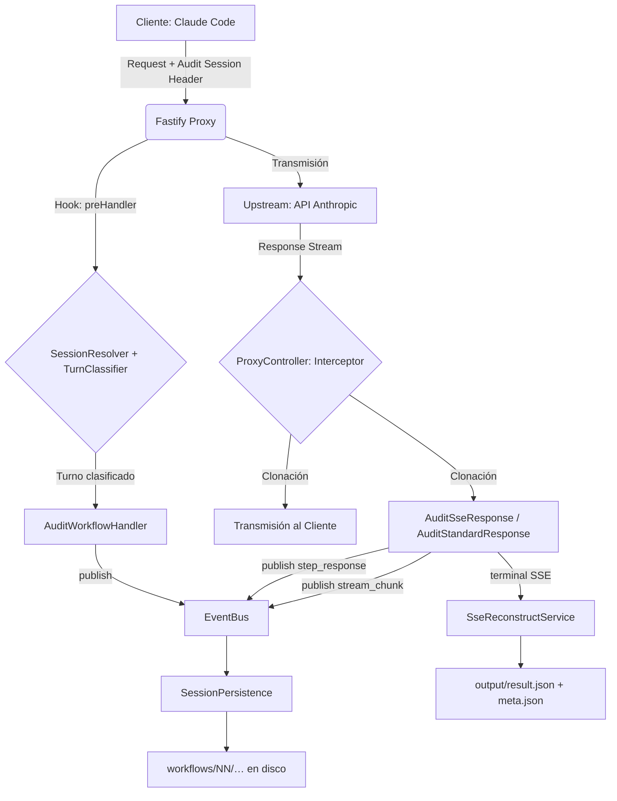

# 📡 Smart Code Proxy (Anthropic Observability)

[](https://www.typescriptlang.org/)
[](https://fastify.dev/)
[](#-diseño-del-sistema-pka---progressive-kernel-architecture)

Una implementación de alto rendimiento, modular y basada en **Fastify + TypeScript** diseñada específicamente para interceptar, auditar y analizar en tiempo real el tráfico entre **Claude Code** (el CLI oficial de Anthropic) y la API oficial de Anthropic. Claude Code permite redirigir sus peticiones al proxy vía la variable `ANTHROPIC_BASE_URL`, condición imprescindible para el funcionamiento del sistema; otros clientes (p. ej. Cursor) usan harnesses distintos y no están dentro del alcance de este proyecto.

Diseño desacoplado que garantiza **latencia cero** en la retransmisión mientras procesa auditorías enfocadas en la **observabilidad inteligente para análisis humana** — no busca registrar todo lo técnicamente posible, sino presentar los flujos lógicos que el usuario orquesta (secuenciales y/o paralelos con subagentes) de forma natural y trazable.

---

## 🏛 Diseño del Sistema (PKA - Progressive Kernel Architecture)

El proxy utiliza **Progressive Kernel Architecture (PKA)** — un modelo arquitectónico concéntrico de 6 capas que sintetiza los mejores patrones de **Clean Architecture**, **Hexagonal Architecture**, **Onion Architecture**, **DDD** y **CQRS**. Las dependencias del código fuente **solo apuntan hacia el centro** (Dominio). La Capa 6 (GUIs) no aplica a este proyecto.

### 🧩 Capas de Responsabilidad

| Capa                           | Ubicación                | Responsabilidad                                                                   | Componentes Clave                                                                                                                                                   |
| ------------------------------ | ------------------------ | --------------------------------------------------------------------------------- | ------------------------------------------------------------------------------------------------------------------------------------------------------------------- |
| **1 - Dominio**                | `src/1-domain/`          | Tipos puros (entidades) y lógica de dominio sin dependencias externas             | `SessionResolverService`, `RequestClassifierService`, `RedactService`, `MarkdownRendererService`, `SseSimulatorService`, Tipos de auditoría                         |
| **2 - Servicios (Adapters)**   | `src/2-services/`        | Implementaciones concretas con I/O (filesystem, streams) y **ports** (interfaces) | `EventBus`, `SessionPersistence`, `WorkflowRepositoryService`, `SseReconstructService`, `StreamTeeService`, Ports: `IEventBus`, `IWorkflowRepository`, `ISseReconstructor`, `IStreamTee` |
| **3 - Operaciones (Handlers)** | `src/3-operations/`      | Orquestación de casos de uso (Command Handlers)                                   | `AuditWorkflowHandler`, `AuditSseResponseHandler`, `AuditStandardResponseHandler`, `AuditUpstreamErrorHandler`, `FilterToolsHandler`                             |
| **4 - API (Composition Root)** | `src/4-api/`             | Wiring de dependencias y configuración                                            | `createProxyDependencies()`, Configuración de entorno                                                                                                               |
| **5 - Interfaces de Usuario**  | `src/5-user-interfaces/` | Adaptadores HTTP (reciben deps inyectadas via options)                            | `ProxyController`, `proxyRoutes`, `fastify.augments.d.ts`                                                                                                           |

### 📐 Regla de Dependencia

```
Capa 5 → Capa 4 → Capa 3 → Capa 2 → Capa 1
(UI)     (API)     (Ops)    (Svcs)   (Domain)
```

Las capas internas **nunca** importan de capas externas. Esta regla garantiza que:

- El dominio (Capa 1) es puro y testeable sin mocks
- Los servicios (Capa 2) pueden ser reemplazados sin afectar la lógica de negocio
- La UI (Capa 5) es un detalle de implementación desechable

### Persistencia causal (P1)

Los handlers de capa 3 **no escriben disco** directamente. El correlador publica eventos (`workflow_start`, `step_request`, `step_response`, `stream_chunk`, `tool_call`, `tool_result`, `workflow_complete`, …) en un **EventBus** in-process; **SessionPersistence** es el único suscriptor que proyecta el layout `causal-workflows-v1` bajo `sessions/<id>/workflows/NN/`. Ver [`docs/session-audit-model.md`](docs/session-audit-model.md#0-layout-vigente-causal-workflows-v1-sesiones-nuevas).

---

## 🔄 Flujo de Datos (Arquitectura de Intercepción)



---

## 🚀 Casos de Uso del Sistema

### 🔍 Observabilidad de Flujos SSE

A diferencia de un proxy genérico, este sistema "entiende" los flujos binarios de Anthropic.

- Persiste cada chunk SSE en `steps/NN/response/streaming/*.ndjson` (fuente canónica de reconstrucción; P2 implementado).
- Mantiene un volcado binario crudo (`steps/NN/response/sse.txt`) para depuración de paridad de protocolos. **No** es la fuente de la reconstrucción y puede truncarse por `MAX_AUDIT_BYTES` sin afectar al mensaje final reconstruido.

### 🛡️ Privacidad Avanzada

El diseño garantiza que nunca se filtren API Keys a los logs de servidor ni a los archivos de auditoría físicos, permitiendo compartir los volcados de sesión de forma segura entre equipos de desarrollo.

### 📦 Gestión de Sesiones Persistentes

Ideal para depurar comportamientos erráticos en herramientas de CLI (como `claude`):

- Agrupa cada ciclo E2E bajo `workflows/NN/` con subdirectorios `steps/MM/` y `tools/KK-slug/`.
- Tres tipos semánticos (`agentic`, `client-preflight`, `side-request`) se materializan como workflows hermanos bajo el mismo árbol `workflows/` (no hay `side-interactions/` en disco).
- Los `side-request` abren un workflow propio sin desplazar el workflow `main` activo.
- Varios workflows pueden coexistir en la misma sesión (subagentes paralelos, preflights, side-requests).
- Las continuaciones (`tool_result`) se rutean al turno padre mediante correlación por `tool_use_id`, eliminando la misatribución de steps. Las continuaciones de `Agent`/subagentes se coalescen en el `response` del step que emitió los subagentes; las demás tools conservan steps separados.
- **Correlación de subagentes (plano A):** Claude Code ≥ 2.1.139 emite cabeceras `X-Claude-Code-Agent-Id` y `X-Claude-Code-Parent-Agent-Id` en cada request. Cuando están presentes, la correlación es **determinista** (`correlationMethod: 'agent-headers'`), con mayor autoridad que los métodos heurísticos anteriores. Para clientes sin estas cabeceras el fallback heurístico (`prompt` / `unique-pending`) sigue operativo.
- **Borde hooks (plano C, activo desde C3):** El proxy expone `POST /hooks` para recibir eventos del lifecycle de Claude Code (hooks). El evento `SubagentStart` confirma subagentes en el correlador (`confirmSubagentFromHook`); los demás eventos (`UserPromptSubmit`, `PreToolUse`, `PostToolUse`, `Stop`, etc.) son stubs con log diferidos a G2/C4. El endpoint responde HTTP 202 inmediatamente y nunca reenvía al upstream.
- Los preflights (`client-preflight`) se cierran inmediatamente al recibir su respuesta, evitando turnos zombie que bloquean la sesión.
- El correlador (`IWorkflowRepository`) mantiene tools pendientes y steps en memoria; al cierre, `output/result.json` expone `IWorkflowResult` (outcome, usage agregado, `stepCount`).
- `meta.json` en cada workflow fusiona identidad y estado (`status`, timestamps, outcome); no hay `state.json` separado.

<a name="riesgos-seguridad"></a>

> [!WARNING]
> **Riesgos de Seguridad**: Los directorios de auditoría pueden contener API keys, tokens y contenido de conversaciones en claro si se desactiva la redacción. Restringe los permisos del directorio `sessions/` y manténlo fuera de repositorios públicos.

---

<a name="archivos-auditoria"></a>

## 📂 Referencia de Archivos de Auditoría

Layout vigente (`causal-workflows-v1`) bajo `./sessions/<session-id>/`:

```
sessions/<session-id>/
  session-metrics.json
  workflows/
    NN/                    # meta.json, request/, output/result.json, steps/MM/, tools/KK-slug/
```

Preflights y side-requests usan el mismo árbol `workflows/` con otro índice `NN` (véase [`docs/session-audit-model.md`](docs/session-audit-model.md)).

> **Referencia completa:** modelo conceptual, layout detallado, tipos de interacción, protocolo HTTP, subagentes, `meta.json` y correlación con logs — [`docs/session-audit-model.md`](docs/session-audit-model.md).

### Tipos de Interacción

| `interactionType`  | Origen                                                                 | Cierre                                            |
| ------------------ | ---------------------------------------------------------------------- | ------------------------------------------------- |
| `agentic`          | Prompt del usuario con `tools` no vacíos (fresh) + continuations       | `stop_reason` terminal (`end_turn`, `max_tokens`) |
| `client-preflight` | Quota check (`max_tokens:1`) o cache warm-up sin turno activo          | Al recibir la respuesta (inmediato)               |
| `side-request`     | Peticiones con `tools: []` (ej. `count_tokens`, generación de títulos) | Respuesta terminal; no desplaza al turno activo   |

Las peticiones **sin** cabecera de sesión válida no generan archivos bajo `sessions/`. Guía: [`docs/health-check-handling.md`](docs/health-check-handling.md).

---

<a name="configuracion"></a>

## ⚙️ Configuración (Matriz de Entorno)

Personaliza el comportamiento ajustando estas variables en tu entorno o en un archivo `configs/.env`. Cabeceras de sesión, compresión upstream y límites internos de memoria están fijados en código; véase [`docs/advanced-configuration.md`](docs/advanced-configuration.md).

|  Categoría   | Variable                  | Descripción                                                                                                                     | Default                                                                                 |
| :----------: | ------------------------- | ------------------------------------------------------------------------------------------------------------------------------- | --------------------------------------------------------------------------------------- |
|   **Core**   | `PORT`                    | Puerto de escucha del proxy.                                                                                                    | `8787`                                                                                  |
| **Upstream** | `UPSTREAM_ORIGIN`         | URL objetivo (Anthropic, OpenRouter, etc.).                                                                                     | `https://api.anthropic.com`                                                             |
| **Límites**  | `MAX_REQUEST_BODY`        | Límite del cuerpo de petición (memoria en proxy).                                                                               | `50mb`                                                                                  |
|              | `MAX_AUDIT_BYTES`         | Tope único de volcado en disco (request, response, `sse.txt` raw). Buffer en memoria se deriva internamente.                     | `52428800`                                                                              |
| **Thinking** | `PROXY_UNREDACT_THINKING` | Remueve el flag `redact-thinking-2026-02-12` del header `anthropic-beta` para capturar contenido thinking legible.              | `false` (desactivado)                                                                   |
| **Filtrado** | `FILTERED_TOOLS`          | Tool names a excluir del request (coma-separado). Omitir la variable = default abajo. Desactivar filtrado: `FILTERED_TOOLS=""`. | `ScheduleWakeup,NotebookEdit,ExitWorktree,EnterWorktree,CronList,CronDelete,CronCreate` |
|   **Logs**   | `LOG_LEVEL`               | Nivel de log de Pino (consola y `server/logs.jsonl`).                                                                           | `info`                                                                                  |

> **Auditoría por defecto.** El árbol causal se escribe vía **EventBus → SessionPersistence**. Para SSE, los chunks se persisten en `steps/MM/response/streaming/*.ndjson` (fuente canónica de reconstrucción); `sse.txt` es raw dump opcional acotado por `MAX_AUDIT_BYTES`; el cierre del workflow persiste `output/result.json`. Detalle en [`docs/how-sse-reconstruction-works.md`](docs/how-sse-reconstruction-works.md).

<a name="configuracion-de-hooks"></a>

### Configuración de hooks

Para instalar las **14 entradas** de hooks de SCP en `~/.claude/settings.json` (user-level) con merge selectivo que preserva configs ajenas del usuario: `npm run setup -- --hooks` (o `npm run setup:hooks`). Con `--dry-run` para previsualizar, `--force` para sobrescribir configs ajenas (con backup automático), `--uninstall` para desinstalar solo los hooks de SCP. La plantilla canónica versionada vive en [`configs/hooks.json`](configs/hooks.json) y el instalador en [`scripting/setup-hooks.ts`](scripting/setup-hooks.ts).

Adicionalmente, el archivo `.claude/settings.json` del proyecto registra **14 entradas** de hooks de Claude Code (**8 del lifecycle** que alimentan al gateway, más **6 entradas de UX no-lifecycle** que solo emiten toast nativo), sobrescribiendo las entradas equivalentes del user-level (`C:\Users\Cristian\.claude\settings.json`) para esas claves (mecanismo de merge de Claude Code: el proyecto tiene precedencia). Las 14 entradas son:

| Hook | Matcher | Comandos |
| --- | --- | --- |
| `UserPromptSubmit` | — | `post-hook-event.ts` + notificación (entry point del servicio migrado) |
| `PreToolUse` | `*` | `post-hook-event.ts` |
| `PreToolUse` | `AskUserQuestion` | notificación |
| `PostToolUse` | `*` | `post-hook-event.ts` |
| `PostToolUseFailure` | — | `post-hook-event.ts` |
| `SubagentStart` | — | `post-hook-event.ts` + notificación |
| `SubagentStop` | — | `post-hook-event.ts` + notificación |
| `Stop` | — | `stop-hook-ux.ts` (`POST /hooks` + toast único con mensaje de continuidad; ver abajo) |
| `StopFailure` | — | `post-hook-event.ts` + notificación |
| `SessionStart` | `startup|resume` | notificación |
| `SessionEnd` | — | notificación |
| `PermissionRequest` | — | notificación |
| `TaskCreated` | — | notificación |
| `TaskCompleted` | — | notificación |

Cada `POST /hooks` se invoca con `npx tsx scripting/post-hook-event.ts` (relay TypeScript que lee stdin y usa `ANTHROPIC_BASE_URL`; evita `curl` y `@-`, que PowerShell no interpreta como bash). La URL del proxy se resuelve vía la variable de entorno `ANTHROPIC_BASE_URL` (default `http://127.0.0.1:8787`), por lo que el comando no queda acoplado a un host:puerto literal. Los hooks **`UserPromptSubmit`**, **`SubagentStart`**, **`SubagentStop`** y **`StopFailure`** combinan `post-hook-event.ts` con un segundo comando al CLI de notificaciones (`src/2-services/notifications/cli.ts`). El hook **`Stop`** es una excepción: un único relay [`scripting/stop-hook-ux.ts`](scripting/stop-hook-ux.ts) lee stdin **una vez**, reenvía al gateway y emite un **toast único con mensaje de continuidad** (generado con Haiku a partir del contexto del workflow: qué se completó, qué está abierto, dirección del siguiente prompt). Varios comandos en paralelo sobre el mismo `Stop` vacían stdin en Windows; por eso no se usan handlers separados. El fragmento de `.claude/settings.json` del proyecto (gitignored) y el detalle operativo están en [`docs/notifications.md` § Hook Stop](docs/notifications.md#hook-stop-fin-de-turno-y-resumen-con-modelo). `PreToolUse` y `PostToolUse` con `matcher: "*"` no llevan notificación: los eventos de tool son demasiado frecuentes (5–50/turno) y un toast por invocación es ruido de UX; para notificar la pregunta interactiva se declara una **segunda entrada** bajo la misma clave `PreToolUse` con matcher `AskUserQuestion`. Las 6 entradas de UX (`SessionStart`, `SessionEnd`, `PermissionRequest`, `PreToolUse:AskUserQuestion`, `TaskCreated`, `TaskCompleted`) **no invocan** `POST /hooks`: el `AuditHookEventHandler` solo despacha los 8 `eventName` del lifecycle. Tabla canónica: [`docs/notifications.md`](docs/notifications.md) y [`docs/gateway-architecture.md` §18](docs/gateway-architecture.md#18-plano-c--hooks-claude-code).

### Notifications

El servicio de notificaciones de escritorio vive bajo `src/2-services/notifications/`: un puerto `INotificationService` (capa 1) y un adaptador `DesktopNotificationAdapter` (capa 2) que delega en `node-notifier.notify()` con un subset mínimo de opciones. El entry point CLI (`src/2-services/notifications/cli.ts`) acepta `--event-type`, `--message`, `--title`, `--sound`, `--silent`, `--stdin-json`, `--app-id` e `--icon`. **Branding:** el CLI aplica por defecto el AUMID `AIAssistant.Proxy` y el icono `<repo>/assets/notifications/ai-assistant.png` (256×256 + ICO multi-resolución). En Windows, ejecutar opcionalmente `npm run notifications:register -- --install` para que SnoreToast firme los toasts como "AI Assistant" en lugar de "SnoreToast" (helper idempotente, opt-in; no-op en macOS/Linux). Detalle operativo y exclusiones explícitas: [`docs/notifications.md`](docs/notifications.md). Spec canónica: [`openspec/specs/desktop-notifications-service/spec.md`](openspec/specs/desktop-notifications-service/spec.md).

<a name="correlación-de-sesión-sessionid"></a>

### Correlación de Sesión (SessionId)

El directorio de auditoría bajo `sessions/<sessionId>/` se nombra a partir de `x-cc-audit-session` (prioridad 1) o `x-claude-code-session-id` (prioridad 2). Si ninguna está presente, el resolver devuelve `_unknown` y **no se escribe auditoría en disco** (véase [`docs/health-check-handling.md`](docs/health-check-handling.md)). Nombres alternativos: [`docs/advanced-configuration.md`](docs/advanced-configuration.md).

<a name="capas-bytes-env"></a>

### Capas de Bytes y Convenciones de Logs

El sistema previene la saturación en memoria o disco ignorando la escritura si se superan los límites configurados:

- **Disco (`sessions/`):** un solo tope operativo, `MAX_AUDIT_BYTES` (request, response y volcado raw `sse.txt`).
- **Memoria (respuestas no-SSE):** buffer derivado internamente como `max(MAX_AUDIT_BYTES, 100 MiB)`; no es variable de entorno.

Todo volcado que se trunca genera un archivo `.omitted.txt` documentando la omisión. Detalle de constantes internas: [`docs/advanced-configuration.md`](docs/advanced-configuration.md). El proxy utiliza Fastify Logger (`LOG_LEVEL`) para consola y `server/logs.jsonl`.

> [!TIP]
> **Certificados SSL corporativos:** si tu organización intercepta tráfico HTTPS, configura la variable de entorno estándar de Node.js [`NODE_EXTRA_CA_CERTS`](https://nodejs.org/api/cli.html#node_extra_ca_certsfile) con la ruta a un archivo PEM que contenga los certificados raíz adicionales. Esta variable es gestionada directamente por Node.js, no por el proxy.

---

## 🛠 UX de Desarrollo (Workflow)

### Instrucciones de Inicio Rápido

1.  **Instalar dependencias**: `npm install`
2.  **Configurar proveedor** (opcional): `npm run configure:provider` (asistente interactivo para configurar API keys y modelos de diferentes proveedores).
3.  **Integraciones Claude Code** (opcional): `npm run setup` instala statusline, notificaciones y voz en `~/.claude/settings.json` en un único paso (admite `--dry-run`, `--uninstall`, flags `--statusline`/`--notifications`/`--voice`). Instaladores individuales para statusline y notificaciones: `npm run install:statusline` y `npm run install:notifications`. La voz no tiene instalador individual; usa `npm run setup --voice`. Ver [`docs/notifications.md`](docs/notifications.md) y [`docs/router-statusline.md`](docs/router-statusline.md).
4.  **Referencia multi-agente** (opcional): `npm run create:agents-reference` (Crea hardlink `AGENTS.md` → `CLAUDE.md` para compatibilidad con otros agentes de código).
5.  **Modo Desarrollo**: `npm run dev` (Carga `configs/.env` mediante flag nativo de Node v22.9+; **v24 LTS recomendado**).
6.  **Compilación**: `npm run build` (Genera `/dist` optimizado).
7.  **Referencia de scripts**: `npm run help` (muestra todos los scripts disponibles con descripciones).
8.  **Limpieza**: `npm run clean:dist` (purga `dist/`), `npm run clean:modules` (purga `node_modules/`). Purga completa del entorno de desarrollo del proxy (auditoría `./sessions/` y logs `./server/`): `npm run clean:all` — sustituye el antiguo slash `/router-clean-slate` de Claude Code Router (CCR), que operaba sobre `~/.claude` y ya no aplica. Selectiva: `npm run clean:sessions` o `npm run clean:logs`.

### Gestión de sesiones Claude Code

CLI npm para el historial de **Claude Code** en `~/.claude` (listar, archivar, restaurar, eliminar y sanitizar bloques `thinking` inválidos tras usar el proxy). No confundir con `npm run clean:sessions`, que purga la carpeta `./sessions/` de **auditoría del proxy**.

| Script | Descripción |
|--------|-------------|
| `sessions:list` | Lista sesiones del proyecto (cwd) |
| `sessions:archive` | Archiva a `~/.claude/archived-sessions/` |
| `sessions:restore` | Restaura una sesión archivada |
| `sessions:delete` | Elimina permanentemente (requiere `--force`) |
| `sessions:list-archived` | Lista archivadas |
| `sessions:sanitize:scan` | Detecta thinking blocks con firma inválida |
| `sessions:sanitize` | Sanitiza una sesión (`npm run … -- <id>`) |
| `sessions:sanitize:all` | Sanitiza en lote (requiere `-- --force`) |

Detalle, layout en disco y ejemplos: [scripting/session-manager/README.md](scripting/session-manager/README.md).

> Para una guía detallada de onboarding, consultar [docs/how-to-start.md](docs/how-to-start.md).

<a name="enrutamiento-de-proveedores"></a>

## 📡 Enrutamiento de Proveedores

El directorio `routing/providers/` contiene la configuración de los diferentes proveedores de modelos LLM soportados:

```
routing/providers/
├── anthropic/           # AUTH_METHOD: oauth
│   ├── config.json      # Configuración del proveedor
│   ├── secrets.json     # API keys (no versionado)
│   ├── secrets.json.example
│   └── models/          # Metadatos por modelo
│       ├── claude-haiku-4-5/metadata.json
│       ├── claude-opus-4-6/metadata.json
│       └── claude-sonnet-4-6/metadata.json
├── openrouter/          # AUTH_METHOD: bearer
│   ├── config.json      # Configuración del proveedor
│   ├── secrets.json     # API keys (no versionado)
│   ├── secrets.json.example
│   └── models/          # Metadatos por modelo
│       ├── deepseek-v4-flash/metadata.json
│       ├── deepseek-v4-pro/metadata.json
│       └── minimax-m2-5/metadata.json
├── ollama/              # AUTH_METHOD: bearer
│   ├── config.json      # Configuración del proveedor
│   ├── secrets.json     # API keys (no versionado)
│   ├── secrets.json.example
│   └── models/          # Metadatos por modelo
│       ├── gemini-3-flash-preview/metadata.json
│       ├── minimax-m2.5/metadata.json
│       └── minimax-m2.7/metadata.json
└── xiaomi/              # AUTH_METHOD: bearer
    ├── config.json      # Configuración del proveedor
    └── models/          # Metadatos por modelo
        ├── mimo-v2-5/metadata.json
        ├── mimo-v2-5-pro/metadata.json
        └── mimo-v2-omni/metadata.json
```

Cada `config.json` incluye el campo `AUTH_METHOD` que determina qué variable de entorno de autenticación usa Claude Code al comunicarse con ese proveedor:

| `AUTH_METHOD` | Variable de entorno                 | Header HTTP                         | Cuándo usarlo                                        |
| ------------- | ----------------------------------- | ----------------------------------- | ---------------------------------------------------- |
| `oauth`       | Ninguna (`ANTHROPIC_API_KEY` vacía) | `Authorization: Bearer` (vía OAuth) | Autenticación nativa (Suscripción Pro/Max)           |
| `api_key`     | `ANTHROPIC_API_KEY`                 | `X-Api-Key`                         | Acceso directo a la API de Anthropic (pay-as-you-go) |
| `bearer`      | `ANTHROPIC_AUTH_TOKEN`              | `Authorization: Bearer`             | Gateways y proxies LLM (OpenRouter, Ollama, Xiaomi)  |

Los archivos `secrets.json` contienen la credencial real y **no deben versionarse** (están en `.gitignore`). Usar `secrets.json.example` como plantilla — su contenido refleja el campo correcto según el `AUTH_METHOD` del proveedor.

### Mecanismo de Intercepción Multi-Proveedor

Al ejecutar `npm run configure:provider <proveedor>`, el sistema realiza dos acciones clave para garantizar que el tráfico siempre fluya a través del proxy para su auditoría:

1. **Redirección del Cliente**: Sobrescribe la variable de entorno de tu sistema operativo `ANTHROPIC_BASE_URL` para que apunte al **Smart Code Proxy local** (`http://127.0.0.1:<PORT>`).
2. **Enrutamiento del Proxy**: Extrae la verdadera URL destino del proveedor (`config.json`) y la escribe como `UPSTREAM_ORIGIN` en el archivo `configs/.env` del proxy.

> **Importante:** Si el Smart Code Proxy ya estaba ejecutándose al momento de cambiar de proveedor, debes detenerlo y volver a iniciarlo para que cargue el nuevo destino desde el archivo `.env`.

## 🐳 Docker y Contenerización

Los artefactos para la contenerización del proyecto se han centralizado en el directorio `containerization/`.

- `containerization/Dockerfile`: imagen multi-etapa optimizada para producción.
- `containerization/.dockerignore`: entradas ignoradas para construir la imagen sin archivos de desarrollo ni artefactos (convención [BuildKit](https://docs.docker.com/build/buildkit/): Docker asocia automáticamente este archivo al `Dockerfile` del mismo directorio).

Instrucciones básicas:

1.  Construir la imagen (desde la raíz del repositorio):
    - `docker build -f containerization/Dockerfile -t smart-code-proxy:latest .`

2.  Ejecutar el contenedor (crea y monta `sessions/` como volumen):
    - `docker run -it --rm -p 8787:8787 -v "$(pwd)/sessions:/app/sessions" --env-file configs/.env smart-code-proxy:latest`

3.  Notas importantes:
    - El `Dockerfile` usa una etapa `builder` para compilar TypeScript y una etapa final mínima basada en `node:24-alpine`.
    - Asegúrate de no incluir `sessions/`, `dist/` ni `node_modules/` en la imagen: estos están listados en `containerization/.dockerignore`. Docker BuildKit (motor por defecto desde Docker 23.0+) reconoce automáticamente este archivo al construir con `-f containerization/Dockerfile`.
    - La imagen final ejecuta como usuario `node` (no-root) e incluye un `HEALTHCHECK` contra `/health`.
    - Para desarrollo iterativo es recomendable usar `npm run dev` localmente en lugar de reconstruir la imagen cada cambio.

Para más detalles y comandos alternativos, consulta `docs/dockerization.md`.

### Interpretación de Auditoría

Tras cada ciclo auditado, se genera (o actualiza) `./sessions/<session-id>/workflows/NN/`, documentado en la [§ Referencia de Archivos de Auditoría](#archivos-auditoria) y en [`docs/session-audit-model.md`](docs/session-audit-model.md).

### Fix de Colisión de Steps y Reconstrucción SSE

El proxy incluye validaciones defensivas para prevenir errores de reconstrucción SSE causados por colisiones de concurrencia en requests internas (WebSearch/WebFetch):

- **Contrato inmutable de stepIndex**: Cada step auditado tiene un `assignedStepIndex` asignado durante el request audit que se transporta inmutablemente hasta el response audit. Esto garantiza que el handler de response use el índice correcto del step, incluso si el workflow en el correlador ha avanzado por requests concurrentes.
  - Fresh agentic y side-request: `assignedStepIndex = 1`
  - Client-preflight: `assignedStepIndex = 1`
  - Continuation no-coalesced: `assignedStepIndex = stepCount` incrementado
  - WebSearch/WebFetch internos: `assignedStepIndex = stepCount` asignado dentro de `withSessionLock`
  - Coalesced Agent continuation: `assignedStepIndex = coalescedAgentContinuation.targetStepIndex`
- **Asignación atómica de steps internos**: Los handlers de WebSearch y WebFetch usan `withSessionLock` para serializar la asignación de `stepCount` y escritura de step requests, evitando que dos requests concurrentes escriban en el mismo directorio de step.
- **Correlación de WebFetch interna**: Las implementaciones WebFetch reales llegan como requests con `tools: []` y contenido `Web page content:`. El proxy las detecta antes de clasificarlas como `side-request` genérico. Si existe un pending WebFetch en el agente/subagente padre, se correlaciona como step interno del padre. Si no hay pending, se trata como side-request normal.
- **Unicidad de metadata**: `pushStepMetaByDir` rechaza duplicados no-coalesced con el mismo `stepIndex`, lanzando un error diagnóstico si se detecta una colisión. Para steps coalesced, permite enriquecer la metadata existente en lugar de crear duplicados.
- **Validación de SSE completo**: `SseReconstructService` valida que el NDJSON contenga exactamente un mensaje completo (un `message_start` y un `message_stop`). Si detecta múltiples mensajes o un stream incompleto, lanza un error diagnóstico antes de pasar al SDK de Anthropic.
- **Reconstrucción por fase**: Los steps coalesced de Agent usan `reconstructSseJsonlPhaseMessage` (que no requiere `message_stop`) para reconstruir fases parciales (delegation/continuation), manteniendo separados los caminos de reconstrucción para streams completos versus fases coalesced.

---

> [!NOTE]
> Este proyecto utiliza **Inyección de Dependencias** para facilitar las pruebas unitarias de los servicios sin necesidad de levantar el servidor completo.

## 📚 Guías de Estimación de Costos

El proxy intercepta métricas de uso de tokens que pueden ser cuantificadas. Consulta estas guías adicionales para configurar precios y estimar costos según el tráfico auditado:

- [Cómo empezar (on-boarding)](./docs/how-to-start.md)
- [Peticiones sin sesión (pre-sesión)](./docs/health-check-handling.md)
- [Coste por interacción: Claude Code y la API de Anthropic](./docs/how-to-calculate-anthropic-api-costs.md)
- [Coste por generación: OpenRouter y la API Chat Completions](./docs/how-to-calculate-openrouter-api-costs.md)
