# Smart Code Proxy — Arquitectura del Gateway

Documento de referencia del **gateway tal como está implementado**: el modelo de dominio (vocabulario gateway), la correlación runtime Wire + Hooks, la estrategia de persistencia en disco (`causal-workflows-v1`) y la composición PKA en `src/`. Describe el sistema en presente; la historia de cómo se llegó a esta arquitectura vive en los changes archivados (ver §41).

---

## Tabla de contenidos

### [Parte I — Fundamentos](#parte-i--fundamentos)

- [1. Contexto del producto](#1-contexto-del-producto)
- [2. Progressive Kernel Architecture](#2-progressive-kernel-architecture)
- [3. Principios de diseño gateway](#3-principios-de-diseño-gateway)
- [4. Glosario y definiciones canónicas](#4-glosario-y-definiciones-canónicas)
- [5. Integración con tipos Anthropic](#5-integración-con-tipos-anthropic)

### [Parte II — Modelo de dominio](#parte-ii--modelo-de-dominio)

- [6. Vista de agregados](#6-vista-de-agregados)
- [7. Entidades de enrutamiento](#7-entidades-de-enrutamiento)
- [8. Session y Workflow](#8-session-y-workflow)
- [9. WorkflowResult](#9-workflowresult)
- [10. Step](#10-step)
- [11. ToolUse](#11-tooluse)
- [12. Invariantes globales (G1–G19)](#12-invariantes-globales-g1g19)
- [13. Tipos primitivos y estructura de archivos](#13-tipos-primitivos-y-estructura-de-archivos)

### [Parte III — Observabilidad y correlación](#parte-iii--observabilidad-y-correlación)

- [14. Sistema de correlación: tres planos de señal](#14-sistema-de-correlación-tres-planos-de-señal)
- [15. Reglas de autoridad por concern](#15-reglas-de-autoridad-por-concern)
- [16. Plano A — Cabeceras Claude Code ≥ 2.1.139](#16-plano-a--cabeceras-claude-code--21139)
- [17. Plano B — Delegación SSE y join tool↔agente](#17-plano-b--delegación-sse-y-join-toolagente)
- [18. Plano C — Hooks Claude Code](#18-plano-c--hooks-claude-code)
- [19. Flujo proxy HTTP](#19-flujo-proxy-http)
- [20. Streaming SSE y StepBuffer](#20-streaming-sse-y-stepbuffer)
- [21. Subagentes](#21-subagentes)
- [22. Integración Wire ↔ Hooks: carreras y estados](#22-integración-wire--hooks-carreras-y-estados)
- [23. Integración correlador — bus de eventos — persistencia](#23-integración-correlador--bus-de-eventos--persistencia)

### [Parte IV — Persistencia](#parte-iv--persistencia)

- [24. Terminología de entradas y salidas](#24-terminología-de-entradas-y-salidas)
- [25. Estructura de directorios `causal-workflows-v1`](#25-estructura-de-directorios-causal-workflows-v1)
- [26. Reglas adaptativas](#26-reglas-adaptativas)
- [27. Escenarios de workflows](#27-escenarios-de-workflows)
- [28. Artefactos de persistencia](#28-artefactos-de-persistencia)
- [29. Reconstrucción de bodies](#29-reconstrucción-de-bodies)
- [30. Resolución canónica de ubicaciones](#30-resolución-canónica-de-ubicaciones)
- [31. Garantías de robustez](#31-garantías-de-robustez)
- [32. Matriz entidad dominio ↔ ruta disco](#32-matriz-entidad-dominio--ruta-disco)
- [33. Checklist de conformidad E2E del layout](#33-checklist-de-conformidad-e2e-del-layout)

### [Parte V — Arquitectura PKA](#parte-v--arquitectura-pka)

- [34. Diagrama de capas (wire + hooks)](#34-diagrama-de-capas-wire--hooks)
- [35. Composición por capa y mapa archivo → capa](#35-composición-por-capa-y-mapa-archivo--capa)
- [36. Capa 1 — Domain](#36-capa-1--domain)
- [37. Capa 2 — Services](#37-capa-2--services)
- [38. Capa 3 — Operations](#38-capa-3--operations)
- [39. Capas 4–5 — Composition y Delivery](#39-capas-45--composition-y-delivery)

### [Parte VI — Limitaciones y referencias](#parte-vi--limitaciones-y-referencias)

- [40. Fuera de alcance y limitaciones conocidas](#40-fuera-de-alcance-y-limitaciones-conocidas)
- [41. Referencias y trazabilidad](#41-referencias-y-trazabilidad)
- [42. Resumen ejecutivo](#42-resumen-ejecutivo)

---

# Parte I — Fundamentos

## 1. Contexto del producto

**Smart Code Proxy** es un proxy HTTP (Fastify + TypeScript) que se coloca entre **Claude Code** y la API **Anthropic-compatible** upstream. Claude Code redirige tráfico con `ANTHROPIC_BASE_URL` apuntando al proxy.

**Dos responsabilidades principales:**

| Responsabilidad                   | Descripción                                                                                                                                                                                              |
| --------------------------------- | -------------------------------------------------------------------------------------------------------------------------------------------------------------------------------------------------------- |
| **Proxy transparente**            | Reenviar `POST /v1/messages` (y rutas afines) al upstream con latencia mínima; reenviar streams SSE al cliente.                                                                                          |
| **Auditoría orientada al humano** | Persistir bajo `sessions/<session-id>/` una jerarquía legible: workflows, steps HTTP, subagentes, reconstrucción de mensajes. No es un event store exhaustivo de cada delta SSE como entidad de dominio. |

El gateway eleva la observabilidad a un **modelo de dominio propio** (vocabulario gateway) y distribuye responsabilidades según PKA, proyectando en disco la estructura `causal-workflows-v1` (Parte IV, §24–§33) y exponiendo un segundo borde normativo (hooks Claude Code). La proyección a `sessions/` es coherente con `session-audit-model.md`.

**Documentos hermanos (profundidad, no prerequisito):**

| Documento                                        | Contenido                                           |
| ------------------------------------------------ | --------------------------------------------------- |
| [session-audit-model.md](session-audit-model.md) | Modelo de auditoría en disco (`sessions/`)          |
| [README.md](../README.md)                        | Operación, configuración, diagrama de flujo general |

---

## 2. Progressive Kernel Architecture

PKA es un modelo de **seis capas concéntricas** que asigna un paradigma clásico a cada anillo. Las dependencias de código **solo apuntan hacia el centro** (capa 1 = más estable; capas externas = más volátiles).

### 2.1 Paradigma por capa

| Capa  | Nombre                            | Paradigma                | Rol                                                                                |
| ----- | --------------------------------- | ------------------------ | ---------------------------------------------------------------------------------- |
| **1** | Domain                            | DDD                      | Vocabulario del negocio, reglas invariantes, contratos de persistencia abstractos. |
| **2** | Services                          | Hexagonal                | Ports + adapters cohesionados: tecnología sin reglas de negocio.                   |
| **3** | Operations                        | CQRS                     | Casos de uso: command/query handlers que orquestan dominio + adapters.             |
| **4** | Application Programming Interface | Orquestación transversal | Multiplexor interno (DI, Mediator, auth, UoW, tracing).                            |
| **5** | User Interfaces / Delivery        | Protocolos               | HTTP, CLI, colas: traducen wire → intención de aplicación.                         |
| **6** | Graphical User Interfaces         | Presentación             | **No aplica** a este proxy.                                                        |

### 2.2 Tres zonas conceptuales

| Zona                          | Capas      | Qué cambia cuando evoluciona el sistema     |
| ----------------------------- | ---------- | ------------------------------------------- |
| **Semántica de negocio**      | 1 y 3      | Reglas de dominio y flujos de casos de uso. |
| **Encapsulación tecnológica** | 2, 5 (y 6) | Frameworks, disco, protocolos.              |
| **Orquestación transversal**  | 4          | Políticas comunes a todos los canales.      |

### 2.3 Regla de dependencia

| Capa | Puede importar    | No puede conocer |
| ---- | ----------------- | ---------------- |
| 5    | 4                 | 1–3 directamente |
| 4    | 3, contratos de 2 | 5–6              |
| 3    | 2, 1              | 4–6              |
| 2    | 1                 | 3–6              |
| 1    | —                 | 2–6              |

### 2.4 Perfil PKA adoptado en Smart Code Proxy

| Decisión                   | Descripción                                                                                                                               |
| -------------------------- | ----------------------------------------------------------------------------------------------------------------------------------------- |
| **Dominio anémico**        | Capa 1: tipos, value objects y domain services puros (clasificación, agregación de tokens, redacción). Poca o ninguna lógica con efectos. |
| **Orquestación en capa 3** | La secuencia "clasificar → abrir workflow → escribir request → procesar SSE → cerrar workflow" vive en handlers.                          |
| **Capa 4 reducida**        | Solo Composition Root + configuración; sin Mediator ni pipeline (un único canal HTTP).                                                    |

---

## 3. Principios de diseño gateway

### 3.1 Matriz de alcance por capa

| Capa                                      | Responsabilidad                                                             | Alcance en este diseño     |
| ----------------------------------------- | --------------------------------------------------------------------------- | -------------------------- |
| **Aplicación** (encima del gateway)       | Orquestación de apps propias; bibliotecas cliente de terceros               | Solo mención periférica    |
| **Claude Code**                           | Ejecuta tools y subagentes; emite hooks; construye el historial de mensajes | Cliente + emisor de hooks  |
| **Gateway (este diseño)**                 | Proxy HTTP + correlación + persistencia de observabilidad                   | **Alcance del documento**  |
| **Dominio Anthropic** (`types/anthropic`) | Forma de mensajes, bloques, request/response, SSE                           | Reutilización sin duplicar |
| **Infraestructura**                       | Cliente HTTP upstream, endpoint hooks, correlador, persistencia disco       | Implementación             |

### 3.2 Principios

| #   | Principio                           | Implicación                                                                                           |
| --- | ----------------------------------- | ----------------------------------------------------------------------------------------------------- |
| 1   | **Proxy primero**                   | El gateway reenvía `POST /v1/messages` sin orquestar el loop agéntico. Claude Code arma `messages[]`. |
| 2   | **Observabilidad propia**           | `Step` y `Workflow` son términos del gateway, no préstamos de capas superiores.                       |
| 3   | **Dos bordes normativos**           | Wire Anthropic (HTTP/SSE) + hooks Claude Code (lifecycle, cierre E2E, `finalText`).                   |
| 4   | **Composición con tipos Anthropic** | No duplicar mensajes/bloques; referenciar `AnthropicRequest`, `AnthropicMessage`, `AnthropicUsage`.   |
| 5   | **Sin entidad Agent**               | Metadatos de subagente viven en `Workflow` (`kind`, `agentType?`, `agentId?`).                        |

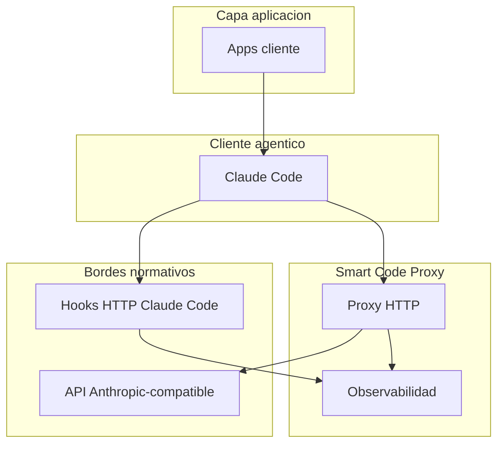
```mermaid
flowchart TB
  subgraph app [Capa aplicacion]
    Apps[Apps cliente]
  end
  subgraph runtime [Cliente agentico]
    CC[Claude Code]
  end
  subgraph gw [Smart Code Proxy]
    Proxy[Proxy HTTP]
    Obs[Observabilidad]
  end
  subgraph wire [Bordes normativos]
    API[API Anthropic-compatible]
    Hooks[Hooks HTTP Claude Code]
  end

  Apps --> CC
  CC --> Proxy
  Proxy --> API
  CC --> Hooks
  Hooks --> Obs
  Proxy --> Obs
```

---

## 4. Glosario y definiciones canónicas

> **Step:** agrupa la llamada a la API de inferencia, la respuesta del modelo, y la ejecución y resultados de las tools asociadas a esa respuesta. El Step siguiente es el que procesa los resultados de las tools del Step anterior (vía `messages` del request de inferencia).
>
> **Workflow:** agrupa la ejecución E2E desde el input del usuario hasta el Step final que contiene el mensaje de cierre del workflow.
>
> **Consumo facturado por hop:** contadores `usage` de un `POST /v1/messages`. La agregación en `WorkflowResult.usage` suma esos contadores **por categoría** entre hops; representa lo facturado en el workflow, no el tamaño único del historial (ver §9.6).

### Mapa señal observada → entidad gateway

| Señal observada                               | Entidad               | Origen               |
| --------------------------------------------- | --------------------- | -------------------- |
| `session_id`                                  | **Session**           | Campo común en hooks |
| `UserPromptSubmit` → `Stop`                   | **Workflow** (main)   | Hooks lifecycle      |
| `SubagentStart` → `SubagentStop`              | **Workflow** (sub)    | Hooks lifecycle      |
| `POST /v1/messages` → `message_stop`          | **Step**              | Wire proxied         |
| `tool_use` block en assistant → `PostToolUse` | **ToolUse**           | Wire + hooks         |
| `X-Claude-Code-Agent-Id`                      | `Workflow.agentId`    | Wire header          |
| `model` en request                            | **LanguageModel** ref | Wire body            |
| Provider base URL                             | **Provider**          | Configuración        |

---

## 5. Integración con tipos Anthropic

Las entidades del gateway **referencian** DTOs Anthropic; no redefinen mensajes ni bloques.

| Concepto gateway                      | Tipo Anthropic reutilizado                                              |
| ------------------------------------- | ----------------------------------------------------------------------- |
| Request en Step                       | `IAnthropicRequest`                                                     |
| Mensaje assistant (por hop)           | `IAnthropicMessage` en `Step.assistantMessage`                          |
| Texto final E2E (resumen)             | `string` en `WorkflowResult.finalText` — origen hook, no wire           |
| Bloques en respuesta sync             | `IAnthropicContentBlock[]` en `IAnthropicResponse.content`              |
| Bloques en ToolUse                    | `IAnthropicContentBlock`                                                |
| Uso de tokens (por hop)               | `IAnthropicUsage` en `Step.usage`                                       |
| Uso de tokens (consumo facturado E2E) | `IAnthropicUsage` en `WorkflowResult.usage` — misma forma, suma por hop |
| Respuesta síncrona                    | `IAnthropicResponse` / clase `Response`                                 |
| Streaming SSE                         | `AnthropicSseEvent` + interfaces `IAnthropicSse*`                       |
| Roles y tipos de bloque               | `AnthropicRole`, `AnthropicBlockType`                                   |

**Mapeo ToolUse ↔ bloques wire:**

| Fase             | Bloque Anthropic                 | Campo ToolUse                         |
| ---------------- | -------------------------------- | ------------------------------------- |
| Solicitud        | `type: 'tool_use'`               | `toolUseBlock`, `arguments` ← `input` |
| Resultado        | `type: 'tool_result'`            | `toolResultBlock`, `tool_use_id`      |
| Error / denegado | `tool_result` + `is_error: true` | `status: 'rejected' \| 'error'`       |

> **Streaming SSE:** los tipos existen para parseo en el borde; no se persisten como agregados gateway. Ver §20.

# Parte II — Modelo de dominio

## 6. Vista de agregados

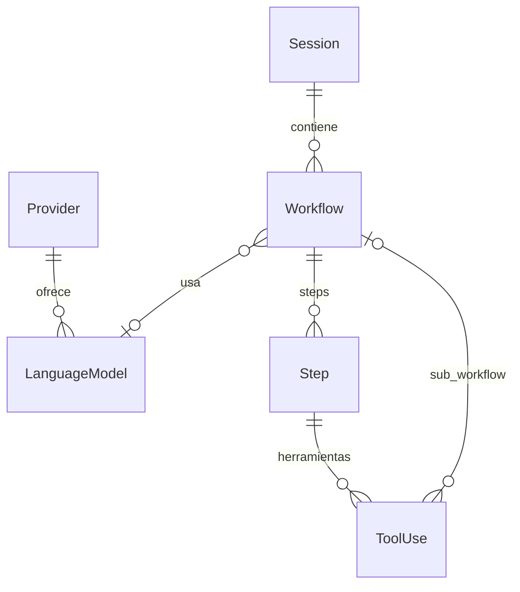
```mermaid
erDiagram
  Provider ||--o{ LanguageModel : ofrece
  Session ||--o{ Workflow : contiene
  Workflow }o--o| LanguageModel : usa
  Workflow ||--o{ Step : steps
  Step ||--o{ ToolUse : herramientas
  ToolUse }o--o| Workflow : sub_workflow
```

### Jerarquía de composición

```
Provider
  └── LanguageModel[]
Session (raíz de continuidad)
  └── Workflow[]
        ├── kind, agentType?, agentId?
        ├── languageModelId? (ref)
        ├── WorkflowResult? (valor al cerrar; usage? consumo facturado E2E §9.6; finalText? §9.7)
        └── Step[]
              ├── inferenceRequest  → IAnthropicRequest (snapshot)
              ├── assistantMessage  → IAnthropicMessage
              ├── toolUses[]        → ToolUse[]
              └── usage?, stopReason?   ← Step.usage = hop wire; agregación E2E en WorkflowResult §9.6
                    ToolUse
                      ├── toolUseBlock    → IAnthropicContentBlock (type: tool_use)
                      ├── toolResultBlock? → IAnthropicContentBlock (type: tool_result)
                      └── childWorkflowId? → Workflow (subagente)
```

Un **Step** no es solo una llamada HTTP aislada: incluye la fase de tools observada vía hooks. Los `tool_result` del Step N se consumen en el `inferenceRequest` del Step N+1, no como un mensaje user paralelo en el mismo Step.

---

## 7. Entidades de enrutamiento

### Provider

**Rol:** Identifica quién ejecuta la inferencia y cómo se enruta la petición proxied.

| Campo          | Tipo           | Notas                                              |
| -------------- | -------------- | -------------------------------------------------- |
| `id`           | `string`       | Identificador interno del gateway                  |
| `kind`         | `ProviderKind` | `'anthropic' \| 'vertex' \| 'bedrock' \| 'custom'` |
| `baseUrl?`     | `string`       | URL base cuando no es first-party Anthropic        |
| `displayName?` | `string`       | Etiqueta para UI/logs                              |

**Invariantes:**

- `kind === 'custom'` implica `baseUrl` definido.
- No contiene secretos; credenciales viven en infraestructura.

---

### LanguageModel

**Rol:** Modelo LLM disponible a través de un proveedor (p. ej. `claude-sonnet-4-6`).

| Campo                       | Tipo      | Notas                                           |
| --------------------------- | --------- | ----------------------------------------------- |
| `id`                        | `string`  | ID interno del gateway                          |
| `providerId`                | `string`  | FK lógica a `Provider`                          |
| `modelId`                   | `string`  | ID enviado a la API (`IAnthropicRequest.model`) |
| `displayName?`              | `string`  |                                                 |
| `supportsEffort?`           | `boolean` | Capacidad del proveedor/modelo                  |
| `supportsExtendedThinking?` | `boolean` | Opcional                                        |

**Integración Anthropic:** `modelId` corresponde al campo `model` observado en requests proxied.

> **`LanguageModel` vs. directorio `models/`:** `LanguageModel` es un value object del dominio gateway, no un subdirectorio de `src/1-domain/models/`. La carpeta `models/gateway/` contiene clases de dominio (perfil anémico); `LanguageModel` como interfaz vive en `interfaces/gateway/`. El campo `model` de `IAnthropicRequest` es un string wire; `LanguageModel.modelId` es la referencia de dominio que lo mapea.

---

## 8. Session y Workflow

### Session

**Rol:** Agrupa la continuidad observada de una sesión Claude Code y el historial de workflows correlacionados.

| Campo                | Tipo                      | Notas                              |
| -------------------- | ------------------------- | ---------------------------------- |
| `id`                 | `string`                  | ID interno del gateway             |
| `externalSessionId?` | `string`                  | `session_id` de hooks Claude Code  |
| `providerId?`        | `string`                  | Proveedor por defecto de la sesión |
| `workflows`          | `Workflow[]`              | Historial de workflows observados  |
| `createdAt`          | `Date`                    |                                    |
| `metadata?`          | `Record<string, unknown>` | Proyecto, usuario, etc.            |

**Eventos de sesión (no son Steps):**

| Hook                         | Ubicación en dominio                           |
| ---------------------------- | ---------------------------------------------- |
| `SessionStart`               | Crear o reanudar metadata de `Session`         |
| `SessionEnd`                 | Cierre de sesión observado                     |
| `PreCompact` / `PostCompact` | `SessionEvent` futuro o log de infraestructura |

**Invariantes:**

- `externalSessionId` se asigna al recibir el primer hook con `session_id`.
- Resume/fork operan sobre la misma `Session` (o rama vía metadata), no sobre un solo `Workflow`.

---

### Workflow

**Rol:** Intervalo de observabilidad E2E desde el input del usuario (o spawn de subagente) hasta el Step final con mensaje de cierre.

| Campo               | Tipo             | Notas                                          |
| ------------------- | ---------------- | ---------------------------------------------- |
| `id`                | `string`         |                                                |
| `sessionId`         | `string`         |                                                |
| `kind`              | `WorkflowKind`   | `'main' \| 'subagent'`                         |
| `agentType?`        | `string`         | De hook `agent_type` / `SubagentStart`         |
| `agentId?`          | `string`         | De hook `agent_id` (subagentes)                |
| `languageModelId?`  | `string`         | Último o dominante en Steps                    |
| `prompt?`           | `string`         | De `UserPromptSubmit.prompt` o input subagente |
| `status`            | `WorkflowStatus` | Ver §13                                        |
| `steps`             | `Step[]`         | Steps correlacionados en orden                 |
| `result?`           | `WorkflowResult` | Snapshot inmutable al cierre; ver **§9**       |
| `transcriptPath?`   | `string`         | Referencia hook; reconciliación opcional       |
| `parentWorkflowId?` | `string`         | Sub-workflow                                   |
| `parentToolUseId?`  | `string`         | Enlace al `ToolUse` que lo disparó             |
| `startedAt`         | `Date`           |                                                |
| `completedAt?`      | `Date`           |                                                |

**Delimitadores (hooks):**

| Evento             | Acción                                                                          |
| ------------------ | ------------------------------------------------------------------------------- |
| `UserPromptSubmit` | Abre `Workflow` con `kind: 'main'`                                              |
| `SubagentStart`    | Abre `Workflow` con `kind: 'subagent'`                                          |
| `Stop`             | Cierra main si `stop_hook_active === false` y sin `background_tasks` pendientes |
| `SubagentStop`     | Cierra sub-workflow                                                             |
| `StopFailure`      | Cierra con `WorkflowResult.outcome: 'api_error'`                                |

**Cardinalidad:** `Session` 1 — \* `Workflow`. Cada prompt significativo abre un workflow; reanudar sesión puede abrir un workflow nuevo.

**Invariantes:**

- `status` en `'completed' | 'failed' | 'aborted'` implica `result` definido.
- Un sub-workflow tiene `parentWorkflowId` y `parentToolUseId` obligatorios.

---

## 9. WorkflowResult

### 9.1 Propósito

**Rol:** Value object **inmutable** adjunto a `Workflow.result` al cierre del workflow.

Responde: _¿cómo terminó la ejecución E2E del workflow?_ — resultado global, texto final reportado por el orquestador, coste agregado y extensión en Steps.

- Se construye **una vez** al recibir un hook de cierre (`Stop`, `SubagentStop`, `StopFailure`).
- Es un **snapshot de resumen** para API, persistencia y dashboards.
- El detalle por hop de inferencia (mensajes, `stop_reason`, tools) permanece en `Workflow.steps[]`; ver **§10**.

### 9.2 Qué no es

- **No** es un `IAnthropicResponse` agregado ni un DTO de un solo POST al modelo.
- **No** sustituye `Step.assistantMessage`, `Step.usage` ni `Step.stopReason`.
- **No** proviene del SDK Agent (`ResultMessage`); el cierre se observa vía **hooks Claude Code** + agregación de Steps.
- **`WorkflowResult.usage` no** es el `usage` del último `IAnthropicResponse` del workflow; es agregación gateway. Ver **§9.6**.
- **`WorkflowResult.usage` no** mide cardinalidad única del contexto; es consumo facturado por hop agregado. Ver **§9.6**.
- **`WorkflowResult.finalText` no** es `IAnthropicResponse.content` del último POST ni extracto de `Step.assistantMessage`; es passthrough de `last_assistant_message`. Ver **§9.7**.
- El `stop_reason` del modelo vive en **`Step.stopReason`** (wire Anthropic); **no** se denormaliza en `WorkflowResult`.

### 9.3 Campos

| Campo           | Tipo                    | Origen                         | Descripción                                                                                                                                                                       |
| --------------- | ----------------------- | ------------------------------ | --------------------------------------------------------------------------------------------------------------------------------------------------------------------------------- |
| `outcome`       | `WorkflowOutcome`       | Hook + reglas de cierre (§9.4) | Resultado global: `'success' \| 'api_error' \| 'aborted' \| 'unknown'`                                                                                                            |
| `finalText?`    | `string`                | Hook de cierre                 | Texto plano E2E; passthrough de `last_assistant_message` (**hook**, no StepBuffer). Fuentes primarias: `Stop`, `SubagentStop`; `StopFailure` solo si el campo viene. Ver **§9.7** |
| `usage?`        | `IAnthropicUsage`       | Agregación                     | Suma **por categoría** de `Step.usage` cerrados (+ rollup hijos). **Consumo facturado E2E** del workflow; no cardinalidad única de contexto. Ver **§9.6**.                        |
| `stepCount`     | `number`                | Agregación                     | Cantidad de Steps **cerrados** al momento del cierre                                                                                                                              |
| `closedByEvent` | `WorkflowClosedByEvent` | Hook                           | Evento que disparó el cierre: `'Stop' \| 'SubagentStop' \| 'StopFailure'`                                                                                                         |
| `sessionId`     | `string`                | Hook                           | `session_id` del hook de cierre                                                                                                                                                   |

Contrato TypeScript de referencia:

```typescript
interface WorkflowResult {
  outcome: WorkflowOutcome;
  finalText?: string;
  /** Consumo facturado por hop agregado; no tamaño único de contexto. §9.6 */
  usage?: IAnthropicUsage;
  stepCount: number;
  closedByEvent: WorkflowClosedByEvent;
  sessionId: string;
}
```

### 9.4 Derivación de outcome y reglas de cierre

| Hook / regla                          | `outcome`     | Condiciones                  |
| ------------------------------------- | ------------- | ---------------------------- |
| `Stop` / `SubagentStop`               | `'success'`   | Cierre permitido (ver abajo) |
| `StopFailure`                         | `'api_error'` | Siempre al recibir el hook   |
| `PostToolBatch` con `decision: block` | `'aborted'`   | Bloqueo de batch de tools    |
| Caso no clasificado                   | `'unknown'`   | Fallback                     |

**Condiciones para cerrar en `Stop` / `SubagentStop`:**

- No cerrar si `stop_hook_active === true`.
- No cerrar si `background_tasks` tiene subagentes async pendientes.

### 9.5 Construcción al cierre

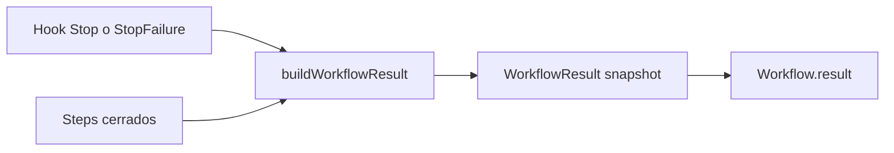
```mermaid
flowchart LR
  Hook[Hook Stop o StopFailure] --> Factory[buildWorkflowResult]
  Steps[Steps cerrados] --> Factory
  Factory --> Result[WorkflowResult snapshot]
  Result --> Workflow[Workflow.result]
```

El correlador (vía el domain service `buildWorkflowResult`) arma el snapshot:

```typescript
const closedSteps = workflow.steps.filter((s) => s.closedAt != null);
const completedChildWorkflows = resolveCompletedChildWorkflows(workflow); // §9.6

const result: WorkflowResult = {
  outcome: deriveOutcome(hook), // ← hook + reglas §9.4
  finalText: deriveFinalText(hook), // ← hook; no extraer de steps (§9.7)
  closedByEvent: hook.eventName, // ← hook
  sessionId: hook.session_id, // ← hook
  stepCount: closedSteps.length, // ← agregación
  usage: aggregateWorkflowUsage(closedSteps, completedChildWorkflows), // ← §9.6
};
```

Ver también semántica de `usage` en **§9.6** y de `finalText` en **§9.7**.

### 9.6 Semántica de `usage`

`IAnthropicUsage` es un **tipo compartido** entre wire Anthropic y dominio gateway, pero **`Step.usage` y `WorkflowResult.usage` no son la misma entidad**: distinto alcance, origen y momento de fijación.

Adicionalmente, el caso `StopFailure` (Step abierto o parcial) tiene reglas propias:

- El Step abierto sin `message_stop` completo **no cuenta** en `stepCount` ni en `usage`.
- `outcome: 'api_error'` refleja el fallo del workflow; **no** se inventa metadata de `stop_reason` a nivel workflow.
- Para auditar el último hop (incl. `stopReason` si existió en un Step cerrado previo), consultar `Workflow.steps[]` o logs de infraestructura.
- `finalText`: passthrough de `last_assistant_message` **solo si** el hook lo incluye; si no → `undefined`. **No** reconstruir desde Step parcial/abierto ni desde wire.
- La documentación oficial de `StopFailure` centra el evento en el **tipo de error**; no garantiza `last_assistant_message`.

#### 9.6.1 Semántica: facturado por hop vs cardinalidad de contexto

`WorkflowResult.usage` y la agregación a nivel **Session** (G16) representan la **suma de los contadores `usage` facturados en cada hop** (cada `POST /v1/messages` cerrado en un Step), no la cardinalidad única del historial ni el tamaño del prompt en un solo instante.

- En cada hop, `input_tokens` incluye **todo** el prompt de ese request (historial reenviado + novedades). Anthropic cobra ese hop completo.
- Sumar `input_tokens` entre Steps del mismo workflow **repite** contexto ya contado en hops anteriores; eso es **correcto para coste/consumo facturado** e **incorrecto** si se interpreta como «cuántos tokens únicos tuvo el workflow».
- Para aproximar el **tamaño del contexto en el último hop**, usar el último Step cerrado: `steps[steps.length - 1].usage` (o su `inferenceRequest`), no `WorkflowResult.usage`.

| Pregunta                                         | Fuente recomendada                              |
| ------------------------------------------------ | ----------------------------------------------- |
| ¿Cuánto me cobraron en este workflow/turno?      | `WorkflowResult.usage`                          |
| ¿Cuánto midió el prompt en la última inferencia? | Último `Step.usage` / último `inferenceRequest` |
| Detalle forense por hop                          | `Workflow.steps[]`                              |

Los campos `cache_read_input_tokens` y `cache_creation_input_tokens` son **categorías de facturación** del mismo hop (ver skill `anthropic-api-protocol`). Al agregar entre hops, se suman **por categoría**, no para un único número «tamaño del prompt». No trates `input_tokens + cache_*` agregados como cardinalidad única del contexto.

**Tabla comparativa**

| Aspecto                | `Step.usage`                                       | `WorkflowResult.usage`                                  |
| ---------------------- | -------------------------------------------------- | ------------------------------------------------------- |
| Alcance                | Un hop de inferencia (un POST)                     | Workflow E2E (consumo facturado agregado)               |
| Origen                 | Wire: `IAnthropicResponse.usage` o StepBuffer      | Agregación gateway                                      |
| Cuándo se fija         | Al cerrar el Step (`message_stop` / response sync) | Una vez en hook `Stop` / `SubagentStop` / `StopFailure` |
| Relación con Anthropic | Copia 1:1 del campo wire                           | **No existe** en ningún JSON de respuesta única         |

**Anti-patrón**

> No usar `IAnthropicResponse.usage` del último POST como `WorkflowResult.usage`. Un workflow con tools implica N inferencias; omitir Steps anteriores subestima tokens (y coste). La agregación es una **decisión del gateway**, no un campo que venga en una sola response Anthropic.
>
> No interpretar `WorkflowResult.usage.input_tokens` como tamaño único del contexto ni como cardinalidad del historial: es la suma de `input_tokens` **facturados en cada hop**, donde cada hop reenvía el historial completo (§9.6.1).

**Ejemplo multi-Step (main workflow, sin subagente)**

| Step | `stopReason` | `usage` (ejemplo) |
| ---- | ------------ | ----------------- |
| 0    | `tool_use`   | 1200 in / 80 out  |
| 1    | `tool_use`   | 2400 in / 120 out |
| 2    | `end_turn`   | 2600 in / 200 out |

`WorkflowResult.usage` = suma aritmética de los tres (6200 in / 400 out), **no** el usage del Step 2 solo (2600 in / 200 out). Los 6200 `input_tokens` agregados son **consumo facturado acumulado** (1200+2400+2600), no el tamaño del prompt del Step 2 (2600). Omitir Steps 0–1 subestima el **coste**; usar solo el último Step no sustituye al agregado para facturación E2E.

**Reglas de agregación (`aggregateWorkflowUsage`)**

- **Entrada Steps:** solo Steps con `closedAt` definido y `usage` presente.
- **Sumar:** `input_tokens`, `output_tokens`, `cache_creation_input_tokens`, `cache_read_input_tokens`, subcampos de `cache_creation` (si existen en algún Step).
- **Omitir en el agregado:** `service_tier`, `inference_geo` (no aditivos; permanecen en cada `Step.usage`).
- **Opcionalidad:** si ningún Step cerrado (ni hijo rollup) aporta `usage` → `WorkflowResult.usage` = `undefined` (no inventar ceros).

**Rollup de sub-workflows al padre**

Al cierre de un workflow **main**, el usage agregado incluye tokens de sub-workflows hijos completados:

```typescript
aggregateWorkflowUsage(closedSteps, completedChildWorkflows) =
  sumStepUsage(closedSteps) + sumChildWorkflowUsage(completedChildWorkflows);
```

Donde `completedChildWorkflows` son workflows `kind: 'subagent'` enlazados vía `ToolUse.childWorkflowId` cuyo `result` ya existe al cerrar el padre.

| Entidad                            | Qué incluye en `usage`                                                             |
| ---------------------------------- | ---------------------------------------------------------------------------------- |
| Sub-workflow hijo `WorkflowResult` | Σ `Step.usage` cerrados del hijo (auditoría del subagente)                         |
| Main `WorkflowResult`              | Σ Steps cerrados del main **+** Σ `result.usage` de hijos completados (visión E2E) |

**Ejemplo con subagente**

```text
Main workflow
├── Step 0: 1200/80
├── Step 1: 2400/120  (tool_use Agent → sub-workflow)
│     └── Sub-workflow
│           ├── Step 0: 5000/300
│           └── Step 1: 3000/150
└── Step 2: 2600/200  (end_turn)
```

| Entidad                       | `usage` agregado                                      |
| ----------------------------- | ----------------------------------------------------- |
| Sub-workflow `WorkflowResult` | 8000 in / 450 out                                     |
| Main `WorkflowResult`         | 6200+8000 in / 400+450 out (Steps main + rollup hijo) |

**Métricas a nivel Session**

Sumar todos los `WorkflowResult.usage` de una Session (main + sub) **contaría dos veces** los tokens del subagente (aparecen en hijo y en rollup del padre). Regla: **Session = Σ `WorkflowResult.usage` de workflows `kind: 'main'`** (ya incluyen rollup). Ver **G16**.

### 9.7 Semántica de `finalText`

`finalText` es un **string opcional de resumen E2E** con origen en el **orquestador** (Claude Code), no en el wire Anthropic. El gateway **observa y persiste**; **no genera ni reconstruye** texto propio.

**Tres actores**

| Actor                         | Qué «dice»                                                      | Canal                                                         |
| ----------------------------- | --------------------------------------------------------------- | ------------------------------------------------------------- |
| **Modelo (API Anthropic)**    | Bloques estructurados por hop (`text`, `tool_use`, thinking, …) | Tráfico proxied → `Step.assistantMessage` (StepBuffer / sync) |
| **Claude Code (orquestador)** | «El turno terminó; este fue el último texto assistant»          | Hook `Stop` / `SubagentStop` → `last_assistant_message`       |
| **Gateway**                   | Observa y persiste; no reescribe                                | `WorkflowResult.finalText` = passthrough del hook             |

**Orquestador** = Claude Code: ejecuta tools, arma `messages[]`, decide cuándo un turno/workflow terminó y emite el hook de cierre. El gateway **no** cierra el workflow porque observó `stop_reason: end_turn` en el wire; cierra al recibir `Stop` / `SubagentStop` (con las reglas de **§9.4**).

Referencia normativa del campo hook: [Hooks reference — Stop / SubagentStop](https://code.claude.com/docs/en/hooks). Cita abreviada: _«The `last_assistant_message` field contains the **text content** of Claude's / the subagent's **final response**, so hooks can access it without parsing the transcript file.»_

**Tabla comparativa**

| Aspecto                | `IAnthropicResponse.content` / `Step.assistantMessage`   | `WorkflowResult.finalText`                                                     |
| ---------------------- | -------------------------------------------------------- | ------------------------------------------------------------------------------ |
| Alcance                | Un hop de inferencia (un Step)                           | Workflow E2E al cierre del turno                                               |
| Origen                 | Wire proxied: StepBuffer o parse sync                    | Hook Claude Code (`last_assistant_message`)                                    |
| Formato                | `IAnthropicContentBlock[]` (text, tool_use, thinking, …) | `string` plano                                                                 |
| Cuándo se fija         | Al cerrar el Step (`message_stop` / response sync)       | Una vez en hook `Stop` / `SubagentStop` (`StopFailure` solo si el campo viene) |
| Relación con Anthropic | Campo estándar de la API                                 | **No existe** en ningún `IAnthropicResponse`; señal del orquestador            |

**Anti-patrón**

> No derivar `WorkflowResult.finalText` concatenando bloques `type: 'text'` del último `IAnthropicResponse.content`, del último `Step.assistantMessage`, ni del último POST proxied. Eso ignora la señal de cierre del orquestador, mezcla hops intermedios con `tool_use` y puede distorsionar el texto que Claude Code considera «último mensaje assistant» al cerrar.

**Qué es / qué no es**

- **Es:** texto plano de la **última respuesta assistant** del ámbito que cierra el hook — `Stop` → agente main en ese turno; `SubagentStop` → subagente (`kind: 'subagent'`).
- **No es** agregado de Steps, historial concatenado, ni volcado de `content` del wire.

| No es                                         | Por qué                                         |
| --------------------------------------------- | ----------------------------------------------- |
| `IAnthropicResponse.content`                  | Wire de **un POST**; el workflow tiene N Steps  |
| Concatenación de todos los Steps              | Informe inventado por el gateway                |
| `tool_result` de tools                        | Mensajes user-side en el historial              |
| Resumen del subagente en el workflow **main** | Main cierra con `Stop`; hijo con `SubagentStop` |
| Texto reconstruido desde SSE / StepBuffer     | Capa wire → `Step`, no cierre E2E               |

**Dónde está el detalle estructurado**

- Mensaje completo del último turno de inferencia → último Step cerrado con `stopReason === 'end_turn'` (típicamente) → `Step.assistantMessage`.
- Historial E2E de inferencias → `Workflow.steps[].assistantMessage`.

**Correlación esperada (no invariante)**

En el camino feliz (`Stop` tras Step final con `end_turn`), `finalText` y el texto visible en `assistantMessage` del último Step **suelen coincidir**. No se garantiza 1:1:

- Claude Code deriva `last_assistant_message` del **transcript interno** («text content»), no re-exporta `IAnthropicResponse.content`.
- Puede excluir bloques no-texto (`tool_use`, thinking, …) que sí están en `assistantMessage`.
- Un hook `Stop` con `decision: "block"` puede forzar más inferencias; el `last_assistant_message` definitivo es el del **Stop que realmente permitió** terminar.

**Matiz: `Stop` vs último POST**

`Stop` es **once per turn** (cadencia del hook), alineado con el **Workflow** main (`UserPromptSubmit` → `Stop`). Pero `last_assistant_message` es la **última respuesta assistant del turno**, no «el último POST que pasó por el proxy»:

- Si el último POST tuvo solo `tool_use`, el turno **continúa**; aún **no** hay `Stop`.
- `Stop` llega cuando Claude Code considera que **ya no hay más respuesta pendiente** en ese turno — típicamente tras un Step con mensaje final al usuario (`end_turn`).

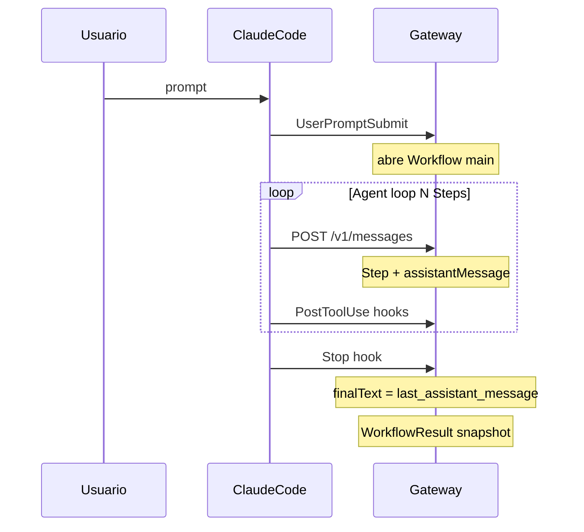
```mermaid
sequenceDiagram
  participant U as Usuario
  participant CC as ClaudeCode
  participant GW as Gateway

  U->>CC: prompt
  CC->>GW: UserPromptSubmit
  Note over GW: abre Workflow main

  loop Agent loop N Steps
    CC->>GW: POST /v1/messages
    Note over GW: Step + assistantMessage
    CC->>GW: PostToolUse hooks
  end

  CC->>GW: Stop hook
  Note over GW: finalText = last_assistant_message
  Note over GW: WorkflowResult snapshot
```

**Sub-workflows**

| Workflow                       | Hook de cierre | `finalText`                                        |
| ------------------------------ | -------------- | -------------------------------------------------- |
| Main (`kind: 'main'`)          | `Stop`         | Último texto assistant del agente main en el turno |
| Subagente (`kind: 'subagent'`) | `SubagentStop` | Último texto assistant del subagente               |

El `finalText` del main **no** incluye el resumen del hijo; el padre observa el subagente vía `ToolUse` / `tool_result` en Steps propios.

**Casos límite**

| Situación                                          | `finalText` esperado                       | Notas                               |
| -------------------------------------------------- | ------------------------------------------ | ----------------------------------- |
| Cierre normal (`Stop` / `SubagentStop`, reglas OK) | `last_assistant_message` del hook          | Caso principal                      |
| Subagente completado                               | `last_assistant_message` de `SubagentStop` | Alcance = respuesta del hijo        |
| `StopFailure` (error API)                          | Opcional / a menudo ausente                | Passthrough si existe; ver **§9.6** |
| Hook sin `last_assistant_message`                  | `undefined`                                | Sin fallback silencioso desde Steps |
| `PostToolBatch` con `decision: block`              | Puede faltar                               | `outcome: 'aborted'`                |
| Sin hook `Stop` (stall, interrupt)                 | Workflow puede no cerrarse                 | Limitación conocida                 |

**Propósito del campo**

- Resumen E2E legible: listados, dashboards, APIs («¿qué respondió Claude al usuario?»).
- **No sustituye** `Step.assistantMessage` (**G12**): auditoría forense (tools, thinking, bloques) → `Workflow.steps[]`.

**Derivación (`deriveFinalText`)**

```typescript
function deriveFinalText(hook: ClaudeHookEvent): string | undefined {
  const raw = hook.last_assistant_message;
  if (raw == null || raw.trim() === '') return undefined;
  return raw; // passthrough; sin join de bloques ni truncar (salvo límite de persistencia)
}
```

**Política**

1. **Fuente única:** `last_assistant_message` del hook que cierra (`Stop` | `SubagentStop`; `StopFailure` solo si el campo viene).
2. **Sin derivación desde wire** (anti-patrón respecto a `IAnthropicResponse.content`).
3. **Opcionalidad:** si falta → `undefined`; auditar vía `Workflow.steps[]` o `transcript_path`.
4. **Validación cruzada opcional (debug):** comparar con el último Step `end_turn` en logs, **sin** sobrescribir `finalText`.

---

## 10. Step

**Rol:** Unidad de observabilidad que agrupa inferencia, respuesta del modelo y ejecución/resultados de tools de un ciclo.

| Campo              | Tipo                | Origen             | Notas                                                                                                                                                   |
| ------------------ | ------------------- | ------------------ | ------------------------------------------------------------------------------------------------------------------------------------------------------- |
| `id`               | `string`            | —                  |                                                                                                                                                         |
| `workflowId`       | `string`            | —                  |                                                                                                                                                         |
| `index`            | `number`            | —                  | Orden 0-based en el workflow                                                                                                                            |
| `inferenceRequest` | `IAnthropicRequest` | Tráfico proxied    | Snapshot al abrir el step                                                                                                                               |
| `assistantMessage` | `IAnthropicMessage` | StepBuffer / sync  | Respuesta consolidada; `role: 'assistant'`. Origen: **StepBuffer** al `message_stop` si `stream: true`; parseo de `IAnthropicResponse` si sync          |
| `toolUses`         | `ToolUse[]`         | Correlador + hooks | 0..N; solo si hubo `tool_use` en la respuesta                                                                                                           |
| `usage?`           | `IAnthropicUsage`   | Wire Anthropic     | Homólogo de `IAnthropicResponse.usage`: StepBuffer (`message_delta`) o response sync. **Solo** el hop de inferencia del Step; agregación E2E → **§9.6** |
| `stopReason?`      | `string`            | Wire Anthropic     | `tool_use`, `end_turn`, …; desde StepBuffer o response sync                                                                                             |
| `startedAt`        | `Date`              | Gateway            |                                                                                                                                                         |
| `closedAt?`        | `Date`              | Gateway            |                                                                                                                                                         |

**Ciclo de vida:**

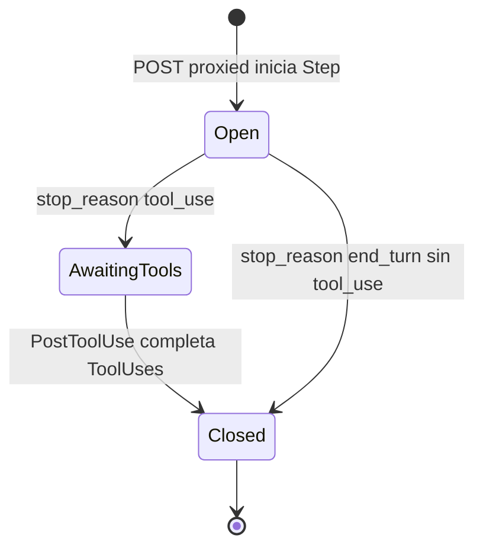
```mermaid
stateDiagram-v2
  [*] --> Open: POST proxied inicia Step
  Open --> AwaitingTools: stop_reason tool_use
  AwaitingTools --> Closed: PostToolUse completa ToolUses
  Open --> Closed: stop_reason end_turn sin tool_use
  Closed --> [*]
```

**Casos de Step:**

| Caso                         | `assistantMessage`  | `toolUses`                 | Step siguiente                                            |
| ---------------------------- | ------------------- | -------------------------- | --------------------------------------------------------- |
| Respuesta con tools          | Contiene `tool_use` | ≥ 1, completados vía hooks | Su `inferenceRequest.messages` incluye `tool_result`      |
| Respuesta final del workflow | Solo texto          | 0                          | No hay step posterior en el mismo workflow                |
| Tool Agent (subagente)       | `tool_use` Agent    | 1 + `childWorkflowId`      | Padre continúa tras `SubagentStop` + `PostToolUse(Agent)` |
| Error API en inferencia      | Parcial o ausente   | 0                          | Workflow → `failed` vía `StopFailure`                     |

**Invariantes:**

- `assistantMessage.role === 'assistant'`.
- Si `stopReason === 'tool_use'`, al cerrarse el step implica `toolUses.length >= 1`.
- Los `tool_result` del Step N aparecen en `inferenceRequest.messages` del Step N+1 (ver **G10**).
- `Step.usage` describe **solo** el hop de inferencia del Step; **no** incluye tokens de sub-workflows hijos ni de ejecución local de tools. Rollup E2E → **§9.6**.

### 10.1 Cardinalidad Step ↔ POST y proyección en disco

**Definición canónica:** La entidad **Step** del dominio gateway es el ciclo completo: inferencia (POST proxied) + respuesta del modelo + ejecución y resultados de las tools de esa respuesta. La fase de tools se observa vía hooks (estado `AwaitingTools` → `Closed`).

**Cardinalidad invariante:** 1 Step de dominio = 1 POST de inferencia. No existe el caso «1 Step = N POST». Al recibir `stop_reason === 'tool_use'`, el Step transiciona a `AwaitingTools` y permanece abierto hasta que los hooks `PostToolUse` completen todas las `ToolUse` del Step; con `end_turn` (u otro `stop_reason` terminal) el Step cierra sin fase de tools.

**Tabla de proyección:**

| Concepto   | Dominio (§10)                                       | Disco `causal-workflows-v1` (Parte IV)        |
| ---------- | --------------------------------------------------- | --------------------------------------------- |
| Step       | Ciclo inferencia + tools                            | `steps/MM/` (1 POST + `tools/`)               |
| Fase tools | Estado `AwaitingTools` en correlador                | Directorios `tools/KK-slug/` bajo el step     |
| Cierre     | `PostToolUse` completa todas las tools o `end_turn` | Correlador cierra + emite evento al bus (§23) |

---

## 11. ToolUse

**Rol:** Registro de observabilidad de una invocación de herramienta. Claude Code ejecuta; el gateway observa vía hooks y bloques en mensajes proxied.

| Campo              | Tipo                     | Notas                                                            |
| ------------------ | ------------------------ | ---------------------------------------------------------------- |
| `id`               | `string`                 | Coincide con `id` del bloque `tool_use` / `tool_use_id` en hooks |
| `stepId`           | `string`                 |                                                                  |
| `name`             | `string`                 | Nombre de herramienta (`Bash`, `Read`, `Agent`, …)               |
| `arguments`        | `unknown`                | `input` del bloque `tool_use`                                    |
| `status`           | `ToolUseStatus`          | `'pending' \| 'running' \| 'completed' \| 'rejected' \| 'error'` |
| `toolUseBlock`     | `IAnthropicContentBlock` | `type: 'tool_use'`                                               |
| `toolResultBlock?` | `IAnthropicContentBlock` | `type: 'tool_result'`                                            |
| `childWorkflowId?` | `string`                 | Solo si `name === 'Agent'` (subagente)                           |
| `startedAt?`       | `Date`                   |                                                                  |
| `completedAt?`     | `Date`                   |                                                                  |

**Integración Anthropic:**

```text
tool_use    → toolUseBlock     (id, name, input)
tool_result → toolResultBlock  (tool_use_id, content, is_error)
```

**Fuentes de observabilidad:**

- Bloques extraídos de `assistantMessage` del Step.
- Hooks `PreToolUse`, `PostToolUse`, `PostToolUseFailure` enriquecen estado y timing.

**Invariantes:**

- `toolResultBlock.tool_use_id === id` cuando hay resultado.
- `childWorkflowId` solo si se correlacionó un sub-workflow vía `SubagentStart`.
- Rechazo por hooks → `status: 'rejected'` y resultado sintético en `toolResultBlock` con `is_error: true`.

---

## 12. Invariantes globales (G1–G19)

| #   | Regla                                                                                                                                                                                                                                      |
| --- | ------------------------------------------------------------------------------------------------------------------------------------------------------------------------------------------------------------------------------------------ |
| G1  | Todo `Workflow` pertenece a exactamente una `Session`.                                                                                                                                                                                     |
| G2  | Todo `Step` pertenece a exactamente un `Workflow`.                                                                                                                                                                                         |
| G3  | Todo `ToolUse` pertenece a exactamente un `Step`.                                                                                                                                                                                          |
| G4  | `LanguageModel.providerId` debe existir en el registro de proveedores conocido (validación en aplicación).                                                                                                                                 |
| G5  | Un sub-workflow tiene `parentWorkflowId` y `parentToolUseId` obligatorios.                                                                                                                                                                 |
| G6  | No hay ciclos en la cadena de sub-workflows.                                                                                                                                                                                               |
| G7  | Mensajes y bloques en Steps/ToolUses usan únicamente tipos Anthropic ya definidos.                                                                                                                                                         |
| G8  | El dominio gateway no contiene colecciones persistidas de `AnthropicSseEvent`; ver **§20** (StepBuffer y decisión SSE).                                                                                                                    |
| G9  | Step con `stopReason === 'tool_use'` implica `toolUses.length >= 1` al cerrarse.                                                                                                                                                           |
| G10 | Los `tool_result` del Step N aparecen en `inferenceRequest.messages` del Step N+1, no como campo separado en Step N.                                                                                                                       |
| G11 | StepBuffer no persiste eventos SSE; solo el correlador persiste el Step al cerrarlo.                                                                                                                                                       |
| G12 | `WorkflowResult` no contiene campos duplicados de un solo Step (`stopReason`, `assistantMessage`, etc.); eso permanece en `Step`. Ver **§9.2**.                                                                                            |
| G13 | `stepCount` y `usage` en `WorkflowResult` consideran solo Steps con `closedAt` definido (más rollup de hijos en main). Ver **§9.3**, **§9.6** y **§9.6.1**.                                                                                |
| G14 | `WorkflowResult.usage` no debe derivarse del `usage` de un único POST; es agregación gateway por hop. No debe interpretarse como cardinalidad única del contexto. Ver **§9.6** y **§9.6.1**.                                               |
| G15 | `WorkflowResult.usage` de un workflow **main** incluye rollup de sub-workflows completados enlazados por `ToolUse.childWorkflowId`. Ver **§9.6**.                                                                                          |
| G16 | Métricas a nivel **Session** suman solo `WorkflowResult.usage` de workflows `kind: 'main'` (evitar doble conteo padre/hijo). Consumo facturado acumulado, no cardinalidad de contexto. Ver **§9.6** y **§9.6.1**.                          |
| G17 | `WorkflowResult.finalText` no debe derivarse de `IAnthropicResponse.content` ni de `Step.assistantMessage`; proviene del hook (`last_assistant_message`). Ver **§9.7**.                                                                    |
| G18 | El correlador emite eventos de telemetría al bus (`IEventBus`); `SessionPersistence` consume eventos del bus para proyectar a disco. El bus es unidireccional (emisor → suscriptores); la persistencia no muta el correlador. Ver **§23**. |
| G19 | El timer de timeout de `ToolUse` vive en el correlador; `SessionPersistence` no implementa timers de timeout propios. La persistencia reacciona al evento `tool_result` (timeout) emitido por el correlador. Ver **§18.1**.                |

---

## 13. Tipos primitivos y estructura de archivos

### Tipos primitivos (`types/gateway/`)

Literales sin comportamiento (espejo de `types/anthropic/`):

```typescript
// ProviderKind
type ProviderKind = 'anthropic' | 'vertex' | 'bedrock' | 'custom';

// WorkflowKind
type WorkflowKind = 'main' | 'subagent';

// WorkflowStatus
type WorkflowStatus = 'pending' | 'running' | 'completed' | 'failed' | 'aborted';

// WorkflowOutcome
type WorkflowOutcome = 'success' | 'api_error' | 'aborted' | 'unknown';

// WorkflowClosedByEvent
type WorkflowClosedByEvent = 'Stop' | 'SubagentStop' | 'StopFailure';

// ToolUseStatus
type ToolUseStatus = 'pending' | 'running' | 'completed' | 'rejected' | 'error';
```

### Interfaces DTO (`interfaces/gateway/`)

Contratos planos para persistencia, API REST del gateway o eventos. Sin lógica.

| Interfaz          | Propósito                 |
| ----------------- | ------------------------- |
| `IProvider`       | Snapshot de Provider      |
| `ILanguageModel`  | Snapshot de LanguageModel |
| `ISession`        | Session serializable      |
| `IWorkflow`       | Workflow serializable     |
| `IStep`           | Step serializable         |
| `IToolUse`        | ToolUse serializable      |
| `IWorkflowResult` | Resultado final           |

Las clases en `models/gateway/` implementan estas interfaces (mismo patrón que `Request` / `Response` con Anthropic).

### Clases de dominio (`models/gateway/`)

| Clase           | Implementa       | Comportamiento                         |
| --------------- | ---------------- | -------------------------------------- |
| `Provider`      | `IProvider`      | Validación de `kind` / `baseUrl`       |
| `LanguageModel` | `ILanguageModel` | `toModelId(): string`                  |
| `Session`       | `ISession`       | `addWorkflow()`, `getActiveWorkflow()` |
| `Workflow`      | `IWorkflow`      | `addStep()`, `isSubWorkflow()`         |
| `Step`          | `IStep`          | `hasToolCalls()`, `isTerminal()`       |
| `ToolUse`       | `IToolUse`       | `markRunning()`, `isSubagent()`        |

### Dependencias entre capas

```text
types/anthropic          types/gateway
       \                      /
        \                    /
    interfaces/anthropic    interfaces/gateway
                \          /
                 models/anthropic (Request, Response)
                 models/gateway  (Session, Workflow, …)
```

**Reglas:**

1. `interfaces/gateway` puede importar `interfaces/anthropic` y `types/*`.
2. `models/gateway` importa `interfaces/gateway` y, si hace falta, tipos Anthropic para mensajes.
3. `interfaces/anthropic` **no** importa entidades gateway.
4. `ToolUse` y `Step` nunca duplican la forma de `IAnthropicContentBlock`; solo la referencian.

### Estructura de archivos

```text
src/1-domain/
├── types/
│   ├── anthropic.types.ts  # contratos wire Anthropic
│   └── gateway/
│       ├── provider.types.ts        # ProviderKind
│       ├── workflow.types.ts         # WorkflowKind, WorkflowStatus, WorkflowOutcome, WorkflowClosedByEvent
│       ├── tool-use.types.ts         # ToolUseStatus
│       └── session-metrics.types.ts  # ISessionMetrics
├── interfaces/
│   └── gateway/
│       ├── IProvider.ts
│       ├── ILanguageModel.ts
│       ├── IProviderCatalog.ts
│       ├── ISession.ts
│       ├── IWorkflow.ts
│       ├── IStep.ts
│       ├── IToolUse.ts
│       └── IWorkflowResult.ts   # finalText? hook; usage? consumo facturado; ver §9.6–§9.7
├── models/gateway/
│   ├── Provider.ts
│   ├── LanguageModel.ts
│   ├── Session.ts
│   ├── Workflow.ts
│   ├── Step.ts
│   └── ToolUse.ts
└── repositories/
    ├── IEventBus.ts
    └── IWorkflowRepository.ts
```

El detalle completo de la composición por capa (incluido el mapa archivo → capa as-built) está en **§35**.

---

# Parte III — Observabilidad y correlación

## 14. Sistema de correlación: tres planos de señal

| Plano              | Borde | Señales                                                                                                                       | Cuándo llega                  | Responsabilidad                                                                                             |
| ------------------ | ----- | ----------------------------------------------------------------------------------------------------------------------------- | ----------------------------- | ----------------------------------------------------------------------------------------------------------- |
| **A — Identidad**  | Wire  | `X-Claude-Code-Agent-Id`, `X-Claude-Code-Parent-Agent-Id` (headers HTTP en cada POST)                                         | `request_received`            | Grafo de agentes por sesión; apertura/ruteo de sub-workflow en disco **sin** depender de pending.           |
| **B — Delegación** | Wire  | SSE content blocks `tool_use` con `name: "Agent"` / `"Explore"` / `"Plan"`                                                    | `message_stop` del padre      | `tool_use_id`, `prompt`, `subagent_type`, modo parallel/background; join con hijo identificado por plano A. |
| **C — Ciclo E2E**  | Hooks | `UserPromptSubmit`, `SubagentStart`, `SubagentStop`, `Stop`, `StopFailure`, `PreToolUse`, `PostToolUse`, `PostToolUseFailure` | Eventos lifecycle Claude Code | Lifecycle workflow; estado `ToolUse`; **cierre autoritativo**; `WorkflowResult.finalText`.                  |

**Complementariedad:**

- Las **cabeceras no sustituyen a los hooks**: la identidad del hijo llega antes que `SubagentStart`, pero el cierre E2E y `finalText` solo provienen del orquestador (hook).
- Los **hooks no sustituyen a las cabeceras**: `SubagentStart` confirma un spawn, pero el POST hijo ya puede haber llegado antes con sus headers.
- El **SSE no sustituye a ninguno**: registra pending tools para join; no abre ni cierra workflows.

### 14.1 Claves de correlación

| Clave            | Uso                                                                              |
| ---------------- | -------------------------------------------------------------------------------- |
| `session_id`     | Agrupa `Session` y workflows activos; presente en hooks y header HTTP.           |
| Ventana temporal | Requests proxied entre `UserPromptSubmit` y `Stop` → mismo workflow main activo. |
| `agent_id`       | Identifica sub-workflows; headers HTTP (plano A) + hooks (plano C).              |
| `tool_use_id`    | Enlaza `PreToolUse` ↔ `PostToolUse` ↔ `ToolUse.id`; correlación tool↔subagente.  |
| Orden de llegada | Desempate cuando falte `session_id` en request HTTP (header/metadata).           |

### 14.2 Estado en memoria del correlador

| Estado                    | Responsable | Descripción                                                                     |
| ------------------------- | ----------- | ------------------------------------------------------------------------------- |
| `activeWorkflowBySession` | Correlador  | Workflow main/sub activo por sesión; indexado por `session_id`.                 |
| `activeStepBySession`     | Correlador  | Step abierto (esperando `message_stop` o cierre de tools).                      |
| `pendingToolUses`         | Correlador  | `tool_use` blocks observados en SSE pendientes de `PostToolUse` hook.           |
| `stepBufferByRequestId`   | StepBuffer  | Una instancia por POST stream activo; ensambla deltas SSE → `assistantMessage`. |

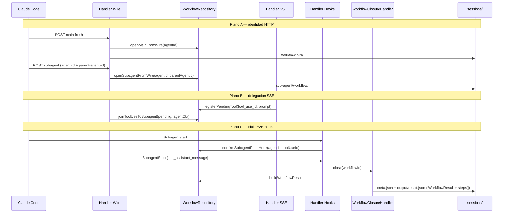
```mermaid
sequenceDiagram
  participant CC as Claude Code
  participant Wire as Handler Wire
  participant Repo as IWorkflowRepository
  participant SSE as Handler SSE
  participant Hook as Handler Hooks
  participant Close as WorkflowClosureHandler
  participant Disk as sessions/

  Note over CC,Disk: Plano A — identidad HTTP
  CC->>Wire: POST main fresh
  Wire->>Repo: openMainFromWire(agentId)
  Wire->>Disk: workflow NN/
  CC->>Wire: POST subagent (agent-id + parent-agent-id)
  Wire->>Repo: openSubagentFromWire(agentId, parentAgentId)
  Wire->>Disk: sub-agent/workflow/

  Note over CC,Disk: Plano B — delegación SSE
  SSE->>Repo: registerPendingTool(tool_use_id, prompt)
  Wire->>Repo: joinToolUseToSubagent(pending, agentCtx)

  Note over CC,Disk: Plano C — ciclo E2E hooks
  CC->>Hook: SubagentStart
  Hook->>Repo: confirmSubagentFromHook(agentId, toolUseId)
  CC->>Hook: SubagentStop (last_assistant_message)
  Hook->>Close: close(workflowId)
  Close->>Repo: buildWorkflowResult
  Close->>Disk: meta.json + output/result.json (IWorkflowResult + steps[])
```

### 14.3 Lifecycle completo del correlador (workflow main)

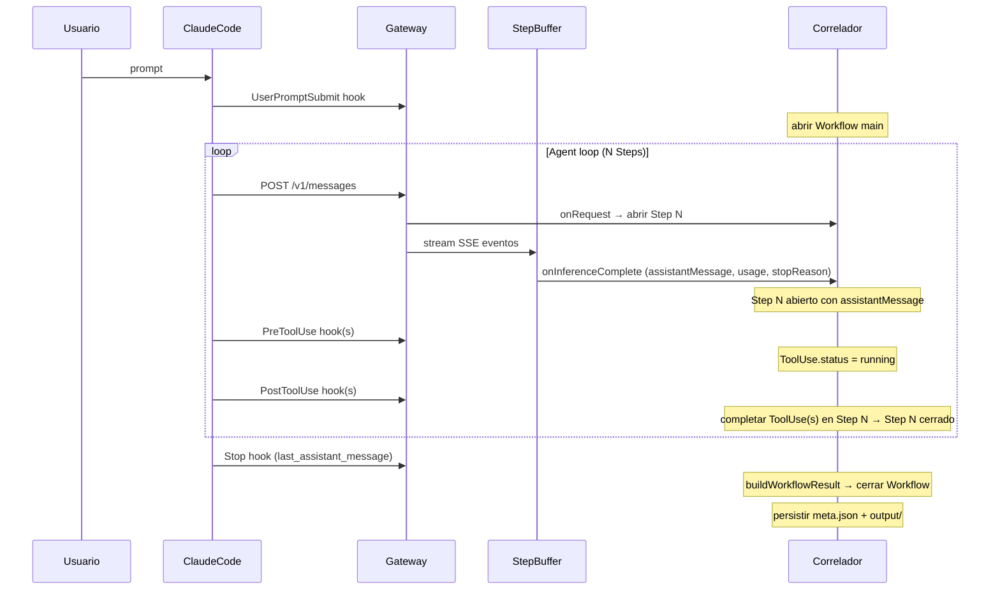
```mermaid
sequenceDiagram
  participant U as Usuario
  participant CC as ClaudeCode
  participant GW as Gateway
  participant Buf as StepBuffer
  participant Corr as Correlador

  U->>CC: prompt
  CC->>GW: UserPromptSubmit hook
  Note over Corr: abrir Workflow main

  loop Agent loop (N Steps)
    CC->>GW: POST /v1/messages
    GW->>Corr: onRequest → abrir Step N
    GW->>Buf: stream SSE eventos
    Buf->>Corr: onInferenceComplete (assistantMessage, usage, stopReason)
    Note over Corr: Step N abierto con assistantMessage
    CC->>GW: PreToolUse hook(s)
    Note over Corr: ToolUse.status = running
    CC->>GW: PostToolUse hook(s)
    Note over Corr: completar ToolUse(s) en Step N → Step N cerrado
  end

  CC->>GW: Stop hook (last_assistant_message)
  Note over Corr: buildWorkflowResult → cerrar Workflow
  Note over Corr: persistir meta.json + output/
```

---

## 15. Reglas de autoridad por concern

| Concern                          | Autoridad primaria                                                           | Fallback / complemento                                                                                                         |
| -------------------------------- | ---------------------------------------------------------------------------- | ------------------------------------------------------------------------------------------------------------------------------ |
| **Sesión**                       | Header HTTP `x-cc-audit-session` + reconciliar `session_id` en payload hook. | Si hook llega antes de primer POST: crear sesión desde hook.                                                                   |
| **Abrir workflow main**          | Wire request `fresh` (abre en disco).                                        | Hook `UserPromptSubmit` alinea/confirma workflow main en repo.                                                                 |
| **Abrir workflow subagente**     | Plano A: cabeceras `agent-id` + `parent-agent-id` en POST `fresh`.           | Legacy: `findInteractionWithPendingAgents` + prompt si CC < 2.1.139. Hook `SubagentStart` confirma y enlaza `childWorkflowId`. |
| **Enlazar `tool_use_id` ↔ hijo** | Plano B: SSE `registerPendingTool` + `joinToolUseToSubagent`.                | Hook `PreToolUse`/`PostToolUse` enriquecen `ToolUse.status` y timing.                                                          |
| **Cerrar workflow**              | **Plano C**: hook `Stop` / `SubagentStop` (autoritativo).                    | Wire `stop_reason` como cierre **transitorio** solo si hook no llega (ventana documentada).                                    |
| **Texto final E2E**              | **Plano C**: `last_assistant_message` del hook de cierre.                    | `output/result.json` (`finalText` + `steps[]`); reconstrucción SSE como fallback si hook no incluye el campo.                  |
| **Join paralelo (N hijos)**      | Prompt match → FIFO por orden SSE (limitación documentada).                  | Si CC envía agent-id único por hijo, join es trivial por identidad.                                                            |

---

## 16. Plano A — Cabeceras Claude Code ≥ 2.1.139

Referencia: [LLM gateway — Claude Code](https://code.claude.com/docs/en/llm-gateway).

| Cabecera HTTP                   | Campo dominio                                      | Persistencia disco                           |
| ------------------------------- | -------------------------------------------------- | -------------------------------------------- |
| `X-Claude-Code-Agent-Id`        | `agentId` en workflow activo y `ParentContext`     | `meta.json` → `agentId`                      |
| `X-Claude-Code-Parent-Agent-Id` | `parentAgentId`; indexado en `IWorkflowRepository` | `parentContext.parentAgentId` en `meta.json` |

**Servicio puro** `resolveAgentContext(headers)` → `{ agentId?, parentAgentId?, isSubagentRequest: boolean }` (case-insensitive, sin I/O).

**Orden de decisión del handler HTTP:**

```text
1. Clasificar request (fresh / continuation / preflight / side)
2. Si side / preflight / WebSearch / WebFetch pending → flujos existentes
3. agentCtx ← resolveAgentContext(headers)
4. Si agentCtx.isSubagentRequest → handleSubagentByHeaders
     └─ workflowRepo.openSubagentFromWire(sessionId, agentCtx)
     └─ joinToolUseToSubagent(pendings, agentCtx, body.prompt?)
5. Si fresh && pendingAgents (CC < 2.1.139) → handleSubagent legacy
6. Si fresh → handleFresh main
7. continuation → enrutar por tool_use_id; validar agentId contra repo
```

**Fallback legacy (sin cabeceras de agente):** si `fresh` con `tools` y no tiene `X-Claude-Code-Agent-Id` pero existe `PendingAgentToolUse` en sesión → `handleSubagent` heurístico (pending+prompt). Resultado: `correlationMethod: 'prompt' | 'unique-pending'`.

**`CorrelationMethod`** (extensión de tipo):

```text
'agent-headers' | 'prompt' | 'unique-pending' | 'fifo-pending' | 'none'
```

---

## 17. Plano B — Delegación SSE y join tool↔agente

El registro de tools pending en SSE:

1. Al observar `content_block_start` / `input_json_delta` con `name: "Agent"` / `"Explore"` / `"Plan"` → `workflowRepo.registerPendingTool(sessionId, stepIndex, tool_use_id, { prompt, subagentType })`.
2. Cuando el hijo se abre (plano A o legacy) → `joinToolUseToSubagent(pendings, agentCtx, subagentPrompt?)`.

**Política de join (función pura, dominio):**

| Caso                                                         | Resolución                                   | `correlationMethod`                                         |
| ------------------------------------------------------------ | -------------------------------------------- | ----------------------------------------------------------- |
| 1 pending en step, sin ambigüedad                            | Asignar                                      | `'unique-pending'` o `'agent-headers'` si headers presentes |
| N pending, prompt del hijo matcha exactamente con un pending | Asignar por prompt                           | `'prompt'`                                                  |
| N pending, sin match determinístico                          | FIFO (orden de registro SSE)                 | `'fifo-pending'`                                            |
| 0 pending (hook llegó antes que SSE complete)                | Diferir join hasta `confirmSubagentFromHook` | provisional                                                 |

**Metadata en `message_stop` del padre** (enriquecimiento, no apertura):

- Si bloques `tool_use` Agent: inferir `parallel` (múltiples) vs `sequential` (uno) y `background` (campo `subagent_config.background=true` en input).
- Persistir como metadata del step padre (`parallelSubagents`, `backgroundSubagents`), no abrir hijos desde SSE.

---

## 18. Plano C — Hooks Claude Code

**Endpoint:** `POST /hooks` en capa 5 (excluido de side-interactions).

**Configuración operativa:** Claude Code hooks apuntan al proxy vía `.claude/settings.json` del proyecto. El archivo del proyecto registra **14 claves en total**: las **8 del lifecycle** que alimentan al gateway (`UserPromptSubmit`, `PreToolUse`, `PostToolUse`, `PostToolUseFailure`, `SubagentStart`, `SubagentStop`, `Stop`, `StopFailure`) y **6 claves de UX no-lifecycle** que solo emiten notificación de escritorio (`SessionStart` con matcher `startup|resume`, `SessionEnd`, `PermissionRequest`, `TaskCreated`, `TaskCompleted`, y `TaskInProgress` implementada como `PostToolUse[matcher=TaskUpdate]` con relay que filtra por `status === "in_progress"`). Las 14 sobrescriben las entradas equivalentes del user-level `C:\Users\Cristian\.claude\settings.json` (merge por clave: el proyecto tiene precedencia). Los relays de lifecycle leen stdin **una vez** (UTF-8) y hacen `POST` a `$ANTHROPIC_BASE_URL/hooks` vía `fetch` ([`post-hook-event.ts`](../scripting/post-hook-event.ts), [`gateway-hook-notify.ts`](../scripting/gateway-hook-notify.ts), [`pre-tool-use-hook-ux.ts`](../scripting/pre-tool-use-hook-ux.ts), [`stop-hook-ux.ts`](../scripting/stop-hook-ux.ts)). `PreToolUse` y `PostToolUse` usan `matcher: "*"`. **`UserPromptSubmit`** y **`StopFailure`** usan `gateway-hook-notify` (gateway + toast sin competir por stdin). **`PreToolUse`** usa `pre-tool-use-hook-ux` (gateway + toast condicional en `AskUserQuestion`). **`Stop`** usa `stop-hook-ux` (gateway + toast de continuidad). **`SubagentStart`** / **`SubagentStop`** combinan `post-hook-event` con CLI de mensaje fijo. **`PostToolUse[*]`** / **`PostToolUseFailure`**: solo `POST /hooks`. **`PostToolUse[TaskUpdate]`** usa `task-in-progress-hook-ux` (solo UX, sin gateway). Las **6 claves de UX no invocan `POST /hooks`** (el `AuditHookEventHandler` solo despacha los 8 del lifecycle). Tabla completa: [`docs/notifications.md`](notifications.md).

**Mapa de eventos hook → acción en dominio:**

| Hook                 | Efecto en `IWorkflowRepository` / correlador                                                                                 |
| -------------------- | ---------------------------------------------------------------------------------------------------------------------------- |
| `SessionStart`       | Crear/reconciliar metadata de sesión (`externalSessionId`).                                                                  |
| `SessionEnd`         | Marcar sesión inactiva.                                                                                                      |
| `UserPromptSubmit`   | Abrir o alinear workflow `kind: main` en repo. Si wire ya abrió la interacción, enlazar.                                     |
| `SubagentStart`      | `confirmSubagentFromHook(agentId, toolUseId?)` — confirma sub-workflow; enlaza `ToolUse.childWorkflowId` si join ya ocurrió. |
| `PreToolUse`         | `ToolUse.status = 'running'`; registrar `startedAt`.                                                                         |
| `PostToolUse`        | Completar `ToolUse`; si `name === 'Agent'`, enriquecer metadata del enlace hijo.                                             |
| `PostToolUseFailure` | `ToolUse.status = 'error'`.                                                                                                  |
| `SubagentStop`       | Cerrar workflow hijo → `buildWorkflowResult` → `WorkflowResult.finalText` desde `last_assistant_message`.                    |
| `Stop`               | Cerrar workflow main (con reglas: no cerrar si `stop_hook_active === true` o si hay `background_tasks` pendientes).          |
| `StopFailure`        | Cerrar con `outcome: 'api_error'`.                                                                                           |

**Reglas de cierre:**

- `stop_hook_active === true` → no cerrar aún; esperar `Stop` final.
- `background_tasks` pendientes → no cerrar main hasta que todos los background se resuelvan.
- `StopFailure` → cierre incondicional con `outcome: 'api_error'`.

**`buildWorkflowResult` al cierre (domain service puro):**

```text
buildWorkflowResult(workflow, closedSteps, hookPayload) → {
  outcome: deriveOutcome(hookPayload),
  finalText: deriveFinalText(hookPayload),  // passthrough last_assistant_message
  closedByEvent: hookPayload.eventName,
  sessionId: hookPayload.session_id,
  usage: aggregateWorkflowUsage(closedSteps, childWorkflows),
  stepCount: closedSteps.length,
}
```

**Notas normativas sobre la interacción Hooks ↔ dominio:**

> **`WorkflowResult` desde hooks:** Al cerrar, el correlador construye el snapshot. Del hook provienen `closedByEvent`, `sessionId`, `finalText` (`last_assistant_message` — voz del orquestador; **no** derivar de wire) y la base para `outcome`. De Steps **cerrados** provienen `stepCount` y la base de `usage` (consumo facturado por hop); el rollup de sub-workflows al padre se aplica en `aggregateWorkflowUsage`.

> **`finalText` y subagentes:** El `finalText` del workflow **main** proviene del hook `Stop` (texto final del agente main). El del sub-workflow hijo proviene de `SubagentStop` (texto final del subagente). El resumen del hijo **no** se denormaliza en el `finalText` del padre; el padre lo observa vía `ToolUse` / `tool_result` en sus Steps.

> **`PostToolUse` y subagentes:** El usage del subagente se observa en los POST proxied del **sub-workflow** (Steps del hijo). El hook `PostToolUse(Agent)` puede enriquecer metadata del `ToolUse`, pero **no sustituye** esa agregación. El rollup al workflow **main** ocurre al cierre del padre, no en `Step.usage` individual.

> **`PostToolUse` y el StepBuffer:** Los hooks de tools operan **después** de que StepBuffer entregó `assistantMessage` al correlador en `message_stop`. Los hooks no sustituyen al StepBuffer; completan la fase de ejecución de tools del Step ya abierto.

### 18.1 Timer de timeout para ToolUse (ownership correlador)

**Regla de ownership:** El timer de timeout de `ToolUse` vive en el **correlador** (capa 2), no en `SessionPersistence`. Es el correlador quien decide si una tool expiró, porque esa decisión afecta el estado del `ToolUse`, el cierre del Step, y potencialmente el cierre del Workflow. Ubicar el timer en persistencia crearía una fuente de verdad paralela no reconciliada con el correlador.

**Mecanismo:**

1. Al registrar un `ToolUse` pending (observado vía SSE `tool_use` block en `message_stop`), el correlador inicia un timer configurable (variable de entorno, default sugerido 30s).
2. Si `PostToolUse` / `PostToolUseFailure` llega **antes** del timeout → cancelar el timer; completar `ToolUse` normalmente (`status: 'completed'` o `'error'`); emitir `tool_result` al bus (§23).
3. Si el timer expira **antes** del hook → marcar `ToolUse.status = 'timeout'`; emitir `tool_result` al bus con `is_error: true` y `error: 'Tool execution timeout'`.

**Precedencia hook > timeout (con inmutabilidad de cierre):**

Si el hook llega **después** de que el timer ya expiró y emitió timeout:

- El correlador **ignora** el hook tardío.
- **Justificación:** el correlador cierra Steps de forma determinista. Si el Step ya se procesó con el timeout (y potencialmente ya cerró el Step o el Workflow), reabrir un Step cerrado viola la inmutabilidad del snapshot (coherente con la idempotencia descrita en §22).
- El hook tardío se loggea como `tool_hook_after_timeout` para auditoría, sin mutar el estado.

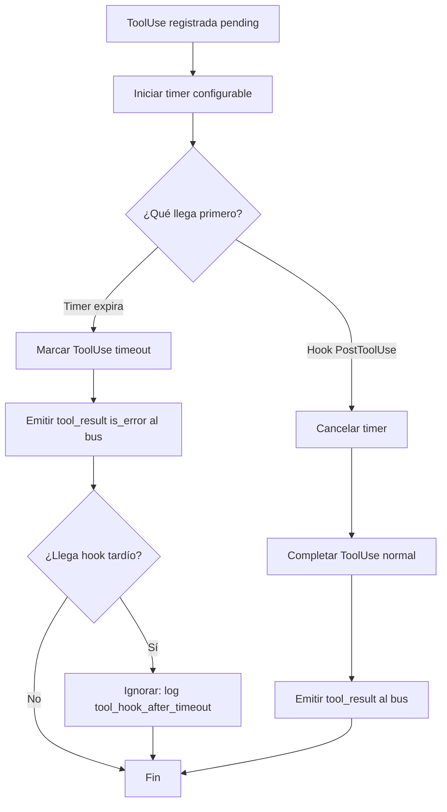
```mermaid
flowchart TD
  A["ToolUse registrada pending"] --> B["Iniciar timer configurable"]
  B --> C{"¿Qué llega primero?"}
  C -->|"Hook PostToolUse"| D["Cancelar timer"]
  D --> E["Completar ToolUse normal"]
  E --> F["Emitir tool_result al bus"]
  C -->|"Timer expira"| G["Marcar ToolUse timeout"]
  G --> H["Emitir tool_result is_error al bus"]
  H --> I{"¿Llega hook tardío?"}
  I -->|"Sí"| J["Ignorar: log tool_hook_after_timeout"]
  I -->|"No"| K["Fin"]
  J --> K
  F --> K
```

**Variable de entorno:** Nombre reservado para el timeout (sugerido `SCP_TOOL_TIMEOUT_MS`).

> El timer automático del correlador está fuera de v1 (ver §40); hoy la completación de tools se observa vía hooks `PostToolUse` / `PostToolUseFailure`.

**Referencia cruzada:** Ver §27.9 para la proyección a disco del timeout; la persistencia consume el evento `tool_result` (timeout) emitido por el correlador al bus (§23), no implementa timer propio.

---

## 19. Flujo proxy HTTP

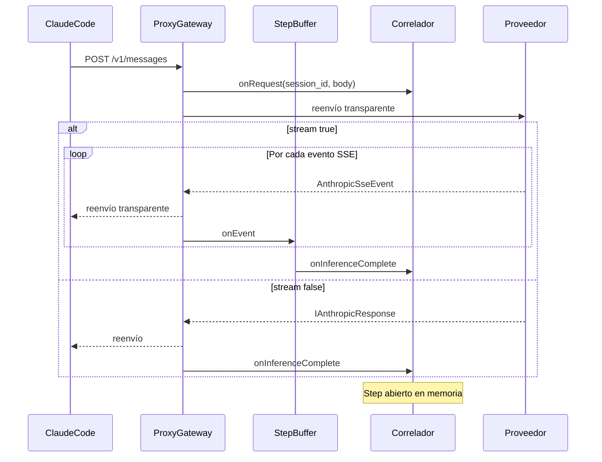
```mermaid
sequenceDiagram
  participant CC as ClaudeCode
  participant Proxy as ProxyGateway
  participant Buf as StepBuffer
  participant Corr as Correlador
  participant API as Proveedor

  CC->>Proxy: POST /v1/messages
  Proxy->>Corr: onRequest(session_id, body)
  Proxy->>API: reenvío transparente
  alt stream true
    loop Por cada evento SSE
      API-->>Proxy: AnthropicSseEvent
      Proxy-->>CC: reenvío transparente
      Proxy->>Buf: onEvent
    end
    Buf->>Corr: onInferenceComplete
  else stream false
    API-->>Proxy: IAnthropicResponse
    Proxy-->>CC: reenvío
    Proxy->>Corr: onInferenceComplete
  end
  Note over Corr: Step abierto en memoria
```

El gateway **no construye** el historial de mensajes desde Steps. Claude Code arma `messages[]`; el gateway **observa** snapshots en cada Step vía **StepBuffer** (streaming) o parseo directo (sync) + **correlador**. La proyección Step N → Step N+1 ocurre en el cliente, no en el proxy.

---

## 20. Streaming SSE y StepBuffer

### 20.1 Problema y decisión adoptada

Con `stream: true`, la API devuelve una **secuencia** de eventos SSE. Un Step puede implicar decenas o cientos de `content_block_delta`. El dominio gateway modela **ciclos de observabilidad** (`Step`, `ToolUse`), no el protocolo HTTP de transporte.

Para obtener `Step.assistantMessage` completo (texto, `tool_use`, thinking, etc.) hace falta **ensamblar** esos trozos en memoria. Ese ensamblaje es responsabilidad del **StepBuffer** (infraestructura), no de entidades de dominio.

> **Decisión:** Los eventos SSE Anthropic se tipan y parsean en el borde, se ensamblan en RAM mediante StepBuffer durante cada inferencia con `stream: true`, y solo se persisten snapshots de dominio (`Step`, `ToolUse`, `WorkflowResult`) al cerrarse un Step o un workflow. No se persisten deltas SSE como entidad de dominio. El reenvío transparente al cliente y el StepBuffer operan en paralelo y son obligatorios en streaming.

| Artefacto                              | Capa                  | ¿Persiste?                               |
| -------------------------------------- | --------------------- | ---------------------------------------- |
| `AnthropicSseEvent` / `IAnthropicSse*` | Tipado borde          | No como entidad; solo contrato de parseo |
| **StepBuffer**                         | Infraestructura proxy | No (RAM efímera por inferencia)          |
| **Correlador**                         | Infraestructura       | No (estado en memoria de Steps abiertos) |
| `Step`, `ToolUse`, `WorkflowResult`    | Dominio gateway       | Sí (snapshot al cerrar Step o workflow)  |
| Stream hacia Claude Code               | Proxy                 | Efímero; reenvío transparente            |

### 20.2 Alternativa considerada (rechazada)

| Enfoque                       | Descripción                                                                     | Motivo de rechazo                                                        |
| ----------------------------- | ------------------------------------------------------------------------------- | ------------------------------------------------------------------------ |
| **Event store SSE**           | `Workflow.streamEvents: AnthropicSseEvent[]` persistido como entidad de dominio | Redundante con el Step final; alto volumen; sin valor de negocio gateway |
| **Entidad por tipo de delta** | Modelos gateway por cada evento delta (`ContentBlockDelta`, etc.)               | Duplica `IAnthropicSse*`; complejidad sin retorno                        |

> **Nota:** el gateway persiste `streaming/*.ndjson` como log forense de chunks SSE (capa 2), pero esto es una proyección de infraestructura, no una entidad de dominio. El dominio solo conoce snapshots cerrados (`Step.assistantMessage`).

### 20.3 StepBuffer

**StepBuffer** no es una entidad de dominio (`Step`, `Workflow`, etc.). Es un **componente de infraestructura** (memoria RAM, efímera) en el borde HTTP/SSE del proxy.

**Propósito único:** reconstruir una respuesta de inferencia completa a partir de un stream SSE, evento por evento. Convierte:

```text
message_start + content_block_* + message_delta + message_stop
```

en objetos usables por el correlador:

```text
assistantMessage : IAnthropicMessage
usage?           : IAnthropicUsage
stopReason?      : string
```

En `message_stop`, StepBuffer notifica al **correlador** (`onInferenceComplete`) y **descarta** su RAM. No persiste deltas.

| Evento SSE                                                           | Acción StepBuffer                                    |
| -------------------------------------------------------------------- | ---------------------------------------------------- |
| `message_start`                                                      | Inicializar buffer                                   |
| `content_block_start` / `content_block_delta` / `content_block_stop` | Acumular bloques parciales                           |
| `message_delta`                                                      | Capturar `stop_reason`, `usage`                      |
| `message_stop`                                                       | Ensamblar `IAnthropicMessage`; handoff al correlador |
| `ping`                                                               | Ignorar                                              |

| StepBuffer **sí**                                   | StepBuffer **no**                                                           |
| --------------------------------------------------- | --------------------------------------------------------------------------- |
| Ensambla la **respuesta del modelo** de **un** POST | Ejecuta tools                                                               |
| Trabaja solo durante **una** inferencia (un stream) | Agrupa tools con inferencia (eso es el **correlador**)                      |
| Vive en RAM hasta `message_stop`                    | Persiste deltas en BD                                                       |
| Parsea SSE Anthropic                                | Recibe `tool_result` (vienen después, vía hooks o en el **siguiente** POST) |

**Analogía:**

- **Proxy transparente** = tubería: el stream pasa tal cual hacia Claude Code.
- **StepBuffer** = grabadora interna: anota en un borrador hasta tener la respuesta completa del modelo.
- **Correlador** = archivador: une esa respuesta con tools (hooks) y persiste el **Step** al cerrarlo.

**Caso `stream: false`:** no hay deltas SSE. El proveedor devuelve un `IAnthropicResponse` ya completo; el proxy lo parsea una vez y entrega al correlador. No hace falta StepBuffer SSE. Correlador y hooks operan igual para tools.

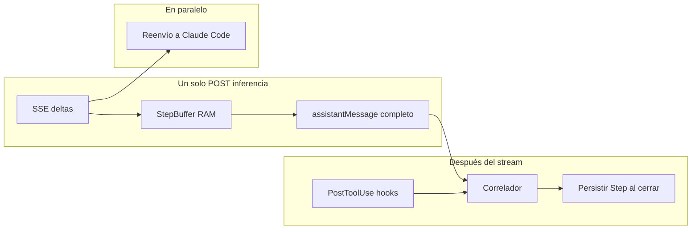
```mermaid
flowchart LR
  subgraph one_post [Un solo POST inferencia]
    SSE[SSE deltas]
    SB[StepBuffer RAM]
    AM[assistantMessage completo]
    SSE --> SB
    SB --> AM
  end

  subgraph parallel [En paralelo]
    SSE --> FWD[Reenvío a Claude Code]
  end

  subgraph later [Después del stream]
    Hooks[PostToolUse hooks]
    Corr[Correlador]
    AM --> Corr
    Hooks --> Corr
    Corr --> Persist[Persistir Step al cerrar]
  end
```

### 20.4 Flujo completo inferencia E2E

Por cada POST con `stream: true` que abre el Step N:

1. Claude Code → Gateway: `POST /v1/messages`. Correlador abre Step N y guarda snapshot de `inferenceRequest`.
2. Proveedor → Gateway: stream SSE. **Por cada evento, en paralelo:**
   - Gateway → Claude Code: reenvío transparente (obligatorio).
   - Gateway → StepBuffer: `onEvent(evento)` (obligatorio en streaming).
3. StepBuffer internamente (RAM): acumula bloques; en `message_stop` produce `assistantMessage`, `usage`, `stopReason`.
4. Al `message_stop`: StepBuffer → Correlador. Correlador asigna campos al Step N abierto y crea `ToolUse` pending desde bloques `tool_use`. StepBuffer descarta RAM.
5. Claude Code ejecuta tools (fuera del StepBuffer). Hooks `PostToolUse` → Correlador completa `ToolUse` en Step N.
6. Correlador cierra Step N cuando `stopReason === 'end_turn'` **o** todos los `ToolUse` están completados, y **persiste** el snapshot completo (sin haber persistido ningún `content_block_delta`).

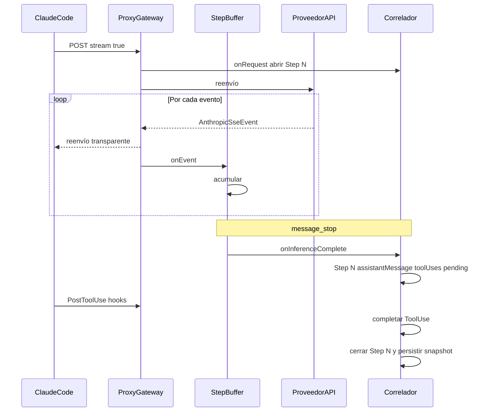
```mermaid
sequenceDiagram
  participant CC as ClaudeCode
  participant Proxy as ProxyGateway
  participant Buf as StepBuffer
  participant API as ProveedorAPI
  participant Corr as Correlador

  CC->>Proxy: POST stream true
  Proxy->>Corr: onRequest abrir Step N
  Proxy->>API: reenvío
  loop Por cada evento
    API-->>Proxy: AnthropicSseEvent
    Proxy-->>CC: reenvío transparente
    Proxy->>Buf: onEvent
    Buf->>Buf: acumular
  end
  Note over Buf,Corr: message_stop
  Buf->>Corr: onInferenceComplete
  Corr->>Corr: Step N assistantMessage toolUses pending

  CC->>Proxy: PostToolUse hooks
  Corr->>Corr: completar ToolUse

  Corr->>Corr: cerrar Step N y persistir snapshot
```

### 20.5 Timing de persistencia

```text
message_stop  → StepBuffer descarta RAM; correlador retiene Step abierto en memoria
Step cerrado  → persistir Step completo (assistantMessage + toolUses[])
```

Si `stopReason === 'tool_use'`, el Step **no** se persiste en `message_stop`; permanece abierto hasta que los hooks completen las tools.

### 20.6 Salida hacia el cliente

La estrategia de **salida hacia Claude Code** es ortogonal al StepBuffer interno: el proxy puede reenviar eventos Anthropic **y** ensamblar en StepBuffer al mismo tiempo.

| Estrategia             | Qué ve el cliente                    | Cuándo usarla                                        |
| ---------------------- | ------------------------------------ | ---------------------------------------------------- |
| **Proxy transparente** | Eventos Anthropic reenviados         | Cliente compatible con protocolo Anthropic           |
| **Eventos de dominio** | `text.delta`, `tool.started`, etc.   | UI de producto; abstracción multi-proveedor (futuro) |
| **Solo resultado**     | Sin stream; datos al cerrar workflow | Clientes simples (futuro)                            |

### 20.7 Implicaciones y tradeoffs

**Beneficios:**

- Persistencia O(steps × tools), no O(eventos SSE).
- Agregados estables alineados al modelo de observabilidad propio.
- Separación clara: transporte Anthropic (reenvío) vs ensamblaje (StepBuffer) vs agregación (correlador).

**Costes / limitaciones:**

- Caída del proceso mid-step: se pierde progreso parcial no consolidado (StepBuffer en RAM).
- Sin reconstrucción forense del stream desde base de datos.
- Debugging de streaming requiere logs de infraestructura.

### 20.8 Relación con tipos SSE existentes

- `AnthropicSseEvent` es la unión de parseo en borde (tipado en `src/1-domain/types/anthropic.types.ts`).
- Interfaces `IAnthropicSse*` las consume el adaptador proxy y el **StepBuffer**; no se persisten como campos de `Workflow` o `Session`.
- Coherente con invariantes **G7** (composición con tipos Anthropic), **G8** (sin colecciones de SSE en dominio) y **G11** (streaming separado de proyección Step).

---

## 21. Subagentes

Cuando `ToolUse.name === 'Agent'`:

1. `PostToolUse(Agent)` + `SubagentStart` → **Workflow** hijo (`kind: 'subagent'`, `agentType`, `agentId`).
2. El hijo se delimita por `SubagentStop`, no por `Stop` del padre.
3. Al completar, el resumen se observa como `tool_result` del `ToolUse` padre (siguiente Step del padre o hook).
4. `agent_transcript_path` del hook como referencia externa opcional.

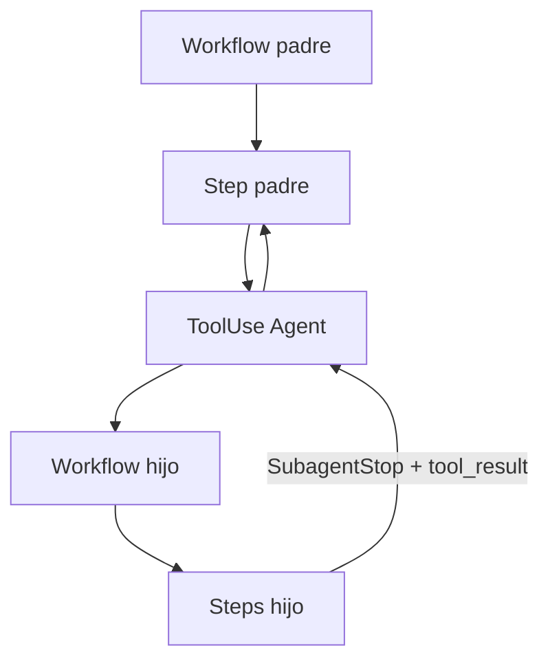
```mermaid
flowchart TD
  PW[Workflow padre]
  PS[Step padre]
  TU[ToolUse Agent]
  CW[Workflow hijo]
  CS[Steps hijo]
  PW --> PS --> TU
  TU --> CW --> CS
  CS -->|SubagentStop + tool_result| TU
  TU --> PS
```

**Modos de ejecución:**

- **Foreground (sequential):** un solo `ToolUse` Agent en el step. El padre espera `SubagentStop` antes de continuar.
- **Parallel:** múltiples `ToolUse` Agent en el mismo step. Se infiere de bloques `tool_use` en `message_stop` del padre.
- **Background:** campo `subagent_config.background=true` en input del `tool_use`. El padre puede continuar sin esperar `SubagentStop` del hijo.

---

## 22. Integración Wire ↔ Hooks: carreras y estados

El POST del subagente (plano A) puede llegar **antes o después** que `SubagentStart` (plano C). El correlador maneja ambos órdenes.

**Estados de un workflow en el correlador:**

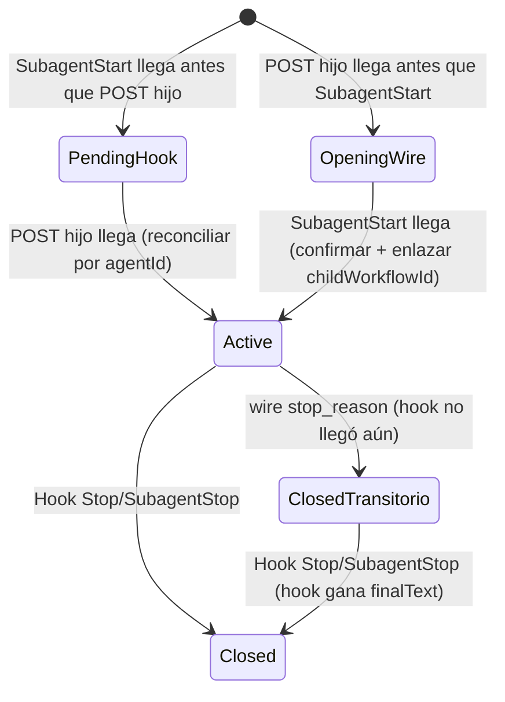
```mermaid
stateDiagram-v2
  [*] --> PendingHook: SubagentStart llega antes que POST hijo
  [*] --> OpeningWire: POST hijo llega antes que SubagentStart
  PendingHook --> Active: POST hijo llega (reconciliar por agentId)
  OpeningWire --> Active: SubagentStart llega (confirmar + enlazar childWorkflowId)
  Active --> Closed: Hook Stop/SubagentStop
  Active --> ClosedTransitorio: wire stop_reason (hook no llegó aún)
  ClosedTransitorio --> Closed: Hook Stop/SubagentStop (hook gana finalText)
```

**Escenarios documentados:**

| #   | Orden temporal                                                     | Comportamiento                                                                                                                                           |
| --- | ------------------------------------------------------------------ | -------------------------------------------------------------------------------------------------------------------------------------------------------- |
| 1   | POST subagent (headers) → `SubagentStart` → steps → `SubagentStop` | Caso nominal: wire abre `sub-agent/workflow/`, hook confirma y cierra.                                                                                   |
| 2   | `SubagentStart` → POST subagent (headers)                          | Crear workflow `status: pending` indexado por `agent_id`; al llegar POST, reconciliar con carpeta en disco.                                              |
| 3   | Main: wire `fresh` → `UserPromptSubmit`                            | Wire abre interacción; hook alinea workflow main en repo (idempotente).                                                                                  |
| 4   | Wire cierra por `stop_reason` → hook `Stop` llega después          | Hook **gana**: reescribir `output/result.json` con `finalText` del orquestador; `closedByEvent: 'Stop'`; actualizar `meta.json` con `status: completed`. |
| 5   | Hook `Stop` llega → wire `stop_reason` en request posterior        | Hook ya cerró; wire posterior se ignora para cierre (workflow ya inmutable).                                                                             |
| 6   | CC < 2.1.139: sin cabeceras ni hooks configurados                  | Fallback completo a heurística (pending+prompt + cierre por wire).                                                                                       |

**Idempotencia:** hooks pueden llegar duplicados (reintentos); el handler verifica estado en repo antes de mutar.

---

## 23. Integración correlador — bus de eventos — persistencia

Esta sección define el puente entre la Parte III (correlación runtime) y la Parte IV (persistencia en disco). El correlador (§14) y `SessionPersistence` (§24+) se conectan mediante un **bus de eventos de telemetría** interno.

### 23.1 Ubicación PKA del bus de eventos

| Componente                         | Capa PKA     | Rol                                                                                    |
| ---------------------------------- | ------------ | -------------------------------------------------------------------------------------- |
| `IEventBus` (port)                 | 1 (Domain)   | Contrato abstracto de emisión/suscripción; sin I/O.                                    |
| `EventBus` (adapter)               | 2 (Services) | Implementación async in-process (pub/sub en memoria). No contiene lógica de dominio.   |
| `IWorkflowRepository` / Correlador | 2 (Services) | Adapter en memoria; mutado por handlers de capa 3. Al mutar, emite eventos al bus.     |
| `SessionPersistence`               | 2 (Services) | Suscriptor independiente; consume eventos del bus y proyecta a disco bajo `sessions/`. |

### 23.2 Flujo: handler → correlador → bus → persistencia

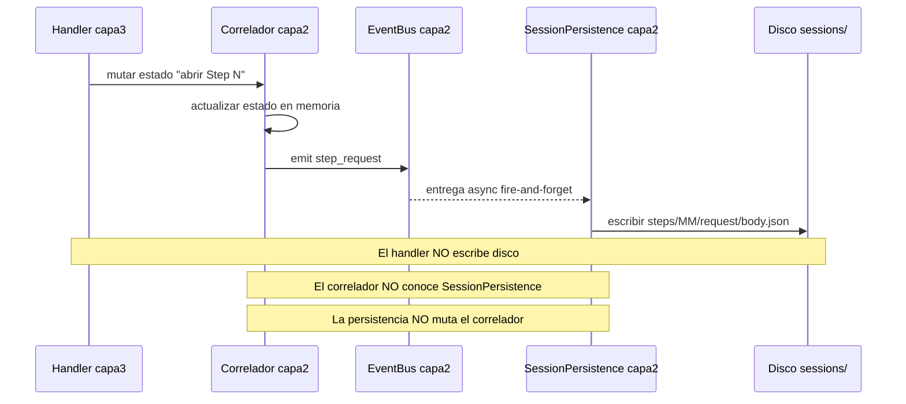
```mermaid
sequenceDiagram
  participant H as Handler capa3
  participant C as Correlador capa2
  participant B as EventBus capa2
  participant P as SessionPersistence capa2
  participant D as Disco sessions/

  H->>C: mutar estado "abrir Step N"
  C->>C: actualizar estado en memoria
  C->>B: emit step_request
  B-->>P: entrega async fire-and-forget
  P->>D: escribir steps/MM/request/body.json

  Note over H,D: El handler NO escribe disco
  Note over C,P: El correlador NO conoce SessionPersistence
  Note over P,C: La persistencia NO muta el correlador
```

**Secuencia completa de un ciclo Step con tools (streaming):**

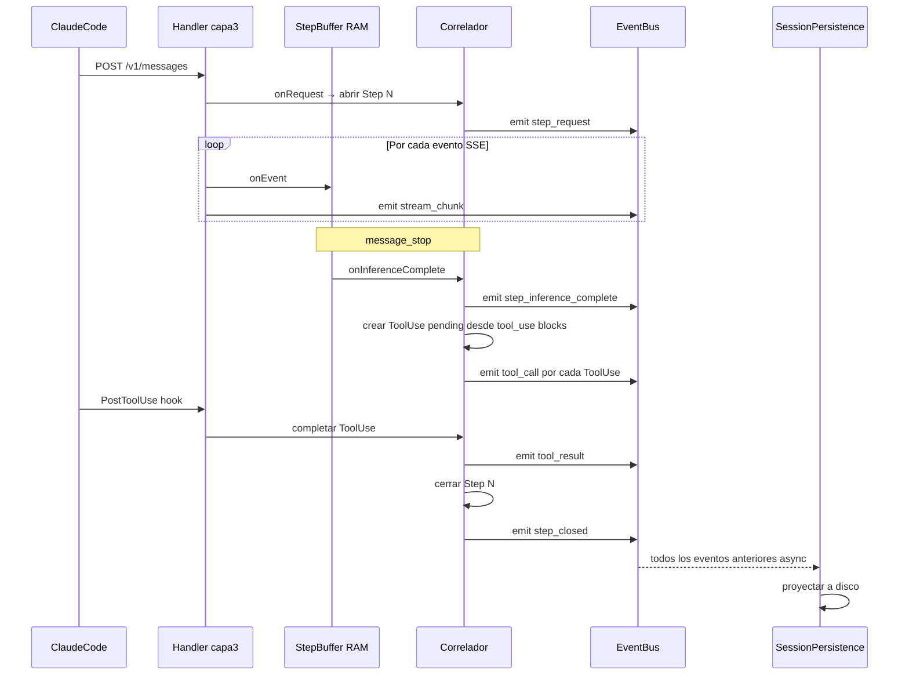
```mermaid
sequenceDiagram
  participant CC as ClaudeCode
  participant H as Handler capa3
  participant SB as StepBuffer RAM
  participant C as Correlador
  participant B as EventBus
  participant P as SessionPersistence

  CC->>H: POST /v1/messages
  H->>C: onRequest → abrir Step N
  C->>B: emit step_request

  loop Por cada evento SSE
    H->>SB: onEvent
    H->>B: emit stream_chunk
  end

  Note over SB,C: message_stop
  SB->>C: onInferenceComplete
  C->>B: emit step_inference_complete
  C->>C: crear ToolUse pending desde tool_use blocks
  C->>B: emit tool_call por cada ToolUse

  CC->>H: PostToolUse hook
  H->>C: completar ToolUse
  C->>B: emit tool_result

  C->>C: cerrar Step N
  C->>B: emit step_closed

  B-->>P: todos los eventos anteriores async
  P->>P: proyectar a disco
```

### 23.3 Catálogo de eventos de telemetría

Eventos emitidos por el correlador al bus. `SessionPersistence` consume todos (`*`) para proyectar a disco.

| Mutación en correlador                   | Evento emitido            | Datos clave                                                                   |
| ---------------------------------------- | ------------------------- | ----------------------------------------------------------------------------- |
| Crear/reconciliar sesión                 | `session_start`           | `session_id`                                                                  |
| Abrir workflow main                      | `workflow_start`          | `workflow_id`, `session_id`, `kind: 'main'`, `agent_id`                       |
| Abrir workflow subagente                 | `workflow_spawn`          | `workflow_id`, `parent_workflow_id`, `triggering_tool_use_id`, `agent_id`     |
| Abrir Step                               | `step_request`            | `request_id`, `workflow_id`, body snapshot (request)                          |
| StepBuffer completa inferencia           | `step_inference_complete` | `assistantMessage`, `usage`, `stopReason`                                     |
| Registrar ToolUse pending (SSE)          | `tool_call`               | `tool_use_id`, `tool_name`, `input`, `workflow_id`                            |
| Completar ToolUse (hook o timeout §18.1) | `tool_result`             | `tool_use_id`, `result`, `is_error`, `execution_duration_ms`                  |
| Cerrar Step                              | `step_closed`             | Step snapshot completo (index, assistantMessage, toolUses, usage, stopReason) |
| Chunk SSE (streaming forense)            | `stream_chunk`            | Chunk data, sequence number, `request_id`                                     |
| Cerrar workflow (éxito)                  | `workflow_complete`       | `WorkflowResult` snapshot, `stop_reason`                                      |
| Cerrar workflow (fallo/cancel)           | `workflow_cancel`         | `outcome`, `reason`                                                           |
| Token usage por hop                      | `token_usage`             | `model_id`, `usage` desglose                                                  |
| Cerrar sesión                            | `session_complete`        | `session_id`, `duration_ms`                                                   |

> **Nota:** `stream_chunk` es emitido directamente por el handler SSE (capa 3) al bus, no por el correlador. El handler SSE opera en dos ramas paralelas: reenvío transparente a Claude Code y emisión de chunks al bus. El StepBuffer consume los mismos eventos SSE internamente para ensamblar `assistantMessage` (§20).

### 23.4 Reglas de acoplamiento

1. Los handlers de capa 3 **no** escriben disco directamente; mutan el correlador y, para `stream_chunk`, emiten al bus.
2. El correlador **no** conoce `SessionPersistence`; emite eventos a `IEventBus` (port abstracto). La inyección del adapter ocurre en composition root (capa 4).
3. `SessionPersistence` **no** muta el correlador; solo consume eventos y proyecta a disco. Es un suscriptor de solo lectura.
4. El bus es **unidireccional**: emisor(es) → suscriptor(es). No hay canal de feedback de persistencia al correlador.
5. La entrega del bus es **async fire-and-forget**: errores de escritura en disco se loggean sin interrumpir el flujo del correlador ni del proxy.
6. Múltiples suscriptores pueden coexistir (e.g. `SessionPersistence`, futuro WebSocket backend, métricas). Cada suscriptor es independiente.

### 23.5 Diagrama de capas con bus de eventos

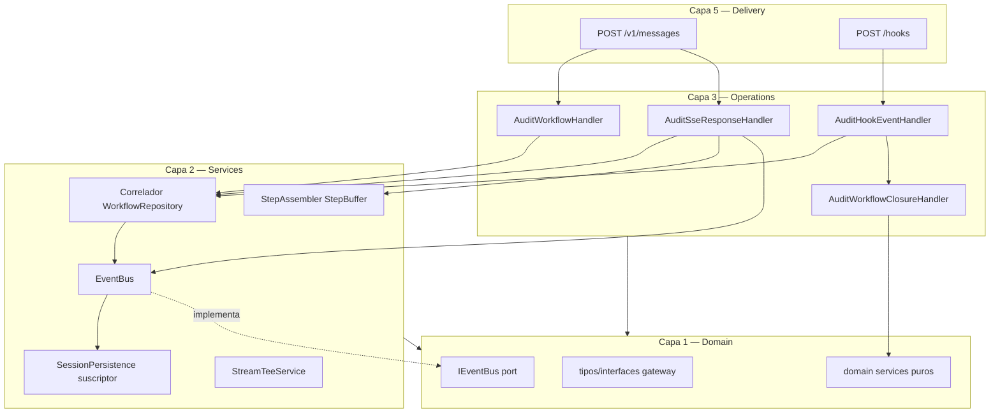
```mermaid
flowchart TB
  subgraph L5["Capa 5 — Delivery"]
    HTTP["POST /v1/messages"]
    HOOKR["POST /hooks"]
  end

  subgraph L3["Capa 3 — Operations"]
    H_IN[AuditWorkflowHandler]
    H_SSE[AuditSseResponseHandler]
    H_HOOK[AuditHookEventHandler]
    H_CLOSE[AuditWorkflowClosureHandler]
  end

  subgraph L2["Capa 2 — Services"]
    REPO[Correlador WorkflowRepository]
    BUS[EventBus]
    PROJ[SessionPersistence suscriptor]
    ASM[StepAssembler StepBuffer]
    TEE[StreamTeeService]
  end

  subgraph L1["Capa 1 — Domain"]
    GW["tipos/interfaces gateway"]
    DS["domain services puros"]
    IBUS["IEventBus port"]
  end

  HTTP --> H_IN
  HTTP --> H_SSE
  HOOKR --> H_HOOK
  H_IN --> REPO
  H_SSE --> REPO
  H_SSE --> ASM
  H_SSE --> BUS
  H_HOOK --> REPO
  H_HOOK --> H_CLOSE
  H_CLOSE --> DS
  REPO --> BUS
  BUS --> PROJ
  BUS -.->|"implementa"| IBUS
  L3 --> L1
  L2 --> L1
```

---

# Parte IV — Persistencia

> Esta parte describe el **layout de persistencia** `causal-workflows-v1`. La conexión entre el correlador runtime (Parte III) y la persistencia se define en **§23**: el correlador emite eventos de telemetría al bus; `SessionPersistence` los consume y proyecta a disco. Esta parte se centra en el **layout de disco** y las **reglas de proyección**.
>
> **`causal-workflows-v1`** es el identificador de versión de este layout. Se llama _causal_ porque modela cada sesión LLM como un árbol causal en disco: cada workflow contiene steps, cada step contiene tools, y las tools de tipo Agent anidan un sub-workflow hijo bajo la tool invocadora — reflejando la cadena causa→efecto. El sufijo _v1_ permite evoluciones futuras del schema sin romper retrocompatibilidad (cada `meta.json` declara su `layoutVersion`).
>
> `SessionPersistence` se suscribe al bus de eventos (§23) y reacciona a eventos de telemetría (`session_start`, `workflow_start`, `workflow_spawn`, `step_request`, `tool_call`, `tool_result`, `stream_chunk`, `workflow_complete`, `workflow_cancel`, `session_complete`, `token_usage`). No hay acoplamiento directo con handlers de transporte ni con el correlador; la persistencia solo consume eventos del bus.

**Conceptos clave de persistencia:**

| Concepto         | Definición en contexto de persistencia                                                                                                            |
| ---------------- | ------------------------------------------------------------------------------------------------------------------------------------------------- |
| **Session**      | Unidad de continuidad; agrupa todos los workflows de una sesión de usuario. Directorio raíz `sessions/<id>/`.                                     |
| **Workflow**     | Ejecución E2E (main o subagent). Directorio `workflows/NN/`. Contiene `meta.json` (identidad + estado), `input/`, `output/result.json`, `steps/`. |
| **Step**         | Un turno LLM (request + response + tools). Directorio `steps/MM/`.                                                                                |
| **Tool**         | Invocación de herramienta. Directorio `tools/KK-<slug>/` bajo el step que la produjo.                                                             |
| **Sub-agent**    | Workflow anidado bajo una tool Agent. Directorio `sub-agent/workflow/` bajo la tool invocadora.                                                   |
| **Side-request** | Request auxiliar (preflight, quota). Directorio `side-requests/NN/` (reservado).                                                                  |

---

## 24. Terminología de entradas y salidas

### 24.1. Confirmación de la terminología

El layout utiliza **tres pares de conceptos distintos** según el nivel de anidamiento:

| Nivel        | Entrada      | Salida        | Ubicación física                                        |
| ------------ | ------------ | ------------- | ------------------------------------------------------- |
| **Workflow** | `input/`     | `output/`     | `workflows/00/input/prompt.json` / `output/result.json` |
| **Step**     | `request/`   | `response/`   | `steps/01/request/body.json` / `response/body.json`     |
| **Tool**     | `input.json` | `result.json` | `tools/00-read/input.json` / `result.json`              |

No existe homogeneidad terminológica, y esta **inconsistencia aparente es intencional**.

### 24.2. Decisiones de diseño por nivel

#### 24.2.1. Workflow: `input/output` — Dominio del Proceso Agéntico

**Decisión:** Un workflow es una unidad de trabajo de alto nivel. Recibe un **input** (prompt del usuario o invocación de sub-agente) y produce un **output** (respuesta final tras todos los pasos, tools y sub-agentes).

**Justificación:**

- **Ambigüedad intencional:** Un workflow no sabe qué contiene su entrada o salida. Puede ser lenguaje natural, JSON, invocación programática, o el resultado de otro workflow.
- **Abstracción de proceso:** `input/output` captura la noción de "algo entra, algo sale" sin asumir el formato o semántica interna.
- **Independencia de transporte:** Un workflow no es una llamada HTTP; es un proceso lógico que puede ejecutarse localmente, en un sub-agente, o distribuirse.

**Por qué no `request/response`:** Un workflow no es una petición de red; es un proceso agéntico que puede contener múltiples llamadas HTTP (steps). Usar `request/response` sería incorrecto porque un workflow no tiene un único par de petición/respuesta.

**Archivo de salida: `output/result.json`** — el archivo dentro del directorio `output/` se denomina `result.json` (no `body.json` ni `response.json`) por dos razones complementarias:

1. **Coherencia con el tipo de dominio:** `IWorkflowResult` es el tipo que encapsula el resultado al cierre del workflow. El nombre del artefacto en disco refleja ese vocabulario de dominio, no el de transporte HTTP.
2. **Dualidad éxito/fallo:** un workflow puede concluir con `outcome: 'success'`, `'api_error'` o `'aborted'`. El término `result` captura esa dualidad igual que `tool/result.json` captura `{ isError: true/false }`. El término `body` o `response` (alternativas HTTP) asumen implícitamente una transacción de red exitosa, que no es la naturaleza de un proceso agéntico.

**Alternativas rechazadas:** `output/response.json` y `output/body.json` son vocabulario del dominio de protocolo HTTP/LLM, que §24.2.2 asigna correctamente al nivel Step. Usarlos en el nivel Workflow contradice la separación de dominios semánticos que justifica este apartado.

#### 24.2.2. Step: `request/response` — Dominio del Protocolo de Red

**Decisión:** Un step es exactamente una llamada HTTP a un LLM provider. El directorio `request/` contiene el cuerpo enviado; el directorio `response/` contiene el cuerpo reconstruido de la respuesta del modelo.

**Justificación:**

- **Precisión técnica:** Cada step es _exactly one LLM request/response_. Los términos `request/response` reflejan fielmente esta naturaleza.
- **Protocolo de transporte:** Un step implica latencia, códigos de estado HTTP, streaming, headers, timeouts y errores de red. `input/output` oscurecería esta realidad.
- **Streaming chunks:** El directorio `response/streaming/` contiene chunks SSE individuales para reconstrucción forense. Esto es específico de un protocolo de streaming, no genérico a cualquier "output".

**Por qué no `input/output`:** Si un step fallara por timeout de red, llamar `output` a una respuesta inexistente sería semánticamente incorrecto. `response` comunica que es una respuesta de red (que puede fallar, estar incompleta o ser parcial).

#### 24.2.3. Tool: `input/result` — Dominio de la Operación con Efecto

**Decisión:** Una tool es una función externa que el LLM invoca. Recibe **input** (argumentos serializados) y produce **result** (consecuencia de la ejecución, exitosa o fallida).

**Justificación:**

- **Dualidad éxito/error:** Una tool puede devolver un valor útil (`is_error: false`) o fallar con un error (`is_error: true`). El término `result` captura esta dualidad; `output` sugiere siempre producción exitosa.
- **Efecto colateral:** Una tool no es una transformación pura; es una operación con efecto colateral (lectura de archivo, ejecución de comando, llamada API). `result` comunica que es la **consecuencia** de una ejecución, no meramente un producto.
- **Consistencia con `is_error`:** El archivo `result.json` contiene `{ isError: boolean, result: unknown }`. Si fuera `output.json`, la propiedad `isError` sería semánticamente contradictoria.

**Por qué no `input/output`:** Una tool que lanza una excepción no produce "output", produce un "resultado fallido". `output` implica éxito; `result` admite ambas posibilidades.

### 24.3. Tabla de decisiones de diseño

| Nivel    | Par elegido        | Archivo de salida    | Dominio semántico      | Razón principal                                                                                                          | Alternativa rechazada                                                                                         |
| -------- | ------------------ | -------------------- | ---------------------- | ------------------------------------------------------------------------------------------------------------------------ | ------------------------------------------------------------------------------------------------------------- |
| Workflow | `input/output`     | `output/result.json` | Proceso agéntico       | Ambigüedad intencional del contenido; no es una llamada HTTP; `result` alineado con `IWorkflowResult` y dualidad outcome | `request/response` (HTTP); `output/response.json` y `output/body.json` (vocabulario HTTP en nivel de proceso) |
| Step     | `request/response` | `response/body.json` | Protocolo de red (LLM) | Precisión técnica: es exactamente una llamada HTTP con streaming                                                         | `input/output` (pierde naturaleza de transporte)                                                              |
| Tool     | `input/result`     | `result.json`        | Operación con efecto   | Dualidad éxito/error (`is_error`); efecto colateral                                                                      | `input/output` (`output` sugiere siempre éxito)                                                               |

### 24.4. ¿Por qué no homogeneizar?

La homogeneización forzaría una semántica genérica donde cada nivel tiene una naturaleza distinta:

1. **Workflow ≠ HTTP:** Un workflow no es una petición de red; es un proceso lógico que puede ejecutarse localmente o distribuirse. Llamarlo `request` sería incorrecto.
2. **Step ≠ función pura:** Un step es una interacción de red con latencia, streaming y códigos de estado. Llamar `output` a una respuesta HTTP oscurecería debugging de timeouts y errores de transporte.
3. **Tool ≠ transformación:** Una tool tiene efecto colateral y puede fallar. Llamar `result` como `output` sería semánticamente contradictorio con `is_error`.
4. **Señales de navegación:** Los nombres de directorio proporcionan señales de abstracción. Al ver `request/` sabes que estás en el nivel de protocolo; al ver `input/` sabes que estás en el nivel de proceso. Homogeneizar eliminaría estas señales.

La terminología es **deliberadamente no homogénea**. Cada par (`input/output`, `request/response`, `input/result`) refleja el dominio semántico correcto. El contexto del subdirectorio (`workflows/NN/`, `steps/MM/`, `tools/TT/`) ya proporciona la información suficiente para que el operador interprete el par según el nivel.

---

## 25. Estructura de directorios `causal-workflows-v1`

### 25.1. Árbol canónico

```text
sessions/<session-id>/
├── events.ndjson                    # Log append-only de TODOS los eventos
├── session-metrics.json             # Métricas agregadas por modelo + totales
├── workflows/
│   ├── workflow-sequence.json       # Índice cronológico incremental de workflows
│   └── NN/                          # NN = índice top-level (00, 01, ...)
│       ├── meta.json                # WorkflowMetadata (kind, status, agentId, lastActivity, ...)
│       ├── input/
│       │   └── prompt.json          # Primer prompt de entrada del workflow
│       ├── output/
│       │   ├── result.json          # IWorkflowResult (outcome, finalText, usage, stepCount,
│       │   │                        #   closedByEvent, sessionId) + steps[] con contenido narrativo
│       │   └── result.parsed.md     # Vista Markdown del resultado del workflow
│       └── steps/
│           └── MM/                  # MM = índice step (local al workflow, 00, 01, ...)
│               ├── request/
│               │   └── body.json    # Cuerpo de la solicitud al LLM
│               ├── response/
│               │   ├── body.json            # Cuerpo reconstruido (final)
│               │   ├── body.parsed.md       # Vista Markdown del body
│               │   ├── body.coalesced.json  # Vista derivada coalesced del body
│               │   ├── body.coalesced.parsed.md # Vista Markdown del coalesced body
│               │   └── streaming/
│               │       ├── 0001-chunk.ndjson
│               │       ├── 0002-chunk.ndjson
│               │       └── ...              # Cada chunk SSE como artefacto
│               └── tools/
│                   └── KK-<slug>/  # KK = índice global de tool_use; slug = tool name normalizado
│                       ├── meta.json    # ToolUseMetadata (id, retryCount, consumedByStep, previousAttempts, ...)
│                       ├── input.json   # Entrada de la tool
│                       ├── result.json  # { isError, result }
│                       └── sub-agent/   # ← Sólo si la tool dispara sub-agent
│                           └── workflow/
│                               ├── meta.json    # workflowKind=subagent, status, lastActivity, ...
│                               ├── input/
│                               │   └── prompt.json
│                               ├── output/
│                               │   ├── result.json       # IWorkflowResult + steps[]
│                               │   └── result.parsed.md
│                               └── steps/
│                                   └── ...      # Estructura recursiva idéntica (nota: Claude Code limita anidamiento a 1 nivel, ver §27.7)
└── side-requests/
    └── NN/                          # (Reservado para compactación, etc.)
```

### 25.2. Versionado

Cada `meta.json` (workflow, step, tool-use) incluye `layoutVersion: "causal-workflows-v1"` para permitir evolución futura sin romper retrocompatibilidad.

---

## 26. Reglas adaptativas

El layout es **adaptativo**: los directorios sólo se crean cuando hay contenido real que justifique su existencia.

- Un workflow sin tools: **no** crea `tools/`.
- Un step sin SSE: **no** crea `response/streaming/`.
- Una tool que no dispara sub-agent: **no** crea `sub-agent/`.
- Si nunca hay side-requests: el directorio se crea vacío al inicializar la sesión, pero queda inerte.

### 26.1 Contadores e índices internos de persistencia

| Contador / índice      | Tipo                      | Descripción                                                                                   |
| ---------------------- | ------------------------- | --------------------------------------------------------------------------------------------- |
| `counters.workflow`    | `number`                  | Índice global de workflow en la sesión (00, 01, …). Incrementa en cada `workflow_start`.      |
| `counters.toolUse`     | `number`                  | Índice global de tool use por step (00, 01, …). Genera el prefijo `KK` en `tools/KK-<slug>/`. |
| `workflowStepCounters` | `Map<workflowId, number>` | Contador de steps por workflow; cada workflow tiene numeración independiente (00, 01, …).     |
| `workflowLastSteps`    | `Map<workflowId, number>` | Último step conocido por workflow; usado para `workflow_complete` y cálculo de `stepCount`.   |

Estos contadores viven en memoria dentro del servicio de persistencia y se reinician por sesión. No se persisten a disco directamente — la numeración de directorios refleja su valor.

### 26.2 Representación de turnos LLM en disco

Cada turno LLM = un step = un directorio `workflows/NN/steps/MM/`.

| Lado del turno          | Artefacto                                       | Origen                                                                                         |
| ----------------------- | ----------------------------------------------- | ---------------------------------------------------------------------------------------------- |
| **Solicitud**           | `steps/MM/request/body.json`                    | Cuerpo JSON enviado al endpoint LLM (`step_request.body`)                                      |
| **Respuesta (final)**   | `steps/MM/response/body.json`                   | Reconstruido por `aggregateSseChunks` desde chunks SSE; o escrito directamente si no-streaming |
| **Respuesta (legible)** | `steps/MM/response/body.parsed.md`              | Render Markdown del body vía `MarkdownRendererService`                                         |
| **Respuesta (forense)** | `steps/MM/response/streaming/NNNN-chunk.ndjson` | Cada evento `stream_chunk` como artefacto individual                                           |

**Numeración de steps:**

- Cada workflow tiene su propio contador (`workflowStepCounters`).
- Step 00 = primer turno; cada continuación tras `stop_reason="tool_use"` crea un nuevo step (01, 02, …).
- Un step termina cuando llega `stop_reason != "tool_use"` (`end_turn`, `max_tokens`, etc.) o cuando se necesita continuar tras tool results.

**Ejemplo de loop agéntico con 3 turnos:**

```text
workflows/00/steps/
├── 00/   # Turno 1: assistant responde con stop_reason=tool_use, emite Read
├── 01/   # Turno 2: assistant recibe tool_result, responde con stop_reason=tool_use, emite Grep
└── 02/   # Turno 3: assistant responde con stop_reason=end_turn (final)
```

---

## 27. Escenarios de workflows

### 27.1. Workflow sin tools (text-only response)

**Flujo de eventos:**

1. `session_start`
2. `workflow_start (workflow_id=wf-A)`
3. `step_request (request_id=req-1)`
4. Múltiples `stream_chunk` (`message_start`, `content_block_start`, `content_block_delta` texto, `content_block_stop`, `message_delta`, `message_stop`)
5. `workflow_complete (stop_reason=end_turn)`
6. `session_complete`

**Estructura generada:**

```text
sessions/<sid>/
├── events.ndjson
├── session-metrics.json
└── workflows/
    ├── workflow-sequence.json
    └── 00/
        ├── meta.json                    # workflowKind=main, status=completed, lastActivity=...
        ├── input/
        │   └── prompt.json              # Primer prompt original
        ├── output/
        │   ├── result.json              # IWorkflowResult + steps[] (escrito en workflow_complete)
        │   └── result.parsed.md
        └── steps/00/
            ├── request/body.json
            └── response/
                ├── body.json            # Reconstruido de chunks
                ├── body.parsed.md
                └── streaming/0001-chunk.ndjson … 000N-chunk.ndjson
```

**Notas:** No se crea `tools/`. El step 00 representa el único turno LLM.

### 27.2. Workflow con una tool (loop agéntico simple)

**Flujo de eventos:**

1. `session_start`, `workflow_start`
2. `step_request (req-1)` → chunks → assistant emite tool_use
3. `tool_call (tool_use_id=tu-A, name=Read)` ← step 00
4. `tool_result (tool_use_id=tu-A)` ← se correlaciona con tu-A (consumido por step 01)
5. `step_request (req-2)` → chunks → respuesta final
6. `workflow_complete (stop_reason=end_turn)`

**Estructura generada:**

```text
workflows/00/
├── meta.json
└── steps/
    ├── 00/
    │   ├── request/body.json
    │   ├── response/{body.json, body.parsed.md, streaming/*}
    │   └── tools/
    │       └── 00-read/
    │           ├── meta.json    # toolUseIndex=0, consumedByStep=1
    │           ├── input.json   # { "file_path": "..." }
    │           └── result.json  # { "isError": false, "result": "..." }
    └── 01/
        ├── request/body.json
        └── response/{body.json, body.parsed.md, streaming/*}
```

**Notas:**

- `step_request` incrementa el contador local de steps del workflow vía `nextStepNum`.
- `tool_call` usa `getCurrentStepNum` para asociar la tool al step actual (step 00).
- `tool_result` se correlaciona por `tool_use_id` (no por índice posicional), tolerando llegadas fuera de orden.
- `consumedByStep` en `meta.json` de la tool registra qué step (01) recibió el resultado.

### 27.3. Workflow con tools paralelas

Cuando el assistant emite múltiples `tool_use` blocks en el mismo step (batch paralelo de Claude), llegan varios `tool_call` consecutivos antes de los `tool_result`.

**Flujo de eventos (resumido):**

1. `step_request (req-1)` → chunks que incluyen 3 tool_use blocks (Read, Grep, WebFetch)
2. `tool_call (tu-A=Read)`, `tool_call (tu-B=Grep)`, `tool_call (tu-C=WebFetch)` ← todas en step 00
3. `tool_result` pueden llegar en **cualquier orden** (ej. B → C → A)
4. `step_request (req-2)` con todos los resultados
5. ...

**Estructura generada:**

```text
workflows/00/steps/00/
├── request/body.json
├── response/{...}
└── tools/
    ├── 00-read/       # toolUseIndex=0 (orden de aparición en el response)
    ├── 01-grep/       # toolUseIndex=1
    └── 02-webfetch/   # toolUseIndex=2
```

**Notas:**

- Los índices `KK` reflejan el **orden de aparición en el assistant message**, no el orden de ejecución.
- La correlación `tool_use_id` → location resuelve out-of-order.
- El step `meta.json` puede registrar `observedExecutionMode: "parallel" | "sequential" | "mixed" | "unknown"` (campo reservado).

### 27.4. Workflow con sub-agent foreground (Agent/Explore/Plan secuencial)

**Detección:** El `WorkflowTracker` reconoce nombres de tools sub-agent: `Agent`, `Explore`, `Plan` (constante interna `SUBAGENT_TOOL_NAMES`). Cuando se emite `tool_call` con uno de estos nombres, se registra el `tool_use_id` en `pendingSubagentTools[parentAgentId]`. Al llegar `subagent_detected`, se consume el pending tool y se emite `workflow_spawn` enriquecido con `triggering_tool_use_id` y `triggering_tool_name`.

**Flujo de eventos:**

1. `workflow_start (wf-parent)` → step 00 del parent
2. `tool_call (tu-agent-1, name=Agent)` en parent step 00
3. `subagent_detected` (interno) → `workflow_spawn (wf-child, parent=wf-parent, triggering_tool_use_id=tu-agent-1)`
4. `step_request` del sub-agent → chunks → `tool_call`s del sub-agent (si los hay)
5. `workflow_complete (wf-child)` → resultado del sub-agent
6. `tool_result (tu-agent-1)` → vuelve al parent
7. `step_request` continuación del parent
8. `workflow_complete (wf-parent)`

**Estructura generada (anidada bajo el tool invocador):**

```text
workflows/00/                            # wf-parent
├── meta.json                            # kind=main
└── steps/
    ├── 00/
    │   ├── request/body.json
    │   ├── response/{...}
    │   └── tools/
    │       └── 00-agent/                # tool Agent
    │           ├── meta.json
    │           ├── input.json
    │           ├── result.json          # ← resultado coalesced del sub-agent
    │           └── sub-agent/
    │               └── workflow/        # ← wf-child anidado aquí
    │                   ├── meta.json    # kind=subagent, parentWorkflowId=wf-parent,
    │                   │                #   triggeringToolUseId=tu-agent-1,
    │                   │                #   parentStepIndex=0
    │                   └── steps/
    │                       └── 00/
    │                           ├── request/body.json
    │                           ├── response/{...}
    │                           └── tools/  # si el sub-agent usa tools propias
    └── 01/                              # continuación del parent
        ├── request/body.json
        └── response/{...}
```

**Validaciones críticas:**

- `workflow_spawn` SIN `triggering_tool_use_id` se rechaza con warning `subagent_spawn_missing_triggering_tool_use_id` (no se persiste).
- No se crea **ningún** workflow top-level duplicado para sub-agents.
- Los steps del sub-agent usan su contador **local** (independiente del parent).

### 27.5. Workflow con sub-agents paralelos

Cuando el assistant emite múltiples `Agent`/`Explore`/`Plan` en el mismo step (ej. 3 reviewers en paralelo):

**Estructura generada:**

```text
workflows/00/steps/00/tools/
├── 00-agent/sub-agent/workflow/    # sub-agent 1
├── 01-agent/sub-agent/workflow/    # sub-agent 2
└── 02-agent/sub-agent/workflow/    # sub-agent 3
```

Cada uno se anida bajo su propia tool invocadora. El `WorkflowTracker` mantiene una **cola** de pending tools (`pendingSubagentTools[parentAgentId]` es un array), de modo que cada `subagent_detected` consume el siguiente pending tool en orden de aparición.

`inferExecutionMode()` del `WorkflowTracker` reporta `concurrency: "parallel"` cuando hay >1 sub-agent block.

### 27.6. Workflow con sub-agents background

`inferExecutionMode()` detecta `blocking: "background"` cuando el `input` de la tool contiene `subagent_config.background === true`. La estructura de directorios es idéntica a la foreground; la diferencia es semántica (el parent no bloquea esperando, y el sub-agent puede completarse después de continuations del parent).

**Riesgo conocido:** La completación del sub-agent en background puede llegar después de que el parent ya escribió continuations. El campo `status` de `meta.json` por workflow y los eventos en `events.ndjson` representan explícitamente el estado in-progress.

### 27.7. Sub-agents anidados — limitación Claude Code

⚠️ **Limitación de Claude Code:** Esta sección describe una capacidad teórica del diseño de persistencia, pero **no se materializa en la práctica** con Claude Code actual. Según la documentación oficial de Claude Code, los sub-agentes no pueden crear otros sub-agentes (_"This prevents infinite nesting (subagents cannot spawn other subagents)"_). Esta es una limitación intencional del diseño de Claude Code para evitar anidamiento infinito.

**Profundidad máxima en la práctica:**

| Profundidad | ¿Posible? | Ejemplo                                                         |
| ----------- | --------- | --------------------------------------------------------------- |
| 0 → 1       | ✅ Sí     | Main agent → code-reviewer (documentado en §27.4, §27.5, §27.6) |
| 1 → 2+      | ❌ No     | Sub-agent → sub-sub-agent (bloqueado por Claude Code)           |

**Capacidad teórica del diseño:**
El diseño de persistencia es recursivo y soporta anidamiento arbitrario. Si un sub-agent pudiera invocar otra tool `Agent`, se generaría:

```text
workflows/00/steps/00/tools/00-agent/sub-agent/workflow/
└── steps/00/tools/00-agent/sub-agent/workflow/
    └── ...
```

El `resolveWorkflowLocation` resuelve la ubicación canónica para cualquier nivel de anidamiento usando el map `workflowLocations` keyed por `workflow_id`. Esta capacidad está implementada pero nunca se utiliza en la práctica debido a la limitación de Claude Code.

**Referencias:**

- Documentación oficial de Claude Code: _"This prevents infinite nesting (subagents cannot spawn other subagents)"_
- GitHub issue #4182: "Sub-Agent Task Tool Not Exposed When Launching Nested Agents"
- GitHub issue #19077: "[BUG] Sub-agents can't create sub-sub-agents, even with Task tool"

### 27.8. Workflow cancelado

`workflow_cancel` actualiza el `meta.json` del workflow:

```json
{
  "status": "cancelled",
  "cancelledAt": "2026-05-19T...",
  "cancellationReason": "user_requested"
}
```

### 27.9. Tool con timeout / Tool con retry

**Timeout:** El timer de timeout es propiedad del **correlador** (ver **§18.1**). `SessionPersistence` no implementa timer propio; consume el evento `tool_result` con `is_error: true` emitido por el correlador al bus (§23) cuando el timeout expira. Al recibir ese evento, persiste:

```json
{ "isError": true, "result": { "error": "Tool execution timeout" } }
```

El artefacto de disco (`result.json`) es idéntico al de un error normal; la diferencia es que el **trigger** es el evento del bus emitido por el correlador, no un timer local de persistencia.

**Retry:** Si llega un `tool_call` con el mismo `tool_use_id` que uno previo, se incrementa `retryCount` en `meta.json` y se preserva el historial en `previousAttempts[]`.

---

## 28. Artefactos de persistencia

### 28.1. `events.ndjson` (raíz de sesión)

Append-only log de **todos** los eventos emitidos al bus, vía suscripción wildcard (`"*"`). Contiene la verdad cronológica de la sesión. Ubicación: `sessions/<session-id>/events.ndjson`.

### 28.2. `session-metrics.json` (raíz de sesión)

Agregado por `SessionMetricsService`. Estructura:

```json
{
  "models": {
    "claude-sonnet-4-6": {
      "count": 3,
      "input_tokens": 1500,
      "output_tokens": 800,
      "cache_creation_input_tokens": 200,
      "cache_read_input_tokens": 1000,
      "cache_efficiency": 0.67
    }
  },
  "session_totals": { "input_tokens": "...", "total_steps": "..." },
  "duration_ms": 12345,
  "outcome": "success | failure | timeout"
}
```

Escritura atómica (temp file + rename) y serializada vía `writeQueue` para evitar races en concurrencia.

### 28.3. Workflow `meta.json` (`WorkflowMetadata`)

Contiene **identidad y estado** del workflow. NO contiene campos de resultado (`outcome`,
`finalText`, `usage`, `closedByEvent`): esos van en `output/result.json` (§28.4b). Escrito
atómicamente en cada transición de estado (`pending → running → completed|failed|aborted`),
máximo 3 veces por workflow. `detectOrphans()` escanea este archivo al arranque: si
`status` es `pending` o `running` y `lastActivity` supera el umbral de inactividad, el
workflow se marca como huérfano.

```typescript
{
  layoutVersion: "causal-workflows-v1",
  workflowKind: "main" | "subagent",
  workflowIndex: number,               // Sólo top-level; null si nested
  workflowId: string,
  parentWorkflowId?: string | null,
  parentStepIndex?: number | null,     // Step del parent que disparó (sub-agents)
  triggeringToolUseId?: string | null, // Tool que disparó (sub-agents)
  status: "pending" | "running" | "completed" | "failed" | "aborted",
  lastActivity: string,                // ISO timestamp; actualizado en cada transición
  parentContext?: {                     // Procedente de wire headers plano A
    agentId: string,
    parentAgentId: string | null,
    correlationMethod: "agent-headers" | "heuristic" | null
  },
  startedAt: string,
  completedAt?: string,
  cancelledAt?: string,
  cancellationReason?: string,
  stopReason?: string
}
```

### 28.4. Estado runtime en `meta.json` (sin `state.json` separado)

El layout `causal-workflows-v1` **no genera `state.json`**. El estado mutable del workflow
(`status`, `lastActivity`, `cancellationReason`) vive directamente en `meta.json` (§28.3).

**Justificación de la fusión:** las transiciones de `WorkflowStatus` son ≤ 3 por workflow
(`pending → running → completed|failed|aborted`), lo que hace a `meta.json` un archivo de
baja frecuencia de escritura. La separación en dos archivos no aporta protección de hot
path real y crea solapamiento de campos (`status`, `agentId`). Un único archivo atómico
simplifica la implementación y elimina la redundancia.

**Detección de huérfanos (`detectOrphans()`):** al arranque, `SessionPersistence` escanea
`meta.json` de cada workflow en `sessions/`. Un workflow es candidato a huérfano si
`status ∈ { "pending", "running" }` y `lastActivity` supera el umbral de inactividad
configurado. El workflow se marca `aborted` y se emite un evento de diagnóstico.

### 28.4b. Workflow `output/result.json` (`WorkflowResult`)

Escrito una única vez por `SessionPersistence` al recibir el evento `workflow_complete`.
Contiene el `IWorkflowResult` completo más el contenido narrativo de todos los steps del
workflow. Es el único artefacto que recoge los campos de resultado; `meta.json` no los
duplica.

```typescript
{
  layoutVersion: "causal-workflows-v1",
  // --- IWorkflowResult ---
  outcome: "success" | "api_error" | "aborted" | "unknown",
  finalText?: string,          // Passthrough de last_assistant_message del hook de cierre;
                               // ausente si el hook no incluyó el campo. Ver §9.7.
  usage?: AnthropicUsage,      // Consumo facturado E2E agregado por hop. Ver §9.6.
  stepCount: number,           // Cantidad de steps cerrados al momento del cierre.
  closedByEvent: "Stop" | "SubagentStop" | "StopFailure",
  sessionId: string,
  // --- Contenido narrativo ---
  steps: Array<{
    stepIndex: number,         // 0-based, local al workflow
    model: string,
    id: string,                // anthropicMessageId
    role: "assistant",
    content: IAnthropicContentBlock[],  // thinking, text, tool_use blocks
    stop_reason: string
  }>
}
```

El archivo hermano `output/result.parsed.md` contiene el render Markdown del workflow
completo, generado a partir de `steps[].content`.

### 28.5. `workflow-sequence.json`

Se crea y actualiza de manera incremental y atómica en `sessions/<session-id>/workflows/workflow-sequence.json` en cada inicio (`onWorkflowStart`) y completación/cancelación de un workflow principal de la sesión.

**Estructura:** `[{ workflowIndex, workflowId, startedAt, completedAt?, status }]`. Proporciona una navegación rápida para listados temporales de la sesión.

### 28.6. `previousAttempts[]` en ToolUseMetadata

Cada vez que se detecta un reintento (mismo `tool_use_id`), el escritor lee la metadata y resultado del intento anterior. Agrega este historial en el array `previousAttempts` de `meta.json` detallando el número de intento, la marca de tiempo de inicio y el mensaje de error correspondiente.

```typescript
{
  layoutVersion: "causal-workflows-v1",
  toolUseIndex: number,            // KK (orden de aparición)
  toolUseId: string,               // tu-* (correlación)
  toolName: string,                // "Read", "Grep", "Agent", ...
  parentWorkflowIndex: number,     // NN (puede ser null si nested)
  parentStepIndex: number,         // MM
  status: "pending" | "completed" | "failed" | "denied" | "timeout",
  isSubAgent: boolean,
  isError?: boolean,
  consumedByStep?: number | null,  // Step que recibió el result
  retryCount?: number,
  previousAttempts?: Array<{ attemptNumber, timestamp, error? }>
}
```

### 28.7. Persistencia de tools: flujo `onToolCall` / `onToolResult`

**Producción (step padre):** Al observar un bloque `tool_use` en `assistantMessage` de un step cerrado, el servicio de persistencia invoca `onToolCall`:

1. Resuelve la ubicación del tool (`toolUseLocations`) usando `tool_use_id`.
2. Crea `tools/KK-<slug>/` bajo el step correspondiente.
3. Escribe `input.json` (entrada serializada) y `meta.json` (índice, nombre, status `pending`).

**Consumo (step siguiente):** Al llegar `tool_result` (vía hooks `PostToolUse` o en `messages[]` del siguiente request), invoca `onToolResult`:

1. Busca `tool_use_id` en `toolUseLocations` para resolver la ruta canónica.
2. Escribe `result.json` (`{ isError, result }`).
3. Actualiza `meta.json` con `status: 'completed'|'failed'|'denied'`, `consumedByStep`.

**Correlación step↔tool:**

- El step que **produce** el `tool_use` block es el padre de la tool (hereda `parentStepIndex`).
- El step que **consume** el `tool_result` es el paso siguiente (`consumedByStep` en metadata).
- Si `tool_use_id` no tiene match en `toolUseLocations`, se loggea warning sin interrumpir el flujo.

### 28.8. Vistas coalesced (`body.coalesced.json` y `body.coalesced.parsed.md`)

Generadas bajo `response/` de cada step de forma derivada tras la reconstrucción de streaming. Integran de forma causativa las peticiones del parent, las ejecuciones recursivas de sub-agentes (recorriendo sus directorios causales y de forma deduplicada eligiendo sólo el último intento exitoso de herramientas) y la continuación final.

### 28.9. `observedExecutionMode` en StepMetadata

Se añaden propiedades al schema `StepMetadata`. Un monitor dinámico asíncrono (`stepActiveTools`) detecta solapamientos reales en tiempo de ejecución de herramientas simultáneas de un paso y asienta el valor real en `meta.json`.

**Valores posibles:**

| Valor          | Significado                                                                      |
| -------------- | -------------------------------------------------------------------------------- |
| `"parallel"`   | Múltiples tools ejecutándose concurrentemente (solapamiento temporal detectado). |
| `"sequential"` | Tools ejecutadas una tras otra sin solapamiento.                                 |
| `"mixed"`      | Combinación de ejecuciones paralelas y secuenciales en el mismo step.            |
| `"unknown"`    | No se pudo determinar (p.ej. step con 0-1 tools o datos insuficientes).          |

**Variables de entorno configurables (nombres a definir por SCP):**

| Propósito            | Descripción                                                                                                                   | Default sugerido |
| -------------------- | ----------------------------------------------------------------------------------------------------------------------------- | ---------------- |
| Tool timeout         | Timer del **correlador** (§18.1); `SessionPersistence` consume el evento `tool_result` (timeout), no implementa timer propio. | 30s              |
| Streaming max chunks | Límite de chunks SSE persistidos por step (protección contra streams infinitos).                                              | 10000            |

---

## 29. Reconstrucción de bodies

### 29.1. Chunks streaming (`streaming/NNNN-chunk.ndjson`)

Cada `stream_chunk` se persiste como artefacto independiente en `response/streaming/NNNN-chunk.ndjson` (numerado con 4 dígitos). Esto proporciona:

| Aspecto                   | Beneficio                                |
| ------------------------- | ---------------------------------------- |
| Crash recovery mid-stream | Total (chunks parciales preservados)     |
| Timeline forense          | Reconstrucción exacta token-by-token     |
| Reproducibilidad          | Cada chunk SSE es un artefacto inmutable |

### 29.2. Proceso `aggregateSseChunks`

La reconstrucción del body final sigue este algoritmo:

1. **`message_start`** → inicializa `body.id`, `body.model`, `role=assistant`.
2. **`content_block_start`** → abre un bloque (text, thinking, tool_use, ...).
3. **`content_block_delta`** → concatena según tipo de delta:
   - `delta.text` → acumula en `block.text`.
   - `delta.partial_json` → acumula en `block.input` como string, parseado al cerrar.
   - `delta.thinking` → acumula en `block.thinking`.
   - `delta.signature` → acumula en `block.signature`.
4. **`content_block_stop`** → finaliza el bloque y lo coloca en `body.content[index]`. Parsea `input` si es string JSON acumulado.
5. **`message_delta`** → setea `stop_reason`, `stop_sequence`, `usage`.

**Trigger de reconstrucción:** Al llegar `chunk_type=message_stop`, se programa con `setTimeout(50ms)` la reconstrucción (delay para garantizar que el último chunk se haya escrito a disco).

### 29.3. Salida dual: `body.json` + `body.parsed.md`

- **`body.json`** → JSON canónico (idéntico a la respuesta no-streaming).
- **`body.parsed.md`** → Render legible Markdown para inspección humana.

Se garantiza equivalencia: el body reconstruido desde streaming es estructuralmente idéntico al escrito directamente.

### 29.4. Filtrado de pings

Los chunks de tipo `ping` se descartan (no se escriben a disco). Esto evita ruido en la carpeta `streaming/` y en la reconstrucción.

---

## 30. Resolución canónica de ubicaciones

### 30.1. Maps internos

- `workflowLocations: Map<${sessionId}:${workflowId}, WorkflowLocation>`
- `toolUseLocations: Map<${sessionId}:${toolUseId}, ToolUseLocation>`
- `requestToLocation: Map<${sessionId}:${requestId}, { workflowDir, stepNum }>`

### 30.2. Tipo `WorkflowLocation`

```typescript
type WorkflowLocation =
  | { kind: 'top-level'; workflowNum: number; workflowDir: string }
  | {
      kind: 'nested-subagent';
      parentWorkflowNum: number;
      parentStepNum: number;
      toolUseNum: number;
      toolName: string;
      workflowDir: string; // Path absoluto al directorio nested
    };
```

### 30.3. Algoritmo `onWorkflowSpawn` (sub-agent)

1. Recibe evento con `workflow_id`, `parent_workflow_id`, `triggering_tool_use_id`.
2. Si falta `parent_workflow_id` o `triggering_tool_use_id` → warn y descarta.
3. Resuelve `toolLocation` desde `toolUseLocations[${sessionId}:${triggeringToolUseId}]`.
4. Si no encuentra el tool location → warn y descarta.
5. Calcula `workflowDir = getSubAgentWorkflowDir(sessionId, parentWf, parentStep, toolNum, toolName)`.
6. Registra en `workflowLocations` con `kind: "nested-subagent"`.
7. Escribe `meta.json` con kind=subagent, parentStepIndex, triggeringToolUseId.

### 30.4. Cómo `onToolCall`, `onStepRequest`, `onStreamChunk` usan `resolveWorkflowLocation`

Todos usan `resolveWorkflowLocation(sessionId, workflowId)` para obtener el `workflowDir` correcto (top-level o nested) y delegan a helpers `*AtDir(workflowDir, ...)`. Esto garantiza que **toda escritura subsecuente respete el anidamiento canónico**.

---

## 31. Garantías de robustez

1. **Out-of-order tool results:** Correlación por `tool_use_id`, no por índice posicional.
2. **Tool timeouts:** Timer configurable en el **correlador** (§18.1, default 30s); `SessionPersistence` consume el evento `tool_result` (timeout) emitido por el correlador (G19).
3. **Tool retries:** Detección por `tool_use_id` duplicado; incrementa `retryCount` y preserva `previousAttempts[]`.
4. **Workflow cancellation:** Status `cancelled` + `cancellationReason`.
5. **Crash recovery:** Chunks SSE individuales preservados; `detectOrphans()` escanea `meta.json` de cada workflow al startup buscando `status ∈ {pending, running}` con `lastActivity` antigua.
6. **Streaming bounds:** Límite configurable de chunks máximos por step (default 10000) para evitar crecimiento descontrolado.
7. **Fire-and-forget escrituras:** Cada escritura va vía `fireAndForget` para no bloquear el bus; errores se loggean sin interrumpir telemetría.
8. **Cleanup de Maps:** `onSessionComplete` limpia todos los maps por sesión para evitar memory leaks.

---

## 32. Matriz entidad dominio ↔ ruta disco

### 32.1. Mapeo de entidades

| Entidad                  | Ruta `causal-workflows-v1`           |
| ------------------------ | ------------------------------------ |
| Session                  | `sessions/<id>/`                     |
| Workflow main            | `workflows/NN/`                      |
| Workflow subagent        | `tools/KK-agent/sub-agent/workflow/` |
| Step                     | `workflows/NN/steps/MM/`             |
| ToolUse                  | `steps/MM/tools/KK-slug/`            |
| `events.ndjson`          | `sessions/<id>/events.ndjson`        |
| `session-metrics.json`   | `sessions/<id>/session-metrics.json` |
| `workflow-sequence.json` | `workflows/workflow-sequence.json`   |

### 32.2. Doble persistencia SSE (decisión explícita)

El layout adopta `streaming/*.ndjson` (un archivo por chunk SSE) para forensia:

| Aspecto           | `streaming/*.ndjson`                     |
| ----------------- | ---------------------------------------- |
| Granularidad      | Un archivo por chunk SSE                 |
| Crash recovery    | Total (chunks atómicos)                  |
| Timeline forense  | Cada chunk es un artefacto independiente |
| Filtrado de pings | Pings descartados antes de persistir     |
| Reconstrucción    | `aggregateSseChunks` estandarizado       |

La persistencia de deltas SSE es una decisión de **proyección** (capa 2), ortogonal al dominio (G8):

| Artefacto                     | Capa           | ¿Persiste deltas SSE?                                        |
| ----------------------------- | -------------- | ------------------------------------------------------------ |
| Agregado `Step` en dominio    | 1 (Domain)     | No — solo snapshot al cerrar step.                           |
| `streaming/*.ndjson` en disco | 2 (Proyección) | Sí — decisión de auditoría humana SCP, ortogonal al dominio. |

### 32.3. `events.ndjson`: log cronológico centralizado

`events.ndjson` es un append-only log de **todos** los eventos emitidos al bus (`session_start`, `workflow_start`, `step_request`, `tool_call`, `tool_result`, `stream_chunk`, `workflow_complete`, `session_complete`, etc.).

Este artefacto proporciona:

- **Verdad cronológica:** Orden exacto de todos los eventos, independiente de la estructura de directorios.
- **Debugging:** Permite reconstruir el flujo completo de una sesión sin navegar el árbol de directorios.
- **Auditoría:** Base para métricas, dashboards y análisis post-mortem.

> **Nota de diseño (dual-write intencional):** El árbol de directorios (§24–§27) y `events.ndjson` son proyecciones complementarias del mismo flujo de ejecución. La redundancia es intencional: el log cronológico optimiza para replay y debugging temporal; el árbol causal optimiza para navegación humana y crash recovery parcial. Análogo a un event store + vista materializada.

---

## 33. Checklist de conformidad E2E del layout

Criterios de conformidad para validar que la persistencia cumple el layout `causal-workflows-v1`. Derivados del test suite de referencia (`tests/2-services/session-persistence.test.ts`). Los casos marcados **Fuera de v1** se documentan en §40 y no son requisito de conformidad del layout vigente.

| #   | Caso                                             | Qué valida                                                                                                                                                                                  | Conformidad       |
| --- | ------------------------------------------------ | ------------------------------------------------------------------------------------------------------------------------------------------------------------------------------------------- | ----------------- |
| 1   | Persistencia de `events.ndjson`                  | Append-only log de todos los eventos de la sesión.                                                                                                                                          | ✅ Conforme       |
| 2   | Agregación de `session-metrics.json`             | Contadores (count, totals, cache_efficiency, finalize).                                                                                                                                     | ✅ Conforme       |
| 3   | Workflow meta vía `workflow_start`               | Creación de `meta.json` al iniciar workflow.                                                                                                                                                | ✅ Conforme       |
| 4   | Tool input/output/meta con correlación           | Escritura bajo `tools/KK/` con `input.json`, `result.json`, `meta.json`.                                                                                                                    | ✅ Conforme       |
| 5   | Sub-agent metadata anidada bajo tool invocador   | Ausencia de workflow top-level duplicado; nested bajo step/tool padre.                                                                                                                      | ✅ Conforme       |
| 6   | Sub-agent steps dentro del nested workflow       | Steps del hijo en `workflows/NN/steps/MM/` del directorio nested.                                                                                                                           | ✅ Conforme       |
| 7   | No crear `tools/` sin tools                      | Si un step no invoca tools, no se crea el directorio.                                                                                                                                       | ✅ Conforme       |
| 8   | Out-of-order tool results                        | Correlación por `tool_use_id`, no por índice posicional.                                                                                                                                    | Fuera de v1 (§40) |
| 9   | Tool timeout (timer automático)                  | Timer automático del correlador (§18.1). Hoy la cadena `completeToolUse` → `tool_result` → persistencia (`result.json`) se observa vía hooks `PostToolUse`; el timer auto está fuera de v1. | Fuera de v1 (§40) |
| 10  | Tool retry con `retryCount`                      | Detección por `tool_use_id` duplicado; `previousAttempts[]` en `meta.json`.                                                                                                                 | Fuera de v1 (§40) |
| 11  | Workflow cancellation                            | Status `cancelled` + `cancellationReason` en `meta.json`.                                                                                                                                   | ✅ Conforme       |
| 12  | Streaming chunks + body reconstruction           | Chunks SSE → `body.json` / `body.parsed.md` correctos (text + tool_use + partial_json).                                                                                                     | ✅ Conforme       |
| 13  | Filtrado de pings                                | Eventos `ping` excluidos de chunks persistidos.                                                                                                                                             | ✅ Conforme       |
| 14  | Equivalencia stream-reconstructed ≡ direct write | Cuerpo reconstruido desde chunks idéntico al body directo.                                                                                                                                  | ✅ Conforme       |
| 15  | `workflow-sequence.json`                         | Índice incremental de workflows por sesión.                                                                                                                                                 | ✅ Conforme       |
| 16  | `detectOrphans()` al startup                     | `meta.json` con `status ∈ {pending, running}` + `lastActivity` antigua → marcar huérfano.                                                                                                   | Fuera de v1 (§40) |
| 17  | `previousAttempts[]` en tool metadata            | Historial de reintentos con timestamp y error.                                                                                                                                              | Fuera de v1 (§40) |
| 18  | Vistas coalesced                                 | `body.coalesced.json` / `body.coalesced.parsed.md` integran sub-agentes recursivamente.                                                                                                     | ✅ Conforme       |
| 19  | `input/` y `output/` de workflows                | `prompt.json` al inicio; `result.json` + `result.parsed.md` al completar (`workflow_complete`).                                                                                             | ✅ Conforme       |
| 20  | `observedExecutionMode` en step metadata         | Detección dinámica `parallel` / `sequential` de tools en un step.                                                                                                                           | Fuera de v1 (§40) |

---

# Parte V — Arquitectura PKA

## 34. Diagrama de capas (wire + hooks)

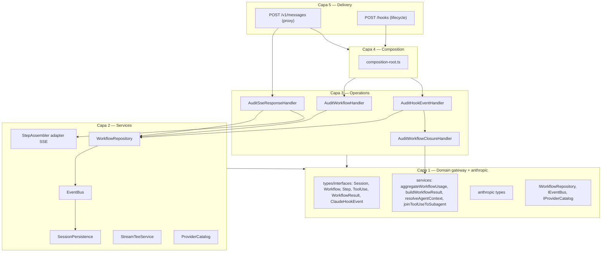
```mermaid
flowchart TB
  subgraph L5["Capa 5 — Delivery"]
    HTTP["POST /v1/messages (proxy)"]
    HOOKR["POST /hooks (lifecycle)"]
  end

  subgraph L4["Capa 4 — Composition"]
    CR[composition-root.ts]
  end

  subgraph L3["Capa 3 — Operations"]
    H_IN[AuditWorkflowHandler]
    H_SSE[AuditSseResponseHandler]
    H_CLOSE[AuditWorkflowClosureHandler]
    H_HOOK[AuditHookEventHandler]
  end

  subgraph L2["Capa 2 — Services"]
    REPO[WorkflowRepository]
    BUS[EventBus]
    PROJ[SessionPersistence]
    ASM[StepAssembler adapter SSE]
    TEE[StreamTeeService]
    CAT[ProviderCatalog]
  end

  subgraph L1["Capa 1 — Domain gateway + anthropic"]
    GW["types/interfaces: Session, Workflow, Step, ToolUse, WorkflowResult, ClaudeHookEvent"]
    DS["services: aggregateWorkflowUsage, buildWorkflowResult, resolveAgentContext, joinToolUseToSubagent"]
    AN[anthropic types]
    IFACE[IWorkflowRepository, IEventBus, IProviderCatalog]
  end

  HTTP --> L4 --> H_IN
  HTTP --> H_SSE
  HOOKR --> L4 --> H_HOOK
  H_IN --> REPO
  H_SSE --> REPO
  H_SSE --> ASM
  H_HOOK --> REPO
  H_HOOK --> H_CLOSE
  H_CLOSE --> DS
  REPO --> BUS
  BUS --> PROJ
  L3 --> L1
  L2 --> L1
```

El diagrama muestra dos puntos de entrada en capa 5 (wire HTTP y hooks lifecycle) que convergen en capa 3 a través de cuatro handlers especializados. Todos los handlers comparten `IWorkflowRepository` como correlador unificado en memoria; el correlador emite eventos al `EventBus`, que `SessionPersistence` consume para proyectar a disco (§23). La capa 1 contiene exclusivamente tipos, interfaces y funciones puras sin I/O.

### 34.1 Componentes por capa (resumen)

| Capa  | Componentes                                                                                                                                                                                                                                                                                  |
| ----- | -------------------------------------------------------------------------------------------------------------------------------------------------------------------------------------------------------------------------------------------------------------------------------------------- |
| **1** | `resolveAgentContext`, `joinToolUseToSubagent`, `buildWorkflowResult`, `deriveOutcome`, `deriveFinalText`, `aggregateWorkflowUsage`, `IWorkflowRepository`, `IEventBus`, `IProviderCatalog`, tipos hook (`ClaudeHookEvent`), `ParentContext`, `CorrelationMethod`.                           |
| **2** | `WorkflowRepositoryService` (correlador: índices `sessionId+agentId`, `interactionDir`, `tool_use_id`), `EventBusService`, `SessionPersistenceService` (suscriptor), `StepAssemblerService`, `SseReconstructService`, `StreamTeeService`, `ProviderCatalogService`, `SessionMetricsService`. |
| **3** | `AuditWorkflowHandler` (clasificación + routing), `AuditSseResponseHandler`, `AuditHookEventHandler`, `AuditWorkflowClosureHandler` (cierre + resultado), `AuditStandardResponseHandler`, `AuditUpstreamErrorHandler`, `FilterToolsHandler`.                                                 |
| **5** | `POST /v1/messages` (proxy), `POST /hooks` (excluida de side-interactions, respuesta rápida 2xx).                                                                                                                                                                                            |

El mapa completo archivo → capa está en **§35**.

---

## 35. Composición por capa y mapa archivo → capa

Mapa as-built de `src/` a las capas PKA. Las dependencias apuntan hacia el centro (capa 1).


```mermaid
flowchart TB
  subgraph L5["Capa 5 — Delivery (http/)"]
    ctrl["proxy.controller.ts"]
    routes["proxy.routes.ts"]
    hooks["hooks.controller.ts"]
    aug["fastify.augments.d.ts"]
  end

  subgraph L4["Capa 4 — Composition"]
    root["composition-root.ts"]
    env["config/env.config.ts"]
  end

  subgraph L3["Capa 3 — Operations"]
    h_wf["audit-workflow.handler.ts"]
    h_sse["audit-sse-response.handler.ts"]
    h_hook["audit-hook-event.handler.ts"]
    h_close["audit-workflow-closure.handler.ts"]
    h_std["audit-standard-response.handler.ts"]
    h_err["audit-upstream-error.handler.ts"]
    h_filt["filter-tools.handler.ts"]
    u_wire["gateway-wire-step.util.ts"]
  end

  subgraph L2["Capa 2 — Services"]
    repo["workflow-repository.service.ts"]
    bus["event-bus.service.ts"]
    persist["session-persistence.service.ts"]
    metrics["session-metrics.service.ts"]
    catalog["provider-catalog.service.ts"]
    asm["step-assembler.service.ts"]
    tee["stream-tee.service.ts"]
    recon["sse-reconstruct.service.ts"]
    routing["session-routing.ts"]
    ports["ports/*.port.ts"]
  end

  subgraph L1["Capa 1 — Domain"]
    types["types/* + types/gateway/*"]
    ifaces["interfaces/gateway/*"]
    models["models/gateway/*"]
    repos["repositories/I*.ts"]
    dsvc["services/* + services/gateway/*"]
    consts["constants/*"]
  end

  L5 --> L4
  L4 --> L3
  L3 --> L2
  L3 --> L1
  L2 --> L1
```

### 35.1 Capa 1 — Domain

| Categoría                                          | Archivos                                                                                                                                                                                          |
| -------------------------------------------------- | ------------------------------------------------------------------------------------------------------------------------------------------------------------------------------------------------- |
| **Tipos wire/gateway**                             | `types/anthropic.types.ts`; `types/gateway/{provider,workflow,tool-use,session-metrics}.types.ts`; `types/hook.types.ts`; `types/telemetry.types.ts`; `types/{audit,config,logger,json}.types.ts` |
| **Constantes**                                     | `constants/{audit-paths,audit-limits,session-headers}.ts`                                                                                                                                         |
| **Interfaces DTO**                                 | `interfaces/gateway/{IProvider,ILanguageModel,IProviderCatalog,ISession,IWorkflow,IStep,IToolUse,IWorkflowResult}.ts`                                                                             |
| **Modelos (clases anémicas)**                      | `models/gateway/{Provider,LanguageModel,Session,Workflow,Step,ToolUse}.ts`                                                                                                                        |
| **Ports de repositorio**                           | `repositories/{IEventBus,IWorkflowRepository}.ts`                                                                                                                                                 |
| **Domain services de cierre (puros)**              | `services/gateway/{aggregate-workflow-usage,aggregate-workflow-usage-by-model,build-workflow-result,derive-final-text,derive-outcome,validate-workflow-invariants}.ts`                            |
| **Domain services de correlación/soporte (puros)** | `services/{resolve-agent-context,join-tool-use-to-subagent,session-resolver,request-classifier,redact,markdown-renderer,event-pattern-match}.service.ts`                                          |

### 35.2 Capa 2 — Services (adapters)

| Componente              | Archivo                                                       | Rol                                                                              |
| ----------------------- | ------------------------------------------------------------- | -------------------------------------------------------------------------------- |
| Correlador              | `workflow-repository.service.ts`                              | Estado en memoria de workflows/steps/tools; índices `tool_use_id`; emite al bus. |
| Bus de eventos          | `event-bus.service.ts`                                        | Pub/sub in-process del port `IEventBus`.                                         |
| Persistencia            | `session-persistence.service.ts`                              | Suscriptor del bus; proyecta layout `causal-workflows-v1`.                       |
| Métricas                | `session-metrics.service.ts`                                  | `session-metrics.json` por modelo (§28.2).                                       |
| Catálogo de proveedores | `provider-catalog.service.ts`                                 | Deriva `Provider` / `LanguageModel`.                                             |
| StepBuffer              | `step-assembler.service.ts`                                   | SSE → `assistantMessage`, `usage`, `stopReason` (§20).                           |
| Tee de stream           | `stream-tee.service.ts`                                       | Reenvío transparente + rama auditoría.                                           |
| Reconstrucción SSE      | `sse-reconstruct.service.ts`                                  | Forense / `response/body.json` desde chunks.                                     |
| Enrutamiento            | `session-routing.ts`                                          | Resolución de rutas de sesión.                                                   |
| Ports                   | `ports/{sse-reconstructor,step-assembler,stream-tee}.port.ts` | Contratos de adapters.                                                           |
| Utilidades              | `utils/{async,file-write}.utils.ts`                           | Helpers de escritura atómica y async.                                            |

### 35.3 Capa 3 — Operations (handlers)

| Handler / util                             | Archivo                              |
| ------------------------------------------ | ------------------------------------ |
| Request entrante (clasificación + routing) | `audit-workflow.handler.ts`          |
| Stream SSE                                 | `audit-sse-response.handler.ts`      |
| Eventos hook                               | `audit-hook-event.handler.ts`        |
| Cierre de workflow + `WorkflowResult`      | `audit-workflow-closure.handler.ts`  |
| Respuestas no streaming                    | `audit-standard-response.handler.ts` |
| Errores upstream                           | `audit-upstream-error.handler.ts`    |
| Filtrado de herramientas                   | `filter-tools.handler.ts`            |
| Helper de step wire                        | `gateway-wire-step.util.ts`          |

### 35.4 Capas 4 y 5

| Capa                | Archivos                                                                                        | Rol                                                                                          |
| ------------------- | ----------------------------------------------------------------------------------------------- | -------------------------------------------------------------------------------------------- |
| **4 — Composition** | `4-api/composition-root.ts`, `4-api/config/env.config.ts`, `src/app.ts`, `src/index.ts`         | Ensamblar el grafo de dependencias; variables de entorno; bootstrapping Fastify; entrypoint. |
| **5 — Delivery**    | `5-user-interfaces/http/{proxy.controller,proxy.routes,hooks.controller,fastify.augments.d.ts}` | Rutas catch-all proxy, endpoint `POST /hooks`, tipos augment Fastify.                        |

### 35.5 Artefactos fuera de `src/`

| Ruta                | Rol                                                                                            | Capa conceptual                    |
| ------------------- | ---------------------------------------------------------------------------------------------- | ---------------------------------- |
| `scripting/`        | Scripts operativos: `configure-provider.ts` (routing multi-proveedor), statusline, utilidades. | Infraestructura operativa (no PKA) |
| `routing/`          | Configuración de providers y reglas de enrutamiento.                                           | Infraestructura operativa          |
| `sessions/`         | Persistencia de auditoría en disco (output de capa 2).                                         | Almacenamiento                     |
| `tests/`            | Tests unitarios e integración.                                                                 | Verificación                       |
| `configs/`          | Archivos de configuración (TS, JSON).                                                          | Infraestructura                    |
| `containerization/` | Docker / compose.                                                                              | Infraestructura despliegue         |
| `server/`           | Configuración servidor auxiliar.                                                               | Infraestructura                    |

---

## 36. Capa 1 — Domain

La capa 1 contiene tipos primitivos, interfaces DTO, modelos de clase anémicos, ports de repositorio y domain services puros (sin I/O). El árbol de archivos está en §13 y §35.1.

| Tipo de lógica             | Ejemplos                                                                                                                                                                                                                                     |
| -------------------------- | -------------------------------------------------------------------------------------------------------------------------------------------------------------------------------------------------------------------------------------------- |
| **Datos de dominio**       | `IWorkflow`, `IStep`, `IToolUse`, `IWorkflowResult`, `IProvider`, `ILanguageModel`.                                                                                                                                                          |
| **Transformaciones puras** | `aggregateWorkflowUsage(closedSteps, childResults)`, `aggregateWorkflowUsageByModel(closedSteps)` (agrupa `Step.usage` por `modelId`), `deriveOutcome(hook)`, `deriveFinalText(hook)`, `buildWorkflowResult(wf, steps, childResults, hook)`. |
| **Validaciones**           | Invariante G5: sub-workflow requiere `parentWorkflowId` + `parentToolUseId` (`validate-workflow-invariants.ts`).                                                                                                                             |
| **Sin I/O**                | Ningún `fs`, `fetch`, ni parseo SSE aquí.                                                                                                                                                                                                    |

**Perfil anémico:** en lugar de `Workflow.complete()` como método con efectos secundarios, el cierre se implementa como **`buildWorkflowResult(...)`** — función pura invocada desde el handler de capa 3. Esto permite testear la lógica de cierre sin dependencias de infraestructura. El hook de cierre usa `ClaudeHookEvent` de `types/hook.types.ts`.

**Tipos `Interaction*`:** `InteractionType`, `InteractionOutcome`, `SideRequestKind`, `AuditInteractionContext` en `audit.types.ts` están **activos por diseño** (clasificación de request §16; consumidores en handlers y `IWorkflowRepository`).

**Catálogo de proveedores:** el port `IProviderCatalog` (`interfaces/gateway/IProviderCatalog.ts`) lo implementa `ProviderCatalogService` en capa 2: deriva un único proveedor desde `UPSTREAM_ORIGIN` (`kind: 'anthropic'` si la URL contiene `api.anthropic.com`, `kind: 'custom'` con `baseUrl` en otro caso) y expone `getLanguageModel` en modo pass-through con cache por identidad referencial.

---

## 37. Capa 2 — Services

| Componente                            | Rol                                                                                                                                                              | Referencia interna                             |
| ------------------------------------- | ---------------------------------------------------------------------------------------------------------------------------------------------------------------- | ---------------------------------------------- |
| `WorkflowRepositoryService` (memoria) | `Session`, workflows activos, steps abiertos, índices `tool_use_id`; emite eventos al bus                                                                        | Correlador §14                                 |
| `EventBusService`                     | Adapter async in-process del port `IEventBus`; pub/sub unidireccional                                                                                            | Bus de eventos §23                             |
| `SessionPersistenceService`           | Suscriptor del bus; proyecta eventos de telemetría a disco `sessions/` (`causal-workflows-v1`)                                                                   | §23, Parte IV                                  |
| `SessionMetricsService`               | Escritura atómica de `session-metrics.json` agrupada por modelo (`models`, `session_totals`, `cache_efficiency`); solo workflows `kind: 'main'` (invariante G16) | §28.2                                          |
| `StepAssemblerService`                | RAM: SSE → `assistantMessage`, `usage`, `stopReason`; callback `onInferenceComplete`                                                                             | StepBuffer §20                                 |
| `SseReconstructService`               | Forense / `response/body.json` desde chunks SSE                                                                                                                  | Complemento; no sustituye `finalText` de hooks |
| `StreamTeeService`                    | Reenvío transparente + rama auditoría                                                                                                                            | §19                                            |
| `ProviderCatalogService`              | Deriva `Provider`, `LanguageModel` desde `UPSTREAM_ORIGIN`                                                                                                       | Entidades §7                                   |

**Principio:** los adapters **no** deciden cuándo cerrar un workflow; ejecutan lo que capa 3 ordena. Los handlers de capa 3 **no** escriben disco directamente (§23.4 regla 1); la proyección a disco la realiza `SessionPersistence` consumiendo eventos del bus.

**Doble persistencia SSE (decisión explícita):**

| Artefacto                     | Capa           | ¿Persiste deltas SSE?                                  |
| ----------------------------- | -------------- | ------------------------------------------------------ |
| Agregado `Step` en dominio    | 1              | No — solo snapshot al cerrar step.                     |
| `streaming/*.ndjson` en disco | 2 (proyección) | Sí — decisión de auditoría humana SCP, ortogonal a G8. |

---

## 38. Capa 3 — Operations

| Handler                        | Borde        | Orquestación                                                                                                                                                                            |
| ------------------------------ | ------------ | --------------------------------------------------------------------------------------------------------------------------------------------------------------------------------------- |
| `AuditWorkflowHandler`         | Wire         | Clasificar → `resolveAgentContext(headers)` → abrir workflow/step en repo → emitir `step_request`.                                                                                      |
| `AuditSseResponseHandler`      | Wire         | `tee` → `stepAssembler.onEvent` → al `message_stop`: completar step en repo → emitir `stream_chunk` / `step_inference_complete` → registrar pending tools.                              |
| `AuditWorkflowClosureHandler`  | Wire + Hooks | Invocar `buildWorkflowResult` → emitir `workflow_complete` → marcar workflow cerrado. Cierre autoritativo por hook `Stop`/`SubagentStop`; wire `stop_reason` como respaldo transitorio. |
| `AuditHookEventHandler`        | Hooks        | `UserPromptSubmit` / `Stop` / `SubagentStart` / `SubagentStop` / `PreToolUse` / `PostToolUse` → mutar repo → delegar cierre a `AuditWorkflowClosureHandler`.                            |
| `AuditStandardResponseHandler` | Wire         | Respuestas no streaming.                                                                                                                                                                |
| `AuditUpstreamErrorHandler`    | Wire         | Errores upstream / conexión.                                                                                                                                                            |
| `FilterToolsHandler`           | Wire         | Filtrar herramientas del body antes de audit/upstream.                                                                                                                                  |

La **secuencia** entre repo, assembler y proyección vive aquí; las **reglas de suma de tokens** viven en capa 1. Todos los handlers comparten el mismo `IWorkflowRepository` en memoria como correlador unificado.

---

## 39. Capas 4–5 — Composition y Delivery

| Capa                | Rol                                                                                                                                                                                                                                                            |
| ------------------- | -------------------------------------------------------------------------------------------------------------------------------------------------------------------------------------------------------------------------------------------------------------- |
| **4 — Composition** | `composition-root.ts` registra `IWorkflowRepository`, `EventBus`, `SessionPersistence`, handlers hook y wire, y `ProviderCatalog` en `ProxyDependencies`. Sin lógica de negocio; solo cableado de dependencias. `env.config.ts` resuelve variables de entorno. |
| **5 — Delivery**    | Controller delgado; `POST /v1/messages` (proxy catch-all) y `POST /hooks` (segundo canal de entrada, `hooks.controller.ts`).                                                                                                                                   |

Consideraciones para `POST /hooks`:

- Excluida de side-interactions (no genera tráfico proxy adicional).
- Respuesta rápida `2xx` antes de procesamiento asíncrono interno.
- No requiere autenticación del proxy (hooks proviene del orquestador local).

---

# Parte VI — Limitaciones y referencias

## 40. Fuera de alcance y limitaciones conocidas

| Tema                                              | Tratamiento                                                                            |
| ------------------------------------------------- | -------------------------------------------------------------------------------------- |
| Bibliotecas cliente de aplicación (capa superior) | Fuera del dominio gateway                                                              |
| Eventos SSE delta (`IAnthropicSse*`)              | Tipado en borde + ensamblaje StepBuffer; ver §20                                       |
| Hooks no disparados en algunos límites de sesión  | Limitación documentada; fallback vía `transcript_path`                                 |
| Silent stall sin hook `Stop`                      | Limitación; timeout/heartbeat en infraestructura                                       |
| Skills, MCP, CLAUDE.md                            | Metadata de `Session`; no entidades de dominio                                         |
| Configuración hooks HTTP                          | Doc operativa separada (`.claude/settings.json`)                                       |
| Tool retry / `previousAttempts[]` (§33 #10, #17)  | Fuera de v1; extensión futura opcional                                                 |
| `observedExecutionMode` en step (§33 #20)         | Fuera de v1                                                                            |
| `detectOrphans()` al startup (§33 #16)            | Fuera de v1                                                                            |
| Correlación OoO de tool results (§33 #8)          | Fuera de v1 salvo que tests existentes demuestren el comportamiento actual             |
| Timer automático de tool timeout (§18.1 / §33 #9) | Fuera de v1; hoy solo vía hooks `PostToolUse`/`PostToolUseFailure` → `completeToolUse` |

---

## 41. Referencias y trazabilidad

### 41.1 Documentos internos del proyecto

| Recurso                                                                                | Ruta                                                                     |
| -------------------------------------------------------------------------------------- | ------------------------------------------------------------------------ |
| session-audit-model.md                                                                 | `docs/session-audit-model.md`                                            |
| README PKA del repo                                                                    | `README.md` § Diseño PKA                                                 |
| Capa 4 en SCP                                                                          | `src/4-api/README.md`                                                    |
| workflow-persistence design                                                            | `docs/external-references/workflow-persistence-refactor-phase/design.md` |
| Arquitectura del Gateway (este documento)                                              | `docs/gateway-architecture.md`                                           |
| **Historia de la migración gateway** (registro de cómo se construyó esta arquitectura) | `openspec/changes/archive/2026-06-01-gateway-migration/`                 |

### 41.2 Skills y referencias PKA

| Recurso            | Ruta                                                                            |
| ------------------ | ------------------------------------------------------------------------------- |
| PKA skill          | `~/.claude/skills/progressive-kernel-architecture/SKILL.md`                     |
| PKA especificación | `~/.claude/skills/progressive-kernel-architecture/references/ESPECIFICACION.md` |
| PKA fundamentos    | `~/.claude/skills/progressive-kernel-architecture/references/FUNDAMENTOS.md`    |

### 41.3 Referencias externas

| Recurso                                    | URL                                                                                        |
| ------------------------------------------ | ------------------------------------------------------------------------------------------ |
| LLM gateway Claude Code (cabeceras agente) | [https://code.claude.com/docs/en/llm-gateway](https://code.claude.com/docs/en/llm-gateway) |
| Hooks reference Claude Code                | [https://code.claude.com/docs/en/hooks](https://code.claude.com/docs/en/hooks)             |

### 41.4 Proyección a disco: campos de correlación y cierre

| Archivo disco                     | Campos                                                                                               | Origen                                                                                  |
| --------------------------------- | ---------------------------------------------------------------------------------------------------- | --------------------------------------------------------------------------------------- |
| `workflows/NN/meta.json`          | `parentContext: { agentId, parentAgentId, correlationMethod }`, `lastActivity`                       | Wire headers plano A (parentContext); transiciones de estado (lastActivity)             |
| `workflows/NN/output/result.json` | `outcome`, `closedByEvent`, `finalText`, `usage` (agregado E2E), `stepCount`, `sessionId`, `steps[]` | `IWorkflowResult` de `buildWorkflowResult()` + `Step[]` del correlador (plano C cierre) |

### 41.5 Evolución API Anthropic: campos por incorporar

Campos de la API Anthropic (documentados en 2025-2026) que el diseño no cubre explícitamente. Ninguno invalida el modelo Step/Workflow/ToolUse; requieren extensiones aditivas.

#### 41.5.1 `stop_reason: "pause_turn"`

**Semántica API:** Indica que el server-side sampling loop (usado por server tools como `web_search`, `web_fetch`) alcanzó su límite de iteraciones (default 10). La respuesta puede contener un bloque `server_tool_use` sin su correspondiente resultado. Para continuar, el cliente reenvía la respuesta del assistant tal cual en el siguiente request — la API reanuda donde quedó.

**Impacto en el modelo SCP:**

- El Step actual se **cierra** con `stopReason: 'pause_turn'`.
- El siguiente POST (continuation) abre un nuevo Step en el mismo Workflow — misma semántica que `tool_use` seguido de continuation.
- No requiere estado nuevo en Step; `stopReason` ya es `string` (§10).

**Decisión de diseño:** Tratar `pause_turn` como cualquier otro `stopReason` que genera continuation. El diagrama de estados del Step (§10 mermaid) se extiende:

```
Open --> Closed: stop_reason pause_turn (server tool loop limit)
```

No se necesita `AwaitingTools` intermedio porque el proxy no ejecuta la tool — Anthropic la ejecuta server-side.

#### 41.5.2 `stop_reason: "refusal"`

**Semántica API:** Claude rehúsa generar respuesta por violación de política de seguridad. Disponible por defecto en Sonnet 4.5+ y Claude 4+. La respuesta incluye contenido parcial (texto generado antes del corte) y opcionalmente un campo `stop_details: { type: "refusal", category?: "cyber" | "bio" | null, explanation?: string }`. El cliente **debe** resetear contexto (reformular o limpiar historial) antes de continuar.

**Impacto en el modelo SCP:**

- El Step se cierra con `stopReason: 'refusal'`.
- Si es el último Step del Workflow (sin continuation posterior), `WorkflowResult.outcome` debería reflejar la negativa: nuevo valor `'refused'` en el enum de outcomes.
- `stop_details` es metadata forense útil; puede persistirse en `Step` como campo opcional `stopDetails?: { category?: string; explanation?: string }`.

**Decisión de diseño:**

1. `Step.stopReason = 'refusal'` — sin cambios al tipo (ya es `string`).
2. Agregar campo opcional `Step.stopDetails` para metadata de refusal.
3. Nuevo outcome en `WorkflowResult`: `'refused'` — indica que el modelo rehusó y no hubo continuation exitosa posterior.
4. El diagrama de estados del Step se extiende:

```
Open --> Closed: stop_reason refusal (policy violation)
```

#### 41.5.3 `usage.server_tool_use`

**Semántica API:** Objeto dentro de `usage` que reporta el consumo de server-side tools. Estructura actual documentada:

```json
{
  "usage": {
    "input_tokens": 6039,
    "output_tokens": 931,
    "server_tool_use": {
      "web_search_requests": 1
    }
  }
}
```

Cobro: $10 por 1000 búsquedas web. Los resultados de búsqueda cuentan como input tokens en el mismo turno y en turnos subsiguientes.

**Impacto en el modelo SCP:**

- `IAnthropicUsage` (en `src/1-domain/types/anthropic.types.ts`) **no tiene** este campo.
- `Step.usage` hereda `IAnthropicUsage` 1:1 del wire, así que debe reflejar el campo.
- `WorkflowResult.usage` agrega por categoría; `server_tool_use.web_search_requests` se suma entre hops.

**Decisión de diseño:**

1. Extender `IAnthropicUsage`:

```typescript
server_tool_use?: {
  web_search_requests?: number;
  web_fetch_requests?: number;
};
```

2. En agregación de `WorkflowResult.usage`, sumar `web_search_requests` y `web_fetch_requests` entre Steps.

#### 41.5.4 `cache_creation.ephemeral_5m` / `ephemeral_1h`

**Semántica API:** Desglose de `cache_creation_input_tokens` por TTL del cache. El request marca bloques con `cache_control: { type: "ephemeral", ttl?: "5m" | "1h" }`. La respuesta desglosa en `usage`:

- `cache_creation_input_tokens`: total (campo existente, retrocompatible).
- `cache_creation.ephemeral_5m_input_tokens`: tokens cacheados con TTL 5 min.
- `cache_creation.ephemeral_1h_input_tokens`: tokens cacheados con TTL 1 hora (write cost 2×).

**Estado actual en src/:** `AnthropicUsage` ya tiene el desglose (`anthropic.types.ts`):

```typescript
cache_creation?: {
  ephemeral_5m_input_tokens?: number;
  ephemeral_1h_input_tokens?: number;
};
```

**Impacto en el modelo SCP:** Nulo a nivel conceptual. El desglose ya existe en el tipo wire. La agregación en `WorkflowResult.usage` suma por subcategoría igual que `cache_creation_input_tokens`.

**Decisión de diseño:** El desglose por TTL existe y se agrega por suma directa (ver §9.6). No requiere cambio de modelo; solo visibilidad en la fórmula de coste si se quiere calcular ahorro por tier de cache.

> **Nota general:** Los cuatro campos son aditivos al diseño existente. El modelo Step/Workflow/ToolUse permanece válido. La implementación puede incorporarlos incrementalmente sin refactoring.

---

## 42. Resumen ejecutivo

El gateway de Smart Code Proxy:

- Es un **proxy transparente** con **observabilidad correlacionada** (tráfico HTTP + hooks Claude Code).
- Usa **Step** como ciclo inferencia + tools, y **Workflow** como ejecución E2E desde input de usuario hasta mensaje final.
- Integra tipos Anthropic existentes evitando duplicación; `IAnthropicUsage` tiene **semántica dual**: hop wire en `Step.usage`, consumo facturado E2E (+ rollup subagentes en main) en `WorkflowResult.usage`.
- Modela **subagentes** como workflows hijos (`kind: 'subagent'`) enlazados desde `ToolUse.childWorkflowId`.
- Cierra cada workflow con **WorkflowResult**: snapshot E2E inmutable (hooks + agregación de Steps cerrados).
- Trata streaming SSE con **reenvío transparente, StepBuffer obligatorio, y persistencia solo en Steps cerrados**.
- Proyecta el layout en disco **`causal-workflows-v1`** (`workflows/NN/`, `tools/KK/`, `streaming/*.ndjson`, `events.ndjson`, `workflow-sequence.json`).
- Correlaciona **Wire + Hooks** con tres planos de señal (A: headers identidad agente, B: SSE `tool_use_id` join, C: hooks lifecycle).
- Integra correlador y persistencia mediante **bus de eventos unidireccional** (§23): el correlador emite eventos de telemetría; `SessionPersistence` consume y proyecta a disco sin acoplar capas.
- Ubica el timeout de tools como **decisión del correlador** (§18.1), no de persistencia; precedencia hook > timeout con inmutabilidad de cierre.
