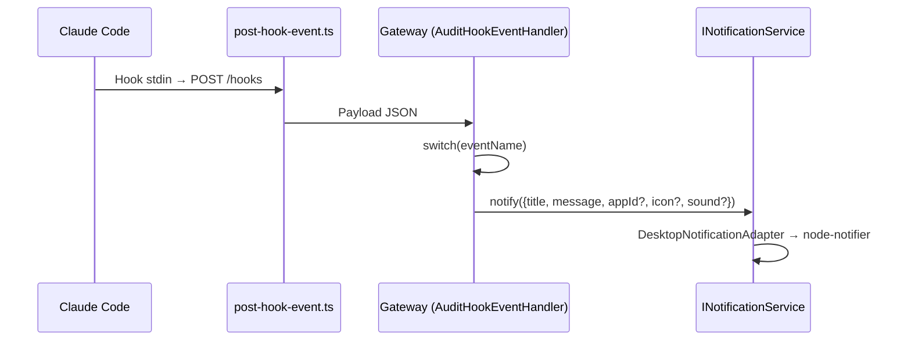

# Hooks de Claude Code — Arquitectura e implementación

**Smart Code Proxy** intercepta 13 eventos de hooks de Claude Code para correlacionar workflows y emitir notificaciones de escritorio. Esta documentación describe el contrato, la implementación y cómo se construye cada mensaje de notificación.

---

## Tabla de contenidos

- [1. Clasificación de hooks](#1-clasificación-de-hooks)
- [2. Configuración de hooks](#2-configuración-de-hooks)
- [3. Relays de eventos](#3-relays-de-eventos)
- [4. Mensaje de notificación por hook](#4-mensaje-de-notificación-por-hook)
  - [4.1. Hooks con mensaje estático](#41-hooks-con-mensaje-estático)
  - [4.2. Hooks con mensaje dinámico desde payload](#42-hooks-con-mensaje-dinámico-desde-payload)
  - [4.3. Hooks con mensaje contextual (transcript)](#43-hooks-con-mensaje-contextual-transcript)
- [5. Integración con notificaciones de escritorio](#5-integración-con-notificaciones-de-escritorio)

---

## 1. Clasificación de hooks

Claude Code emite hooks en 13 puntos del ciclo de vida. Smart Code Proxy los clasifica en tres grupos según su función en el gateway:

| Hook | Tipo | Correlación workflow | Toast |
|------|------|---------------------|-------|
| `UserPromptSubmit` | Lifecycle | No (solo notificación) | Sí (dinámico si hay prompt) |
| `PreToolUse` | Lifecycle | Sí (ToolUse.status) | Sí (solo AskUserQuestion) |
| `PostToolUse` | Lifecycle | Sí (completar ToolUse) | Sí (condicional TaskInProgress) |
| `PostToolUseFailure` | Lifecycle | Sí (ToolUse.status) | No |
| `SubagentStart` | Lifecycle | Sí (confirmar sub-workflow) | Sí (estático) |
| `SubagentStop` | Lifecycle | Sí (cerrar workflow) | Sí (contextual) |
| `Stop` | Lifecycle | Sí (cerrar workflow main) | Sí (contextual) |
| `StopFailure` | Lifecycle | Sí (cerrar con error) | Sí (dinámico) |
| `PermissionRequest` | UX + Lifecycle | No (solo notificación) | Sí (dinámico) |
| `TaskCreated` | UX + Lifecycle | No (solo notificación) | Sí (estático) |
| `TaskCompleted` | UX + Lifecycle | No (solo notificación) | Sí (estático) |
| `SessionStart` | UX | No | Sí (estático) |
| `SessionEnd` | UX | No | Sí (contextual) |

**Nota sobre UserPromptSubmit**: Es un evento del lifecycle del turno, pero **no correlaciona workflows**. La apertura del workflow la realiza el primer `POST /v1/messages` en el wire, no el hook. El handler incluye una explicación:

> "El workflow del turno lo crea exclusivamente `ensureTurnWorkflow` al llegar la request HTTP real; crear aquí produciría workflows sin request body."

**Resumen por función:**

| Función | Hooks | Cantidad |
|---------|-------|----------|
| **Correlación de workflows** | PreToolUse, PostToolUse, PostToolUseFailure, SubagentStart, SubagentStop, Stop, StopFailure | 7 |
| **Notificación únicamente** | UserPromptSubmit, SessionStart, SessionEnd, PermissionRequest, TaskCreated, TaskCompleted, TaskInProgress | 7 |

---

## 2. Configuración de hooks

**Plantilla canónica:** [`configs/hooks.json`](../configs/hooks.json)

```json
{
  "hooks": {
    "UserPromptSubmit": [{ "hooks": [{ "type": "command", "command": "..." }] }],
    "PreToolUse": [{ "matcher": "*", "hooks": [{ "type": "command", "command": "..." }] }],
    ...
  }
}
```

La cobertura incluye:
- **8 hooks de lifecycle** (fundamental para correlación de workflows)
- **5 hooks de UX** (SessionStart, SessionEnd, PermissionRequest, TaskCreated, TaskCompleted)

---

## 3. Relays de eventos

### 3.1. Relay genérico (12 hooks)

**`scripting/hooks/post-hook-event.ts`**

Cliente minimalista que:
1. Lee el payload JSON de `stdin` (UTF-8)
2. Envía `POST /hooks` a `$ANTHROPIC_BASE_URL`
3. Sale con código 0/1

Este relay **NO** decide efectos. Solo reenvía al gateway, que centraliza toda la lógica de correlación y notificaciones.

### 3.2. Relay especializado (SessionEnd)

**`scripting/hooks/session-end-hook.ts`**

Cliente autocontenido que usa `node` directo (type-stripping nativo, sin `npx`/`tsx`). Es equivalente al genérico pero más rápido en el teardown de sesión.

### 3.3. Relay de hook secundario (Stop)

**`scripting/openspec/enforce-auto-pipeline.mts`**

Comando adicional en `Stop` que ejecuta después del relay principal. No emite notificaciones.

---

## 4. Mensaje de notificación por hook

### 4.1. Hooks con mensaje estático

Estos hooks emiten siempre el mismo texto definido en `event-notification-profile.ts`. El mensaje estático se usa **solo si no hay formatter aplicable o como fallback**:

| Hook | Título del toast | Mensaje estático | Imagen | Sonido (Windows) |
|------|------------------|------------------|--------|------------------|
| `UserPromptSubmit` | UserPromptSubmit | Procesando tu solicitud... | user-prompt-submit.png | Reminder |
| `PreToolUse` | PreToolUse | Pregunta pendiente — Responde en la ventana del cliente. | pre-tool-use-ask.png | SMS |
| `SubagentStart` | Subagente iniciado | Subagente iniciado | subagent-start.png | IM |
| `SubagentStop` | Subagente terminado | Subagente terminado | subagent-stop.png | Default |
| `Stop` | Stop | Tu turno — El asistente terminó. Escribe tu siguiente mensaje. | stop.png | IM |
| `StopFailure` | StopFailure | Error de API — No se completó la respuesta. | stop-failure.png | LoopingAlarm7 |
| `SessionStart` | Sesión iniciada | Sesión iniciada | session-start.png | Default |
| `SessionEnd` | Sesión finalizada | Sesión finalizada | session-end.png | Default |
| `PermissionRequest` | PermissionRequest | Permiso requerido — Confirma la herramienta en el cliente. | permission-request.png | SMS |
| `TaskCreated` | Tarea creada | Tarea creada | task-created.png | Reminder |
| `TaskCompleted` | Tarea completada | Tarea completada | task-completed.png | Default |
| `TaskInProgress` | TaskInProgress | Tarea iniciada | task-in-progress.png | IM |

**Implementación:** `AuditHookEventHandler.emitToast(título, mensaje)` donde el segundo parámetro es el texto ya construido.

### 4.2. Hooks con mensaje dinámico desde payload

Estos hooks usan formatters que pueden sustituir el mensaje estático:

| Hook | Formatter | Campos relevantes | Formato del mensaje |
|------|-----------|-------------------|---------------------|
| `UserPromptSubmit` | `formatUserPromptSubmitMessage` | `prompt` | Preview truncado del prompt (120 chars) → sustituye "Procesando tu solicitud..." |
| `StopFailure` | `formatStopFailureMessage` | `error`, `last_assistant_message` | "Límite de tasa (API)\n[preview]" o solo el tipo de error |
| `PreToolUse` | `formatPreToolUseAskMessage` | `tool_input.questions[]` | "N preguntas pendientes\n[preview]" → solo si AskUserQuestion |
| `PermissionRequest` | `formatPermissionRequestMessage` | `tool_name`, `tool_input` | "Permiso para: [tool]\n[preview]" |
| `TaskInProgress` | `formatTaskInProgressMessage` | `tool_input.subject` | "Tarea iniciada: [subject]" → solo si TaskUpdate status=in_progress |

**Implementación:** `resolveHookNotificationMessage(eventKey, payload)` devuelve el texto formateado o `null` si no aplica. La CLI usa `--stdin-json` para activar este path.

### 4.3. Hooks con mensaje contextual (transcript)

Estos hooks enriquecen el toast con el último mensaje del asistente, leído del transcript:

| Hook | Método | Fuente del texto |
|------|--------|------------------|
| `Stop` | `announceStop()` | `lastAssistantText(transcriptPath)` → último mensaje del transcript |
| `SubagentStop` | `emitContextualToast()` | `lastAssistantText(transcriptPath)` → último mensaje del transcript |
| `SessionEnd` | `lastAssistantText()` directo | `lastAssistantText(transcriptPath)` → preview del transcript |

**Formato del mensaje contextual:**
- Si hay texto del transcript: `"Título del evento: [texto]"`
- Si no: `"Título del evento"` (texto fijo del catálogo)

**Ejemplos:**
- `Stop`: "Tu turno — El asistente terminó. Escribe tu siguiente mensaje.: [último mensaje]" o solo el mensaje estático
- `SubagentStop`: "Subagente terminado: [último mensaje]" o "Subagente terminado"
- `SessionEnd`: "Sesión finalizada: [último mensaje]" o "Sesión finalizada"

---

## 5. Integración con notificaciones de escritorio

### 5.1. Flujo completo



### 5.2. Branding

| Campo | Valor por defecto | Configuración |
|-------|-------------------|---------------|
| `appId` (AUMID) | `AIAssistant.Proxy` | Variable `AI_ASSISTANT_AUMID` |
| `icon` | `assets/notifications/events/[event].png` | `--icon` o ruta estable en `%LOCALAPPDATA%\AIAssistant\` |
| `sound` | Token por evento (ver tabla en 4.1) | Variable `sound` en `event-notification-profile.ts` |

### 5.3. Helpers de branding

**`src/2-services/notifications/register.ts`**

| Comando | Acción |
|---------|--------|
| `--install` | Crea `.lnk` + registro AUMID (idempotente) |
| `--status` | Verifica estado de registro |
| `--uninstall` | Elimina `.lnk` y clave de registro |

---

## Referencias

- Spec: `openspec/specs/desktop-notifications-service/spec.md`
- Spec: `openspec/specs/hooks-lifecycle-correlation/spec.md`
- Implementación: `src/3-operations/audit-hook-event.handler.ts`
- Formatters: `src/2-services/notifications/hook-payload-notification-message.ts`