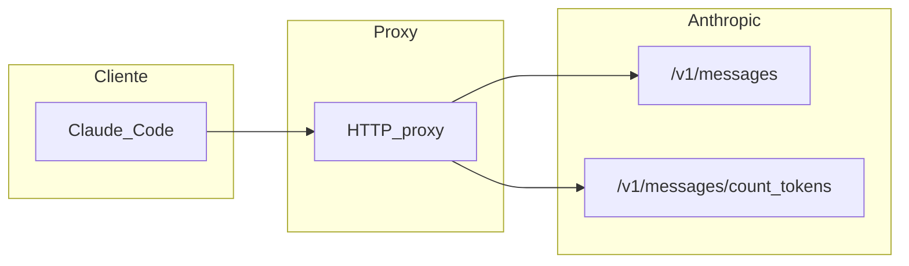

# Coste por interacción: Claude Code y la API de Anthropic

Esta guía define qué cuenta como **interacción** en el tráfico auditado por el [proxy de observabilidad](../README.md), cómo leer `usage` en las respuestas, cómo **calcular el coste estimado** por petición usando un **archivo de configuración de precios** (sin hardcodear tarifas en código) y un **ejemplo** con datos reales de sesión.

### Notas de diseño del documento

- **Público:** personas que interpretan carpetas `sessions/` y quienes implementan herramientas de coste encima del mismo contrato JSON.
- **Separación de responsabilidades:** la documentación oficial de Anthropic define _qué_ se cobra; el JSON local define _a qué precio_ (snapshot editable); el código solo combina `usage` × precios sin incrustar USD.
- **Límite del método:** el resultado es una **estimación** útil para análisis y alertas. La factura real de Anthropic puede diferir por redondeo, promociones, cambios de tarifa no reflejados en el JSON, uso de Batch API, Fast mode, herramientas con cargo fijo u otros modificadores no modelados aquí.

---

## 1. Alcance y fuentes

| Rol                             | Descripción                                                                                                                                                                                                                                                                                              |
| ------------------------------- | -------------------------------------------------------------------------------------------------------------------------------------------------------------------------------------------------------------------------------------------------------------------------------------------------------- |
| **Lógica de coste**             | Alineada con la documentación oficial de Anthropic: [Pricing](https://platform.claude.com/docs/en/about-claude/pricing), [Prompt caching](https://platform.claude.com/docs/en/build-with-claude/prompt-caching), [Token counting](https://platform.claude.com/docs/en/build-with-claude/token-counting). |
| **Fuente humana de verdad**     | La página de **precios** de Anthropic (USD por millón de tokens, MTok) para validar o actualizar el archivo local cuando cambien tarifas o modelos.                                                                                                                                                      |
| **Fuente máquina para cálculo** | El archivo [`configs/anthropic-model-pricing.json`](../configs/anthropic-model-pricing.json): el proxy o cualquier herramienta de análisis debe leer los coeficientes desde ahí, no desde constantes en el código.                                                                                       |

**Restricción de diseño:** los importes **no deben estar hardcodeados** en la lógica del servidor. Los costes por categoría y modelo se cargan desde el JSON; al cambiar precios, solo se edita (o despliega) ese archivo. El JSON debe mantenerse al día copiando valores desde la página oficial (columnas por MTok) para cada `modelId` que uses.

**Qué queda fuera de esta ecuación base:** [Batch API](https://platform.claude.com/docs/en/about-claude/pricing#batch-processing) (descuento distinto), [Fast mode](https://platform.claude.com/docs/en/about-claude/pricing#fast-mode-pricing) (tarifas premium), cargos por herramientas **del lado del servidor** (p. ej. búsqueda web facturada por uso) y otros ítems no lineales en tokens. Si los usas, amplía el modelo de coste más allá de `usage` + tabla MTok.

Si estimas costes con **Chat Completions** vía **[OpenRouter](https://openrouter.ai/)** (`ResponseUsage`, `usage.cost`), no apliques la ecuación de esta guía: sigue [Coste por generación: OpenRouter y la API Chat Completions](./how-to-calculate-openrouter-api-costs.md).

---

## 2. Qué es una “interacción” (dos niveles)

### 2.1 Interacción de auditoría (proxy)

Cada **turno lógico** que el proxy gestiona genera un directorio de auditoría:

```text
sessions/<session-id>/interactions/NNNNNN_<uuid>/
```

- `NNNNNN` es el orden dentro de la sesión (coherente con el prefijo del directorio y con `interaction-sequence.json` en la raíz de la sesión).
- Una interacción puede contener **múltiples steps** (llamadas HTTP individuales), agrupados bajo `steps/`. Por ejemplo, un turno agentic con herramientas puede tener 2-3 steps SSE seguidos.
- `meta.json` es de tipo `TurnMetadata`: describe `interactionType` (`agentic-turn` o `client-preflight`), `steps[]` con metadatos por step, y `totals` con tokens agregados.

Eso es una **interacción de turno** única: una fila en el historial de auditoría, que puede abarcar varias llamadas HTTP.

### 2.2 Interacción con coste de modelo (facturación por tokens)

Para estimar **dinero**, la unidad útil es una llamada que produce **uso de tokens** según la tabla de precios de Anthropic:

| Ruta                                 | ¿Aplica ecuación de coste por tokens?                                                                                                                          |
| ------------------------------------ | -------------------------------------------------------------------------------------------------------------------------------------------------------------- |
| `POST /v1/messages` (streaming o no) | **Sí.** Usar el objeto `usage` del mensaje de respuesta.                                                                                                       |
| `POST /v1/messages/count_tokens`     | **No** (según la documentación actual: el conteo es [gratis](https://platform.claude.com/docs/en/build-with-claude/token-counting), con límites RPM por tier). |

Las llamadas **auxiliares** a Messages (por ejemplo `max_tokens: 1` para comprobaciones) siguen siendo **Messages**: generan `usage` y entran en el cálculo.

En las sesiones de Claude Code suele aparecer el query `?beta=true` (API beta); **no cambia** la lógica de `usage` ni la ecuación: la ruta sigue siendo `POST /v1/messages` o `POST /v1/messages/count_tokens`.

---

## 3. Tipos de interacción (Claude Code → API)

Basado en la sesión de ejemplo sintética `claude-code-workflow-example` (no es un directorio real de este repositorio; es un ejemplo ilustrativo con datos representativos):

| Patrón en `meta.json`                  | Rol típico                                                                                                                                                                                            |
| -------------------------------------- | ----------------------------------------------------------------------------------------------------------------------------------------------------------------------------------------------------- |
| `url` con `/v1/messages`, `sse: true`  | Turnos del agente con **streaming (SSE)**. El `usage` forma parte del mensaje final del stream (p. ej. evento que completa el mensaje). En auditoría: `response.sse.jsonl` siempre aloja los eventos. |
| `url` con `/v1/messages`, `sse: false` | Respuesta JSON única; `usage` en el cuerpo (`response/body.json`). Ejemplo: llamadas pequeñas de comprobación.                                                                                        |
| `url` con `/v1/messages/count_tokens`  | **Conteo de tokens** previo a enviar un mensaje grande; la respuesta suele ser solo un número de `input_tokens` — no facturable como generación en la política actual.                                |

Cada respuesta **completada** de `POST /v1/messages` incluye **un** objeto `usage` asociado a ese id de mensaje asistente: **una** estimación de coste con la ecuación de más abajo por petición. Un turno de conversación con herramientas puede implicar **varias** peticiones seguidas (cada una con su propio `usage`); suma los costes por petición. Los **reintentos** HTTP duplican peticiones en auditoría: si ambas completan, tendrás dos costes (salvo que dedupliques por lógica de negocio).



---

## 4. Estructura de `usage` en la respuesta

En el mensaje final (JSON o reconstruido desde SSE), el objeto `usage` desglosa **entrada** en componentes que se facturan por separado cuando hay [prompt caching](https://platform.claude.com/docs/en/build-with-claude/prompt-caching). **No** existe un desglose de “output en caché”: el caché explícito es **solo sobre el prompt de entrada**.

| Campo API                                  | Significado                                                                                                                                                                                                                                                                                                                                                                                                                                               |
| ------------------------------------------ | --------------------------------------------------------------------------------------------------------------------------------------------------------------------------------------------------------------------------------------------------------------------------------------------------------------------------------------------------------------------------------------------------------------------------------------------------------- |
| `input_tokens`                             | Tokens de entrada facturados a la tarifa **estándar de entrada** para ese tramo del prompt (lo que en pricing aparece como “Base Input”). Es independiente de las líneas de **escritura** y **lectura** de caché: no es “todo el prompt en un solo número”, sino la parte que la API contabiliza en esta categoría.                                                                                                                                       |
| `cache_creation_input_tokens`              | Total de tokens de **escritura** en caché en esa respuesta. Debe ser coherente con el desglose 5m/1h cuando ambos están presentes.                                                                                                                                                                                                                                                                                                                        |
| `cache_read_input_tokens`                  | Tokens de **lectura** desde caché (hits / refreshes), facturados a la tarifa de “Cache Hits & Refreshes”.                                                                                                                                                                                                                                                                                                                                                 |
| `cache_creation.ephemeral_5m_input_tokens` | Tokens de escritura en caché con TTL **5 minutos** (tarifa “5m Cache Writes”).                                                                                                                                                                                                                                                                                                                                                                            |
| `cache_creation.ephemeral_1h_input_tokens` | Tokens de escritura en caché con TTL **1 hora** (tarifa “1h Cache Writes”).                                                                                                                                                                                                                                                                                                                                                                               |
| `output_tokens`                            | Tokens **generados** en la respuesta del asistente. Lo que Anthropic acumule aquí depende del modelo y del producto (p. ej. texto, bloques `tool_use`, y —si el modelo lo reporta en el mismo contador— razonamiento extendido). Para **estimar coste** con el JSON de esta guía basta una tarifa única `costs.output` sobre `output_tokens`; si en el futuro la API expusiera desgloses de salida con precios distintos, habría que extender el esquema. |
| `service_tier`                             | Información de tier (p. ej. `standard`).                                                                                                                                                                                                                                                                                                                                                                                                                  |
| `inference_geo`                            | Restricción o disponibilidad de enrutamiento geográfico (p. ej. `not_available`). Si tu petición usa residencia de datos solo en EE. UU. y el modelo está sujeto al recargo documentado, puede aplicarse un multiplicador global sobre todos los precios por token (ver [§7.1](#71-modificador-inference_geo-opcional)).                                                                                                                                  |

**Coherencia entre totales:** en condiciones normales,

`cache_creation_input_tokens` ≈ `cache_creation.ephemeral_5m_input_tokens` + `cache_creation.ephemeral_1h_input_tokens`.

Para el cálculo económico, **prioriza el desglose 5m/1h** cuando exista: permite aplicar dos precios de escritura distintos. Si hubiera discrepancia puntual entre el total y la suma 5m+1h (versiones de API, bugs o snapshots antiguos), define una política en tu herramienta (p. ej. usar solo los desgloses 5m/1h y omitir el total, o viceversa) y documenta la elección.

**Sin prompt caching:** muchos campos de caché van a **0**; la ecuación se reduce a entrada base + salida (más modificadores opcionales). Si alguna respuesta antigua u omitida no trae el objeto anidado `cache_creation`, trata los contadores 5m/1h **ausentes** como **0** antes de aplicar la §8.

**Categorías de facturación, no “suma = tamaño del prompt”:** `input_tokens`, líneas de caché y `output_tokens` describen **cómo** se cobran tramos del trabajo (base, escritura 5m/1h, lectura, generación). No trates `input_tokens + cache_* + output_tokens` como un recuento único y mutuamente excluyente del mismo conjunto de tokens en el sentido de “tamaño total del prompt en un solo número”; la API ya devuelve los buckets listos para multiplicar por su tarifa (§8).

---

## 5. Precios: documentación oficial vs configuración local

Anthropic publica precios por **MTok** en columnas equivalentes a:

1. Entrada base (`input_tokens`).
2. Escritura caché 5m.
3. Escritura caché 1h.
4. Lectura de caché (hits / refreshes).
5. Salida (`output_tokens`).

En la documentación, los **multiplicadores conceptuales** sobre el precio base de entrada son: escritura 5m **1.25×**, escritura 1h **2×**, lectura **0.1×** (véase [Prompt caching en pricing](https://platform.claude.com/docs/en/about-claude/pricing#prompt-caching)). Los **valores absolutos en USD/MTok** para tu implementación deben vivir en [`configs/anthropic-model-pricing.json`](../configs/anthropic-model-pricing.json), no en el código fuente.

---

## 6. Esquema del archivo de precios (`configs/anthropic-model-pricing.json`)

Objetivo: **un solo archivo** editable para actualizar costes sin modificar TypeScript/JavaScript del proxy.

### 6.1 Campos en la raíz

| Campo              | Tipo              | Descripción                                                                                        |
| ------------------ | ----------------- | -------------------------------------------------------------------------------------------------- |
| `schemaVersion`    | número            | Incrementar si cambian claves obligatorias o el significado de los campos.                         |
| `updatedAt`        | string (ISO 8601) | Informativo: última actualización manual del snapshot.                                             |
| `pricingSourceUrl` | string            | URL de la página oficial usada al rellenar los valores.                                            |
| `currency`         | string            | P. ej. `"USD"`.                                                                                    |
| `unit`             | string            | `"per_million_tokens"` — coherente con la API de facturación Anthropic.                            |
| `defaultModifiers` | objeto opcional   | P. ej. `inferenceGeoUs`: multiplicador documentado para inferencia solo en EE. UU. cuando aplique. |
| `models`           | array             | Un bloque por modelo (o familia de IDs).                                                           |

### 6.2 Cada elemento de `models`

| Campo                      | Tipo              | Descripción                                                                                |
| -------------------------- | ----------------- | ------------------------------------------------------------------------------------------ |
| `modelId`                  | string            | Valor exacto del campo `model` en petición/respuesta (p. ej. `claude-haiku-4-5-20251001`). |
| `aliases`                  | string[] opcional | Otros identificadores que deben resolverse al mismo bloque de costes.                      |
| `costs.input.base`         | número            | USD por MTok para `input_tokens`.                                                          |
| `costs.input.cacheWrite5m` | número            | USD por MTok para `cache_creation.ephemeral_5m_input_tokens`.                              |
| `costs.input.cacheWrite1h` | número            | USD por MTok para `cache_creation.ephemeral_1h_input_tokens`.                              |
| `costs.input.cacheRead`    | número            | USD por MTok para `cache_read_input_tokens`.                                               |
| `costs.output`             | número            | USD por MTok para `output_tokens`.                                                         |

### 6.3 Mapeo ecuación ↔ JSON

Cada sumando de la ecuación es **tokens de una categoría** × **un precio por MTok** del JSON correspondiente. No hace falta un único número “input caché vs no caché”: ya está separado en `base`, escrituras 5m/1h y lectura.

### 6.4 Resolución de `model` → precios

Al calcular el coste:

1. Buscar una entrada cuyo `modelId` coincida exactamente con el campo `model` del mensaje o de la petición.
2. Si no hay coincidencia, probar cada lista `aliases` de las entradas.
3. Si no hay entrada aplicable, no inventes precios: marca el coste como **desconocido** o aplica una política explícita (p. ej. modelo por defecto o error), según tu producto.

---

## 7. Estrategia de carga (guía de diseño)

> [!NOTE]
> Esta sección describe la **estrategia recomendada** para quienes implementen herramientas de cálculo de coste encima del contrato JSON. No es el comportamiento actual del proxy (que reenvía tráfico y no ejecuta cálculos de coste internamente). El servidor Fastify del proxy **no** carga ni procesa este archivo: la carga del JSON queda para la herramienta externa de análisis.

| Aspecto                  | Recomendación                                                                                                                                               |
| ------------------------ | ----------------------------------------------------------------------------------------------------------------------------------------------------------- |
| **Lectura inicial**      | _Lazy loading:_ al primer cálculo de coste, leer el JSON desde disco, validar `schemaVersion` y construir un mapa `modelId → costs` (incluyendo `aliases`). |
| **Caché en memoria**     | Mantener ese mapa en el proceso para no releer el archivo en cada petición.                                                                                 |
| **Reinicio**             | Al reiniciar el servidor, la caché se pierde y el archivo se puede volver a cargar en el próximo uso (o en el arranque si se prefiere carga _eager_).       |
| **Recarga sin reinicio** | Posible extensión futura: señal al proceso o endpoint administrativo para invalidar la caché.                                                               |

No implementar el loader en el servidor Fastify del proxy forma parte del alcance de esta guía; la restricción es de **diseño** para que el código futuro siga este contrato.

### 7.1 Modificador `inference_geo` (opcional)

La documentación de [precios (Data residency)](https://platform.claude.com/docs/en/about-claude/pricing#data-residency-pricing) indica que, en la **Claude API en primera persona (1P)** y para **modelos donde aplica**, especificar inferencia solo en EE. UU. vía el parámetro `inference_geo` puede implicar un **multiplicador 1.1×** sobre **todas** las categorías de precio por token (entrada, salida y caché). Ese recargo es distinto del enrutamiento global por defecto. Plataformas de terceros (Bedrock, Vertex, etc.) tienen reglas propias.

En la implementación:

- Usa `defaultModifiers.inferenceGeoUs` del JSON (p. ej. `1.1`) solo cuando, según tu lectura de la petición y la documentación vigente del modelo, **corresponda** aplicar residencia US.
- Si `inference_geo` es `not_available` o la petición no usa residencia US, **no** apliques ese multiplicador (salvo regla de negocio explícita). En el [ejemplo §9](#9-ejemplo-con-datos-de-auditoría) el valor es `not_available` y el multiplicador no se usa.

---

## 8. Ecuación del coste por interacción (Messages)

Los precios por categoría y el mapeo `model` → fila de `models[]` están en el §6; la carga del archivo y el modificador geográfico opcional, en el §7. Aquí se resume **cómo combinar** `usage` y `costs`.

### 8.1 Qué interviene

El coste de una respuesta Messages es una **suma de productos**: en cada categoría (entrada base, escrituras de caché, lectura de caché, salida) multiplicas **cantidad de tokens** × **precio de esa categoría en USD por millón de tokens (MTok)**.

Hacen falta **dos fuentes de datos distintas**:

1. **Cantidades (tokens)** — Salen del objeto **`usage`** en la respuesta de la API una vez completado el mensaje (`input_tokens`, `cache_read_input_tokens`, etc.).
2. **Tarifas (USD/MTok)** — Las define el proyecto en **`anthropic-model-pricing.json`**: resuelves la fila de `models[]` según `model` / `aliases` (§6.4) y usas el objeto anidado **`costs`** (`costs.input.base`, `costs.output`, …).

**Regla de cada sumando:** `(tokens de esa categoría) / 1_000_000 × (USD/MTok de esa categoría)` — equivalente a `tokens × USD/MTok × 1e-6`.

En el pseudocódigo siguiente, **`tarifas`** es ese objeto **`costs`** ya resuelto para el modelo.

### 8.2 Desglose por categoría

La entrada aporta **cuatro sumandos** (base + tres líneas de caché); la salida **uno**. En total, **cinco** productos (tokens × USD/MTok) que se suman.

| Parte              | Campo en `usage` (cantidad)                | Campo en `costs` del JSON (USD/MTok) |
| ------------------ | ------------------------------------------ | ------------------------------------ |
| Entrada base       | `input_tokens`                             | `costs.input.base`                   |
| Escritura caché 5m | `cache_creation.ephemeral_5m_input_tokens` | `costs.input.cacheWrite5m`           |
| Escritura caché 1h | `cache_creation.ephemeral_1h_input_tokens` | `costs.input.cacheWrite1h`           |
| Lectura caché      | `cache_read_input_tokens`                  | `costs.input.cacheRead`              |
| Salida             | `output_tokens`                            | `costs.output`                       |

### 8.3 Fórmula (implementación)

`tarifas` = `models[i].costs` del modelo resuelto; los contadores vienen de `usage`.

```
cost_in =
    (input_tokens / 1e6) * tarifas.input.base
  + (cache_creation.ephemeral_5m_input_tokens / 1e6) * tarifas.input.cacheWrite5m
  + (cache_creation.ephemeral_1h_input_tokens / 1e6) * tarifas.input.cacheWrite1h
  + (cache_read_input_tokens / 1e6) * tarifas.input.cacheRead

cost_out = (output_tokens / 1e6) * tarifas.output

coste_interaccion = cost_in + cost_out
```

### 8.4 Residencia US (opcional)

Si, según [§7.1](#71-modificador-inference_geo-opcional), aplica el multiplicador documentado para inferencia solo en EE. UU.:

```
coste_final = coste_interaccion * defaultModifiers.inferenceGeoUs
```

Si no aplica, usar factor **1**. En muchos snapshots `inference_geo` es `not_available` y este paso no se usa.

---

## 9. Ejemplo con datos de auditoría

**Petición de referencia:** `sessions/claude-code-workflow-example/interactions/000006_5e0986b8-ff70-4afc-9534-701bb9c68597/response/body.json` (modelo `claude-haiku-4-5-20251001`).

**`usage` (solo contadores agregados):**

| Campo                                      |           Valor |
| ------------------------------------------ | --------------: |
| `input_tokens`                             |            4480 |
| `cache_creation.ephemeral_5m_input_tokens` |           11011 |
| `cache_creation.ephemeral_1h_input_tokens` |               0 |
| `cache_read_input_tokens`                  |           26793 |
| `output_tokens`                            |             693 |
| `inference_geo`                            | `not_available` |

En este snapshot, `cache_creation_input_tokens` es **11011**, igual a `ephemeral_5m_input_tokens + ephemeral_1h_input_tokens` (11011 + 0), coherente con la §4.

**Precios:** tomados de [`configs/anthropic-model-pricing.json`](../configs/anthropic-model-pricing.json) para ese `modelId` (snapshot alineado con la tabla oficial de Claude Haiku 4.5 en la documentación).

| Categoría          | Tokens | USD / MTok |                                                 Parcial (USD) |
| ------------------ | -----: | ---------: | ------------------------------------------------------------: |
| Entrada base       |   4480 |       1.00 |                                                      0.004480 |
| Escritura caché 5m |  11011 |       1.25 |                                                    0.01376375 |
| Escritura caché 1h |      0 |       2.00 |                                                      0.000000 |
| Lectura caché      |  26793 |       0.10 |                                                     0.0026793 |
| Salida             |    693 |       5.00 |                                                      0.003465 |
| **Suma**           |      — |          — | **0.02438805** USD (suma exacta de los parciales de la tabla) |

No se aplica `inferenceGeoUs` porque `inference_geo` es `not_available` en este ejemplo.

**Interpretación del total:** el coste **no** es «(suma de todos los contadores de tokens) × un único precio». Cada categoría tiene su propio USD/MTok; el importe es la **suma de los parciales** de la tabla (equivalente a la §8).

---

## 10. Dónde mirar en las sesiones auditadas

Para localizar `usage` en disco (jerarquía general: `sessions/<session-id>/interactions/NNNNNN_<uuid>/`):

En la nueva estructura, el `usage` de cada step SSE vive en `steps/{N}/response/sse.jsonl`. Si existe reconstrucción top-level, también en `response/body.json`. El `meta.json` del turno incluye `totals` con tokens agregados por turno (solo para `agentic-turn` SSE) y `steps[]` donde cada step puede incluir tokens individuales.

| Nivel | Archivo | Cuándo |
| ----- | ------- | ------ |
| **Step SSE** | `steps/NNN/response/sse.jsonl` | Siempre en turnos SSE; contiene evento `message_delta` con `usage` |
| **Top-level** | `response/body.json` | Siempre en agentic-turn/side-request SSE completados (reconstrucción exitosa) |
| **meta.json** | campo `totals` | Solo `agentic-turn` SSE; agrega tokens de todos los steps |
| **meta.json** | campo `steps[].inputTokens` etc. | Tokens por step individual |

Si **no** hay JSON reconstruido pero sí `steps/NNN/response/sse.jsonl`, el objeto `usage` aparece en el flujo SSE (p. ej. en el evento `message_delta` al finalizar el stream): parsea las líneas JSON del archivo hasta localizar el bloque `usage` asociado al mensaje completado.

El campo `model` para la §6.4 suele coincidir en petición y respuesta; si solo tienes cuerpo de petición (`request/body.json`) por un fallo de auditoría, puedes leer `model` de ahí como respaldo.

Convención detallada de nombres y reglas de presencia: [README del repositorio](../README.md) y referencia de auditoría del proyecto.

Para la **matriz completa** de archivos por interacción, campos de `meta.json` (TurnMetadata) y catálogo de presencia, resulta útil la skill de Claude Code **`smart-code-proxy`** y su `reference.md`. Esta sección solo indica **dónde** suele aparecer `usage` en relación con la estructura de steps.

---

## 11. Coste agregado de una sesión o de un intervalo

La clasificación de rutas (`count_tokens` vs generación) debe ser coherente con el §2 y el §10. Para recorrer carpetas `interactions/` con criterio estructural, la skill **`smart-code-proxy`** describe la jerarquía bajo `sessions/`.

Para estimar el coste **total** de una sesión de Claude Code a partir de auditoría en disco:

1. Recorre cada carpeta `interactions/NNNNNN_*/` en orden de secuencia (p. ej. orden numérico del prefijo). Nota: cada interacción puede agrupar múltiples llamadas HTTP; los `usage` individuales están en los steps (`steps/{N}/response/sse.jsonl`).
2. Clasifica por **ruta sin query** (quita `?beta=true` u otros parámetros antes de comparar). **Orden importa:** el endpoint de conteo contiene el segmento `count_tokens`. Si solo buscas si la URL contiene `/v1/messages`, **ambas** rutas coincidirían (porque `.../messages/count_tokens` también incluye `messages`). Regla segura: si el path contiene `count_tokens` → petición de **conteo**; si no, y el path corresponde a `POST /v1/messages` (sin `count_tokens`) → **generación**. Omite `count_tokens` para el coste de generación (coste **0** con la política actual de conteo gratuito). La ruta por step está en `meta.json → steps[].url` (si aplica) o en los archivos de request del step.
3. Para cada step de generación con respuesta válida y `usage` disponible, aplica la §8. El `model` suele estar en el cuerpo de respuesta reconstruido o en el último evento SSE del step. Alternativamente, `meta.json → totals` agrega los tokens de todos los steps del turno para `agentic-turn` SSE.
4. **Suma** los costes por step. Si el proxy registró error de upstream (`turnOutcome: "upstream-error"` en `meta.json`), o si no hay archivos de respuesta utilizables en el step, no hay `usage` fiable para esa llamada.

---

## 12. Seguridad

Los directorios `sessions/` pueden contener **claves API** en cabeceras y **contenido sensible** en cuerpos. No compartas esos archivos públicamente; esta guía solo usa **agregados numéricos** de `usage` como ejemplo.

---

## 13. Misma guía en Claude Code (opcional)

La ecuación y convenciones de esta guía están recogidas en la skill global **`anthropic-api-cost-estimation`** (instalación típica: `~/.claude/skills/anthropic-api-cost-estimation/`), pensada para usarse junto con **`smart-code-proxy`** cuando trabajes con sesiones auditadas y costes estimados en Claude Code. Para OpenRouter (guía y skill **`openrouter-api-cost-estimation`**), véase el enlace de §1.

Mantén alineados el presente documento y los archivos `references/*.md` de la skill **`anthropic-api-cost-estimation`** cuando cambie el contrato semántico (véase `MAINTENANCE.md` en el directorio de la skill).
