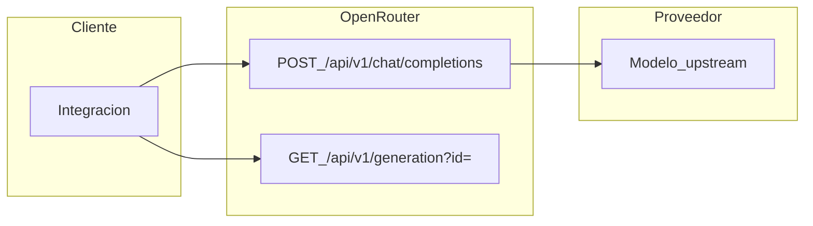

# Coste por generación: OpenRouter y la API Chat Completions

Esta guía define cómo interpretar **`usage`** (`ResponseUsage`) en respuestas de **[OpenRouter](https://openrouter.ai/)** (`POST /api/v1/chat/completions`), cómo priorizar el **coste reportado** (`usage.cost`), cuándo usar **GET `/api/v1/generation`**, cómo **estimar** con tokens y precios del modelo si falta `cost`, y cómo **agregar** importes en integraciones locales (p. ej. logs JSONL). Para la API **Messages** de Anthropic, el archivo de precios del proxy y la ecuación por caché 5m/1h, véase [Coste por interacción: Claude Code y la API de Anthropic](./how-to-calculate-anthropic-api-costs.md).

### Notas de diseño del documento

- **Público:** integradores de OpenRouter y quienes analizan costes a partir de respuestas o logs.
- **Separación de responsabilidades:** la documentación y el **OpenAPI** de OpenRouter definen el **esquema** de `usage`; esta guía describe **cómo** usarlo para estimación y agregación. Los importes en cuenta (créditos, facturación) dependen de la política comercial de OpenRouter; no sustituyen el extracto oficial.
- **Límite del método:** el resultado es útil para **análisis y alertas**. Puede diferir de la facturación por redondeo, promociones, BYOK, plugins o reglas no reflejadas en un único campo `cost`.

---

## 1. Alcance y fuentes

| Rol                              | Descripción                                                                                                                                                                                                           |
| -------------------------------- | --------------------------------------------------------------------------------------------------------------------------------------------------------------------------------------------------------------------- |
| **Referencia de API**            | [API Reference — overview](https://openrouter.ai/docs/api/reference/overview): formato de petición/respuesta al estilo Chat Completions y tipo **`ResponseUsage`**.                                                   |
| **Fuente normativa de esquema**  | [OpenAPI YAML](https://openrouter.ai/openapi.yaml) o [JSON](https://openrouter.ai/openapi.json). Si la documentación web y el OpenAPI discrepan en **nombres de campos o tipos**, prevalece el **OpenAPI** publicado. |
| **Generación tras la respuesta** | [Get a generation](https://openrouter.ai/docs/api-reference/get-a-generation): estadísticas por `id` de generación.                                                                                                   |
| **Precios para estimación**      | Lista de modelos: [GET /api/v1/models](https://openrouter.ai/api/v1/models) o ficha del modelo en el sitio.                                                                                                           |

**Qué queda fuera de esta guía:** la API **Messages** de Anthropic (`/v1/messages`), los archivos de precios por proveedor en `routing/providers/<provider>/models/<model>/metadata.json` (solo aplica al flujo del proxy documentado en la otra guía), la jerarquía `sessions/.../requests/` del proxy (auditoría distinta), y cargos de **plugins** u **herramientas de servidor** no modelados solo con tokens (ampliar el modelo de coste según la documentación de OpenRouter).

---

## 2. Unidad de observación y de coste

### 2.1 Petición HTTP

El núcleo de esta guía es **`POST https://openrouter.ai/api/v1/chat/completions`** (o el host que uses), cuerpo al estilo OpenAI Chat Completions.

### 2.2 Generación con uso y coste

Para estimar dinero, la unidad útil es una respuesta **completada** que incluya un objeto **`usage`** coherente con el tipo **`ResponseUsage`**. Suele haber **un** `usage` por respuesta de completado (no streaming o reconstruido desde el stream).

### 2.3 Recuperación diferida

Si necesitas datos **después** de cerrar la respuesta o perdiste el cuerpo, usa el identificador **`id`** del objeto respuesta en la raíz (p. ej. `"gen-..."` en ejemplos oficiales) con:

`GET https://openrouter.ai/api/v1/generation?id=<GENERATION_ID>`

con las **mismas credenciales** que el resto de la API (p. ej. cabecera `Authorization` según la documentación). El nombre del parámetro y la forma exacta del cuerpo de respuesta: **OpenAPI** y [Get a generation](https://openrouter.ai/docs/api-reference/get-a-generation).

Esta llamada **no** es una segunda generación facturada como un chat completion nuevo: es una **consulta** de estadísticas de la generación ya asociada a ese `id`.



---

## 3. Patrones de integración (no streaming vs streaming)

| Modo                                          | Dónde aparece `usage`                                                                                                                                                                                                 |
| --------------------------------------------- | --------------------------------------------------------------------------------------------------------------------------------------------------------------------------------------------------------------------- |
| **Sin streaming** (`stream: false` o ausente) | En el cuerpo JSON completo al finalizar. La documentación de overview indica que los datos de uso se devuelven para completions no streaming.                                                                         |
| **Streaming (SSE)**                           | Suele enviarse **una vez** en el **último chunk** antes del mensaje de fin (`[DONE]`), a menudo con `choices` vacío en ese chunk; conviene no asumir comportamiento no documentado en el OpenAPI y probar tu cliente. |

Para incluir uso en stream, el patrón habitual (compatible con OpenAI) es **`stream_options.include_usage: true`** en el cuerpo de la petición; el nombre exacto del objeto debe coincidir con el esquema que acepte OpenRouter en tu versión de API.

**Ejemplo de integración (no normativo):** en integraciones tipo **Claude Code Router**, un plugin puede forzar `include_usage` y persistir `usage.cost` desde líneas SSE. Eso es **referencia de producto**, no especificación de OpenRouter.

---

## 4. Estructura de `usage` (ResponseUsage)

En el mensaje final (JSON o último chunk), **`usage`** desglosa tokens y, opcionalmente, coste y BYOK. Los nombres siguen el tipo **`ResponseUsage`** del OpenAPI.

### 4.1 Tokens principales

| Campo               | Significado                                                                                          |
| ------------------- | ---------------------------------------------------------------------------------------------------- |
| `prompt_tokens`     | Tokens de entrada (texto, multimodal, herramientas, según modelo).                                   |
| `completion_tokens` | Tokens generados en la salida.                                                                       |
| `total_tokens`      | Suma coherente con el esquema (p. ej. prompt + completion); útil como tamaño agregado de la llamada. |

### 4.2 Desgloses opcionales

| Objeto                      | Contenido típico                                           |
| --------------------------- | ---------------------------------------------------------- |
| `prompt_tokens_details`     | P. ej. `cached_tokens`, `cache_write_tokens`, audio/vídeo. |
| `completion_tokens_details` | P. ej. `reasoning_tokens`, salida multimodal.              |

**No** sumes ingenuamente desgloses con `prompt_tokens` como si fueran categorías disjuntas sin leer la documentación del proveedor; úsalos como información adicional.

### 4.3 Coste y BYOK

| Campo          | Significado                                                                                                                                                                                                                                                           |
| -------------- | --------------------------------------------------------------------------------------------------------------------------------------------------------------------------------------------------------------------------------------------------------------------- |
| `cost`         | Importe asociado a la generación en la cuenta OpenRouter; la documentación puede hablar de **créditos**. Trátalo como **valor reportado por la API** para auditoría interna; la interpretación monetaria final está en la documentación de facturación de OpenRouter. |
| `is_byok`      | Indica **Bring Your Own Key** (clave del proveedor propia).                                                                                                                                                                                                           |
| `cost_details` | Desglose opcional; pueden aparecer campos como `upstream_inference_cost`, `upstream_inference_prompt_cost`, `upstream_inference_completions_cost` (nombres exactos en OpenAPI).                                                                                       |

### 4.4 Herramientas en servidor

`server_tool_use` puede incluir contadores (p. ej. `web_search_requests`). El coste puede incluir **cargos no lineales** en tokens; revisa precios de plugins o de búsqueda en la documentación de OpenRouter.

### 4.5 Contraste con Anthropic Messages

El objeto `usage` de la API **Messages** de Anthropic usa `input_tokens`, líneas de caché explícitas (`cache_creation.*`, `cache_read_input_tokens`), etc. **No** es intercambiable con `ResponseUsage` de OpenRouter: convenciones y proveedores distintos.

Si aparece **`error`** dentro de un elemento de **`choices`** (p. ej. en tipos de elección con error anidado), la generación puede estar incompleta: no uses `usage` como éxito sin revisar; véase §8.

---

## 5. Prioridad para obtener el coste

1. **`usage.cost`** en la respuesta no streaming o en el chunk final del stream (cuando exista).
2. **`GET /api/v1/generation?id=...`** con el **`id`** de la respuesta de chat completions, si necesitas recuperar estadísticas después o no guardaste el cuerpo.
3. **Estimación por tokens** multiplicando `prompt_tokens` y `completion_tokens` por los precios publicados para ese modelo en **`/api/v1/models`** (o equivalente), solo como **respaldo**.

**Cuándo falla cada nivel:** stream cortado antes del chunk con `usage`; cliente sin `stream_options.include_usage` en stream; **`cost` ausente**; **`cost` numéricamente 0** sin contexto (no asumir “gratis”: puede ser BYOK, redondeo o política comercial; véase §7 y documentación de facturación); modelo sin precios en la API para estimación; error HTTP o cuerpo inválido (véase §8).

En respuesta **no streaming**, el cuerpo completo suele incluir `usage` al terminar; si recibes error HTTP o JSON incompleto, trata el caso como §8.

---

## 6. Estimación por tokens (respaldo)

Si no puedes usar `usage.cost` ni GET generation con datos fiables:

- Obtén **precios por millón de tokens** (o la unidad que exponga el modelo) desde [GET /api/v1/models](https://openrouter.ai/api/v1/models) o la documentación del modelo.
- Aplica la estructura de precios que devuelva cada modelo: si solo hay **prompt** y **completion**, usa `prompt_tokens` y `completion_tokens` por separado. Si hay más categorías en la definición del modelo, alinea categorías con contadores **solo** cuando el esquema del modelo lo permita.

**Advertencia:** los **tokens** de OpenRouter se calculan con el tokenizer del modelo upstream; **no** son intercambiables con los contadores de la guía Anthropic (`input_tokens`, `cache_*`, etc.).

Esta guía **no** define una ecuación única tipo la §8 de [la guía Anthropic](./how-to-calculate-anthropic-api-costs.md) (entrada base + caché 5m/1h + lectura): aquí el ancla operativa es **`usage.cost`** cuando está disponible.

---

## 7. BYOK (Bring Your Own Key) — no es §7 de la guía Anthropic

El título recuerda que **esta sección no corresponde** al §7 de la guía Anthropic (carga de JSON y `inference_geo`). En OpenRouter, con **`is_byok: true`**, el reparto entre margen de OpenRouter y coste upstream puede reflejarse en **`cost_details`** y campos de coste upstream. No confundas este flujo con el consumo de la **API Anthropic en primera persona** documentado en la skill **`anthropic-api-cost-estimation`** (Messages + `metadata.json` por proveedor).

---

## 8. Fiabilidad, errores y exclusiones de suma

- **Errores HTTP:** no trates la respuesta como completación exitosa; puede no haber `usage` fiable.
- **Errores en `choices`:** si hay error anidado en una elección, revisa el mensaje y el código antes de sumar coste.
- **Streaming incompleto:** sin chunk final con `usage`, el coste en cliente puede ser desconocido salvo que recuperes por **GET generation** con el `id` si lo tenías.
- **Política recomendada:** no sumes al mismo total operativo las peticiones **fallidas o incompletas** que las **exitosas** sin una regla explícita de negocio (p. ej. auditoría de intentos fallidos por separado).

---

## 9. Ejemplo ilustrativo (sintético)

Cuerpo de respuesta **de ejemplo** (valores inventados; no es una sesión real de este repositorio):

```json
{
  "id": "gen-example-openrouter-001",
  "model": "anthropic/claude-3.5-haiku",
  "choices": [
    {
      "finish_reason": "stop",
      "message": { "role": "assistant", "content": "Hola." }
    }
  ],
  "usage": {
    "prompt_tokens": 120,
    "completion_tokens": 30,
    "total_tokens": 150,
    "cost": 0.00012,
    "is_byok": false
  }
}
```

Para el coste agregado de un proyecto, sumarías **`usage.cost`** por cada respuesta que clasifiques como exitosa según tu política (§8).

---

## 10. Dónde mirar en integraciones locales

No hay un único formato de log impuesto por OpenRouter. En integraciones habituales:

- **Líneas JSONL** (p. ej. `router-requests.jsonl`): campos como `timestamp`, `launch_id`, `slot`, `model`, objeto `tokens` derivado de `usage`, y `cost` desde `usage.cost`.
- **Cuerpos guardados** de respuestas HTTP: el mismo `usage` que en la API.

**Contraste:** la auditoría del [proxy de observabilidad](../README.md) bajo `sessions/<session-id>/interactions/NNNNNN_<uuid>/` describe el tráfico hacia **api.anthropic.com**, no un contrato oficial de OpenRouter. Para árbol de archivos y `meta.json` del proxy, la skill **`smart-code-proxy`** aplica al proxy Anthropic, no a OpenRouter.

---

## 11. Agregación

1. Recorre las respuestas o líneas de log en el orden que defina tu producto (tiempo, archivo, sesión lógica).
2. Para cada **`POST /api/v1/chat/completions`** con resultado válido y `usage` utilizable, toma **`usage.cost`** cuando exista y sea fiable según §8.
3. **Suma** los costes por petición. Puedes agrupar por **`model`**, por **`launch_id`** o **slot** (si tu integración los guarda), o por ventana temporal.
4. **Reintentos:** si dos peticiones **completan** con éxito, habrá dos importes salvo que dedupliques por regla de negocio (misma idea que en la guía Anthropic para reintentos HTTP).

Una **línea JSONL ilustrativa** coherente con §10–11 (solo patrón, no dato real):

```json
{
  "timestamp": "2026-04-09T12:00:00.000Z",
  "launch_id": "example-launch",
  "slot": "main",
  "model": "anthropic/claude-3.5-haiku",
  "tokens": { "prompt": 120, "completion": 30, "total": 150 },
  "cost": 0.00012
}
```

---

## 12. Seguridad

Las peticiones y los logs pueden incluir **claves API** en cabeceras y **contenido sensible** en cuerpos. No compartas archivos de log ni respuestas completas públicamente; esta guía solo muestra **ejemplos sintéticos** o agregados.

---

## 13. Misma guía en Claude Code (opcional)

Las convenciones de esta guía están recogidas en la skill global **`openrouter-api-cost-estimation`** (instalación típica: `~/.claude/skills/openrouter-api-cost-estimation/`), pensada para interpretar `ResponseUsage`, streaming y agregación desde logs. Para la API Messages de Anthropic y sesiones del proxy en disco, usáis **`anthropic-api-cost-estimation`** y **`smart-code-proxy`** según corresponda.

Mantén alineados el presente documento y los archivos `references/*.md` de esa skill cuando cambie el contrato semántico (véase `MAINTENANCE.md` en el directorio de la skill).
