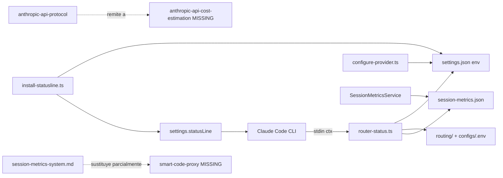

# Artifacts drift: perfil Claude Code vs sandbox vs Smart Code Proxy

Informe de diagnóstico para identificar qué artefactos del perfil global de Claude Code (`~/.claude`) son reutilizables en el repositorio **Smart Code Proxy**, con foco en la cadena de cohesión de `scripting/router-status.ts`. Este documento **no** es el plan de migración; sirve como insumo para diseñarlo.

**Fecha:** 2026-06-01  
**Versión Claude Code:** `@anthropic-ai/claude-code@2.1.156`  
**Sandbox:** `C:\Users\Cristian\claude-code-sandbox\`

---

## 1. Resumen ejecutivo

- El perfil global en `C:\Users\Cristian\.claude\` contiene **38 archivos editables** (commands, skills, scripts, hooks, settings) fuera de runtime/plugins; el sandbox limpio generó **3 archivos** tras un arranque mínimo sin login.
- **Smart Code Proxy ya versiona** 18 skills y 3 commands en `.claude/`, más los scripts `router-status.ts`, `install-statusline.ts`, `install-notifications.ts` y `configure-provider.ts`. La configuración operativa del proxy (statusline, modelos, `ANTHROPIC_BASE_URL`) vive en **`~/.claude/settings.json`**, no en el repo.
- **Drift crítico (P0):** `.claude/settings.local.json` del repo referencia skills globales **inexistentes** (`smart-code-proxy`, `anthropic-api-cost-estimation`). El skill `anthropic-api-protocol` remite al segundo; el primero tenía 42 usos históricos pero ya no está en disco.
- **Cohesión statusline incompleta:** el runtime funciona (statusLine apunta al repo), pero la documentación/skill operativa del statusline quedó huérfana al eliminar `~/.claude/skills/smart-code-proxy/` y `router-status.ps1`. Los docs canónicos del repo (`docs/router-statusline.md`, `docs/session-metrics-system.md`) cubren parte del vacío.
- **OpenSpec y managers:** ya migrados al repo; no hay copias globales duplicadas.
- **PKA y PowerShell guard:** solo en global; candidatos P2 si se quieren compartir con el equipo del proxy.
- **CCR legacy:** 5 commands, 5 scripts PS1 y 2 hooks de sesión; sección aparte, sin migración automática recomendada.
- **README obsoleto:** enlaza `docs/how-to-calculate-anthropic-api-costs.md`, archivo archivado/eliminado.

---

## 2. Metodología

### 2.1 Sandbox aislado

| Variable | Valor |
|----------|-------|
| `CLAUDE_CONFIG_DIR` | `C:\Users\Cristian\claude-code-sandbox\config` |
| `USERPROFILE` | `C:\Users\Cristian\claude-code-sandbox\fake-profile` |
| `CLAUDE_CODE_DISABLE_OFFICIAL_MARKETPLACE_AUTOINSTALL` | `1` |

Comando de bootstrap: `claude --version` + `claude -p "ok" --max-turns 1` (sin `/login`; salida: *Not logged in*).

**Observación:** con `CLAUDE_CONFIG_DIR`, Claude Code creó `.claude.json` **dentro de `config/`**, no en `fake-profile/`. El perfil aislado quedó vacío. Para comparar estado global OAuth/MCP, se usó la estructura de claves de `C:\Users\Cristian\.claude.json` vs `config\.claude.json`.

### 2.2 Exclusiones del diff de migración

No se comparan como artefactos migrables: `projects/`, `sessions/`, `daemon/`, `jobs/`, `file-history/`, `shell-snapshots/`, `backups/`, `plugins/`, `tasks/`, `paste-cache/`, `plans/`, `cache/`, `debug/`, `ide/`.

### 2.3 Snapshots exportados

Inventarios en `C:\Users\Cristian\claude-code-sandbox\snapshots\`:

- `baseline-config.txt` — 3 rutas
- `user-artifacts.txt` — 38 rutas
- `repo-claude.txt` — 30 rutas

---

## 3. Baseline (sandbox)

Tras primer arranque mínimo:

| Ruta relativa a `config/` | Categoría |
|---------------------------|-----------|
| `.claude.json` | Runtime / estado global mínimo (7 claves top-level) |
| `backups\.claude.json.backup.*` | Runtime |
| `projects\...\*.jsonl` | Runtime (sesión desde cwd del proxy) |

**No se crearon:** `settings.json`, `commands/`, `skills/`, `hooks/`, marketplace/plugins (auto-install desactivado).

**Claves top-level en sandbox `.claude.json`:** `firstStartTime`, `migrationVersion`, `opusProMigrationComplete`, `seenNotifications`, `sonnet1m45MigrationComplete`, `userID`.

**Claves top-level en perfil real `~/.claude.json` (estructura, 60+ claves):** incluye `oauthAccount`, `mcpServers`, `projects`, `skillUsage`, `toolUsage`, `officialMarketplaceAutoInstalled`, caches GrowthBook, etc.

---

## 4. Inventario perfil actual (`C:\Users\Cristian\.claude\`)

### 4.1 Commands globales — solo histórico retirado

| Archivo | Uso histórico (`.claude.json`) | Clasificación |
|---------|----------------------------------|---------------|
| ~~`commands\ccr-multimode.md`~~ | 8 usos | **retirado 2026-06-03** (paquete CCR) |
| ~~`commands\router-clean-slate.md`~~ | 1 uso | **retirado 2026-06-03** → `npm run clean:all` (repo) |
| ~~`commands\delete-session.md`~~ | 1 uso | **retirado 2026-06-03** → `npm run sessions:delete` |
| ~~`commands\sanitize-session.md`~~ | 1 uso | **retirado 2026-06-03** → `npm run sessions:sanitize*` |
| ~~`commands\archive-session.md`~~ | (registrado) | **retirado 2026-06-03** → `npm run sessions:archive` / `restore` |

### 4.2 Skills globales (2)

| Skill | Archivos | Hook activo | Clasificación |
|-------|----------|-------------|---------------|
| `skills\progressive-kernel-architecture\` | SKILL.md + 2 references + 1 asset | No | **personal-global** (citado en docs del repo) |
| `skills\powershell-syntax-guard\` | SKILL.md + reference + 2 scripts | Sí (`PostToolUse` en `*.ps1`) | **personal-global** |

### 4.3 Skills fantasma (referenciados pero ausentes)

| Skill | Referenciado desde | En disco | Usos históricos |
|-------|-------------------|----------|-----------------|
| `smart-code-proxy` | `.claude.json` skillUsage; sesiones citan `statusline.md` | **No** | 42 |
| `anthropic-api-cost-estimation` | `.claude/settings.local.json`; `anthropic-api-protocol/SKILL.md` | **No** | — |

### 4.4 Scripts y hooks

| Artefacto | Ruta | Clasificación |
|-----------|------|---------------|
| ~~Hook SessionStart CCR~~ | ~~`session-start-router.ps1`~~ | **retirado 2026-06-03** |
| Notificaciones | `npm run install:notifications` → `npx … cli.ts` en `~/.claude/settings.json` | **canónico** (retirado `desktop-notification-hook.ps1` 2026-06-03) |
| ~~Router CCR~~ | ~~`scripts\router-clean-slate.ps1`~~ | **retirado 2026-06-03** |
| Session manager (Claude Code) | `scripting/session-manager/` + npm `sessions:*` | **canónico en repo** (backup `~/.claude/_archive/2026-06-03-session-manager-legacy/`) |
| ~~Estado CCR~~ | ~~`router-*`, `session-tags.json`, `.claude-code-router/`~~ | **retirado 2026-06-03** (backup `~/.claude/_archive/2026-06-03-ccr-legacy/`) |

### 4.5 Settings global (`settings.json`)

**Claves de primer nivel (13):** `env`, `permissions`, `hooks`, `statusLine`, `model`, `language`, `effortLevel`, `voice`, `voiceEnabled`, `autoUpdatesChannel`, `awaySummaryEnabled`, `showClearContextOnPlanAccept`, `remoteControlAtStartup`, `skipDangerousModePermissionPrompt`.

**Bloque `env` (gestionado por Smart Code Proxy):**

| Variable | Valor (sanitizado) | Escrito por |
|----------|-------------------|-------------|
| `SMART_CODE_PROXY_ROOT` | `C:\Users\Cristian\Desktop\Proyectos\Smart Code Proxy` | `install-statusline` |
| `ANTHROPIC_BASE_URL` | `http://127.0.0.1:8787` | `configure-provider` |
| `ANTHROPIC_AUTH_TOKEN` | *(presente — no documentar)* | `configure-provider` |
| `ANTHROPIC_API_KEY` | *(vacío)* | `configure-provider` |
| `ANTHROPIC_DEFAULT_HAIKU_MODEL` | `MiniMax-M2.5` | `configure-provider` |
| `ANTHROPIC_DEFAULT_SONNET_MODEL` | `MiniMax-M2.7` | `configure-provider` |
| `ANTHROPIC_DEFAULT_OPUS_MODEL` | `MiniMax-M3` | `configure-provider` |
| `CLAUDE_CODE_SUBAGENT_MODEL` | `MiniMax-M2.7` | `configure-provider` |

**Statusline (proxy-cohesion):**

```text
npx --prefix "<repo>" tsx scripting/router-status.ts
```

**Hooks registrados:**

| Evento | Destino | Clasificación |
|--------|---------|---------------|
| SessionStart, SessionEnd, UserPromptSubmit, Stop, StopFailure, PermissionRequest, PreToolUse (AskUserQuestion), Subagent*, Task* | `npx tsx …/notifications/cli.ts` vía `install:notifications` | **activo** |
| PostToolUse (`Write\|Edit` `*.ps1`) | `powershell-syntax-guard/scripts/hook-post-tooluse.ps1` | personal-global |

### 4.6 Plugins (nativo Anthropic, no migrar)

Marketplace `claude-plugins-official` clonado bajo `plugins\` — **33 plugins** locales. Auto-instalación confirmada en `~/.claude.json` (`officialMarketplaceAutoInstalled: true`). Fuera del alcance de migración al repo.

### 4.7 Memoria global

| Archivo | Clasificación |
|---------|---------------|
| `memory\MEMORY.md` | personal-global |
| `memory\feedback_no_backups.md` | personal-global |

---

## 5. Inventario repo (Smart Code Proxy)

### 5.1 `.claude/` versionado

**Commands (3):**

| Command | Equivalente histórico global |
|---------|----------------------------|
| `analyze-session.md` | — |
| `create-plan.md` | `crear-plan` (29 usos históricos) |
| `verify-scripts.md` | — |

**Skills (18):**

| Grupo | Skills |
|-------|--------|
| Dominio proxy/API | `anthropic-api-protocol`, `artifact-structuring`, `conventional-commits` |
| Gestión artefactos | `skill-manager`, `command-manager` (+ references) |
| OpenSpec | `openspec-specialist`, `openspec-onboard`, `openspec-explore`, `openspec-new`, `openspec-continue`, `openspec-propose`, `openspec-ff`, `openspec-apply`, `openspec-verify`, `openspec-sync`, `openspec-archive`, `openspec-bulk-archive` |
| Migración | `migration-phase-gate` (+ references) |

**Settings:**

| Archivo | Contenido |
|---------|-----------|
| `.claude/settings.json` | `{}` (vacío) |
| `.claude/settings.local.json` | Permisos; **referencias rotas** a skills globales inexistentes |

### 5.2 Scripts y docs de cohesión statusline

| Artefacto | Rol |
|-----------|-----|
| `scripting/router-status.ts` | Renderiza statusline; lee stdin, settings, repo |
| `scripting/install-statusline.ts` | Escribe `statusLine` + `SMART_CODE_PROXY_ROOT` en global |
| `scripting/install-notifications.ts` | Escribe 11 hooks de notificación globales + `SMART_CODE_PROXY_ROOT` |
| `scripting/configure-provider.ts` | Escribe `ANTHROPIC_*` en global + `configs/.env` |
| `scripting/shared/claude-settings.ts` | I/O de `~/.claude/settings.json` |
| `docs/router-statusline.md` | Especificación canónica del statusline |
| `docs/session-metrics-system.md` | Sistema `session-metrics.json` (Tabla 2) |

### 5.3 Instrucciones de proyecto

| Archivo | Rol |
|---------|-----|
| `CLAUDE.md` / `AGENTS.md` | Reglas de comportamiento del repo |

---

## 6. Matriz comparativa

Leyenda **Migración:** `ya-hecho` | `sí` | `parcial` | `no` | `ccr-legacy` | `repo-gap`

| Artefacto | Baseline | User global | Repo SCP | Clasificación | Migración |
|-----------|:--------:|:-----------:|:--------:|---------------|-----------|
| `settings.json` (env proxy) | — | Sí | — (scripts escriben global) | proxy-cohesion | parcial — permanece global por diseño |
| `statusLine` → `router-status.ts` | — | Sí | Script en repo | proxy-cohesion | ya-hecho |
| `anthropic-api-protocol` | — | — | Sí | repo canónico | ya-hecho |
| `anthropic-api-cost-estimation` | — | Ref, ausente | Ref rota | repo-gap | sí — crear o eliminar ref |
| `smart-code-proxy` skill | — | Ref, ausente | — | repo-gap | parcial — consolidar en docs/skill repo |
| OpenSpec (13 skills) | — | — | Sí | repo canónico | ya-hecho |
| `skill-manager`, `command-manager` | — | — | Sí | repo canónico | ya-hecho |
| `create-plan`, `verify-scripts`, `analyze-session` | — | — | Sí | repo canónico | ya-hecho |
| `progressive-kernel-architecture` | — | Sí | Citado en docs | personal-global | sí — si PKA es parte del producto |
| `powershell-syntax-guard` | — | Sí + hook | Permiso local | personal-global | parcial — skill al repo o mantener global |
| Commands CCR/sesión (5) | — | Sí | — | ccr-legacy | no (sección aparte) |
| Hooks CCR (`session-*-router`) | — | Sí | — | ccr-legacy | no |
| Scripts CCR (`scripts/*.ps1`) | — | Sí | — | ccr-legacy | no |
| Notificaciones `C:\AI\...` | — | Sí (hooks) | — | personal-global | no |
| Marketplace plugins (33) | — | Sí | — | native-plugin | no |
| `memory/MEMORY.md` | — | Sí | — | personal-global | no |
| `session-metrics.json` (runtime) | — | — | Generado por proxy | proxy-cohesion | ya-hecho (código en `src/`) |
| `.statusline-state.json` | — | — | Escrito por statusline | proxy-cohesion | ya-hecho |
| `docs/how-to-calculate-anthropic-api-costs.md` | — | — | Eliminado; README enlaza | drift doc | sí — corregir README o restaurar doc |

---

## 7. Cadena de cohesión `router-status.ts`

### 7.1 Grafo de dependencias



### 7.2 Fuentes de datos en runtime (contrato actual)

| Dato | Fuente | ¿En repo? |
|------|--------|-----------|
| Contexto sesión, modelo, rate limits | stdin (`$ctx`) | N/A (Claude Code) |
| Auth y modelos por nivel | `~/.claude/settings.json → env` | Escrito por scripts del repo |
| Raíz del proxy | `env.SMART_CODE_PROXY_ROOT` | Escrito por `install-statusline` |
| Proveedor upstream | `configs/.env` + `routing/providers/` | Sí |
| Métricas Tabla 2 | `sessions/<id>/session-metrics.json` | Sí (proxy escribe) |
| Caché % contexto | `sessions/<id>/.statusline-state.json` | Sí (statusline escribe) |

### 7.3 Eslabones fuera del repo que afectan cohesión

| Eslabón | Estado | Destino de migración propuesto |
|---------|--------|--------------------------------|
| Skill `smart-code-proxy` | Eliminado; 42 usos históricos | Recuperar contenido útil → `.claude/skills/smart-code-proxy/` o ampliar `docs/router-statusline.md` + `docs/session-metrics-system.md`; eliminar refs rotas |
| Skill `anthropic-api-cost-estimation` | Nunca en repo; referenciado | Crear `.claude/skills/anthropic-api-cost-estimation/` **o** fusionar sección costes en `anthropic-api-protocol` y actualizar frontmatter |
| `settings.local.json` permisos | Apunta a rutas globales inexistentes | Reemplazar por permisos a skills del repo |
| Legacy `router-status.ps1` | Eliminado | Sin acción — reemplazado por TS |
| Config global `settings.json` | Necesaria en runtime | Mantener; opcional futuro: plantilla documentada + scripts idempotentes |

### 7.4 Lo que permanece en global por diseño

Documentado en [docs/router-statusline.md](../router-statusline.md) y [openspec/specs/statusline-installer](../../openspec/specs/statusline-installer/spec.md):

- `statusLine.command` y `env.SMART_CODE_PROXY_ROOT` tras `npm run install:statusline`
- Variables `ANTHROPIC_*` tras `npm run configure:provider`

`claude-settings.ts` resuelve siempre `join(homedir(), '.claude', 'settings.json')` — no lee `CLAUDE_CONFIG_DIR`.

---

## 8. Drift detectado

### 8.1 Referencias rotas

1. `.claude/settings.local.json` → `~/.claude/skills/smart-code-proxy/**` y `anthropic-api-cost-estimation/**` (directorios inexistentes).
2. `.claude/skills/anthropic-api-protocol/SKILL.md` → skill `anthropic-api-cost-estimation` inexistente.
3. `README.md` línea 299 → `docs/how-to-calculate-anthropic-api-costs.md` (eliminado en change `remove-token-cost-usd`).

### 8.2 Duplicación / renombrado histórico

| Global (histórico) | Repo (actual) | Estado |
|--------------------|---------------|--------|
| `crear-plan` | `create-plan` | Migrado (nombre distinto) |
| `crear-comando`, `crear-skill` | `command-manager`, `skill-manager` | Migrado |
| `opsx:apply`, `openspec-apply-change` | `openspec-apply` | Migrado |
| `statusline` (skillUsage) | `router-status.ts` + docs | Reemplazado por código |

### 8.3 Configuración dual

- **Global fuerte:** proxy, modelos, hooks, statusline, permisos extensos.
- **Proyecto casi vacío en settings:** `{}` en `.claude/settings.json`; riqueza en `.claude/skills/` y `commands/`.
- Al abrir Smart Code Proxy, Claude Code carga **ambas capas** (global + proyecto).

---

## 9. Sección CCR legacy (retirado 2026-06-03)

Paquete **Claude Code Router** retirado del perfil global. Sustitutos en Smart Code Proxy:

| Antes (CCR) | Sustituto |
|-------------|-----------|
| `/router-clean-slate` | `npm run clean:all` (purga `dist/`, `node_modules/`, `./sessions/`, `./server/`) |
| `/ccr-multimode`, servicio `ccr` | `npm run configure:provider` + `ANTHROPIC_BASE_URL` → proxy `:8787` |
| Session tagging (`session-tags.json`, hook SessionStart CCR) | Retirado; no requerido por `router-status.ts` |
| Gestión sesiones chat | `npm run sessions:*` — ver [`scripting/session-manager/`](../../scripting/session-manager/) |

Backup completo: `~/.claude/_archive/2026-06-03-ccr-legacy/`. Referencia histórica del producto CCR: [`docs/external-references/claude-code-router.md`](../external-references/claude-code-router.md) (deprecado).

---

## 10. Backlog sugerido para plan de migración

### P0 — Gaps rotos (bloquean coherencia)

1. Corregir `.claude/settings.local.json`: quitar permisos a skills inexistentes; apuntar a skills del repo.
2. Resolver referencia `anthropic-api-cost-estimation`: implementar skill en repo **o** actualizar `anthropic-api-protocol` para no depender de él.
3. Recuperar/consolidar conocimiento de `smart-code-proxy` (backups, transcripts) en skill o docs del repo.
4. Corregir enlace roto en `README.md` al doc de costes.

### P1 — Cohesión statusline

1. Skill operativo único (p. ej. `smart-code-proxy` o ampliar docs existentes) que documente: instalación (`install:statusline`, `configure:provider`), fuentes de datos, troubleshooting Tabla 2.
2. Verificar que `npm run install:statusline` + `configure:provider` reconstruyen el bloque `env` mínimo desde cero.
3. Opcional: plantilla `.claude/settings.json.example` en repo (sin secretos) documentando qué va en global vs proyecto.

### P2 — Artefactos personales reutilizables

1. **`progressive-kernel-architecture`** — versionar en `.claude/skills/` si el equipo adopta PKA como marco del proxy.
2. **`powershell-syntax-guard`** — migrar skill + hook a repo si se desarrolla PS1 en el proyecto; hoy acoplado a global.

### ~~P3 — CCR legacy~~ (cerrado 2026-06-03)

Retirado del perfil; ver §9 y backup `_archive/2026-06-03-ccr-legacy/`.

---

## 11. Anexo: agregado personal (user \ baseline)

Todo lo listado en `user-artifacts.txt` (38 rutas) es **agregado personal** respecto al sandbox. Los grupos accionables para Smart Code Proxy:

| Grupo | Rutas | Veredicto |
|-------|-------|-----------|
| Proxy-cohesion en global | `settings.json` (env + statusLine) | Mantener global; scripts en repo |
| Repo ya cubre | — (skills/commands OpenSpec en repo, no en global) | No duplicar |
| Gaps | skills fantasma | Migrar al repo |
| CCR legacy | 5 commands + 5 scripts + hooks sesión | Sección aparte |
| Personal | PKA, PowerShell guard, memory, notificaciones | Opcional P2 / no migrar |

---

## 12. Referencias

- Sandbox: `C:\Users\Cristian\claude-code-sandbox\`
- Perfil: `C:\Users\Cristian\.claude\`, `C:\Users\Cristian\.claude.json`
- Spec statusline: [docs/router-statusline.md](../router-statusline.md)
- Métricas: [docs/session-metrics-system.md](../session-metrics-system.md)
- Instalador: [scripting/install-statusline.ts](../../scripting/install-statusline.ts)
