# Smart Work Gateway — Diseño de dominio y observabilidad

Documento de diseño para el dominio de **observabilidad y enrutamiento** de un proxy transparente entre **Claude Code** y APIs **Anthropic-compatible**, integrado con el **modelo de dominio Anthropic** ya existente en `src/1. domain`.

**Referencias:**

- [Hooks reference (Claude Code)](https://code.claude.com/docs/en/hooks)
- Estructura de capas: `src/1. domain/README.md`
- Coste y categorías de `usage`: [how-to-calculate-anthropic-api-costs.md](../how-to-calculate-anthropic-api-costs.md) (§4, §4.1)

---

## Índice

### Parte I — Contexto y alcance
- [1. Objetivo y principios de diseño](#1-objetivo-y-principios-de-diseño)
- [2. Glosario y definiciones canónicas](#2-glosario-y-definiciones-canónicas)
- [3. Mapa señal observada → entidad gateway](#3-mapa-señal-observada--entidad-gateway)

### Parte II — Modelo de dominio
- [4. Vista de agregados](#4-vista-de-agregados)
- [5. Entidades de enrutamiento (Provider, LanguageModel)](#5-entidades-de-enrutamiento-provider-languagemodel)
- [6. Session y Workflow](#6-session-y-workflow)
- [7. WorkflowResult](#7-workflowresult)
  - [7.7.1 Semántica: facturado por hop vs cardinalidad de contexto](#771-semántica-facturado-por-hop-vs-cardinalidad-de-contexto)
- [8. Step](#8-step)
- [9. ToolUse](#9-tooluse)
- [10. Invariantes globales (G1–G17)](#10-invariantes-globales)

### Parte III — Comportamiento en runtime
- [11. Correlación de eventos](#11-correlación-de-eventos)
- [12. Hooks → acciones de dominio](#12-hooks--acciones-de-dominio)
- [13. Flujo proxy HTTP](#13-flujo-proxy-http)
- [14. Subagentes](#14-subagentes)
- [15. Streaming SSE y StepBuffer](#15-streaming-sse-y-stepbuffer)

### Parte IV — Integración con tipos Anthropic
- [16. Composición, no duplicación](#16-composición-no-duplicación)
- [17. Mapeo ToolUse ↔ bloques](#17-mapeo-tooluse--bloques)

### Parte V — Guía de implementación
- [18. Tipos primitivos](#18-tipos-primitivos-typesgateway)
- [19. Interfaces DTO](#19-interfaces-dto-interfacesgateway)
- [20. Clases de dominio](#20-clases-de-dominio-modelsgateway)
- [21. Dependencias entre capas](#21-dependencias-entre-capas)
- [22. Estructura de archivos propuesta](#22-estructura-de-archivos-propuesta)

### Parte VI — Alcance y cierre
- [23. Fuera de alcance (v1)](#23-fuera-de-alcance-v1)
- [24. Resumen ejecutivo](#24-resumen-ejecutivo)

---

# Parte I — Contexto y alcance

## 1. Objetivo y principios de diseño

Modelar lo que el gateway **observa y persiste** al actuar como proxy HTTP de inferencia y receptor de hooks de Claude Code: sesiones, workflows, steps, tool uses y enrutamiento multi-proveedor, **sin duplicar** los contratos HTTP/SSE de Anthropic ni asumir responsabilidades de orquestación del cliente.

| Capa | Responsabilidad | En este documento |
|------|-----------------|-------------------|
| **Aplicación** (encima del gateway) | Orquestación de apps propias; puede usar bibliotecas cliente de terceros | Solo mención periférica |
| **Claude Code** | Ejecuta tools y subagentes; emite hooks; construye el historial de mensajes | Cliente + emisor de hooks |
| **Gateway (este diseño)** | Proxy HTTP + correlación + persistencia de observabilidad | **Alcance del documento** |
| **Dominio Anthropic** (`interfaces/` + `types/`) | Forma de mensajes, bloques, request/response, SSE | Reutilización sin duplicar |
| **Infraestructura** | Cliente HTTP upstream, endpoint hooks, correlador, persistencia | Implementación futura |

**Principios de diseño:**

1. **Proxy primero:** el gateway reenvía `POST /v1/messages` sin orquestar el loop agentico.
2. **Observabilidad propia:** `Step` y `Workflow` son términos del gateway, no préstamos de capas superiores.
3. **Dos bordes normativos:** contratos Anthropic HTTP/SSE + hooks Claude Code.
4. **Sin entidad Agent:** metadatos de subagente en `Workflow` (`kind`, `agentType?`, `agentId?`).

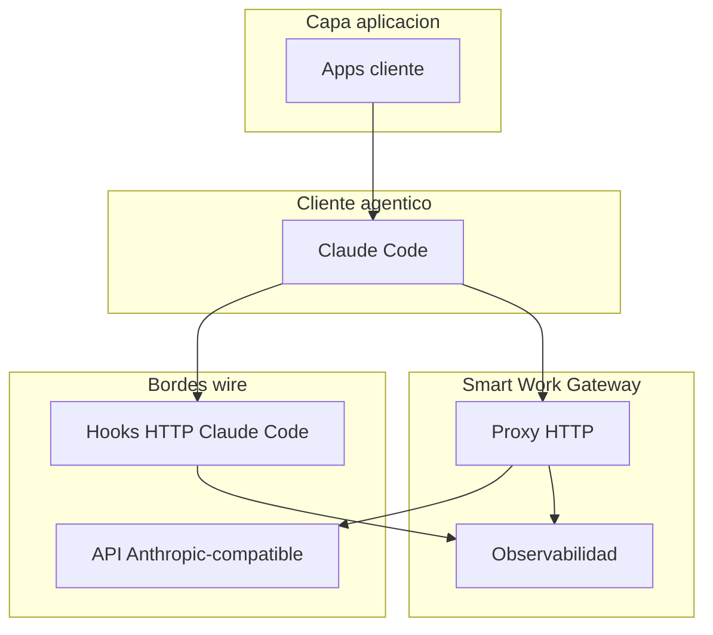

---

## 2. Glosario y definiciones canónicas

### Definiciones canónicas

> **Step:** agrupa la llamada a la API de inferencia, la respuesta del modelo, y la ejecución y resultados de las tools asociadas a esa respuesta. El Step siguiente es el que procesa los resultados de las tools del Step anterior (vía `messages` del request de inferencia).
>
> **Workflow:** agrupa la ejecución E2E desde el input del usuario hasta el Step final que contiene el mensaje de cierre del workflow.
>
> **Consumo facturado por hop:** contadores `usage` de un `POST /v1/messages`. La agregación en `WorkflowResult.usage` suma esos contadores **por categoría** entre hops; representa lo facturado en el workflow, no el tamaño único del historial (§7.7.1).

---

## 3. Mapa señal observada → entidad gateway

| Señal observada | Entidad | Origen |
|-----------------|---------|--------|
| `session_id` | **Session** | Campo común en hooks |
| `UserPromptSubmit` → `Stop` | **Workflow** (main) | Hooks lifecycle |
| `SubagentStart` → `SubagentStop` | **Workflow** (sub) | Hooks lifecycle |
| Llamada inferencia + respuesta + tools de un ciclo | **Step** | Tráfico proxied + hooks `PreToolUse` / `PostToolUse` |
| Invocación tool individual | **ToolUse** | Hooks tool + bloques en mensajes proxied |
| `request.model` | **LanguageModel** | Request proxied |
| Proveedor upstream | **Provider** | Configuración gateway |

> **LanguageModel** se usa en lugar de `Model` para no confundir con el directorio `models/` ni con el campo `model` de `IAnthropicRequest`.

---

# Parte II — Modelo de dominio

## 4. Vista de agregados

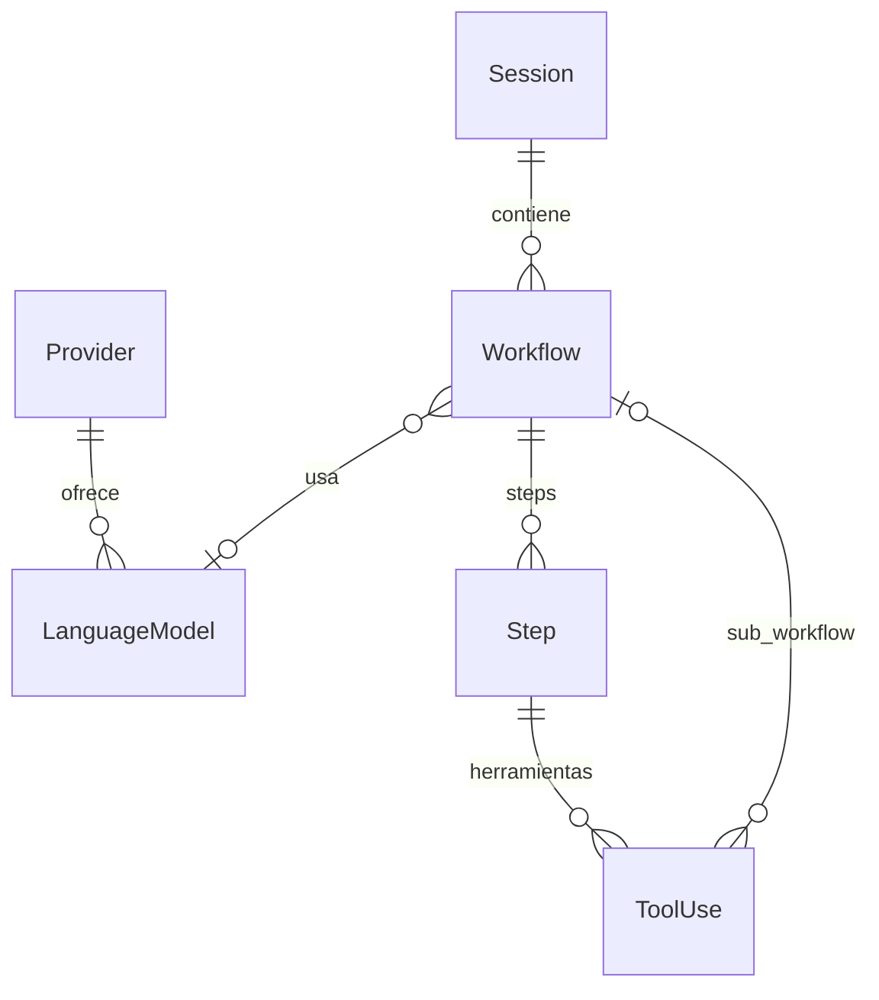

### Jerarquía de composición

```
Provider
  └── LanguageModel[]
Session (raíz de continuidad)
  └── Workflow[]
        ├── kind, agentType?, agentId?
        ├── languageModelId? (ref)
        ├── WorkflowResult? (valor al cerrar; usage? consumo facturado E2E §7.7.1; finalText? §7.8)
        └── Step[]
              ├── inferenceRequest  → IAnthropicRequest (snapshot)
              ├── assistantMessage  → IAnthropicMessage
              ├── toolUses[]        → ToolUse[]
              └── usage?, stopReason?   ← Step.usage = hop wire; agregación E2E en WorkflowResult §7.7.1
                    ToolUse
                      ├── toolUseBlock    → IAnthropicContentBlock (type: tool_use)
                      ├── toolResultBlock? → IAnthropicContentBlock (type: tool_result)
                      └── childWorkflowId? → Workflow (subagente)
```

Un **Step** no es solo una llamada HTTP aislada: incluye la fase de tools observada vía hooks. Los `tool_result` del Step N se consumen en el `inferenceRequest` del Step N+1, no como un mensaje user paralelo en el mismo Step.

---

## 5. Entidades de enrutamiento (Provider, LanguageModel)

### Provider

**Rol:** Identifica quién ejecuta la inferencia y cómo se enruta la petición proxied.

| Campo | Tipo | Notas |
|-------|------|-------|
| `id` | `string` | Identificador interno del gateway |
| `kind` | `ProviderKind` | `'anthropic' \| 'vertex' \| 'bedrock' \| 'custom'` |
| `baseUrl?` | `string` | URL base cuando no es first-party Anthropic |
| `displayName?` | `string` | Etiqueta para UI/logs |

**Invariantes:**

- `kind === 'custom'` implica `baseUrl` definido.
- No contiene secretos; credenciales viven en infraestructura.

---


---

### LanguageModel

**Rol:** Modelo LLM disponible a través de un proveedor (p. ej. `claude-sonnet-4-6`).

| Campo | Tipo | Notas |
|-------|------|-------|
| `id` | `string` | ID interno del gateway |
| `providerId` | `string` | FK lógica a `Provider` |
| `modelId` | `string` | ID enviado a la API (`IAnthropicRequest.model`) |
| `displayName?` | `string` | |
| `supportsEffort?` | `boolean` | Capacidad del proveedor/modelo |
| `supportsExtendedThinking?` | `boolean` | Opcional |

**Integración Anthropic:** `modelId` corresponde al campo `model` observado en requests proxied.

---

## 6. Session y Workflow

### Session

**Rol:** Agrupa la continuidad observada de una sesión Claude Code y el historial de workflows correlacionados.

| Campo | Tipo | Notas |
|-------|------|-------|
| `id` | `string` | ID interno del gateway |
| `externalSessionId?` | `string` | `session_id` de hooks Claude Code |
| `providerId?` | `string` | Proveedor por defecto de la sesión |
| `workflows` | `Workflow[]` | Historial de workflows observados |
| `createdAt` | `Date` | |
| `metadata?` | `Record<string, unknown>` | Proyecto, usuario, etc. |

**Eventos de sesión (no son Steps):**

| Hook | Ubicación en dominio |
|------|---------------------|
| `SessionStart` | Crear o reanudar metadata de `Session` |
| `SessionEnd` | Cierre de sesión observado |
| `PreCompact` / `PostCompact` | `SessionEvent` futuro o log de infraestructura |

**Invariantes:**

- `externalSessionId` se asigna al recibir el primer hook con `session_id`.
- Resume/fork operan sobre la misma `Session` (o rama vía metadata), no sobre un solo `Workflow`.

---


---

### Workflow

**Rol:** Intervalo de observabilidad E2E desde el input del usuario (o spawn de subagente) hasta el Step final con mensaje de cierre.

| Campo | Tipo | Notas |
|-------|------|-------|
| `id` | `string` | |
| `sessionId` | `string` | |
| `kind` | `WorkflowKind` | `'main' \| 'subagent'` |
| `agentType?` | `string` | De hook `agent_type` / `SubagentStart` |
| `agentId?` | `string` | De hook `agent_id` (subagentes) |
| `languageModelId?` | `string` | Último o dominante en Steps |
| `prompt?` | `string` | De `UserPromptSubmit.prompt` o input subagente |
| `status` | `WorkflowStatus` | Ver §18 |
| `steps` | `Step[]` | Steps correlacionados en orden |
| `result?` | `WorkflowResult` | Snapshot inmutable al cierre; ver **§7** |
| `transcriptPath?` | `string` | Referencia hook; reconciliación opcional |
| `parentWorkflowId?` | `string` | Sub-workflow |
| `parentToolUseId?` | `string` | Enlace al `ToolUse` que lo disparó |
| `startedAt` | `Date` | |
| `completedAt?` | `Date` | |

**Delimitadores (hooks):**

| Evento | Acción |
|--------|--------|
| `UserPromptSubmit` | Abre `Workflow` con `kind: 'main'` |
| `SubagentStart` | Abre `Workflow` con `kind: 'subagent'` |
| `Stop` | Cierra main si `stop_hook_active === false` y sin `background_tasks` pendientes |
| `SubagentStop` | Cierra sub-workflow |
| `StopFailure` | Cierra con `WorkflowResult.outcome: 'api_error'` |

**Cardinalidad:** `Session` 1 — * `Workflow`. Cada prompt significativo abre un workflow; reanudar sesión puede abrir un workflow nuevo.

**Invariantes:**

- `status` en `'completed' | 'failed' | 'aborted'` implica `result` definido.
- Un sub-workflow tiene `parentWorkflowId` y `parentToolUseId` obligatorios.

---

## 7. WorkflowResult


#### 7.1 Propósito

**Rol:** Value object **inmutable** adjunto a `Workflow.result` al cierre del workflow.

Responde: *¿cómo terminó la ejecución E2E del workflow?* — resultado global, texto final reportado por el orquestador, coste agregado y extensión en Steps.

- Se construye **una vez** en `Workflow.complete()` o `Workflow.fail()` al recibir un hook de cierre (`Stop`, `SubagentStop`, `StopFailure`).
- Es un **snapshot de resumen** para API, persistencia y dashboards.
- El detalle por hop de inferencia (mensajes, `stop_reason`, tools) permanece en `Workflow.steps[]`; ver **§8**.


#### 7.2 Qué no es

- **No** es un `IAnthropicResponse` agregado ni un DTO de un solo POST al modelo.
- **No** sustituye `Step.assistantMessage`, `Step.usage` ni `Step.stopReason`.
- **No** proviene del SDK Agent (`ResultMessage`); el cierre se observa vía **hooks Claude Code** + agregación de Steps.
- **`WorkflowResult.usage` no** es el `usage` del último `IAnthropicResponse` del workflow; es agregación gateway. Ver **§7.7**.
- **`WorkflowResult.usage` no** mide cardinalidad única del contexto; es consumo facturado por hop agregado. Ver **§7.7.1**.
- **`WorkflowResult.finalText` no** es `IAnthropicResponse.content` del último POST ni extracto de `Step.assistantMessage`; es passthrough de `last_assistant_message`. Ver **§7.8**.
- El `stop_reason` del modelo vive en **`Step.stopReason`** (wire Anthropic); **no** se denormaliza en `WorkflowResult`.


#### 7.3 Campos

| Campo | Tipo | Origen | Descripción |
|-------|------|--------|-------------|
| `outcome` | `WorkflowOutcome` | Hook + reglas de cierre (§7.4) | Resultado global: `'success' \| 'api_error' \| 'aborted' \| 'unknown'` |
| `finalText?` | `string` | Hook de cierre | Texto plano E2E; passthrough de `last_assistant_message` (**hook**, no StepBuffer). Fuentes primarias: `Stop`, `SubagentStop`; `StopFailure` solo si el campo viene. Ver **§7.8** |
| `usage?` | `IAnthropicUsage` | Agregación | Suma **por categoría** de `Step.usage` cerrados (+ rollup hijos). **Consumo facturado E2E** del workflow; no cardinalidad única de contexto. Ver **§7.7** y **§7.7.1**. |
| `totalCostUsd?` | `number` | Cálculo gateway | Coste estimado con tarifas propias; no viene del wire Anthropic |
| `stepCount` | `number` | Agregación | Cantidad de Steps **cerrados** al momento del cierre |
| `closedByEvent` | `WorkflowClosedByEvent` | Hook | Evento que disparó el cierre: `'Stop' \| 'SubagentStop' \| 'StopFailure'` |
| `sessionId` | `string` | Hook | `session_id` del hook de cierre |

Contrato TypeScript de referencia:

```typescript
interface WorkflowResult {
  outcome: WorkflowOutcome;
  finalText?: string;
  /** Consumo facturado por hop agregado; no tamaño único de contexto. §7.7.1 */
  usage?: IAnthropicUsage;
  totalCostUsd?: number;
  stepCount: number;
  closedByEvent: WorkflowClosedByEvent;
  sessionId: string;
}
```


#### 7.4 Derivación de outcome y reglas de cierre

| Hook / regla | `outcome` | Condiciones |
|--------------|-----------|-------------|
| `Stop` / `SubagentStop` | `'success'` | Cierre permitido (ver abajo) |
| `StopFailure` | `'api_error'` | Siempre al recibir el hook |
| `PostToolBatch` con `decision: block` | `'aborted'` | Bloqueo de batch de tools |
| Caso no clasificado | `'unknown'` | Fallback |

**Condiciones para cerrar en `Stop` / `SubagentStop`:**

- No cerrar si `stop_hook_active === true`.
- No cerrar si `background_tasks` tiene subagentes async pendientes.


#### 7.5 Construcción al cierre

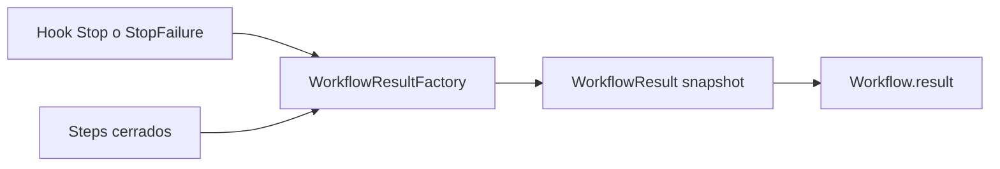

El correlador (o factory de aplicación) arma el snapshot:

```typescript
const closedSteps = workflow.steps.filter(s => s.closedAt != null);
const completedChildWorkflows = resolveCompletedChildWorkflows(workflow); // §7.7

const result: WorkflowResult = {
  outcome: deriveOutcome(hook),           // ← hook + reglas §7.4
  finalText: deriveFinalText(hook),       // ← hook; no extraer de steps (§7.8)
  closedByEvent: hook.eventName,          // ← hook
  sessionId: hook.session_id,             // ← hook
  stepCount: closedSteps.length,          // ← agregación
  usage: aggregateWorkflowUsage(closedSteps, completedChildWorkflows), // ← §7.7
  totalCostUsd: pricingService.estimate(closedSteps, completedChildWorkflows), // ← gateway
};
```

Ver también mapeo hook → dominio en **§12**, semántica de `usage` en **§7.7** / **§7.7.1** y de `finalText` en **§7.8**.


#### 7.6 Caso `StopFailure` (Step abierto o parcial)

Cuando la inferencia falla antes de consolidar un Step completo:

- El Step abierto sin `message_stop` completo **no cuenta** en `stepCount` ni en `usage`.
- `outcome: 'api_error'` refleja el fallo del workflow; **no** se inventa metadata de `stop_reason` a nivel workflow.
- Para auditar el último hop (incl. `stopReason` si existió en un Step cerrado previo), consultar `Workflow.steps[]` o logs de infraestructura.
- `finalText`: passthrough de `last_assistant_message` **solo si** el hook lo incluye; si no → `undefined`. **No** reconstruir desde Step parcial/abierto ni desde wire.
- La documentación oficial de `StopFailure` centra el evento en el **tipo de error**; no garantiza `last_assistant_message`.


#### 7.7 Semántica de `usage`

`IAnthropicUsage` es un **tipo compartido** entre wire Anthropic y dominio gateway, pero **`Step.usage` y `WorkflowResult.usage` no son la misma entidad**: distinto alcance, origen y momento de fijación.


#### 7.7.1 Semántica: facturado por hop vs cardinalidad de contexto

`WorkflowResult.usage` y la agregación a nivel **Session** (G16) representan la **suma de los contadores `usage` facturados en cada hop** (cada `POST /v1/messages` cerrado en un Step), no la cardinalidad única del historial ni el tamaño del prompt en un solo instante.

- En cada hop, `input_tokens` incluye **todo** el prompt de ese request (historial reenviado + novedades). Anthropic cobra ese hop completo.
- Sumar `input_tokens` entre Steps del mismo workflow **repite** contexto ya contado en hops anteriores; eso es **correcto para coste/consumo facturado** e **incorrecto** si se interpreta como «cuántos tokens únicos tuvo el workflow».
- Para aproximar el **tamaño del contexto en el último hop**, usar el último Step cerrado: `steps[steps.length - 1].usage` (o su `inferenceRequest`), no `WorkflowResult.usage`.

| Pregunta | Fuente recomendada |
|----------|-------------------|
| ¿Cuánto me cobraron en este workflow/turno? | `WorkflowResult.usage` (+ `totalCostUsd`) |
| ¿Cuánto midió el prompt en la última inferencia? | Último `Step.usage` / último `inferenceRequest` |
| Detalle forense por hop | `Workflow.steps[]` |

Los campos `cache_read_input_tokens` y `cache_creation_input_tokens` son **categorías de facturación** del mismo hop (ver [how-to-calculate-anthropic-api-costs.md](../how-to-calculate-anthropic-api-costs.md) §4 y skill `anthropic-api-protocol`). Al agregar entre hops, se suman **por categoría** para la ecuación de coste (§7.7, separación con `totalCostUsd`), no para un único número «tamaño del prompt». No trates `input_tokens + cache_*` agregados como cardinalidad única del contexto.

**Tabla comparativa**

| Aspecto | `Step.usage` | `WorkflowResult.usage` |
|---------|--------------|------------------------|
| Alcance | Un hop de inferencia (un POST) | Workflow E2E (consumo facturado agregado) |
| Origen | Wire: `IAnthropicResponse.usage` o StepBuffer | Agregación gateway |
| Cuándo se fija | Al cerrar el Step (`message_stop` / response sync) | Una vez en hook `Stop` / `SubagentStop` / `StopFailure` |
| Relación con Anthropic | Copia 1:1 del campo wire | **No existe** en ningún JSON de respuesta única |

**Anti-patrón**

> No usar `IAnthropicResponse.usage` del último POST como `WorkflowResult.usage`. Un workflow con tools implica N inferencias; omitir Steps anteriores subestima tokens (y coste). La agregación es una **decisión del gateway**, no un campo que venga en una sola response Anthropic.
>
> No interpretar `WorkflowResult.usage.input_tokens` como tamaño único del contexto ni como cardinalidad del historial: es la suma de `input_tokens` **facturados en cada hop**, donde cada hop reenvía el historial completo (§7.7.1).

**Ejemplo multi-Step (main workflow, sin subagente)**

| Step | `stopReason` | `usage` (ejemplo) |
|------|--------------|-------------------|
| 0 | `tool_use` | 1200 in / 80 out |
| 1 | `tool_use` | 2400 in / 120 out |
| 2 | `end_turn` | 2600 in / 200 out |

`WorkflowResult.usage` = suma aritmética de los tres (6200 in / 400 out), **no** el usage del Step 2 solo (2600 in / 200 out). Los 6200 `input_tokens` agregados son **consumo facturado acumulado** (1200+2400+2600), no el tamaño del prompt del Step 2 (2600). Omitir Steps 0–1 subestima el **coste**; usar solo el último Step no sustituye al agregado para facturación E2E.

**Reglas de agregación (`sumStepUsage` / `aggregateWorkflowUsage`)**

Especificación de dominio (sin implementación en v1):

- **Entrada Steps:** solo Steps con `closedAt` definido y `usage` presente.
- **Sumar:** `input_tokens`, `output_tokens`, `cache_creation_input_tokens`, `cache_read_input_tokens`, subcampos de `cache_creation` (si existen en algún Step).
- **Omitir en el agregado:** `service_tier`, `inference_geo` (no aditivos; permanecen en cada `Step.usage`).
- **Opcionalidad:** si ningún Step cerrado (ni hijo rollup) aporta `usage` → `WorkflowResult.usage` = `undefined` (no inventar ceros). Coherente con **§7.6**.

**Rollup de sub-workflows al padre**

Al cierre de un workflow **main**, el usage agregado incluye tokens de sub-workflows hijos completados:

```typescript
// Especificación de diseño (pseudocódigo)
aggregateWorkflowUsage(closedSteps, completedChildWorkflows) =
  sumStepUsage(closedSteps) +
  sumChildWorkflowUsage(completedChildWorkflows);
```

Donde `completedChildWorkflows` son workflows `kind: 'subagent'` enlazados vía `ToolUse.childWorkflowId` cuyo `result` ya existe al cerrar el padre.

| Entidad | Qué incluye en `usage` |
|---------|------------------------|
| Sub-workflow hijo `WorkflowResult` | Σ `Step.usage` cerrados del hijo (auditoría del subagente) |
| Main `WorkflowResult` | Σ Steps cerrados del main **+** Σ `result.usage` de hijos completados (visión E2E) |

**Ejemplo con subagente**

```text
Main workflow
├── Step 0: 1200/80
├── Step 1: 2400/120  (tool_use Agent → sub-workflow)
│     └── Sub-workflow
│           ├── Step 0: 5000/300
│           └── Step 1: 3000/150
└── Step 2: 2600/200  (end_turn)
```

| Entidad | `usage` agregado |
|---------|------------------|
| Sub-workflow `WorkflowResult` | 8000 in / 450 out |
| Main `WorkflowResult` | 6200+8000 in / 400+450 out (Steps main + rollup hijo) |

**Métricas a nivel Session**

Sumar todos los `WorkflowResult.usage` de una Session (main + sub) **contaría dos veces** los tokens del subagente (aparecen en hijo y en rollup del padre). Regla v1: **Session = Σ `WorkflowResult.usage` de workflows `kind: 'main'`** (ya incluyen rollup). Ver **G16**.

**Separación con `totalCostUsd`**

- `usage` = contadores **facturados** del wire, sumados por hop y **por categoría** (§7.7.1).
- `totalCostUsd` = cálculo gateway con tarifas propias desde los mismos Steps cerrados (+ hijos en rollup), **no** derivado únicamente del agregado final de tokens ni como `input_tokens × un solo precio`. Ver **§7.3** y **§7.5**.


#### 7.8 Semántica de `finalText`

`finalText` es un **string opcional de resumen E2E** con origen en el **orquestador** (Claude Code), no en el wire Anthropic. El gateway **observa y persiste**; en v1 **no genera ni reconstruye** texto propio.

**Tres actores**

| Actor | Qué «dice» | Canal |
|-------|------------|-------|
| **Modelo (API Anthropic)** | Bloques estructurados por hop (`text`, `tool_use`, thinking, …) | Tráfico proxied → `Step.assistantMessage` (StepBuffer / sync) |
| **Claude Code (orquestador)** | «El turno terminó; este fue el último texto assistant» | Hook `Stop` / `SubagentStop` → `last_assistant_message` |
| **Gateway** | Observa y persiste; no reescribe | `WorkflowResult.finalText` = passthrough del hook |

**Orquestador** = Claude Code: ejecuta tools, arma `messages[]`, decide cuándo un turno/workflow terminó y emite el hook de cierre. El gateway **no** cierra el workflow porque observó `stop_reason: end_turn` en el wire; cierra al recibir `Stop` / `SubagentStop` (con las reglas de **§7.4**).

Referencia normativa del campo hook: [Hooks reference — Stop / SubagentStop](https://code.claude.com/docs/en/hooks). Cita abreviada: *«The `last_assistant_message` field contains the **text content** of Claude's / the subagent's **final response**, so hooks can access it without parsing the transcript file.»*

**Tabla comparativa**

| Aspecto | `IAnthropicResponse.content` / `Step.assistantMessage` | `WorkflowResult.finalText` |
|---------|----------------------------------------------------------|----------------------------|
| Alcance | Un hop de inferencia (un Step) | Workflow E2E al cierre del turno |
| Origen | Wire proxied: StepBuffer o parse sync | Hook Claude Code (`last_assistant_message`) |
| Formato | `IAnthropicContentBlock[]` (text, tool_use, thinking, …) | `string` plano |
| Cuándo se fija | Al cerrar el Step (`message_stop` / response sync) | Una vez en hook `Stop` / `SubagentStop` (`StopFailure` solo si el campo viene) |
| Relación con Anthropic | Campo estándar de la API | **No existe** en ningún `IAnthropicResponse`; señal del orquestador |

**Anti-patrón**

> No derivar `WorkflowResult.finalText` concatenando bloques `type: 'text'` del último `IAnthropicResponse.content`, del último `Step.assistantMessage`, ni del último POST proxied. Eso ignora la señal de cierre del orquestador, mezcla hops intermedios con `tool_use` y puede distorsionar el texto que Claude Code considera «último mensaje assistant» al cerrar.

**Qué es / qué no es**

- **Es:** texto plano de la **última respuesta assistant** del ámbito que cierra el hook — `Stop` → agente main en ese turno; `SubagentStop` → subagente (`kind: 'subagent'`).
- **No es** agregado de Steps, historial concatenado, ni volcado de `content` del wire.

| No es | Por qué |
|-------|---------|
| `IAnthropicResponse.content` | Wire de **un POST**; el workflow tiene N Steps |
| Concatenación de todos los Steps | Informe inventado por el gateway |
| `tool_result` de tools | Mensajes user-side en el historial |
| Resumen del subagente en el workflow **main** | Main cierra con `Stop`; hijo con `SubagentStop` |
| Texto reconstruido desde SSE / StepBuffer | Capa wire → `Step`, no cierre E2E |

**Dónde está el detalle estructurado**

- Mensaje completo del último turno de inferencia → último Step cerrado con `stopReason === 'end_turn'` (típicamente) → `Step.assistantMessage`.
- Historial E2E de inferencias → `Workflow.steps[].assistantMessage`.

**Correlación esperada (no invariante)**

En el camino feliz (`Stop` tras Step final con `end_turn`), `finalText` y el texto visible en `assistantMessage` del último Step **suelen coincidir**. No se garantiza 1:1:

- Claude Code deriva `last_assistant_message` del **transcript interno** («text content»), no re-exporta `IAnthropicResponse.content`.
- Puede excluir bloques no-texto (`tool_use`, thinking, …) que sí están en `assistantMessage`.
- Un hook `Stop` con `decision: "block"` puede forzar más inferencias; el `last_assistant_message` definitivo es el del **Stop que realmente permitió** terminar.

**Matiz: `Stop` vs último POST**

`Stop` es **once per turn** (cadencia del hook), alineado con el **Workflow** main (`UserPromptSubmit` → `Stop`). Pero `last_assistant_message` es la **última respuesta assistant del turno**, no «el último POST que pasó por el proxy»:

- Si el último POST tuvo solo `tool_use`, el turno **continúa**; aún **no** hay `Stop`.
- `Stop` llega cuando Claude Code considera que **ya no hay más respuesta pendiente** en ese turno — típicamente tras un Step con mensaje final al usuario (`end_turn`).

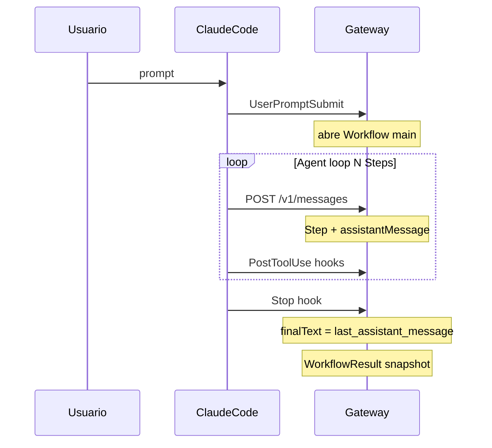

**Sub-workflows**

| Workflow | Hook de cierre | `finalText` |
|----------|----------------|-------------|
| Main (`kind: 'main'`) | `Stop` | Último texto assistant del agente main en el turno |
| Subagente (`kind: 'subagent'`) | `SubagentStop` | Último texto assistant del subagente |

El `finalText` del main **no** incluye el resumen del hijo; el padre observa el subagente vía `ToolUse` / `tool_result` en Steps propios.

**Casos límite**

| Situación | `finalText` esperado | Notas |
|-----------|---------------------|-------|
| Cierre normal (`Stop` / `SubagentStop`, reglas OK) | `last_assistant_message` del hook | Caso principal |
| Subagente completado | `last_assistant_message` de `SubagentStop` | Alcance = respuesta del hijo |
| `StopFailure` (error API) | Opcional / a menudo ausente | Passthrough si existe; ver **§7.6** |
| Hook sin `last_assistant_message` | `undefined` | Sin fallback silencioso desde Steps en v1 |
| `PostToolBatch` con `decision: block` | Puede faltar | `outcome: 'aborted'` |
| Sin hook `Stop` (stall, interrupt) | Workflow puede no cerrarse | Limitación **§23** |

**Propósito del campo**

- Resumen E2E legible: listados, dashboards, APIs («¿qué respondió Claude al usuario?»).
- **No sustituye** `Step.assistantMessage` (**G12**): auditoría forense (tools, thinking, bloques) → `Workflow.steps[]`.

**Derivación v1 (`deriveFinalText`)**

```typescript
function deriveFinalText(hook: ClosureHookPayload): string | undefined {
  const raw = hook.last_assistant_message;
  if (raw == null || raw.trim() === '') return undefined;
  return raw; // passthrough; sin join de bloques ni truncar en v1 (salvo límite de persistencia)
}
```

**Política v1**

1. **Fuente única:** `last_assistant_message` del hook que cierra (`Stop` | `SubagentStop`; `StopFailure` solo si el campo viene).
2. **Sin derivación desde wire** (anti-patrón respecto a `IAnthropicResponse.content`).
3. **Opcionalidad:** si falta → `undefined`; auditar vía `Workflow.steps[]` o `transcript_path`.
4. **Validación cruzada opcional (debug):** comparar con el último Step `end_turn` en logs, **sin** sobrescribir `finalText`.

---

## 8. Step

**Rol:** Unidad de observabilidad que agrupa inferencia, respuesta del modelo y ejecución/resultados de tools de un ciclo.

| Campo | Tipo | Origen | Notas |
|-------|------|--------|-------|
| `id` | `string` | — | |
| `workflowId` | `string` | — | |
| `index` | `number` | — | Orden 0-based en el workflow |
| `inferenceRequest` | `IAnthropicRequest` | Tráfico proxied | Snapshot al abrir el step |
| `assistantMessage` | `IAnthropicMessage` | StepBuffer / sync | Respuesta consolidada; `role: 'assistant'`. Origen: **StepBuffer** al `message_stop` si `stream: true`; parseo de `IAnthropicResponse` si sync |
| `toolUses` | `ToolUse[]` | Correlador + hooks | 0..N; solo si hubo `tool_use` en la respuesta |
| `usage?` | `IAnthropicUsage` | Wire Anthropic | Homólogo de `IAnthropicResponse.usage`: StepBuffer (`message_delta`, §15.4) o response sync. **Solo** el hop de inferencia del Step; agregación E2E → **§7.7** |
| `stopReason?` | `string` | Wire Anthropic | `tool_use`, `end_turn`, …; desde StepBuffer o response sync |
| `startedAt` | `Date` | Gateway | |
| `closedAt?` | `Date` | Gateway | |

**Ciclo de vida:**

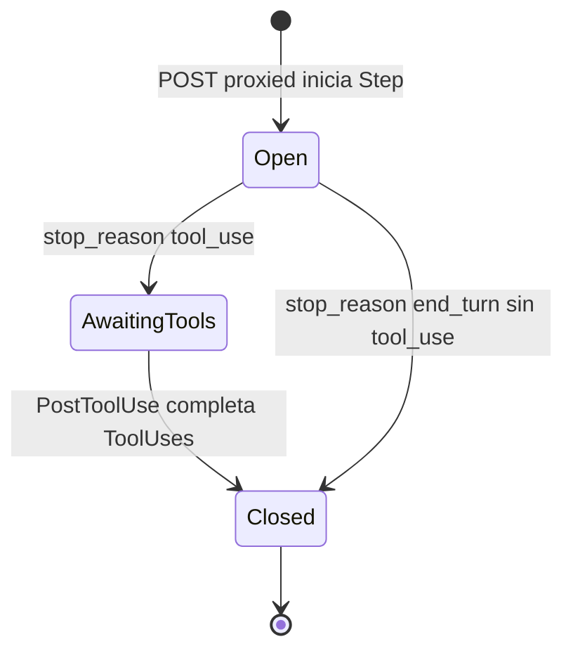

**Casos de Step:**

| Caso | `assistantMessage` | `toolUses` | Step siguiente |
|------|-------------------|------------|----------------|
| Respuesta con tools | Contiene `tool_use` | ≥ 1, completados vía hooks | Su `inferenceRequest.messages` incluye `tool_result` |
| Respuesta final del workflow | Solo texto | 0 | No hay step posterior en el mismo workflow |
| Tool Agent (subagente) | `tool_use` Agent | 1 + `childWorkflowId` | Padre continúa tras `SubagentStop` + `PostToolUse(Agent)` |
| Error API en inferencia | Parcial o ausente | 0 | Workflow → `failed` vía `StopFailure` |

**Invariantes:**

- `assistantMessage.role === 'assistant'`.
- Si `stopReason === 'tool_use'`, al cerrarse el step implica `toolUses.length >= 1`.
- Los `tool_result` del Step N aparecen en `inferenceRequest.messages` del Step N+1 (ver **G10**).
- `Step.usage` describe **solo** el hop de inferencia del Step; **no** incluye tokens de sub-workflows hijos ni de ejecución local de tools. Rollup E2E → **§7.7**.

---

## 9. ToolUse

**Rol:** Registro de observabilidad de una invocación de herramienta. Claude Code ejecuta; el gateway observa vía hooks y bloques en mensajes proxied.

| Campo | Tipo | Notas |
|-------|------|-------|
| `id` | `string` | Coincide con `id` del bloque `tool_use` / `tool_use_id` en hooks |
| `stepId` | `string` | |
| `name` | `string` | Nombre de herramienta (`Bash`, `Read`, `Agent`, …) |
| `arguments` | `unknown` | `input` del bloque `tool_use` |
| `status` | `ToolUseStatus` | `'pending' \| 'running' \| 'completed' \| 'rejected' \| 'error'` |
| `toolUseBlock` | `IAnthropicContentBlock` | `type: 'tool_use'` |
| `toolResultBlock?` | `IAnthropicContentBlock` | `type: 'tool_result'` |
| `childWorkflowId?` | `string` | Solo si `name === 'Agent'` (subagente) |
| `startedAt?` | `Date` | |
| `completedAt?` | `Date` | |

**Integración Anthropic:**

```text
tool_use    → toolUseBlock     (id, name, input)
tool_result → toolResultBlock  (tool_use_id, content, is_error)
```

**Fuentes de observabilidad:**

- Bloques extraídos de `assistantMessage` del Step.
- Hooks `PreToolUse`, `PostToolUse`, `PostToolUseFailure` enriquecen estado y timing.

**Invariantes:**

- `toolResultBlock.tool_use_id === id` cuando hay resultado.
- `childWorkflowId` solo si se correlacionó un sub-workflow vía `SubagentStart`.
- Rechazo por hooks → `status: 'rejected'` y resultado sintético en `toolResultBlock` con `is_error: true`.

---

## 10. Invariantes globales

| # | Regla |
|---|--------|
| G1 | Todo `Workflow` pertenece a exactamente una `Session`. |
| G2 | Todo `Step` pertenece a exactamente un `Workflow`. |
| G3 | Todo `ToolUse` pertenece a exactamente un `Step`. |
| G4 | `LanguageModel.providerId` debe existir en el registro de proveedores conocido (validación en aplicación). |
| G5 | Un sub-workflow tiene `parentWorkflowId` y `parentToolUseId` obligatorios. |
| G6 | No hay ciclos en la cadena de sub-workflows. |
| G7 | Mensajes y bloques en Steps/ToolUses usan únicamente tipos Anthropic ya definidos. |
| G8 | El dominio gateway no contiene colecciones persistidas de `AnthropicSseEvent`; ver **§15**. |
| G9 | Step con `stopReason === 'tool_use'` implica `toolUses.length >= 1` al cerrarse. |
| G10 | Los `tool_result` del Step N aparecen en `inferenceRequest.messages` del Step N+1, no como campo separado en Step N. |
| G11 | StepBuffer no persiste eventos SSE; solo el correlador persiste el Step al cerrarlo. Ver **§15**. |
| G12 | `WorkflowResult` no contiene campos duplicados de un solo Step (`stopReason`, `assistantMessage`, etc.); eso permanece en `Step`. Ver **§7.2**. |
| G13 | `stepCount` y `usage` en `WorkflowResult` consideran solo Steps con `closedAt` definido (más rollup de hijos en main). Ver **§7.3**, **§7.7** y **§7.7.1**. |
| G14 | `WorkflowResult.usage` no debe derivarse del `usage` de un único POST; es agregación gateway por hop. No debe interpretarse como cardinalidad única del contexto. Ver **§7.7** y **§7.7.1**. |
| G15 | `WorkflowResult.usage` de un workflow **main** incluye rollup de sub-workflows completados enlazados por `ToolUse.childWorkflowId`. Ver **§7.7**. |
| G16 | Métricas a nivel **Session** suman solo `WorkflowResult.usage` de workflows `kind: 'main'` (evitar doble conteo padre/hijo). Consumo facturado acumulado, no cardinalidad de contexto. Ver **§7.7** y **§7.7.1**. |
| G17 | `WorkflowResult.finalText` no debe derivarse de `IAnthropicResponse.content` ni de `Step.assistantMessage`; proviene del hook (`last_assistant_message`). Ver **§7.8**. |

---

# Parte III — Comportamiento en runtime

## 11. Correlación de eventos

El **correlador** (infraestructura, no entidad de dominio) une tráfico proxied y hooks en agregados gateway.

| Clave | Uso |
|-------|-----|
| `session_id` | Agrupa `Session` y workflows activos |
| Ventana temporal | Requests proxied entre `UserPromptSubmit` y `Stop` → mismo workflow main activo |
| `agent_id` | Sub-workflows |
| `tool_use_id` | Enlaza `PreToolUse` ↔ `PostToolUse` ↔ `ToolUse.id` |
| Orden de llegada | Desempate cuando falte `session_id` en request HTTP (header/metadata futuro) |

Estado en memoria sugerido:

| Estado | Responsable |
|--------|-------------|
| `activeWorkflowBySession` | Correlador |
| `openStepBySession` | Correlador |
| `pendingToolUses` | Correlador |
| `stepBufferByRequestId` | StepBuffer (una instancia por POST stream activo) |

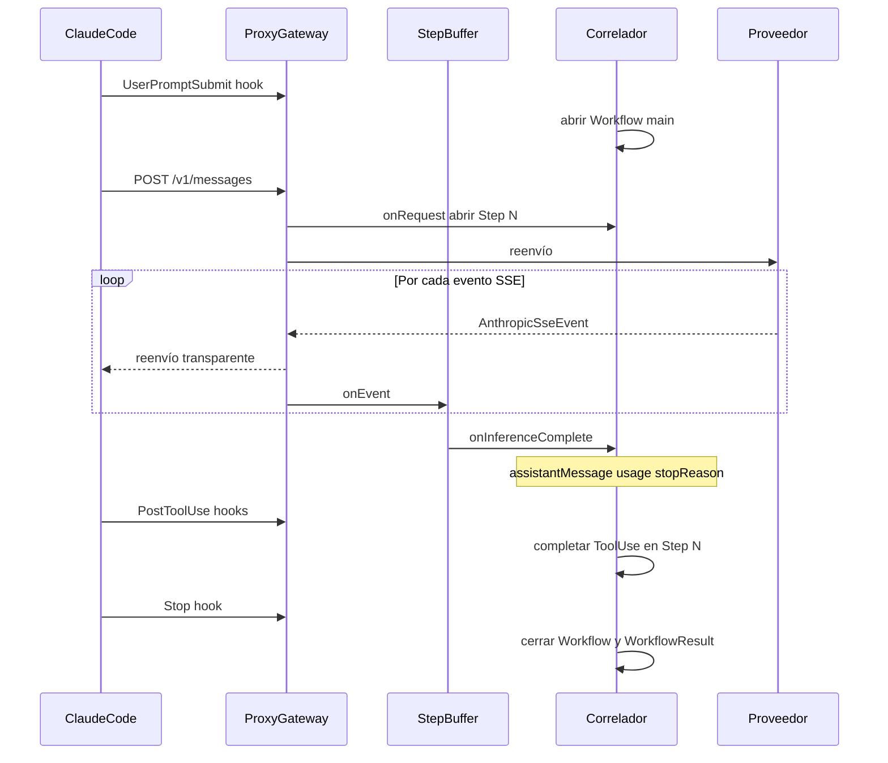

Flujo detallado del stream, StepBuffer y momento de persistencia: **§15.5**.

---

## 12. Hooks → acciones de dominio

Referencia normativa: [Hooks reference](https://code.claude.com/docs/en/hooks).

| Hook | Mutación dominio |
|------|------------------|
| `SessionStart` / `SessionEnd` | Crear/cerrar metadata `Session` |
| `UserPromptSubmit` | `Session.addWorkflow({ kind: 'main' })` |
| `SubagentStart` | Workflow sub + link desde `ToolUse` padre |
| `PreToolUse` | `ToolUse.status = running` |
| `PostToolUse` | Completar `ToolUse`; si `Agent`, enriquecer metadata del `ToolUse` (el usage del subagente proviene de los Steps del sub-workflow, no del Step padre) |
| `PostToolUseFailure` | `ToolUse.status = error` |
| `Stop` / `SubagentStop` | `Workflow.complete(WorkflowResult)` |
| `StopFailure` | `Workflow.fail(...)` con `outcome: 'api_error'` |

> **`WorkflowResult` desde hooks:** al cerrar, el correlador construye el snapshot (§7.5). Del hook provienen `closedByEvent`, `sessionId`, `finalText` (`last_assistant_message` — voz del orquestador; **no** derivar de wire; ver **§7.8**) y la base para `outcome`. De Steps **cerrados** provienen `stepCount` y la base de `usage` (consumo facturado por hop; semántica §7.7.1); el rollup de sub-workflows al padre se aplica en `aggregateWorkflowUsage` (§7.7). `totalCostUsd` es cálculo gateway.

> **`finalText` y subagentes:** el `finalText` del workflow **main** proviene del hook `Stop` (texto final del agente main). El del sub-workflow hijo proviene de `SubagentStop` (texto final del subagente). El resumen del hijo **no** se denormaliza en el `finalText` del padre; el padre lo observa vía `ToolUse` / `tool_result` en sus Steps. Ver **§7.8**.

> **`PostToolUse` y subagentes:** el usage del subagente se observa en los POST proxied del **sub-workflow** (Steps del hijo). El hook `PostToolUse(Agent)` puede enriquecer metadata del `ToolUse`, pero **no sustituye** esa agregación. El rollup al workflow **main** ocurre al cierre del padre, no en `Step.usage` individual. Ver **§7.7**.

> **`PostToolUse` y el StepBuffer:** los hooks de tools operan **después** de que StepBuffer entregó `assistantMessage` al correlador en `message_stop`. Los hooks no sustituyen al StepBuffer; completan la fase de ejecución de tools del Step ya abierto.

---

## 13. Flujo proxy HTTP

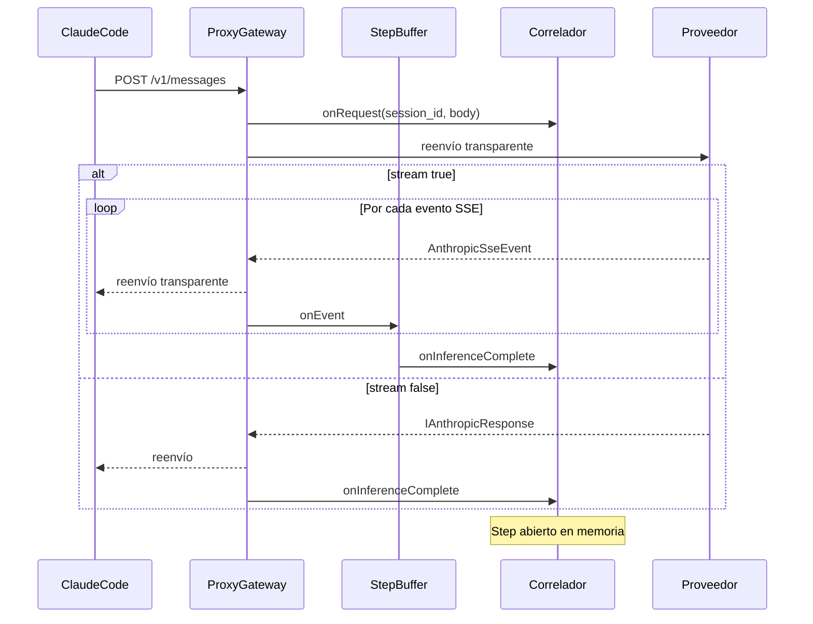

El gateway **no construye** el historial de mensajes desde Steps. Claude Code arma `messages[]`; el gateway **observa** snapshots en cada Step vía **StepBuffer** (streaming) o parseo directo (sync) + **correlador**. La proyección Step N → Step N+1 ocurre en el cliente, no en el proxy.

---

## 14. Subagentes

Cuando `ToolUse.name === 'Agent'`:

1. `PostToolUse(Agent)` + `SubagentStart` → **Workflow** hijo (`kind: 'subagent'`, `agentType`, `agentId`).
2. El hijo se delimita por `SubagentStop`, no por `Stop` del padre.
3. Al completar, el resumen se observa como `tool_result` del `ToolUse` padre (siguiente Step del padre o hook).
4. `agent_transcript_path` del hook como referencia externa opcional.

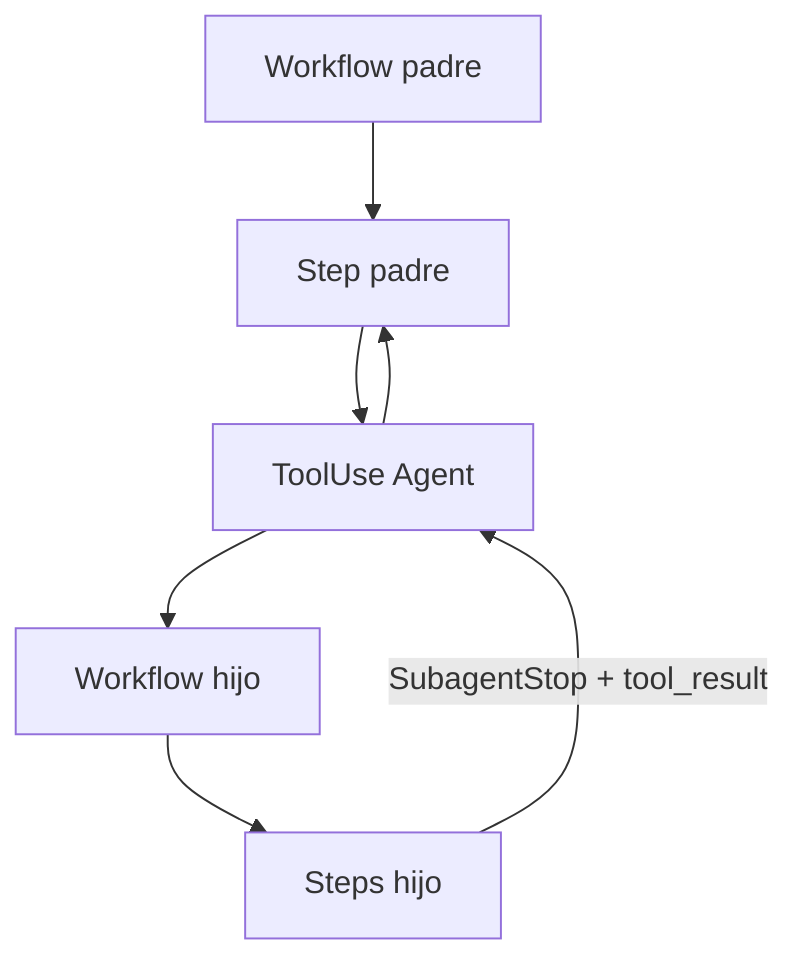

---

## 15. Streaming SSE y StepBuffer

El dominio Anthropic ya define tipos para eventos SSE (`IAnthropicSse*` en `src/1. domain/interfaces/anthropic/ISseEvents.ts`, unión `AnthropicSseEvent` en `src/1. domain/types/anthropic/SseEvent.ts`). El dominio gateway no define una entidad equivalente por cada evento del stream.


#### 15.1 Problema

Con `stream: true`, la API devuelve una **secuencia** de eventos SSE. Un Step puede implicar decenas o cientos de `content_block_delta`. El dominio gateway modela **ciclos de observabilidad** (`Step`, `ToolUse`), no el protocolo HTTP de transporte.

Para obtener `Step.assistantMessage` completo (texto, `tool_use`, thinking, etc.) hace falta **ensamblar** esos trozos en memoria. Ese ensamblaje es responsabilidad del **StepBuffer** (infraestructura), no de entidades de dominio.

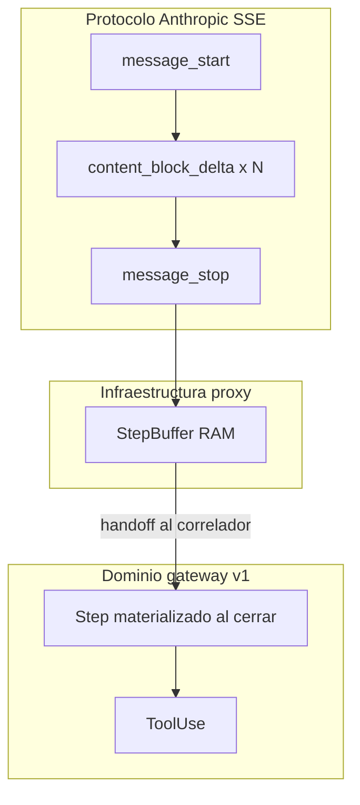


#### 15.2 Alternativa considerada (rechazada)

| Enfoque | Descripción | Motivo de rechazo en v1 |
|---------|-------------|-------------------------|
| **Event store SSE** | `Workflow.streamEvents: AnthropicSseEvent[]` persistido | Redundante con el Step final; alto volumen |
| **Entidad por tipo** | Modelos gateway por cada evento delta | Duplica `IAnthropicSse*`; sin valor de negocio |


#### 15.3 Decisión adoptada

> **Los eventos SSE Anthropic se tipan y parsean en el borde, se ensamblan en RAM mediante StepBuffer durante cada inferencia con `stream: true`, y solo se persisten snapshots de dominio (`Step`, `ToolUse`, `WorkflowResult`) al cerrarse un Step o un workflow. No se persisten deltas SSE (`content_block_delta`, etc.). El reenvío transparente al cliente y el StepBuffer operan en paralelo y son obligatorios en streaming.**

| Artefacto | Capa | ¿Persiste? |
|-----------|------|------------|
| `AnthropicSseEvent` / `IAnthropicSse*` | Tipado borde | No como entidad; solo contrato de parseo |
| **StepBuffer** | Infraestructura proxy | No (RAM efímera por inferencia) |
| **Correlador** | Infraestructura | No (estado en memoria de Steps abiertos) |
| `Step`, `ToolUse`, `WorkflowResult` | Dominio gateway | Sí (snapshot al cerrar Step o workflow) |
| Stream hacia Claude Code | Proxy | Efímero; reenvío transparente |


#### 15.4 StepBuffer

**StepBuffer** no es una entidad de dominio (`Step`, `Workflow`, etc.). Es un **componente de infraestructura** (memoria RAM, efímera) en el borde HTTP/SSE del proxy.

**Propósito único:** reconstruir una respuesta de inferencia completa a partir de un stream SSE, evento por evento. Convierte:

```text
message_start + content_block_* + message_delta + message_stop
```

en objetos usables por el correlador:

```text
assistantMessage : IAnthropicMessage
usage?           : IAnthropicUsage
stopReason?      : string
```

En `message_stop`, StepBuffer notifica al **correlador** (`onInferenceComplete`) y **descarta** su RAM. No persiste deltas.

| Evento SSE | Acción StepBuffer |
|------------|-------------------|
| `message_start` | Inicializar buffer |
| `content_block_start` / `content_block_delta` / `content_block_stop` | Acumular bloques parciales |
| `message_delta` | Capturar `stop_reason`, `usage` |
| `message_stop` | Ensamblar `IAnthropicMessage`; handoff al correlador |
| `ping` | Ignorar |

| StepBuffer **sí** | StepBuffer **no** |
|-------------------|-------------------|
| Ensambla la **respuesta del modelo** de **un** POST | Ejecuta tools |
| Trabaja solo durante **una** inferencia (un stream) | Agrupa tools con inferencia (eso es el **correlador**) |
| Vive en RAM hasta `message_stop` | Persiste deltas en BD |
| Parsea SSE Anthropic | Recibe `tool_result` (vienen después, vía hooks o en el **siguiente** POST) |

**Analogía:**

- **Proxy transparente** = tubería: el stream pasa tal cual hacia Claude Code.
- **StepBuffer** = grabadora interna: anota en un borrador hasta tener la respuesta completa del modelo.
- **Correlador** = archivador: une esa respuesta con tools (hooks) y persiste el **Step** al cerrarlo.

**Caso `stream: false`:** no hay deltas SSE. El proveedor devuelve un `IAnthropicResponse` ya completo; el proxy lo parsea una vez y entrega al correlador. No hace falta StepBuffer SSE. Correlador y hooks operan igual para tools.

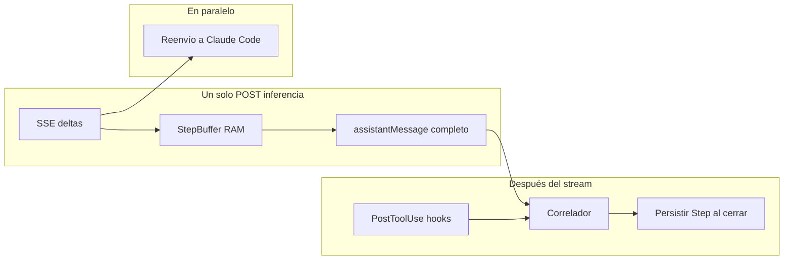


#### 15.5 Flujo completo de inferencia

Diagrama E2E de correlación: ver **§11**.

Por cada POST con `stream: true` que abre el Step N:

1. Claude Code → Gateway: `POST /v1/messages`. Correlador abre Step N y guarda snapshot de `inferenceRequest`.
2. Proveedor → Gateway: stream SSE. **Por cada evento, en paralelo:**
   - Gateway → Claude Code: reenvío transparente (obligatorio).
   - Gateway → StepBuffer: `onEvent(evento)` (obligatorio en streaming).
3. StepBuffer internamente (RAM): acumula bloques; en `message_stop` produce `assistantMessage`, `usage`, `stopReason`.
4. Al `message_stop`: StepBuffer → Correlador. Correlador asigna campos al Step N abierto y crea `ToolUse` pending desde bloques `tool_use`. StepBuffer descarta RAM.
5. Claude Code ejecuta tools (fuera del StepBuffer). Hooks `PostToolUse` → Correlador completa `ToolUse` en Step N.
6. Correlador cierra Step N cuando `stopReason === 'end_turn'` **o** todos los `ToolUse` están completados, y **persiste** el snapshot completo (sin haber persistido ningún `content_block_delta`).

**Timing de persistencia:**

```text
message_stop  → StepBuffer descarta RAM; correlador retiene Step abierto en memoria
Step cerrado  → persistir Step completo (assistantMessage + toolUses[])
```

Si `stopReason === 'tool_use'`, el Step **no** se persiste en `message_stop`; permanece abierto hasta que los hooks completen las tools.

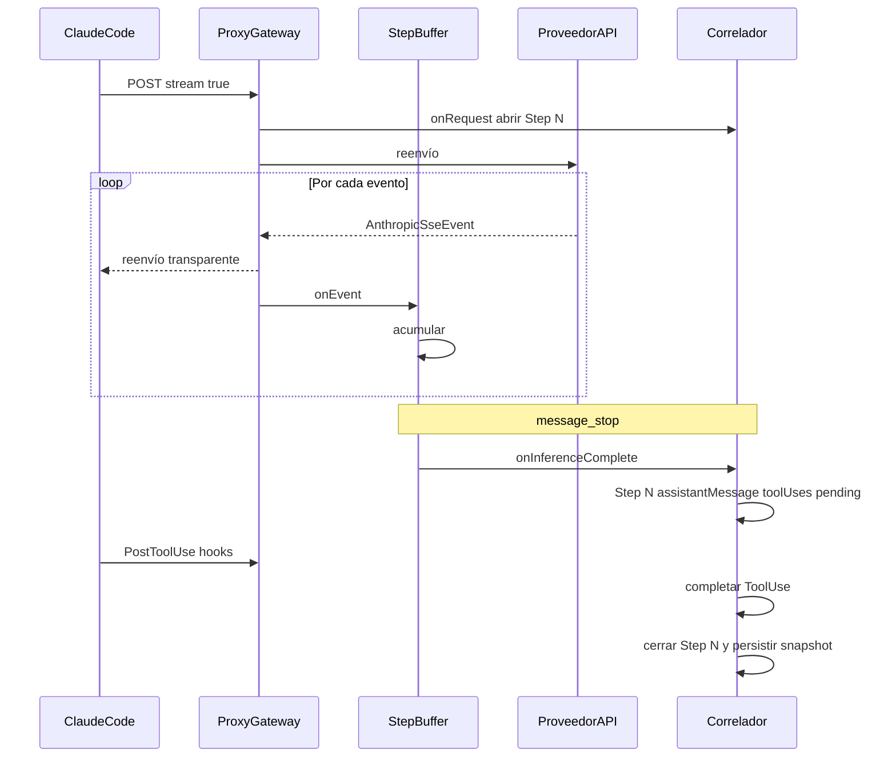


#### 15.6 Salida hacia el cliente

La estrategia de **salida hacia Claude Code** es ortogonal al StepBuffer interno: el proxy puede reenviar eventos Anthropic **y** ensamblar en StepBuffer al mismo tiempo.

| Estrategia | Qué ve el cliente | Cuándo usarla |
|------------|-------------------|---------------|
| **Proxy transparente** (v1) | Eventos Anthropic reenviados | Cliente compatible con protocolo Anthropic |
| **Eventos de dominio** | `text.delta`, `tool.started`, etc. | UI de producto; abstracción multi-proveedor (futuro) |
| **Solo resultado** | Sin stream; datos al cerrar workflow | Clientes simples (futuro) |


#### 15.7 Implicaciones y tradeoffs

**Beneficios:**

- Persistencia O(steps × tools), no O(eventos SSE).
- Agregados estables alineados al modelo de observabilidad propio.
- Separación clara: transporte Anthropic (reenvío) vs ensamblaje (StepBuffer) vs agregación (correlador).

**Costes / limitaciones:**

- Caída del proceso mid-step: se pierde progreso parcial no consolidado (StepBuffer en RAM).
- Sin reconstrucción forense del stream desde base de datos.
- Debugging de streaming requiere logs de infraestructura.


#### 15.8 Relación con tipos existentes

- `AnthropicSseEvent` sigue siendo la unión de parseo en borde.
- Interfaces `IAnthropicSse*` las consume el adaptador proxy y el **StepBuffer**; no se persisten como campos de `Workflow` o `Session`.
- Coherente con **G7**, **G8** y **G11**.

---

# Parte IV — Integración con tipos Anthropic

## 16. Composición, no duplicación

Las entidades del gateway **referencian** DTOs Anthropic; no redefinen mensajes ni bloques.

| Concepto gateway | Tipo Anthropic reutilizado |
|------------------|---------------------------|
| Request en Step | `IAnthropicRequest` |
| Mensaje en Step | `IAnthropicMessage` |
| Texto assistant (por hop) | `IAnthropicMessage` en `Step.assistantMessage` — origen wire / StepBuffer |
| Bloques en respuesta sync | `IAnthropicContentBlock[]` en `IAnthropicResponse.content` |
| Texto final E2E (resumen) | `string` en `WorkflowResult.finalText` — origen hook; ver **§7.8** |
| Bloques en ToolUse | `IAnthropicContentBlock` |
| Uso de tokens (por hop) | `IAnthropicUsage` en `Step.usage` |
| Uso de tokens (consumo facturado del workflow) | `IAnthropicUsage` en `WorkflowResult.usage` — misma forma, suma por hop; ver **§7.7** y **§7.7.1** |
| Respuesta síncrona | `IAnthropicResponse` / clase `Response` |
| Streaming SSE | `AnthropicSseEvent` + interfaces `IAnthropicSse*` |
| Roles y tipos de bloque | `AnthropicRole`, `AnthropicBlockType` |

> **Streaming SSE:** los tipos existen para parseo en el borde; no se persisten como agregados gateway. Ver **§15**.

---

## 17. Mapeo ToolUse ↔ bloques

| Fase | Bloque Anthropic | Campo ToolUse |
|------|------------------|---------------|
| Solicitud | `type: 'tool_use'` | `toolUseBlock`, `arguments` ← `input` |
| Resultado | `type: 'tool_result'` | `toolResultBlock`, `tool_use_id` |
| Error / denegado | `tool_result` + `is_error: true` | `status: 'rejected' \| 'error'` |

Los bloques se extraen de `assistantMessage` del Step; los hooks enriquecen `ToolUse` cuando aportan detalle adicional (timing, rechazos).

---

# Parte V — Guía de implementación

## 18. Tipos primitivos (`types/gateway/`)

Propuesta de literales sin comportamiento (carpeta nueva, espejo de `types/anthropic/`):

```typescript
// ProviderKind
type ProviderKind = 'anthropic' | 'vertex' | 'bedrock' | 'custom';

// WorkflowKind
type WorkflowKind = 'main' | 'subagent';

// WorkflowStatus
type WorkflowStatus =
  | 'pending'
  | 'running'
  | 'completed'
  | 'failed'
  | 'aborted';

// WorkflowOutcome
type WorkflowOutcome = 'success' | 'api_error' | 'aborted' | 'unknown';

// WorkflowClosedByEvent
type WorkflowClosedByEvent = 'Stop' | 'SubagentStop' | 'StopFailure';

// ToolUseStatus
type ToolUseStatus =
  | 'pending'
  | 'running'
  | 'completed'
  | 'rejected'
  | 'error';
```

---

## 19. Interfaces DTO (`interfaces/gateway/`)

Contratos planos para persistencia, API REST del gateway o eventos. Sin lógica.

| Interfaz | Propósito |
|----------|-----------|
| `IProvider` | Snapshot de Provider |
| `ILanguageModel` | Snapshot de LanguageModel |
| `ISession` | Session serializable |
| `IWorkflow` | Workflow serializable |
| `IStep` | Step serializable |
| `IToolUse` | ToolUse serializable |
| `IWorkflowResult` | Resultado final |

Las clases en `models/gateway/` implementan estas interfaces (mismo patrón que `Request` / `Response` con Anthropic).

---

## 20. Clases de dominio (`models/gateway/`)

| Clase | Implementa | Comportamiento inicial sugerido |
|-------|------------|--------------------------------|
| `Provider` | `IProvider` | Validación de `kind` / `baseUrl` |
| `LanguageModel` | `ILanguageModel` | `toModelId(): string` |
| `Session` | `ISession` | `addWorkflow()`, `getActiveWorkflow()` |
| `Workflow` | `IWorkflow` | `addStep()`, `complete(result)`, `isSubWorkflow()` |
| `Step` | `IStep` | `hasToolCalls()`, `isTerminal()` |
| `ToolUse` | `IToolUse` | `markRunning()`, `complete(result)`, `isSubagent()` |

**Exportaciones:** ampliar `models/index.ts` con reexports de gateway y mantener Anthropic separado.

---

## 21. Dependencias entre capas

```text
types/anthropic          types/gateway
       \                      /
        \                    /
    interfaces/anthropic    interfaces/gateway
                \          /
                 models/anthropic (Request, Response)
                 models/gateway  (Session, Workflow, …)
```

**Reglas:**

1. `interfaces/gateway` puede importar `interfaces/anthropic` y `types/*`.
2. `models/gateway` importa `interfaces/gateway` y, si hace falta, tipos Anthropic para mensajes.
3. `interfaces/anthropic` **no** importa entidades gateway.
4. `ToolUse` y `Step` nunca duplican la forma de `IAnthropicContentBlock`; solo la referencian.

---

## 22. Estructura de archivos propuesta

```text
src/1. domain/
├── types/
│   ├── anthropic/          # existente
│   └── gateway/
│       ├── ProviderKind.ts
│       ├── WorkflowKind.ts
│       ├── WorkflowStatus.ts
│       ├── WorkflowOutcome.ts
│       ├── WorkflowClosedByEvent.ts
│       └── ToolUseStatus.ts
├── interfaces/
│   ├── anthropic/          # existente
│   └── gateway/
│       ├── IProvider.ts
│       ├── ILanguageModel.ts
│       ├── ISession.ts
│       ├── IWorkflow.ts
│       ├── IStep.ts
│       ├── IToolUse.ts
│       └── IWorkflowResult.ts   # finalText? hook; usage? consumo facturado; ver §7.7–§7.8, §7.7.1
├── models/
│   ├── Request.ts          # Anthropic — existente
│   ├── Response.ts         # existente
│   └── gateway/
│       ├── Provider.ts
│       ├── LanguageModel.ts
│       ├── Session.ts
│       ├── Workflow.ts
│       ├── Step.ts
│       └── ToolUse.ts
└── README.md               # actualizar con namespace gateway
```

---

# Parte VI — Alcance y cierre

## 23. Fuera de alcance (v1)

| Tema | Tratamiento |
|------|-------------|
| Bibliotecas cliente de aplicación (capa superior) | Fuera del dominio gateway |
| Eventos SSE delta (`IAnthropicSse*`) | Tipado en borde + ensamblaje StepBuffer; ver **§15** |
| Hooks no disparados en algunos límites de sesión | Limitación documentada; fallback vía `transcript_path` |
| Silent stall sin hook `Stop` | Limitación; timeout/heartbeat en infraestructura |
| Skills, MCP, CLAUDE.md | Metadata de `Session`; no entidades v1 |
| Configuración hooks HTTP | Doc operativa separada (`.claude/settings.json`) |

---

## 24. Resumen ejecutivo

El diseño refinado:

- Define el gateway como **proxy transparente** con **observabilidad correlacionada** (tráfico HTTP + hooks Claude Code).
- Usa **Step** como ciclo inferencia + tools, y **Workflow** como ejecución E2E desde input de usuario hasta mensaje final.
- Integra mensajes y tokens vía **tipos Anthropic existentes**, evitando duplicación. `IAnthropicUsage` tiene **semántica dual**: hop wire en `Step.usage`, consumo facturado E2E (+ rollup subagentes en main) en `WorkflowResult.usage` (§7.7, §7.7.1). `finalText` es **passthrough del orquestador** (hook); el wire estructurado queda en `Step.assistantMessage` (§7.8).
- Modela **subagentes** como workflows hijos (`kind: 'subagent'`) enlazados desde `ToolUse`.
- Cierra cada workflow con **WorkflowResult**: snapshot E2E inmutable (hooks + agregación de Steps cerrados), sin metadata de inferencia por hop; ver **§7**.
- Trata streaming SSE con **reenvío transparente, StepBuffer obligatorio en streaming, y persistencia solo en Steps cerrados** (§15).
- Respeta la convención de carpetas `types` / `interfaces` / `models` del dominio actual.

Este documento es la referencia para la implementación posterior de interfaces y clases en `src/1. domain`.
