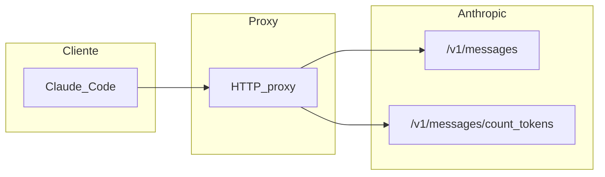

# Interacción, patrones API y campos `usage`

Índice: [§2 Dos niveles](#2-qué-es-una-interacción-dos-niveles) · [§3 Patrones](#3-tipos-de-interacción-claude-code--api) · [§4 usage](#4-estructura-de-usage-en-la-respuesta)

---

## 2. Qué es una “interacción” (dos niveles)

### 2.1 Interacción de auditoría (proxy)

Cada **turno lógico** que el proxy gestiona genera un directorio de auditoría:

```text
sessions/<session-id>/interactions/NNNNNN_<uuid>/
```

- `NNNNNN` es el orden dentro de la sesión, coherente con `interaction-sequence.json` en la raíz de la sesión.
- Una interacción puede contener **múltiples steps** (llamadas HTTP) agrupados bajo `steps/`.
- `meta.json` es de tipo `TurnMetadata`: describe `interactionType` (`agentic-turn` o `client-preflight`), `steps[]` con metadatos por step, y `totals` con tokens agregados.

Eso es una **interacción de turno** única: una fila en el historial de auditoría. Para la jerarquía de archivos y estructura completa, usar la skill **smart-code-proxy**.

### 2.2 Interacción con coste de modelo (facturación por tokens)

Para estimar **dinero**, la unidad útil es una llamada que produce **uso de tokens** según la tabla de precios de Anthropic:

| Ruta | ¿Aplica ecuación de coste por tokens? |
|------|----------------------------------------|
| `POST /v1/messages` (streaming o no) | **Sí.** Usar el objeto `usage` del mensaje de respuesta. |
| `POST /v1/messages/count_tokens` | **No** (según la documentación actual: el conteo es [gratis](https://platform.claude.com/docs/en/build-with-claude/token-counting), con límites RPM por tier). |

Las llamadas **auxiliares** a Messages (por ejemplo `max_tokens: 1` para comprobaciones) siguen siendo **Messages**: generan `usage` y entran en el cálculo.

En las sesiones de Claude Code suele aparecer el query `?beta=true` (API beta); **no cambia** la lógica de `usage` ni la ecuación: la ruta sigue siendo `POST /v1/messages` o `POST /v1/messages/count_tokens`.

---

## 3. Tipos de interacción (Claude Code → API)

| Patrón en `meta.json` | Rol típico |
|------------------------|------------|
| `url` con `/v1/messages`, `sse: true` | Turnos del agente con **streaming (SSE)**. El `usage` forma parte del mensaje final del stream (p. ej. evento que completa el mensaje). En auditoría: `response.sse.jsonl` siempre; `response.body.formatted.json` solo si el proxy reconstruye el cuerpo (`AUDIT_SSE_RESPONSE_BODY` y reconstrucción correcta; ver `sseResponseBodyWritten` en `meta.json`). |
| `url` con `/v1/messages`, `sse: false` | Respuesta JSON única; `usage` en el cuerpo (`response.body.json` / `response.body.formatted.json`). Ejemplo: llamadas pequeñas de comprobación. |
| `url` con `/v1/messages/count_tokens` | **Conteo de tokens** previo a enviar un mensaje grande; la respuesta suele ser solo un número de `input_tokens` — no facturable como generación en la política actual. |

Cada respuesta **completada** de `POST /v1/messages` incluye **un** objeto `usage` asociado a ese id de mensaje asistente: **una** estimación de coste con la ecuación de [equation-loading-and-geo.md](equation-loading-and-geo.md) por petición. Un turno de conversación con herramientas puede implicar **varias** peticiones seguidas (cada una con su propio `usage`); suma los costes por petición. Los **reintentos** HTTP duplican peticiones en auditoría: si ambas completan, tendrás dos costes (salvo que dedupliques por lógica de negocio).



---

## 4. Estructura de `usage` en la respuesta

En el mensaje final (JSON o reconstruido desde SSE), el objeto `usage` desglosa **entrada** en componentes que se facturan por separado cuando hay [prompt caching](https://platform.claude.com/docs/en/build-with-claude/prompt-caching). **No** existe un desglose de “output en caché”: el caché explícito es **solo sobre el prompt de entrada**.

| Campo API | Significado |
|-----------|-------------|
| `input_tokens` | Tokens de entrada facturados a la tarifa **estándar de entrada** para ese tramo del prompt (lo que en pricing aparece como “Base Input”). Es independiente de las líneas de **escritura** y **lectura** de caché: no es “todo el prompt en un solo número”, sino la parte que la API contabiliza en esta categoría. |
| `cache_creation_input_tokens` | Total de tokens de **escritura** en caché en esa respuesta. Debe ser coherente con el desglose 5m/1h cuando ambos están presentes. |
| `cache_read_input_tokens` | Tokens de **lectura** desde caché (hits / refreshes), facturados a la tarifa de “Cache Hits & Refreshes”. |
| `cache_creation.ephemeral_5m_input_tokens` | Tokens de escritura en caché con TTL **5 minutos** (tarifa “5m Cache Writes”). |
| `cache_creation.ephemeral_1h_input_tokens` | Tokens de escritura en caché con TTL **1 hora** (tarifa “1h Cache Writes”). |
| `output_tokens` | Tokens **generados** en la respuesta del asistente. Lo que Anthropic acumule aquí depende del modelo y del producto (p. ej. texto, bloques `tool_use`, y —si el modelo lo reporta en el mismo contador— razonamiento extendido). Para **estimar coste** con el JSON de esta guía basta una tarifa única `costs.output` sobre `output_tokens`; si en el futuro la API expusiera desgloses de salida con precios distintos, habría que extender el esquema. |
| `service_tier` | Información de tier (p. ej. `standard`). |
| `inference_geo` | Restricción o disponibilidad de enrutamiento geográfico (p. ej. `not_available`). Si la petición usa residencia de datos solo en EE. UU. y el modelo está sujeto al recargo documentado, puede aplicarse un multiplicador global sobre todos los precios por token (ver [equation-loading-and-geo.md](equation-loading-and-geo.md), §7.1). |

**Coherencia entre totales:** en condiciones normales,

`cache_creation_input_tokens` ≈ `cache_creation.ephemeral_5m_input_tokens` + `cache_creation.ephemeral_1h_input_tokens`.

Para el cálculo económico, **prioriza el desglose 5m/1h** cuando exista: permite aplicar dos precios de escritura distintos. Si hubiera discrepancia puntual entre el total y la suma 5m+1h (versiones de API, bugs o snapshots antiguos), define una política en tu herramienta (p. ej. usar solo los desgloses 5m/1h y omitir el total, o viceversa) y documenta la elección.

**Sin prompt caching:** muchos campos de caché van a **0**; la ecuación se reduce a entrada base + salida (más modificadores opcionales). Si alguna respuesta antigua u omitida no trae el objeto anidado `cache_creation`, trata los contadores 5m/1h **ausentes** como **0** antes de aplicar la ecuación.

**Categorías de facturación, no “suma = tamaño del prompt”:** `input_tokens`, líneas de caché y `output_tokens` describen **cómo** se cobran tramos del trabajo (base, escritura 5m/1h, lectura, generación). No trates `input_tokens + cache_* + output_tokens` como un recuento único y mutuamente excluyente del mismo conjunto de tokens en el sentido de “tamaño total del prompt en un solo número”; la API ya devuelve los buckets listos para multiplicar por su tarifa.
