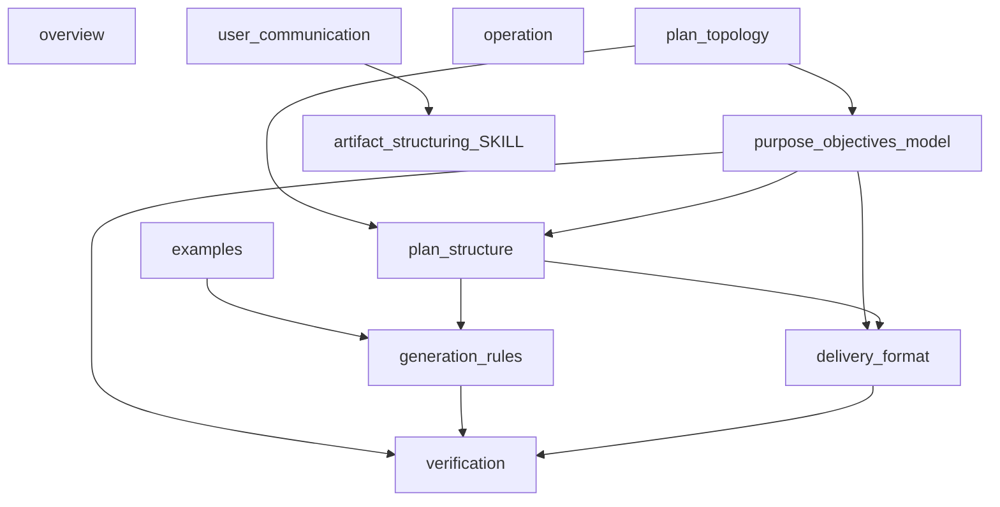

# Análisis estructural de `create-plan.md`

Informe generado tras auditoría del comando `.claude/commands/create-plan.md` y limpieza de referencias legacy a Motivación/Motivation (junio 2026).

## Resumen ejecutivo

El comando `/create-plan` es un artefacto híbrido **XML + Markdown** de ~405 líneas con **11 bloques XML de nivel 1**. Define la generación de planes de desarrollo con siete H2 fijos, dos fases de ejecución secuenciales (implementación → cierre) y un checklist de verificación de **18 ítems** (tras la limpieza legacy).

**Acciones realizadas en este ciclo:**

- Análisis estructural completo (inventario, topología, duplicación, alineación con `artifact-structuring`).
- Eliminación de **8 referencias defensivas** al modelo obsoleto Motivación + Propósito.
- Renumeración del checklist de verificación (19 → 18 ítems).

**Hallazgo principal:** la estructura es coherente y bien alineada con `artifact-structuring`. La duplicación entre bloques es en su mayoría **eco intencional** (refuerzo en entrega y verificación). Oportunidad futura: consolidar reglas de TOC y orden H2 en una sola fuente canónica para reducir ~15 % de texto repetido.

---

## Inventario estructural

### Frontmatter y encabezado

| Elemento | Líneas | Rol |
|----------|--------|-----|
| YAML frontmatter | 1–4 | `description`, `argument-hint` para activación del slash command |
| H1 `# Workflow: Create development plan…` | 6 | Título humano del artefacto |

### Bloques XML de nivel 1

| Bloque | Líneas | Rol | Subsecciones `##`/`###` | XML anidado |
|--------|--------|-----|--------------------------|-------------|
| `<overview>` | 8–10 | Resumen de una línea del workflow | — | — |
| `<user_communication>` | 12–14 | Política de idioma (enlace a `artifact-structuring`) | — | — |
| `<operation>` | 16–25 | Comportamiento según presencia de requisitos | `## How to operate` | — |
| `<plan_topology>` | 27–83 | Topología plana H2, vocabulario interno, fases | `## Plan topology`, `### Non-duplication rules` | `<critical>` |
| `<purpose_objectives_model>` | 85–180 | Modelo Propósito/Objetivos/Acciones, TOC, anti-patrones | `## Purpose…`, `### Purpose`, `### Objectives`, `### Actions`, `### Context`, `### Table of contents`, `### Anti-patrones` | — |
| `<examples>` | 182–257 | Few-shots de forma de plan y formato de acciones | `## Generated plan shape` | `<example>` ×3 |
| `<plan_structure>` | 259–316 | Estructura obligatoria del plan entregado (7 H2) | `## Mandatory structure`, `### 1.`…`### 7.` | — |
| `<generation_rules>` | 318–350 | Reglas en tiempo de generación | `## Rules while generating`, `### Ambiguous…`, `### Handling…`, `### File paths`, `### TOC generation order` | — |
| `<delivery_format>` | 352–378 | Formato de entrega al usuario | `## Delivery format`, `### Heading hierarchy`, `### Spanish headings` | — |
| `<verification>` | 380–405 | Checklist pre-entrega (18 ítems) | `## Final verification` | — |

### Referencias cruzadas internas

| Origen | Destino | Tipo |
|--------|---------|------|
| `<plan_topology>` L.72 | `<purpose_objectives_model>` | Definición remota (subestructura semántica) |
| `<plan_structure>` L.262 | `<plan_topology>`, `<purpose_objectives_model>` | Remisión (orden y semántica) |
| `<plan_structure>` §3 | `<plan_topology>` | Definición (estructura H2) |
| `<plan_structure>` §4 | `<purpose_objectives_model>` | Remisión (propósito fusionado) |
| `<plan_structure>` §6–7 | `<purpose_objectives_model>` | Remisión (tareas y cierre) |
| `<generation_rules>` | `<examples>` | Remisión (formato de acciones) |
| `<delivery_format>` | `<plan_structure>` §3 | Remisión (consideración #3 ES) |
| `<verification>` | Todos los bloques anteriores | Verificación (paridad reglas ↔ checklist) |

### Referencias externas

| Archivo | Uso |
|---------|-----|
| `.claude/skills/artifact-structuring/SKILL.md` | `<language_policy>` |
| `AGENTS.md` §0 | Reglas de idioma usuario |
| `README.md`, `docs/` | Rutas de documentación en fase de cierre |

---

## Topología interna vs entregable

### Mapa vocabulario interno ↔ H2 entregado

| Nombre interno (inglés, no expuesto) | H2 entregado (español) | Ejecuta trabajo |
|--------------------------------------|------------------------|-----------------|
| Project context | Contexto del proyecto | No |
| Plan table of contents | Tabla de contenidos | No |
| Fundamental considerations | Consideraciones fundamentales | No |
| Plan purpose (fused) | Propósito del plan | No |
| Plan objectives | Objetivos del plan | No |
| Implementation phase | Fase de implementación | Sí |
| Closure phase | Fase de cierre | Sí |

### Flujo de fases de ejecución

**Bloques que gobiernan el flujo:**

- `<plan_topology>`: mutual exclusivity implementación/cierre, reglas `<critical>` anti-duplicación.
- `<plan_structure>` §6–7: alcance estricto de cada fase.
- `<verification>` ítems 1–3, 10: paridad con cierre.

### Jerarquía H4 en tareas de implementación

| Nivel entregado | Contenido obligatorio |
|-----------------|----------------------|
| H3 (tarea) | Título; opcionalmente archivo en backticks |
| H4 Propósito | Propósito fusionado (observed need + resolution value) |
| H4 Objetivos | Metas verificables acotadas |
| H4 Acciones | Lista numerada con ruta de archivo al inicio |

Las etapas de cierre (H3 bajo Fase de cierre) **no** usan plantilla H4 Propósito/Objetivos/Acciones.

---

## Matriz de duplicación

Reglas que aparecen en múltiples bloques:

| Regla | Fuente canónica | Ecos intencionales | Clasificación |
|-------|-----------------|-------------------|---------------|
| Orden 7 H2 | `<plan_topology>`, `<purpose_objectives_model>` tabla | `<plan_structure>`, `<delivery_format>`, `<verification>` #4 | Eco intencional |
| Reglas TOC | `<purpose_objectives_model>` § TOC | `<generation_rules>` § TOC order, `<delivery_format>`, `<verification>` #16–18 | Eco intencional |
| Propósito fusionado | `<purpose_objectives_model>` § Purpose | `<plan_structure>` §4, `<verification>` #12 | Eco intencional |
| Formato acciones (ruta primero) | `<purpose_objectives_model>` § Actions | `<plan_structure>` §6, `<delivery_format>`, `<verification>` #7–9 | Eco intencional |
| No-duplicación impl/cierre | `<plan_topology>` `<critical>` | `<plan_structure>` §6, `<verification>` #1–2 | Eco intencional |
| Prohibición H2 técnicos | `<plan_topology>` L.68 | `<delivery_format>`, `<verification>` #5 | Eco intencional |
| Separación generation vs structure | `<generation_rules>` | `<verification>` #15 | Eco intencional |
| No exponer nombres XML internos | `<delivery_format>` | — | Fuente única |

**Deriva potencial:** ninguna contradicción detectada tras limpieza Motivación. La consideración #3 en inglés y español debe mantenerse sincronizada manualmente al editar.

### Anti-patrones sin ejemplo ilustrativo

La tabla en `<purpose_objectives_model>` tiene 17 filas; `<examples>` cubre explícitamente:

- Forma general del plan generado (`generated_plan_shape`)
- Acciones sin ruta (`action_without_explicit_file_bad`)
- Acciones con ruta (`action_with_explicit_file_good`)

**Sin ejemplo:** la mayoría de filas TOC, contexto repetido, propósito vago, títulos H3 sin archivo, etc. No es gap crítico; los ejemplos cubren el anti-patrón de mayor impacto ejecutivo (rutas en acciones).

### Paridad checklist (18 ítems)

Cada ítem de `<verification>` tiene regla explícita en al menos un bloque anterior. Ítem #15 (`generation_rules` vs `plan_structure`) es el más meta y está bien acotado.

---

## Alineación con `artifact-structuring`

| Criterio | Resultado | Notas |
|----------|-----------|-------|
| Boundary Rule (XML nivel 1 por rol) | Cumple | 11 bloques con roles distintos (operación, topología, modelo, ejemplos, estructura, generación, entrega, verificación) |
| Jerarquía nivel 2 (`##`/`###` dentro de XML) | Cumple | Markdown para lectura; sin over-wrapping |
| Jerarquía nivel 3 (XML anidado) | Cumple | `<critical>` en topology, `<example>` en examples — uso justificado y raro |
| `<user_communication>` + enlace a `<language_policy>` | Cumple | No copia política completa |
| Cuerpo en inglés, salida usuario en español | Cumple | Coherente con tabla artifact reference (slash command) |
| Anti-patrón over-wrapping | Cumple | Sin XML por párrafo |
| Consistencia tag naming | Cumple | `snake_case`, nombres por rol |

**Desviación justificada:** el artefacto es largo (~400 líneas) con más bloques XML que el mínimo de 2–3; justificado por la complejidad del workflow (topología + generación + verificación como unidades activables separadas).

---

## Limpieza Motivación (antes/después)

El modelo vigente usa **un solo header Propósito fusionado** (*observed need* + *resolution value*). Las referencias defensivas al modelo obsoleto Motivación + Propósito añadían ruido sin aportar guardia adicional.

| # | Ubicación original | Contenido eliminado | Guardia sustituta |
|---|-------------------|---------------------|-------------------|
| 1 | `### Purpose (fused narrative)` | «never split into Motivation + Purpose» | Norma positiva: «Use one **Propósito** header only (fused narrative)» |
| 2 | `### Anti-patterns` | Fila «Two headers Motivation + Purpose» | Propósito fusionado + anti-patrón «Vague single-sentence Purpose» |
| 3 | `### Anti-patterns` | Fila «Fundamental consideration #3 … «Motivación»» | Eliminada (modelo ya no existe) |
| 4 | `plan_structure` §3 EN | «Do not use a separate Motivation subsection» | Estructura H4 fija (Propósito, Objetivos, Acciones) |
| 5 | `plan_structure` §3 ES | «No usar subsección Motivación separada» | Idem |
| 6 | `<delivery_format>` | «(no Motivación)» | Eliminado |
| 7 | `<delivery_format>` | Prohibición header `Motivación` | Eliminado |
| 8 | `<verification>` | Ítem #12 sobre Motivation header | Absorbido por ítem #12 renumerado (propósito fusionado con ambos movimientos) |

**Verificación post-limpieza:** búsqueda de `Motivation`/`Motivación` en `create-plan.md` → **0 coincidencias**.

**Checklist:** 19 → **18 ítems**; texto final «eighteen checks».

---

## Hallazgos priorizados

| ID | Severidad | Hallazgo | Bloque(s) |
|----|-----------|----------|-----------|
| H1 | Info | Estructura XML bien particionada; roles claros | Todos |
| H2 | Info | Duplicación inter-bloque es eco intencional, no deriva | topology, pom, structure, delivery, verification |
| H3 | Resuelto | 8 referencias legacy Motivación eliminadas | pom, structure, delivery, verification |
| H4 | Advertencia | Consideración #3 EN/ES requiere sincronización manual | `plan_structure` §3 |
| H5 | Info | Pocos anti-patrones tienen few-shot ilustrativo | `examples` |
| H6 | Info | Rutas absolutas Windows en fase de cierre (`plan_structure` §7) | `plan_structure` |

---

## Recomendaciones para evolución futura

1. **Consolidación TOC/H2 (opcional):** extraer reglas de tabla de contenidos a un único bloque referenciado por `delivery_format` y `verification` para reducir ecos.
2. **Ejemplos adicionales (baja prioridad):** añadir few-shot de propósito vago vs propósito fusionado correcto.
3. **Rutas en cierre:** sustituir rutas absolutas Windows por rutas relativas al repo (`README.md`, `docs/`) en `plan_structure` §7 etapa 3.
4. **No reintroducir Motivación:** cualquier guardia futura debe expresarse como norma positiva del propósito fusionado, no como prohibición del modelo obsoleto.

---

## Diagrama de dependencias entre bloques

