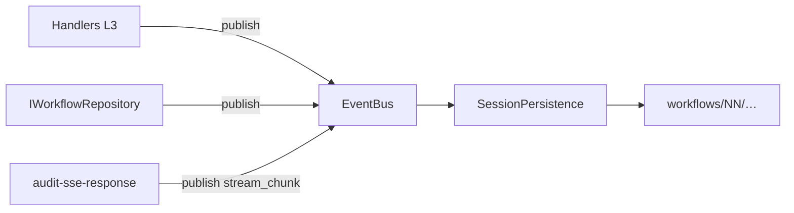

# Session Audit Model — Smart Code Proxy

Referencia canónica del modelo de auditoría en `sessions/` para sesiones **nuevas** (layout `causal-workflows-v1`, fase P1). Describe el modelo de ejecución agéntico, el árbol en disco, la correlación HTTP y el mapeo a tipos TypeScript del gateway.

Para la arquitectura completa del gateway, véase [`gateway-architecture.md`](./gateway-architecture.md) §24, §25, §28 y §41.4.

---

## 0. Layout vigente: `causal-workflows-v1`

Las sesiones nuevas persisten bajo un único árbol `workflows/` por sesión. No existe `main-agent/`, `side-interactions/` ni `state.json` separado.

```text
sessions/<session-id>/
├── session-metrics.json
└── workflows/
    └── NN/
        ├── meta.json                    # identidad + estado fusionado (sin state.json)
        ├── request/body.json            # opcional al abrir el workflow
        ├── output/
        │   ├── result.json              # IWorkflowResult al completar
        │   └── result.parsed.md
        └── steps/
            └── MM/
                ├── request/body.json
                ├── response/
                │   ├── body.json
                │   ├── headers.json
                │   ├── parsed.md
                │   ├── streaming/       # P2: NNNN-chunk.ndjson por stream_chunk
                │   ├── body.coalesced.json   # P2: step coalesced (sin sse.jsonl)
                │   └── body.coalesced.parsed.md
                # Pre-P2 (retirado en P2): sse.jsonl, sse.txt vía ISseAuditWriter
                └── tools/
                    └── KK-<slug>/
                        ├── meta.json
                        ├── input.json
                        ├── result.json
                        └── sub-agent/
                            └── workflow/    # sub-workflow anidado (misma forma recursiva)
```

### Tabla EventBus → persistencia

| Evento (`TelemetryEvent.type`)                                         | Emisor típico               | Rutas escritas por `SessionPersistence`                                              |
| ---------------------------------------------------------------------- | --------------------------- | ------------------------------------------------------------------------------------ |
| `workflow_start`                                                       | Correlador (`openWorkflow`) | `workflows/NN/meta.json`; opcional `request/body.json`                               |
| `workflow_spawn`                                                       | Correlador (subagente)      | `…/tools/KK-slug/sub-agent/workflow/meta.json` (+ request)                           |
| `step_request`                                                         | Handlers L3 / correlador    | `steps/MM/request/body.json`                                                         |
| `step_response`                                                        | Handlers L3                 | `steps/MM/response/body.json`, `headers.json`, `parsed.md`                           |
| `tool_call`                                                            | Correlador                  | `tools/KK-slug/input.json`, `meta.json`                                              |
| `tool_result`                                                          | Correlador / hooks          | `tools/KK-slug/result.json`; actualiza `meta.json`                                   |
| `workflow_complete`                                                    | Cierre de workflow          | `output/result.json`, `output/result.parsed.md`; `meta.json` final                   |
| `workflow_cancel`                                                      | Timeout / cancelación       | `meta.json` con `status: cancelled`                                                  |
| `stream_chunk`                                                         | `AuditSseResponseHandler`   | `steps/MM/response/streaming/NNNN-chunk.ndjson`; pings filtrados; tope 10 000 chunks |
| `step_response` (con `coalescedDelegationStepIndex`)                   | `AuditSseResponseHandler`   | además: `body.coalesced.json` + `body.coalesced.parsed.md` en el step continuation   |
| `*` (wildcard)                                                         | cualquier evento            | `sessions/<id>/events.ndjson` (append-only)                                          |
| `workflow_start` / `workflow_complete` / `workflow_cancel` (kind=main) | Correlador / cierre         | `sessions/<id>/workflows/workflow-sequence.json` (array)                             |

**Precedencia `completionAuthority` (determinista, fijada al registrar el tool):**

| Autoridad      | Canal de registro                         | Tools típicos                       | Emisor de `tool_result`                        |
| -------------- | ----------------------------------------- | ----------------------------------- | ---------------------------------------------- |
| `continuation` | `registerToolUse`                         | Bash, Read, Grep, Glob, Edit, Write | `handleContinuation` → body HTTP `tool_result` |
| `continuation` | `registerPendingToolUse` + nombre `Agent` | Agent (subagente)                   | Continuation del padre (coalescing)            |
| `hook`         | `registerPendingToolUse` + web_*          | `web_search`, `web_fetch`           | `AuditHookEventHandler` (`PostToolUse` / failure) |

`PostToolUse` **no** completa tools con autoridad `continuation` aunque llegue antes que la continuation HTTP. Un único `tool_result` por `tool_call` (idempotencia de `completeToolUse`).

### Componentes de persistencia

| Componente                                          | Capa    | Rol                                                             |
| --------------------------------------------------- | ------- | --------------------------------------------------------------- |
| `IEventBus` / `EventBus`                            | L1 / L2 | Pub/sub in-process; correlador y handlers publican telemetría   |
| `SessionPersistence`                                | L2      | Suscriptor que materializa el árbol en disco                    |
| `IWorkflowRepository` / `WorkflowRepositoryService` | L1 / L2 | Estado en memoria; emite eventos en cada mutación               |
| `SseReconstructService`                             | L2      | Lee `streaming/*.ndjson` para reconstrucción y vistas coalesced |

Índices `NN`, `MM`, `KK` usan zero-padding a 2 dígitos (`01`, `02`, …). El slug del tool se deriva de `slugifyToolName()` en `session-routing.ts`.

---

## 1. Propósito y alcance

### Qué cubre este documento

- Modelo conceptual: sesión → workflows → steps → tools → sub-workflows.
- Layout `causal-workflows-v1` y reglas de nomenclatura.
- Clasificación HTTP (`fresh`, `continuation`, preflights, `side-request`) y su proyección como **steps** bajo el turno activo (o exclusión para preflights).
- Entidades gateway (`IWorkflow`, `IStep`, `IToolUse`, `IWorkflowResult`) y artefactos en disco.
- Correlación de subagentes, tools pendientes y hooks.

### Artefactos transversales (vigentes)

| Artefacto              | Ubicación                     | Contenido                                                                                     |
| ---------------------- | ----------------------------- | --------------------------------------------------------------------------------------------- |
| `session-metrics.json` | Raíz de sesión                | Agregados por modelo (ver [`session-metrics-system.md`](./session-metrics-system.md))         |
| `meta.json`            | Workflow, tool o sub-workflow | Estado fusionado (`status`, `workflowKind`, timestamps, outcome, …) — **no** hay `state.json` |
| `output/result.json`   | Workflow                      | `IWorkflowResult` inmutable al cierre                                                         |

**P2 (implementado):** `events.ndjson` (raíz de sesión), `workflows/workflow-sequence.json`, `streaming/` por step, vistas coalesced; `sse.jsonl` retirado.

### Qué delega a otros documentos

| Tema                  | Documento                                                              |
| --------------------- | ---------------------------------------------------------------------- |
| Métricas de sesión    | [`session-metrics-system.md`](./session-metrics-system.md)             |
| Reconstrucción SSE    | [`how-sse-reconstruction-works.md`](./how-sse-reconstruction-works.md) |
| Peticiones sin sesión | [`health-check-handling.md`](./health-check-handling.md)               |
| Variables de entorno  | [README § Configuración](../README.md#configuracion)                   |
| Onboarding            | [`how-to-start.md`](./how-to-start.md)                                 |

---

## 2. Principio de diseño

La estructura en disco refleja la **causalidad** del flujo: cada workflow es un ciclo E2E (prompt → steps → resultado); cada step agrupa un hop de inferencia; cada tool es una invocación correlacionable; los subagentes cuelgan del tool `Agent` que los disparó.

Navegación humana típica:

```text
sessions/<id>/workflows/01/          → turno principal
  steps/01/request|response/       → primer hop HTTP
  steps/02/tools/01-Agent/         → delegación
    sub-agent/workflow/            → ciclo del subagente
```

### Semántica `input/` / `output/` frente a `request/` / `response/`

| Nivel    | Directorio  | Significado                                                                        |
| -------- | ----------- | ---------------------------------------------------------------------------------- |
| Workflow | `request/`  | Cuerpo de la petición que **abrió** el workflow (fresh / side / preflight)         |
| Workflow | `output/`   | Resultado del ciclo (`IWorkflowResult`), no la respuesta HTTP cruda del último hop |
| Step     | `request/`  | Petición HTTP a Anthropic en ese step                                              |
| Step     | `response/` | Respuesta HTTP (o artefactos derivados: `parsed.md`, `streaming/*.ndjson`)         |

No hay `response/` en la raíz del workflow: la respuesta HTTP vive bajo `steps/MM/response/`.

---

## 3. Vista general

### 3.1 Diagrama de ejecución (agentic)

```text
Sesión
└─ Workflow de turno (kind: main, interactionType: agentic) — workflows/01/
   ├─ request/body.json              → prompt del usuario (primer hop agentic)
   ├─ steps/01/  stepKind: side-request  → naming / count_tokens (si aplica)
   ├─ steps/02/  stepKind: agentic       → fresh / compute
   ├─ steps/03/
   │  └─ tools/01-Agent/
   │     └─ sub-agent/workflow/      → sub-workflow (kind: subagent)
   │        ├─ steps/01/ …
   │        └─ output/result.json
   ├─ steps/04/  stepKind: agentic       → continuation (tool_result)
   └─ output/result.json             → cierre E2E (hook Stop)
```

Un **único workflow por turno** agrupa todos los hops HTTP entre `UserPromptSubmit` y `Stop`. Los índices `NN`, `MM` y `KK` son **base 1** (primer turno → `workflows/01/`, primer step → `steps/01/`).

Los **preflights** (`preflight-quota`, `preflight-warmup`) se reenvían al upstream pero **no** se proyectan al árbol causal (sin carpeta en disco). El tipo de hop auxiliar vs agentic queda en `stepKind` del step (`agentic` | `side-request`).

### 3.2 Flujo de persistencia (P1)



---

## 4. Protocolo HTTP y clasificación

La clasificación la realiza `RequestClassifierService` (dominio); `AuditWorkflowHandler` abre o continúa workflows en `IWorkflowRepository` y publica eventos.

| Clasificación                          | Comportamiento resumido                                      | Proyección en disco                           |
| -------------------------------------- | ------------------------------------------------------------ | --------------------------------------------- |
| `fresh`                                | Hop agentic con `tools` no vacíos                            | Step `stepKind: agentic` bajo turno activo   |
| `continuation`                         | `tool_result` en el **último mensaje** hacia workflow activo | Mismo turno; nuevo step o coalescing Agent    |
| `preflight-quota` / `preflight-warmup` | `max_tokens:1` o warm-up                                     | **Excluido** (proxy activo, sin auditoría)    |
| `side-request`                         | `tools: []` (p. ej. naming)                                  | Step `stepKind: side-request` bajo turno      |

**Sin sesión:** si `sessionId === '_unknown'`, el handler retorna sin escribir disco ([`health-check-handling.md`](./health-check-handling.md)).

**Preflights — proxy activo vs auditoría:** omitir la proyección causal **no** interrumpe el wire; el upstream recibe la petición con normalidad:

```text
Preflight HTTP
  → RequestClassifier: preflight-quota | preflight-warmup
  → AuditWorkflowHandler.execute(): return null   (sin correlador ni disco)
  → Proxy upstream: reenvío normal a Anthropic
```

Los preflights no consumen `layoutIndex`; el primer turno de usuario ocupa siempre `workflows/01/`.

### 4.1 Correlación de subagentes

- **Plano A (cabeceras):** `X-Claude-Code-Agent-Id` / `X-Claude-Code-Parent-Agent-Id` → correlación determinista (`correlationMethod: 'agent-headers'`).
- **Plano B (FIFO):** fallback cuando faltan cabeceras y hay varios `Agent` pendientes.
- **Plano C (hooks):** `POST /hooks`, evento `SubagentStart` → `confirmSubagentFromHook` en el correlador.

Los pendientes viven en `IToolUse` del workflow padre, no en `ActiveInteraction`.

### 4.2 Continuaciones y coalescing

- Continuaciones no coalesced: nuevo step bajo el mismo workflow.
- Continuaciones Agent coalesced: enriquecen el `response` del step que emitió el subagente (lógica en `audit-sse-response` + `gateway-wire-step`).
- WebSearch / WebFetch internos: steps adicionales bajo el workflow padre cuando hay pending correlacionado.

---

## 5. Tipos de interacción (semántica → workflow)

El turno de usuario es un workflow con **`interactionType: agentic`** (`workflows/NN/`, `NN` base 1). Se abre en `UserPromptSubmit` (hook) o lazy-open en el primer hop HTTP, y cierra en hook `Stop` / `StopFailure` con `IWorkflowResult` (`finalText` desde el hook).

| Campo              | Valores activos       | Notas                                                      |
| ------------------ | --------------------- | ---------------------------------------------------------- |
| `interactionType`  | `agentic`             | Workflow de turno; subagentes usan `kind: subagent`      |
| `stepKind`         | `agentic`, `side-request` | Diferencia hops auxiliares vs inferencia dentro del turno |
| Preflights         | —                     | Excluidos del árbol causal; no persisten `interactionType` |

`end_turn` en SSE cierra solo el **step** abierto; el workflow E2E del turno no hace `forceClose` en SSE.

`WorkflowKind` estructural: `main` | `subagent` (sub-workflows bajo `sub-agent/workflow/`).

### 5.1 Cierre de step vs cierre de workflow

| Señal | Cierra step | Cierra workflow de turno |
| ----- | ----------- | ------------------------ |
| Respuesta HTTP terminal de `side-request` | Sí | No |
| SSE `stop_reason: tool_use` | Sí | No |
| SSE `stop_reason: end_turn` | Sí | No |
| Hook `Stop` / `StopFailure` | — | Sí |
| Hook `SubagentStop` (sub-workflow) | — | Sí (sub-workflow anidado) |

`IWorkflowResult.finalText` proviene del hook (`last_assistant_message`); si el hook no lo incluye queda `undefined` (sin fallback desde steps).

### 5.2 Invariantes del turno

- Como máximo **un** workflow de turno `running` por `sessionId` con `id === sessionId`.
- **Lazy open:** si el primer hop HTTP (`side-request` o `fresh`) llega antes de `UserPromptSubmit`, se abre el turno implícito y el hop se registra como step.
- Mutaciones HTTP del turno se serializan con `withSessionLock(sessionId)` en `AuditWorkflowHandler` (evita cross-wiring cuando `side-request` y `agentic` arrancan en paralelo).

---

## 6. Sesión e identificadores

Resolución de `sessionId` (prioridad):

1. `x-cc-audit-session`
2. `x-claude-code-session-id`
3. Ausente → `_unknown` (sin auditoría)

Cada workflow recibe `layoutIndex` (entero para `NN`) y `requestSequence` (contador lógico en el correlador). **P2:** índice global `workflow-sequence.json` en disco.

Al arranque, el proxy puede eliminar sesiones con layout flat legacy (**corte limpio** P1); no hay migración de datos en reposo.

---

## 7. Entidades y tipos TypeScript

| Concepto          | Tipo / interfaz     | Artefacto principal                            |
| ----------------- | ------------------- | ---------------------------------------------- | ---------- |
| Workflow          | `IWorkflow`         | `workflows/NN/meta.json`, `output/result.json` |
| Step              | `IStep`             | `steps/MM/request                              | response/` |
| Tool use          | `IToolUse`          | `tools/KK-slug/input.json`, `result.json`      |
| Resultado E2E     | `IWorkflowResult`   | `output/result.json`                           |
| Sesión (agregado) | `Session` (dominio) | `session-metrics.json`                         |

### `IWorkflowResult` (campos clave)

- `outcome`, `finalText?`, `usage?`, `stepCount`, `closedByEvent`, `sessionId`
- Construido en cierre vía `buildWorkflowResult()`; proyectado por `SessionPersistence` en `workflow_complete`

### Tipos auxiliares en `audit.types.ts` (clasificación wire)

Tipos **activos** en `src/1-domain/types/audit.types.ts` para clasificación HTTP y correlación (no sustituyen el modelo en memoria `IWorkflow` / `IStep` / `IToolUse`):

| Tipo | Uso |
| ---- | --- |
| `WorkflowRequestKind`, `StepKind` | Clasificación semántica del request y del hop |
| `RequestClassification` | Resultado de `classifyRequestBody()` |
| `SideRequestKind` | Subtipo de `side-request` (p. ej. naming de sesión) |
| `PendingAgentToolUse`, `CorrelationMethod`, `ParentContext` | Correlación subagente ↔ tool_use |
| `CoalescedAgentStepResponse`, `SubagentSummary` | Contrato persistido en steps coalesced |
| `SseReconstructOptions` | Reconstrucción SSE → `body.json` (sin campos legacy `sseRaw*`) |

**Retirados en P1/P2** (no exportar ni reintroducir): `StepMeta`, `InteractionType`, `InteractionOutcome`, `AuditInteractionContext`, `InteractionMetadata`, `PendingWebSearchToolUse`, `PendingWebFetchToolUse`, `ResolvedInternalTool`, módulo `audit-paths.ts` (routing canónico: `session-routing.ts`).

Fuente normativa: [`openspec/specs/gateway-domain-types/spec.md`](../openspec/specs/gateway-domain-types/spec.md).

---

## 8. Persistencia y handlers

### Regla P1

Los handlers de capa 3 **no** llaman `fs.write*` para el árbol causal salvo:

- Utilidades de arranque en composition root (`ensureAuditSessionsRoot`, corte limpio)

Todo lo demás (incluido SSE vía `stream_chunk`): `eventBus.publish(...)` → `SessionPersistence`.

### Handlers relevantes

| Handler                        | Rol                                                           |
| ------------------------------ | ------------------------------------------------------------- |
| `AuditWorkflowHandler`         | Clasificación, apertura/continuación de turnos, wire steps; `withSessionLock` por sesión |
| `AuditSseResponseHandler`      | Stream SSE + reconstrucción; publica `step_response` / cierre |
| `AuditStandardResponseHandler` | Respuestas no-SSE                                             |
| `AuditWorkflowClosureHandler`  | Coordinación de cierre + métricas; delega proyección al bus   |
| `AuditUpstreamErrorHandler`    | Errores upstream                                              |

### Cierre de workflow

1. Hook o condición terminal dispara `IWorkflowRepository.close()`.
2. Se emite `workflow_complete` con `IWorkflowResult`.
3. `SessionPersistence` escribe `output/result.json` y actualiza `meta.json`.
4. `SessionMetricsService` actualiza `session-metrics.json`.

---

## Apéndice A — Layout flat histórico (pre-P1)

> **No generado** en sesiones nuevas tras el corte limpio P1. Conservado solo para leer capturas antiguas o entender documentación histórica.

```text
sessions/<session-id>/
  session-metrics.json
  main-agent/interactions/NN/     # agentic
    meta.json, state.json       # state.json eliminado al cerrar
    input/, output/, steps/YY/
  side-interactions/MM/         # preflight + side-request
    interaction-sequence.json   # contadores separados
```

| Árbol legacy               | Tipo semántico                     |
| -------------------------- | ---------------------------------- |
| `main-agent/interactions/` | `agentic`                          |
| `side-interactions/`       | `client-preflight`, `side-request` |

En memoria, el modelo legacy usaba `ActiveInteraction` → `InteractionMetadata` en `meta.json` al cerrar, con `WorkflowResultProjector` proyectando `IWorkflowResult` al shape flat. P1 retiró `ISessionStore`, `IAuditWriter` y el projector; la proyección causal es exclusiva de `SessionPersistence`.

### Equivalencias aproximadas

| Legacy                        | Causal P1                                                          |
| ----------------------------- | ------------------------------------------------------------------ |
| `main-agent/interactions/NN/` | `workflows/NN/` (`kind: main`)                                     |
| `side-interactions/MM/`       | `workflows/NN/` (otro índice; mismo árbol)                         |
| `steps/YY/sub-agent-01/`      | `steps/MM/tools/KK-Agent/sub-agent/workflow/`                      |
| `state.json`                  | Estado en `meta.json` (`status: running` hasta cierre)             |
| `interaction-sequence.json`   | Secuencia en correlador; **P2:** `workflow-sequence.json` en disco |

### Apéndice B — Layout intermedio `session-shell` (lectura histórica)

Entre P1 y `unify-turn-workflow` (junio 2026) algunas sesiones fragmentaban un turno en **tres workflows hermanos**: `workflows/00` (`session-shell`), `workflows/01` (`side-request`) y `workflows/02` (`agentic`). Las sesiones nuevas usan **un workflow por turno** (`workflows/01/` con `interactionType: agentic` y hops como `steps/MM/`). No hay migración automática; al analizar capturas antiguas, distinguir este layout del modelo vigente.

Change de referencia: `openspec/changes/archive/2026-06-08-unify-turn-workflow/`.

---

## Referencias cruzadas

- Arquitectura del gateway: [`gateway-architecture.md`](./gateway-architecture.md)
- Fusión turno unificado (implementado): `openspec/changes/archive/2026-06-08-unify-turn-workflow/`
- OpenSpec: `openspec/specs/session-persistence/`, `event-bus/`, `session-routing/`, `gateway-audit-projection/`
