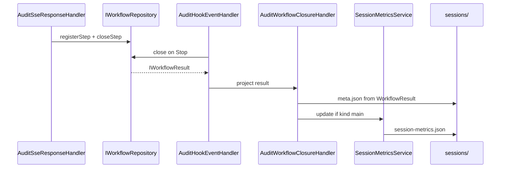

## Context

Post-G3 el stack gateway tiene: tipos y servicios de cierre en capa 1 (G1), `IWorkflowRepository` completo con lifecycle y hooks de cierre des-stubados (G2), `StepAssembler` extraído y `setWorkflowModel` propagado al completar inferencia (G3). Sin embargo, la ruta wire sigue siendo la fuente principal de verdad en disco:

- `AuditSseResponseHandler` / `AuditStandardResponseHandler` escriben `meta.json` como `InteractionMetadata` desde `StepMeta` y llaman `updateSessionMetrics()` por step.
- El correlador acumula steps solo si se invoca manualmente; los handlers wire no llaman `registerStep`/`closeStep`.
- `AuditHookEventHandler` invoca `close()` pero el `IWorkflowResult` no se proyecta a `sessions/`.
- `session-metrics.json` usa schema simple (`SessionMetrics` en `audit.types.ts`) sin `cache_efficiency` ni `session_totals`.

G4 cierra el gap correlador→persistencia **sin cambiar el layout flat** (`sessions/{session}/{interaction}/`). El bus de eventos (§28b) queda fuera de alcance: handlers llaman correlador y closure handler directamente.

## Goals / Non-Goals

**Goals:**

- Cablear `registerStep`/`closeStep` desde handlers wire al completar cada inferencia (bloque A).
- Introducir `AuditWorkflowClosureHandler` que proyecte `WorkflowResult` a `meta.json` tras `close()` en hooks (bloques B/C).
- Añadir `aggregateWorkflowUsageByModel` (L1) y `SessionMetricsService` (L2) con invariante G16 (bloques D/E).
- Retirar `updateSessionMetrics()` y migrar tipos a `ISessionMetrics` en tipos gateway (bloque F).
- Degradar cierre wire-only a fallback documentado.

**Non-Goals:**

- Layout `causal-workflows-v1`, `EventBus`, `SessionPersistence` como suscriptor completo.
- `PreToolUse`/`PostToolUse` ToolUse.status (stubs permanecen).
- `duration_ms`/`outcome` en `session-metrics.json`; `totalCostUsd`.
- Apertura de workflow en `AuditInteractionHandler` al wire-request.
- Cambio del árbol de directorios bajo `sessions/`.

## Decisions

### 1. Construcción de `IStep` desde wire

Al completar la inferencia, el handler construye un `IStep` con:

- `id`: generado (misma estrategia que `StepMeta.stepId` actual).
- `workflowId`: resuelto por `sessionId` (main) o `agentId` → `getWorkflowByAgentId` (subagente).
- `index`: `workflow.steps.length` antes de registrar.
- `inferenceRequest`: snapshot del request Anthropic del POST.
- `assistantMessage`: bloques desde `AssembledInference` (SSE) o respuesta parseada (standard).
- `usage`, `stopReason`: del ensamblaje.
- `toolUses`: array vacío en G4 (ToolUse.status vía hooks sigue diferido).
- `startedAt` / `closedAt`: timestamps del handler.

**Alternativa descartada:** registrar steps parciales durante el stream. Rechazada: el correlador modela un step por inferencia completa; alinea con §41.

### 2. Semántica de `closeStep`

| `stopReason` | Acción |
|--------------|--------|
| `end_turn` | `registerStep` + `closeStep` al `stream.on('end')` / fin de respuesta standard |
| `tool_use` | `registerStep` sin `closeStep` (step abierto hasta hooks PostToolUse en fase posterior) |
| Otros / error | `registerStep` + `closeStep` si el handler ya trataba el step como terminal |

Coherente con el comportamiento wire actual donde `tool_use` implica fase de tools pendiente.

### 3. `AuditWorkflowClosureHandler` — firma y responsabilidades

Nuevo handler en `src/3-operations/audit-workflow-closure.handler.ts`:

```ts
export class AuditWorkflowClosureHandler {
  constructor(
    private readonly auditWriter: IAuditWriter,
    private readonly sessionMetrics: SessionMetricsService,
    private readonly projectWorkflowResult: WorkflowResultProjector, // capa 2
    private readonly logger?: Logger,
  ) {}

  async execute(ctx: {
    sessionDir: string;
    interactionDir: string;
    workflow: IWorkflow;
    result: IWorkflowResult;
    hook: ClaudeHookEvent;
  }): Promise<void>;
}
```

Responsabilidades:
1. Mapear `IWorkflowResult` + workflow + steps → payload de `meta.json` (via projector L2).
2. `auditWriter.writeInteractionMeta(interactionDir, meta)` — reutiliza writer existente.
3. Si `workflow.kind === 'main'`, invocar `sessionMetrics.updateFromWorkflow(closedSteps, result)`.
4. Side-effects legacy de cierre (eliminar `state.json`, reconstrucción `output/` si aplica) — trasladar desde handler wire donde corresponda, sin duplicar lógica.

`AuditHookEventHandler` recibe el closure handler por DI y lo invoca tras cada `close()` exitoso, resolviendo directorios desde `ISessionStore` o contexto de interacción activa.

### 4. Mapper `WorkflowResult` → `InteractionMetadata` (transitorio)

**Decisión:** mantener `writeInteractionMeta(meta: InteractionMetadata)` y un projector L2 `workflow-result-to-interaction-meta.ts` que traduce `IWorkflowResult` + steps cerrados + contexto de interacción al shape legacy de `meta.json`.

**Rationale:** behavior-preserving para consumidores y tests E2E existentes; evita romper el layout flat antes de P. El tipo `InteractionMetadata` queda `@deprecated` como DTO de proyección, no como fuente construida en handlers wire.

**Alternativa descartada:** escribir JSON con shape `WorkflowResult` directamente en `meta.json`. Rechazada: rompería herramientas y tests que esperan el schema actual.

### 5. `SessionMetricsService` y G16

- Input: steps cerrados del workflow main (`workflow.steps.filter(s => s.closedAt)`).
- Usa `aggregateWorkflowUsageByModel(closedSteps)` para el delta de esta interacción.
- Lee `session-metrics.json` existente, merge incremental por modelo, recalcula `session_totals` y `cache_efficiency`.
- Solo se invoca cuando `workflow.kind === 'main'`.
- Rollup de sub-workflows: el `WorkflowResult.usage` del padre ya incluye hijos vía `aggregateWorkflowUsage` en `buildWorkflowResult` — el servicio de sesión suma los steps del main (que reflejan hops wire), no vuelve a sumar sub-workflows cerrados por separado.

`cache_efficiency` por modelo: `cache_read_input_tokens / (input_tokens + cache_read_input_tokens)` cuando el denominador > 0; 0 en caso contrario (§33.2).

### 6. Retiro de `updateSessionMetrics` per-step

Las llamadas en `audit-sse-response.handler.ts` (líneas ~341, ~439), `audit-standard-response.handler.ts` y `audit-interaction.handler.ts` se eliminan. La acumulación per-step migra al cierre del workflow main vía `SessionMetricsService`, usando steps registrados en el correlador con `inferenceRequest.model` (propagado en G3).

`audit-upstream-error.handler.ts`: evaluar si mantiene escritura de meta de error vía mapper o ruta legacy mínima; si usa `InteractionMetadata` directamente, marcar como consumidor transitorio.

### 7. Cierre wire-only como fallback

El bloque de cierre en `stream.on('end')` que hoy escribe `meta.json` desde `InteractionMetadata` se reduce a:
- Mantener escritura de artefactos de step (`sse.jsonl`, `StepMeta` en steps/) sin cambio.
- NO escribir `meta.json` de cierre de turno si se espera hook `Stop` (workflow abierto en correlador).
- Fallback: si tras timeout o ausencia de hooks el workflow sigue abierto, ruta wire existente puede invocar el mismo projector (marcada `@deprecated-fallback`, retiro en P).

### 8. EventBus fuera de alcance

Sin `IEventBus` en G4. Secuencia directa handler → repo → closure handler. La convergencia a §28b es trabajo posterior.

## Flujo prescriptivo



## Archivos concretos

| Archivo | Tipo de cambio |
|---------|----------------|
| `src/1-domain/services/gateway/aggregate-workflow-usage-by-model.ts` | **Nuevo** — función pura L1 |
| `src/1-domain/types/gateway/session-metrics.types.ts` | **Nuevo** — `ISessionMetrics`, `IModelMetrics` |
| `src/2-services/session-metrics.service.ts` | **Nuevo** — escritura atómica + merge |
| `src/2-services/workflow-result-projector.service.ts` | **Nuevo** — mapper `WorkflowResult` → `InteractionMetadata` |
| `src/2-services/ports/session-metrics.port.ts` | **Nuevo** — port opcional |
| `src/2-services/audit-writer.service.ts` | Eliminar `updateSessionMetrics` |
| `src/2-services/ports/audit-writer.port.ts` | Eliminar firma `updateSessionMetrics` |
| `src/1-domain/types/audit.types.ts` | Deprecar/eliminar `SessionMetrics`, `SessionModelMetrics` |
| `src/3-operations/audit-workflow-closure.handler.ts` | **Nuevo** |
| `src/3-operations/audit-hook-event.handler.ts` | Delegar a closure handler tras `close()` |
| `src/3-operations/audit-sse-response.handler.ts` | `registerStep`/`closeStep`; retirar `updateSessionMetrics` y meta de cierre hook-driven |
| `src/3-operations/audit-standard-response.handler.ts` | Idem SSE |
| `src/4-api/**` (composition root) | Cablear closure handler + `SessionMetricsService` |
| `docs/session-audit-model.md` | Documentar proyección y métricas §33.2 |

## Risks / Trade-offs

- **[Regresión meta.json]** → projector L2 con tests de equivalencia; gate `npm run test` al tocar disco.
- **[Doble escritura meta durante transición]** → eliminar escritura wire de cierre cuando hooks activos; tests E2E subset §37b.
- **[Steps no registrados si hooks no abren workflow]** → `registerStep` no-op; meta solo vía fallback wire; aceptado en G4.
- **[Métricas de sesión desfasadas si solo wire sin hooks]** → fallback wire debe invocar `SessionMetricsService` o mantener path legacy hasta retiro — documentar en implementación.
- **[writeQueue compartido]** → `SessionMetricsService` reutiliza la cola de `AuditWriterService` o instancia propia serializada; evitar deadlocks.

## Decisiones absorbidas — rename-interaction-to-workflow (2026-06-01)

### D-1 — `InteractionType` → `WorkflowRequestKind` como nuevo tipo en `audit.types.ts`

`InteractionType` no tiene equivalente directo en `types/gateway/` porque clasifica el request
HTTP, no la topología del workflow. Se define `WorkflowRequestKind` como alias permanente (no
deprecated) con los mismos tres literales: `'client-preflight' | 'agentic' | 'side-request'`.

**Alternativa descartada:** Reutilizar `WorkflowKind` — tiene semántica diferente y cambiaría
contratos del correlador.

### D-2 — `InteractionOutcome` → retirar; `SubagentSummary.outcome` migra a `WorkflowOutcome`

`InteractionOutcome` solo tiene un consumidor activo (`SubagentSummary.outcome`). Los valores del
legacy que no existen en `WorkflowOutcome` se mapean:

| InteractionOutcome (legacy)  | WorkflowOutcome (gateway)   |
|------------------------------|-----------------------------|
| `'completed'`                | `'success'`                 |
| `'client-error'`             | `'api_error'`               |
| `'upstream-error'`           | `'api_error'`               |
| `'truncated'`                | `'aborted'`                 |
| `'orphaned'`                 | `'unknown'`                 |

El campo `SubagentSummary.outcome` cambia de `InteractionOutcome | 'unknown'` a `WorkflowOutcome`.

**Alternativa descartada:** Mantener `InteractionOutcome` como alias — perpetúa la deuda sin
reducirla y los valores no son equivalentes semánticamente.

### D-3 — `AuditInteractionContext` → `AuditWorkflowContext`

Rename directo de la interfaz y todos sus consumidores (3 handlers L3 + controller + augments).
El campo `auditInteractionDir` → `auditWorkflowDir`; `interactionType` → `workflowKind` (usando
el nuevo `WorkflowRequestKind`).

### D-4 — `AuditInteractionHandler` → `AuditWorkflowHandler` (con rename de archivo)

El archivo `audit-interaction.handler.ts` pasa a `audit-workflow.handler.ts`. Los tests del
handler se mueven en paralelo (`tests/3-operations/audit-workflow.handler.test.ts`).

### D-5 — Orden de ejecución: types-first

Para evitar errores de compilación intermedios, el orden SHALL ser:
1. Definir `WorkflowRequestKind` y migrar `SubagentSummary.outcome` (capa 1 — sin dependencias).
2. Renombrar `AuditWorkflowContext` y sus campos (capa 1 — desbloquea handlers).
3. Renombrar handlers y métodos en capa 3.
4. Actualizar augments y controller en capa 5.
5. Actualizar `scripting/router-status.ts`.
6. Renombrar archivo del handler y actualizar todos los imports.
7. Eliminar `InteractionType` e `InteractionOutcome` de `audit.types.ts`.

## Migration Plan

1. Implementar L1 + tests.
2. Implementar L2 (projector + session metrics) sin cablear handlers.
3. Cablear wire → correlador; verificar repo en tests.
4. Introducir closure handler; conectar hooks; retirar escritura meta wire primaria.
5. Eliminar `updateSessionMetrics`; gate completo.
6. Actualizar docs; `migration-phase-gate`; sync + archive.

Rollback: revertir change; `session-metrics.json` regenerable desde interacciones (pérdida solo del agregado de sesión, no de meta por interacción).

## Open Questions

- Resolución exacta de `interactionDir` para subagentes en closure handler (índice de interacción en `ISessionStore` vs directorio del sub-workflow) — confirmar con código `ActiveInteraction` al implementar.
- Si `audit-upstream-error.handler.ts` debe migrar al projector en G4 o quedar como excepción documentada.
