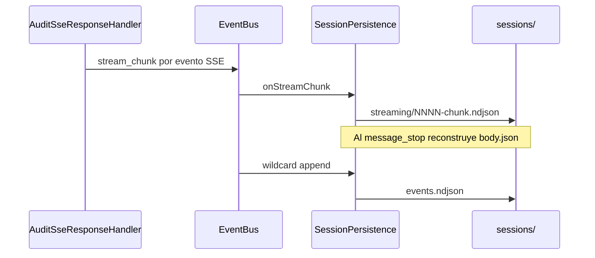

## Context

P1 dejó `SessionPersistence` suscrito a eventos del correlador para el árbol estructural `causal-workflows-v1`. `AuditSseResponseHandler` sigue escribiendo `sse.jsonl` vía `ISseAuditWriter` (`@deprecated-p2`). P0 ratificó que `stream_chunk` lo emite capa 3 al bus, no el correlador.

Referencias: [§28b](../../../docs/proposals/gateway-design.md), [§33](../../../docs/proposals/gateway-design.md), spike P0 archivado, change P1 archivado.

## Goals / Non-Goals

**Goals:**

- Materializar §33.1 (`events.ndjson`), streaming forense y §33.5 (`workflow-sequence.json`).
- Cumplir §28b.4 regla 1 para SSE (publicar al bus; persistir en L2).
- Gate P2-core: casos §37b **1, 12, 13, 14, 15, 18**.

**Non-Goals:**

- Casos §37b fuera v1 (§45), incl. timer automático §24.1.
- `session_start` / `session_complete` en bus.
- Retiro de tipos `Interaction*` (cierre del orquestador).

## Decisions

| Decisión | Elección | Alternativas consideradas |
| --- | --- | --- |
| Coalesced | Opción A — incluido en P2 | Opción B: dejar shim hasta P2.1 — rechazada: impide retirar `ISseAuditWriter` |
| Fuente de reconstrucción | `streaming/*.ndjson` ordenados | Mantener `sse.jsonl` — rechazado: viola diseño §33 |
| Filtrado `ping` | En `SessionPersistence` al recibir `stream_chunk` | Filtrar en handler — rechazado: persistencia es única escritora forense |
| Mapa de tareas | P2-a…P2-h (ver `tasks.md`) | Monolito en un solo PR — rechazado: orden PKA y gates incrementales |

### P2-a … P2-h (resumen)

| ID | Entregable | Archivos clave |
| --- | --- | --- |
| P2-a | Handler publica `stream_chunk` | `audit-sse-response.handler.ts`, `composition-root.ts` |
| P2-b | Chunks en `streaming/` | `session-persistence.service.ts` |
| P2-c | Reconstrucción `body.json` al cierre del step | `session-persistence.service.ts` |
| P2-d | `events.ndjson` (wildcard `*`) | `session-persistence.service.ts` |
| P2-e | `workflow-sequence.json` | `session-persistence.service.ts`, `session-routing.ts` |
| P2-f | `SseReconstructService` sobre chunks | `sse-reconstruct.service.ts`, tests |
| P2-g | Coalesced desde persistencia | handler + persistence + tests |
| P2-h | Retiro `ISseAuditWriter` | port, `audit-writer.service.ts`, tests |

## Risks / Trade-offs

| Riesgo | Mitigación |
| --- | --- |
| Regresión en steps coalesced multi-fase | Tests dedicados §37b #18 antes de retirar shim |
| Equivalencia body reconstruido vs directo (#14) | Test de paridad antes de eliminar `sse.jsonl` |
| Volumen de chunks en streams largos | Límite configurable (§33, `streaming max chunks`) |

## Migration Plan

- Sin migración de sesiones en reposo (corte limpio ratificado en P0/P1).
- Despliegue: implementar P2-a…h en orden de `tasks.md`; validar `npm run test` y gate P2-core antes de archivar.
- Rollback: revertir change; sesiones nuevas volverían a escribir `sse.jsonl` si se restaura el shim.

## Open Questions

_(ninguna bloqueante — Opción A coalesced confirmada)_
