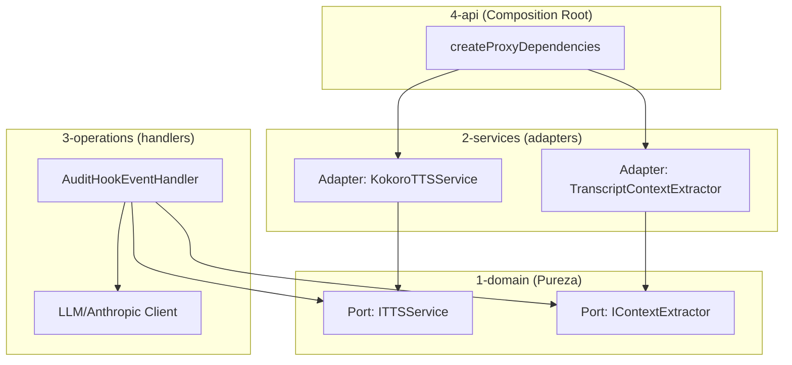

# Diseño: Integración de TTS con Memoria Contextual

## Arquitectura y Flujo PKA
El diseño de la integración incorpora la memoria contextual y la generación de locuciones dinámicas mediante un LLM antes de invocar la síntesis de voz:



### 1. Definición de Puertos y Modelos en Dominio (`1-domain`)
- **`ITTSService`** (en `src/1-domain/ports/ITTSService.ts`):
  ```typescript
  export interface ITTSService {
    speak(text: string): Promise<void>;
    initialize(): Promise<void>;
  }
  ```
- **`IContextExtractor`** (en `src/1-domain/ports/IContextExtractor.ts`):
  ```typescript
  export interface SessionMessage {
    role: 'user' | 'assistant' | 'system';
    text: string;
  }

  export interface IContextExtractor {
    extractLastNMessages(transcriptPath: string, n: number): Promise<SessionMessage[]>;
  }
  ```

### 2. Implementación de Servicios (`2-services`)
- **`TranscriptContextExtractor`** (en `src/2-services/tts/transcript-extractor.service.ts`):
  Lee el archivo JSONL especificado en `transcriptPath` línea a línea usando streams de Node.js, parsea los bloques de mensajes de Claude Code y extrae los últimos $N$ turnos con su rol y contenido textual.
- **`SapiTTSService`** (en `src/2-services/tts/sapi-tts.service.ts`):
  - Usa `System.Speech.Synthesis` de Windows vía PowerShell (`Add-Type -AssemblyName System.Speech`).
  - Voz configurada: `Microsoft Sabina Desktop` (es-MX, femenina, neutral latinoamericana).
  - Reproducción completamente asíncrona y no bloqueante (`child_process.spawn` con `stdio: 'ignore'` + `unref()`).
  - No requiere descarga de modelos ni inicialización asíncrona.

### 3. Orquestación y Lógica en `AuditHookEventHandler` (`3-operations`)
- Se inyecta `ITTSService`, `IContextExtractor` y el cliente Anthropic en `AuditHookEventHandler`.
- **En `UserPromptSubmit`**:
  - Se lee el transcript para obtener los últimos $N$ mensajes.
  - Se envía una petición rápida al LLM (Haiku) con el rol de asistente de voz:
    *System Prompt*: "Eres la voz del asistente Smart Code Proxy. Responde al último mensaje del usuario en una sola oración breve en español de forma entusiasta o servicial, confirmando lo que vas a hacer."
  - Se sintetiza y reproduce el resultado por voz.
- **En `Stop` / `SubagentStop` / `StopFailure`**:
  - Se lee el transcript de la sesión.
  - Se solicita al LLM (Haiku) un resumen del proceso ejecutado:
    *System Prompt*: "Eres la voz del asistente de continuidad. En un máximo de 3 oraciones cortas en español, resume qué tareas se completaron, qué quedó pendiente y cuál es el estado final de la ejecución."
  - Se sintetiza y reproduce el resumen.
- **Manejo de errores**: Todo el flujo de llamadas a LLM y TTS se encapsula en bloques `try-catch` específicos para no interrumpir el flujo del ciclo de vida del proxy.

### 4. Inicialización en `createProxyDependencies` (`4-api`)
Se instancian ambos servicios y se inyectan en `AuditHookEventHandler`. `SapiTTSService.initialize()` es un no-op sincrónico — el arranque no bloquea en carga de modelos.

---

## Divergencias documentadas

### D-1: Sustitución de Kokoro por Windows SAPI

**Decisión original**: `KokoroTTSService` con modelo `Kokoro-82M-v1.0-ONNX` vía kokoro-js.

**Decisión implementada**: `SapiTTSService` con `System.Speech.Synthesis` (Windows SAPI).

**Motivo**: `kokoro-js` fonemiza el texto siempre con fonemas en inglés (`en-us`/`en`), independientemente del idioma del texto de entrada. El texto generado está en español, lo que producía acento anglosajón. SAPI utiliza el motor de síntesis nativo de Windows con la voz `Microsoft Sabina Desktop` (es-MX), que fonemiza correctamente el español.

**Gap multiplataforma consciente**: `System.Speech.Synthesis` es exclusivo de Windows. El proyecto ya depende de PowerShell para la reproducción de audio, por lo que este cambio no introduce una nueva restricción de plataforma. En una iteración futura se analizará la incorporación de soporte multiplataforma (candidatos: Piper TTS offline, Edge TTS neural vía red).
